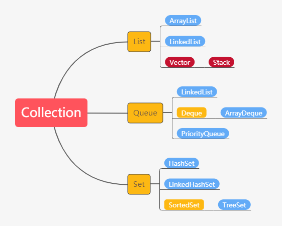

# Collection框架



 <!-- more --> 

## 增

```java
boolean add(E e);
//add()方法传入的数据类型必须是Object，所以写入基本数据类型时，会自动装箱和自动拆箱
```

```java
boolean addAll(Colleciton<? extends E> c);
//把另一个集合里的元素添加到此集合中
```

## 删

```java
boolean remove(Object o);
//删除指定元素
```

```java
boolean removeAll(Collection<?> c);
//把集合中B的所有元素都删除
```

## 改

## 查

```java
boolean contains(Object o);
//查看集合中有没有某个特定的元素
```

```java
boolean containsAll(Collection<?> c);
//查看集合A是否包含了集合B
```

## 其他

```java
boolean isEmpty();
//判断集合是否为空
```

```java
int size();
//集合的大小
```

```java
Object[] toArray();
//把集合转换成数组
```

# List

特点：有序、可重复

```java
add(E e);
//在尾巴上加元素，ArrayList可能有扩容的情况出现。ArrayList和LinkedList的时间复杂度均为O(1)。
```

```java
add(int index, E e);
//在特定的位置上加元素，LinkedList需要先找到这个位置，再加上这个元素，虽然加这个动作的复杂度为O(1),但是要找到这个位置还是O(n)。ArrayList和LinkedList的时间复杂度均为O(n)。
```

```java
remove(int index);
//remove这个index上的元素
//ArrayList找到这个元素的过程是O(1)，但是remove之后，后续元素要往前移动一位，所以均摊复杂度是O(n);
//LinkedList也是要先找到这个index，这个过程是O(n)，所以整体也是O(n)。
```

```java
remove(E e);
//remove见到的第一个这个元素
//ArrayList找到这个元素的过程是O(n)，然后移除后还要往前移一位，这个更是O(n),总体还是O(n)。
//LinkedList也要先找，这个过程是O(n),然后移走，这个过程为O(1),总的是O(n)。
```

## 那造成时间复杂度的区别的原因是什么？

* 因为ArrayList是用数组来实现的。
* 而数组和链表的最大区别就是数组可以随机访问(random access)。

这个特点造成在数组可以通过下标用O(1)的时间拿到任何位置的数，而链表做不到，只能从头开始逐个遍历。

在【改查】这两个功能上，数组能够随机访问。所以ArrayList的效率高。

在【增删】中，若不考虑找到这个元素的时间，数组因为物理上的连续性，当要增删元素时，在尾部还好，但在其他地方就会导致后续元素都要移动所以效率较低；而链表则可以轻松的断开和下一个元素的链接，直接插入新元素或者移除旧元素。

实际上你不能不考虑找到元素的时间!如果在尾部操作，数据量大时ArrayList会更快。

* 改查选择ArrayList
* 增删在尾部选择ArrayList
* 其他情况下，如果时间复杂度一样，推荐选择ArrayList，因为overhead更小，或者说内存使用更有效率。

# Vector

## Vector和ArrayList的区别是什么

* 线程安全问题
* 扩容时扩多少的区别：ArrayList扩容为原容量的1.5倍；而Vector扩容为原来的两倍。


# Queue

Queue是一端进另一端出的线性数据结构；而Deque是两端都可以进出的。

## PriorityQueue(heap)

并不按照进去的时间顺序出来，而是按照规定的优先级出去，并且它的操作并不是O(1)，时间复杂度的计算稍微有点复杂。

## Queue

其有两组API，基本功能一样，但是：

* 一组会抛异常
* 另一组会返回一个特殊值

```java
//增		抛异常		返回值
		add(e)		offter(e)
//删
         remove()	 poll()
//瞧		
         element()	 peek()
```

## 为什么会抛异常呢？

比如队列空了，那就remove()就会抛异常，但是poll()就返回null；element()就会抛异常，而peek()就返回null

## add(e)怎么会抛异常呢？

有些Queue它会有容量的限制，比如BlockingQueue，那如果已经达到了它最大的容量且不会扩容，就会抛异常；但如果offer(e)，就会return false。

## 怎么选择呢？

* 首先，要用就用同一组API，前后要统一；
* 其次，根据需求。如果你需要它抛异常，那就用抛异常的；不过做算法题时基本不用，所以选那组返回特殊值的就好了。

# Deque

Deque是两端都可以进出的，那自然是针对First端的操作和对Last端的操作，那每端都有两组，一组抛异常，一组返回特殊值：

```java
//增		抛异常						返回值
		addFirst(e)/addLast(e)		offterFirst(e)/offerLast(e)
//删
         removeFirst()/removeLast()	 pollFirst()/pollLast()
//瞧		
         getFirst()/getLast()	 	 peekFirst()/peekLast()
```

使用时同理，要用就用一组。Queue和Deque的这些API都是O(1)的时间复杂度，准确来说是均摊时间复杂度。

## 实现类

* LinkedList
* ArrayDeque
* PriorityQueue

* 若想实现普通队列-先进先出的语义，就使用LinkedList或ArrayDeque；
* 若想实现优先队列，就使用PriorityQueue；
* 如果想实现栈的语义，就使用ArrayDeque

## 在实现一个普通的队列时，如何选择LinkedList还是ArrayDeque

推荐使用ArrayDeque，因为效率高，LinkedList还会有其他的额外开销(overhead)。

## ArrayDeque和LinkedList的区别有哪些？

* ArrayDeque是一个可扩容的数组，LinkedList是链表结构；
* ArrayDeque里不可以存null值，但是LinkedList可以；
* ArrayDeque在操作头尾端的增删操作时更高效，但是LinkedList只有在当要移除中间某个元素且已经找到这个元素后的移除才是O(1)；
* ArrayDeque在内存使用方面更高效。

所以，只要不是必须存null值，就选择ArrayDeque！

## 什么情况下选择用LinkedList呢？

Java6之前。

# Stack

Stack在语义上是后进先出(LIFO)的线性数据结构。

由于Vector已经被弃用了，而Stack是继承Vector的。那么想要实现Stack的语义，就用ArrayDeque吧！

```java
Deque<Integer> stack = new ArrayDeque<>();
```


# Set

Set的特点是：无序，不重复的

## 实现类

* HashSet：采用Hashmap的key来存储元素，主要特点是无序的，基本操作都是O(1)的时间复杂度
* LinkedHashSet：这个是一个HashSet + LinkedList的结构，特点就是即拥有了O(1)的时间复杂度，又能够保留插入的顺序。
* TreeSet：采用红黑树结构，特点是可以有序，可以用自然排序或者自己定义比较器来排序；缺点就是查询速度没有HashSet快。

每个Set的底层实现其实就是对应的Map：数值放在map中的key上，value上放了个PRESENT，是一个静态的Object，相当于place holder，每个key都指向这个object。