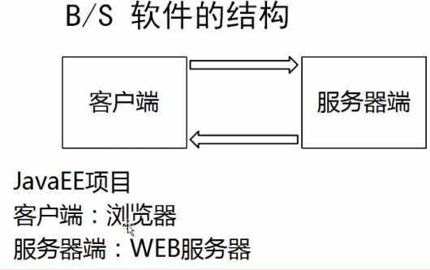
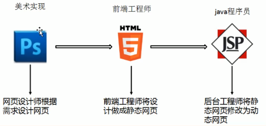
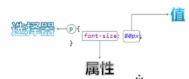

# HTML和CSS

## 1.B/S软件的结构

JAVASE	C/S	Client/Server

B/S	Browser/Server




 <!-- more --> 

## 2.前端的开发流程



## 3.网页的组成部分

* 内容：在页面中看到的数据。一般内容我们使用html技术来展现；
* 表现：这些内容在页面上的表现形式。比如说，布局，颜色，大小等等。一般使用CSS技术实现；
* 行为：指的是页面中元素与设备交互的响应。一般使用js技术实现。

## 4.HTML简介

Hyper Text Markup Language(超文本标记语言) HTML。HTML通过标签来标记要显示的网页中的各部分。网页文件本身是一种文本文件，通过在文本文件添加标记符，可以告诉浏览器如何显示其中的内容

## 5.创建HTML文件

* 创建一个web工程(静态的web工程)
* 在工程下创建html页面

## 6.HTML文件的书写规范

```html
<!DOCTYPE html><!-- 约束，声明-->
<html lang="zh_CN"><!-- html 标签表示html的开始 lang="zh_CN"表示中文 html标签中一般分为两部分，分别是head和body-->
<head><!-- 表示头部信息，一般包含三部分内容：title标题，CSS样式，js代码-->
    <meta charset="UTF-8"><!-- 表示当前页面使用UTF-8字符集-->
    <title>标题</title><!-- 表示标题-->
</head>
<body><!-- body标签是整个heml页面显示的主体内容-->
    hello
</body>
</html>
```

```html
<html><!-- 表示整个html页面的开始-->
    <head><!-- 头信息-->
        <title>标题</title><!-- 标题-->
    </head>
    <body><!-- body页面的主体内容-->
        hello
    </body>
</html><!-- 表示整个html页面的结束-->
```

## 7.HTML标签介绍

* 标签的格式：<标签名>封装的数据</标签名>

* 标签名大小写不敏感

* 标签拥有自己的属性：

  * 基本属性：bgcolor=“red”	可以修改简单的样式效果

  ```html
  <body bgcolor="green">
      hello
  </body>
  ```

  * 事件属性：onclick=“alert(‘你好！ ’);”	可以直接设置事件响应后的代码

  ```html
  <body onclick="alert('123')"><!-- onlick表示单机事件；alert()是javaScript语言提供的一个警告函数，它可以接收任意参数，参数就是警告框的函数信息-->
      hello
  </body>
  ```

* 标签又分为，单标签和双标签

  * 单标签格式：<标签名/>	br换行 hr水平线
  * 双标签

## 标签的语法

* 标签不能交叉嵌套

```html
<div><span>123</span></div><!--正确-->
<div><span>123</div></span><!--错误-->
```

* 标签必须正确的关闭(闭合)

```html
<div>123</div><!--正确-->
<div>123<!--错误-->
<br/><!--正确-->
<br><!--错误-->
```

* 属性必须有值，属性值必须加引号

```html
<font color="blue">123</font><!--正确-->
<font color=blue>123</font><!--错误-->
<font color>123</font><!--错误-->
```

* 注释不能嵌套

```html
<!-- 注释内容--><!--正确-->
<!-- 注释内容<!-- 注释内容-->--><!--错误-->
```

## 8.常用标签介绍

* font字体标签

例：在网页上显示，我是字体标签，并修改为宋体，颜色为红色。

```html
<font color="red" fece="宋体" size="7">我是字体标签</font><!-- font标签是字体标签，它可以用来修改文本的字体，颜色，大小；color、face、size。-->
```

* 特殊字符

例：把\<br>换行标签变成文本转换成字符显示在页面上。

```html
我是&lt;br&gt;标签
<!-- 常用的特殊字符：
< &lt;
> &gt;
空格 &nbsp;
-->
```

* 标题标签

例：演示标题1到标题6

```html
<h1>标题1</h1>
<h6 align="center">标题6</h6><!-- h1-h6都是标题标签；h1最大-h6最小
align 属性是对齐属性：left、center、right-->
```

* 超链接

```html
<a href="http://localhost:8080">百度</a>
<!-- a标签是超链接；
	href属性设置连接的地址；
	target属性设置哪个目标进行跳转
		_self	表示当前页面
		_blank	表示打开新页面来进行跳转
-->
<a href="http://localhost:8080" target="_self">百度</a>
<a href="http://localhost:8080" target="_blank">百度</a>
```

* 列表标签
  * 无序列表\<ul>
  * 有序列表\<ol>
  * 定义列表

```html
<ul>
    <li>123</li>
    <li>234</li>
    <li>345</li>
    <li>456</li>
</ul>
<ol>
    <li>123</li>
    <li>234</li>
    <li>345</li>
    <li>456</li>
</ol>
<!-- ul	是无序列表；
		type属性可以修改列表项前面的符号(type="none")
	 li 是列表项；
```

* img标签

img标签可以在html页面上显示图片。

```html
<!-- img标签，用来显示图片；src属性可以设置图片的路径
在javaSE中路径也分为相对路径和绝对路径：
	相对路径：从工程名开始算

	绝对路径：盘符：/目录/文件名
在web中路劲分为相对路径和绝对路径两种：
	相对路径：
	.	表示当前文件目录
	..	表示当前文件所在的上一级目录
	文件名	表示当前文件所在目录的文件，相当于./文件名(./可以省略)

	绝对路径：
	格式是:	http://ip:port/工程名/资源路径
-->

<!--
	img标签是图片标签，用来显示图片
	src		设置图片路径
	width	设置图片宽度
	height	设置图片宽度
	border	设置图片边框
	alt		当指定路径找不到图片时，用来代替显示的文本内容
-->
	
```

* 表格标签

例：做一个带表头的，三行，三列的表格，并显示边框；修改表格的宽度、高度、表格的对齐方式，单元格间距

```html
<table border="1" width="300" height="300" cellspacing="0">
    <tr>
        <td align="center"><b>1.1</b></td>
        <th>1.2</th>
        <th>1.3</th>
    </tr>
    <tr>
        <td>2.1</td>
        <td>2.2</td>
        <td>2.3</td>
    </tr>
    <tr>
        <td>3.1</td>
        <td>3.2</td>
        <td>3.3</td>
    </tr>
</table>
<!-- table标签	是表格标签
			align 设置表格相当于页面的对齐方式
			cellspacing 设置单元格间距
			boder 设置表格边框
			width 设置表格宽度
			height 设置表格高度
		
	 tr			是行标签
	 th			是表头标签
	 td			是单元格标签
			align 设置单元格文本对齐方式
	 b 			是加粗标签
```

* 跨行跨列表格

例：新建一个五行，五列表格；第一行，第一列的单元格要跨两列；第二行第一列的单元格跨两行，第四行第四列的单元格跨两行两列。

```html
<table width="500" height="500" cellspacing="0" border="1">
    <tr>
        <td colspan="2">1.1</td>
        <td>1.3</td>
        <td>1.4</td>
        <td>1.5</td>
    </tr>
    <tr>
        <td rowspan="2">2.1</td>
        <td>2.2</td>
        <td>2.3</td>
        <td>2.4</td>
        <td>2.5</td>
    </tr>
    </tr>
    <tr>
        <td>3.2</td>
        <td>3.3</td>
        <td>3.4</td>
        <td>3.5</td>
    </tr>
    <tr>
        <td>4.1</td>
        <td>4.2</td>
        <td>4.3</td>
        <td colspan="2" rowspan="2">4.4</td>
    </tr>
    <tr>
        <td>5.1</td>
        <td>5.2</td>
        <td>5.3</td>
    </tr>
</table>
<!-- colspan 属性设置跨列
	 rowspan 属性设置跨行
-->
```

* iframe框架标签

iframe标签可以在一个html页面上，打开一个小窗口，去加载一个单独的页面。

```html
<iframe src="3.标题标签.html" width="500" height="400" name="abc"></iframe>
<br/>

<ul>
    <li><a href="0.html" target="abc">0.html</a></li>
</ul>
<!-- iframe标签可以在页面上开辟一个小区域显示一个单独的页面
	iframe 和 a标签组合使用的步骤：
		1.在iframe标签中使用name属性定义一个名称
		2.在a标签的target属性上设置iframe的name的属性值
-->
```

* 表单标签

表单就是html页面中，用来收集用户信息的所有元素集合，然后把这些信息发送给服务器。

例：创建一个个人信息注册的表单界面。包含用户名、密码、确认密码。性别(单选)，兴趣爱好(多选)，国籍(下拉列表)，隐藏域，自我评价(多行文本域)。重置，提交。

```html
<!-- 
	form标签就是表单
		input type=text		是文本输入框	value属性设置默认值显示内容
		input type=password  是密码输入框
		input type=radio	是单选框	 name属性可以对其进行分组		check="check"表示默认选中
		input type=checkbox	 是复选框	 check="check"表示默认选中
		input type=reset	 是重置按钮	value属性修改按钮上的文本
		input type=submit    提交按钮	 value属性修改按钮上的文本
		input type=button	 是按钮	  value属性修改按钮上的文本
		input type=file		 是文件上传域 
		input type=hidden	 是隐藏域	 当我们要发送某些信息 ，而这些信息，不需要用户参与，就可以使用隐藏域
		selset 标签是下拉列表框
			option	标签是下拉列表框中的选项 selected="selected"设置默认选中
		textarea		表示多行文本输入框(起始标签和结束标签中的内容是默认值)
			rows	属性设置可以显示几行的高度
			cols	属性设置可以显示几个字符宽度
	form标签中的属性： 
		action属性设置提交的服务器地址
		method属性设置提交的方式GET(默认)或POST
		
		表单提交的时候，数据没有发送给服务器的三种情况：
		1.表单项没有name属性值
		2.单选、复选(下拉列表中option标签)都需要添加value属性，以便发送给服务器
		3.表单项不在提交的fore标签中

		GET请求的特点是：
		1.浏览器地址栏中的地址是：action属性[+?+请求参数]
			请求参数的格式是：name=value&name=value
		2.不安全
		3.它有数据长度的限制
		
		POST请求的特点是：
		1.浏览器地址栏中只有action属性值
		2.相对于GET请求要安全
		3.理论上没有数据长度的限制
-->
```

```html
<!DOCTYPE html>
<html lang="en">
<head>
    <meta charset="UTF-8">
    <title>表单的显示</title>
</head>
<body>
<form>
    <h1 align="center">用户信息填写</h1>
    <table align="center">
        <tr>
            <td>用户名称：</td>
            <td>
                <input type="text" value="默认值"/>
            </td>
        </tr>
        <tr>
            <td>用户密码：</td>
            <td>
                <input type="password" value="abc"/><br/>
            </td>
        </tr>
        <tr>
            <td>确认密码：</td>
            <td>
                <input type="password" value="abc"/>
            </td>
        </tr>
        <tr>
            <td>性别: </td>
            <td>
                <input type="radio" name="sex" checked="checked"/>男
                <input type="radio" name="sex"/>女
            </td>
        </tr>
        <tr>
            <td>兴趣爱好：</td>
            <td>
                <input type="checkbox"/>Java
                <input type="checkbox"/>JavaScript
                <input type="checkbox"/>C
                <input type="checkbox"/>C++
            </td>
        </tr>
        <tr>
            <td>国籍：</td>
            <td>
                <select>
                    <option>--请选择国籍--</option>
                    <option selected="selected">中国</option>
                    <option>美国</option>
                    <option>日本</option>
                </select>
            </td>
        </tr>
        <tr>
            <td>自我评价：</td>
            <td>
                <textarea rows="10" cols="20">默认值</textarea>
            </td>
        </tr>
        <tr>
            <td><input type="reset"/></td>
            <td><input type="submit" align="left"/></td>
        </tr>
    </table>
</form>

</body>
</html>
```

* 其他标签

div、span、p标签

```html
<!--
div标签	默认独占一行
span标签	它的长度是封装数据的长度
p标签		默认会在段落的上方或下方各空出一行
-->
```


## CSS技术

### CSS技术介绍

CSS是【层叠样式表单】。用于(增强)控制网页样式并允许将样式信息与网页内容分离的一种标记性语言。

### CSS 语法规则：



选择器：浏览器根据选择器决定受CSS样式影响的HTML元素(标签)

属性：是你要改变的样式名，并且每一个属性都有一个值。属性和值被冒号分开，并由花括号包围，这样就组成了一个完整的样式声明。例如：p{color:blue}

多个声明：如果要定义不止一个声明，则需要用分号将每个声明分开。虽然最后一条声明的最后可以不加分号。例如：p{color:red;font-size:30px;}

CSS注释：/* 注释内容*/

### CSS和HTML的结合方式

1.在标签的style属性上设置“key:value value”，修改标签样式。

例：分别定义div、span标签，分别修改每个div标签的样式为：边框1个像素，实线，红色。

```html
<!DOCTYPE html>
<html lang="en">
<head>
    <meta charset="UTF-8">
    <title>Title</title>
</head>
<body>
    <div style="border: 1px solid red">div标签1</div>
    <div style="border: 1px solid red">div标签2</div>
    <span style="border: 1px solid red">span</span>
    <span style="border: 1px solid red">span</span>
</body>
</html>
```

这种方式的缺点：

* 如果标签多了。样式多了。代码量非常庞大
* 可读性非常差
* CSS代码没什么复用性可言

2.在head标签中，使用style标签来定义各种自己需要的CSS样式

```html
<!DOCTYPE html>
<html lang="en">
<head>
    <meta charset="UTF-8">
    <title>Title</title>
    <style type="text/css">
        div{
            border: 1px solid red;
        }
        span{
            border: 1px solid red;
        }
    </style>
</head>
<body>
    <div>div标签1</div>
    <div>div标签2</div>
    <span>span</span>
    <span>span</span>
</body>
</html>
```

这种方式的缺点：

* 只能在一个页面内复用，不能在多个页面上复用SCC代码
* 维护起来不方便，实际的项目中会有成千上万的页面，要到每个页面中去修改。工作量太大了。

3.把CSS样式写到一个单独的CSS文件，再通过link标签引入即可复用。

```css
div{
    border: 1px solid red;
}
span{
    border: 1px solid red;
}
```

```html
<!DOCTYPE html>
<html lang="en">
<head>
    <meta charset="UTF-8">
    <title>Title</title>
    <link rel="stylesheet" type="text/css" href="css1.css">
</head>
<body>
    <div>div标签1</div>
    <div>div标签2</div>
    <span>span</span>
    <span>span</span>
</body>
</html>
```

### 	CSS选择器

* 标签名选择器的格式是：标签名{属性：值}

标签名选择器，可以决定哪些标签被动的使用这个样式。

例：在所有div标签上修改字体颜色为蓝色，字体大小为30个像素。边框为1像素黄色实线。并且修改所有span标签的字体颜色为黄色，字体大小20个像素，边框大小20个像素，边框为5像素蓝色虚线。

```html
<!DOCTYPE html>
<html lang="en">
<head>
    <meta charset="UTF-8">
    <title>CSSxuanzeqi</title>
    <style type="text/css">
        div{
            border: 1px solid yellow;
            color: blue;
            font-size: 30px;
        }
        span{
            border: 5px dashed blue;
            color: blue;
            font-size: 30px;
        }
    </style>
</head>
<body>
    <div>div标签1</div>
    <div>div标签2</div>
    <span>span</span>
    <span>span</span>
</body>
</html>
```

* id选择器

#id属性值{属性：值}

id选择器，可以让我们通过id属性选择器性的去使用这个样式。

例：分别定义两个div标签，第一个div标签定义为id001，然后根据id属性定义CSS样式修改字体颜色为蓝色，字体大小30个像素，边框为1像素黄色实线。第二个div标签定义id为id002，然后根据id属性定义CSS样式修改的字体颜色为红色，字体大小20个像素，边框为5像素蓝色点线。

```html
<!DOCTYPE html>
<html lang="en">
<head>
    <meta charset="UTF-8">
    <title>IDxuanzeqi</title>
    <style type="text/css">
        #id001{
            color: blue;
            font-size: 30px;
            border: 1px yellow solid;
        }
        #id002{
            color: red;
            font-size: 20px;
            border: 5px blue dotted;
        }
    </style>
</head>
<body>
    <div id="id001">div标签1</div>
    <div id="id002">div标签2</div>
</body>
</html>
```

* class选择器

class类型选择器的格式是：.class属性值{属性：值；}

class类型选择器，可以通过class属性有效地去使用这个样式。

例：修改class属性值为class01的span或div标签，字体颜色为蓝色，字体大小30个px，边框为1px黄色实线。修改class属性值为class02的div标签，字体颜色为灰色，字体大小26个像素。边框为1px红色实线。

```html
<!DOCTYPE html>
<html lang="en">
<head>
    <meta charset="UTF-8">
    <title>classleixingxuanzeqi</title>
    <style type="text/css">
        .class01{
            color: blue;
            font-size: 30px;
            border: 1px solid yellow;

        }
        .class02{
            color: grey;
            font-size: 26px;
            border: 1px solid red;
        }
    </style>
</head>
<body>
    <div class="class01">div标签class01</div>
    <div class="class02">div标签</div>
    <span class="class01">span标签</span>
    <span>span标签2</span>
</body>
</html>
```

* 组合选择器

组合选择器的格式：选择器1，选择器2，选择器n{属性：值}

组合选择器可以让多个选择器共用一个CSS代码

例：修改class=class01的div标签和id=id01所有的span标签，字体颜色为蓝色，字体大小20个像素，边框为1像素黄色实线。

```html
<!DOCTYPE html>
<html lang="en">
<head>
    <meta charset="UTF-8">
    <title>zuhexuanzeqi</title>
    <style type="text/css">
        .class01,#id01{
            color: blue;
            font-size: 20px;
            border: 1px yellow solid;
        }
    </style>
</head>
<body>
    <div class="class01">div标签</div><br/>
    <span id="id01">span标签</span><br/>
    <div>div标签</div><br/>
    <div>div标签</div>

</body>
</html>
```

## 常用样式

* 字体颜色 color：red
* 边框 boder
* 宽度 width
* 高度 height
* 背景颜色 background-color
* 字体样式：
  * color
  * 字体大小 font-size
* DIV居中 margin-left:auto;margin-right:auto;
* 文本居中 text-align:center
* 超链接去下划线 text-decoration:none
* 表格细线 table{border:1px solid black;border-collapse:collapse;}td,th{border:1px solid black;}
* 列表去除修饰 ul{list-style:none}