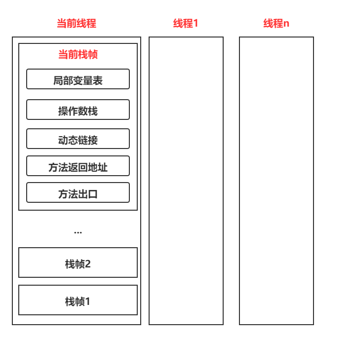

## 概述		

​		与程序计数器一样，Java虚拟机栈(Java Virtual Machine Stack)也是线程私有的，它的生命周期与线程周期相同。虚拟机栈描述的是Java方法执行的线程内存模型：每个方法被执行的时候，Java虚拟机都会同步创建一个栈帧(Stack Frame)用于存储变量表、操作数栈、动态连接、方法出口等信息。每一个方法被调用直至执行完毕的过程，就对应着一个栈帧在虚拟机栈中从入栈到出栈的过程。

 <!-- more --> 

​		经常有人把Java内存区域笼统地划分为堆内存(Heap)和栈内存(Stack)，这种划分方式直接继承自传统的C、C++程序的内存布局结构，在Java语言里就显得有些粗糙了，实际的内存划分要比这更复杂。不过这种划分方式的流行也间接说明了程序员最关注的、与对象内存分配关系最密切的区域是“堆”和“栈”两块。

​		局部变量表存放了编译期可知的各种Java虚拟机基本数据类型(boolean、byte、char、short、int、float、long、double)、对象引用(reference类型，它并不等同于对象本身，可能是一个指向对象起使地址的引用指针，也可能是指向一个代表对象的句柄或者其他与此对象相关的位置)和returnAddress类型(指向了一条字节码指令的地址)。

​		这些数据类型在局部变量表中的存储空间以局部变量槽(Slot)来表示，其中64位长度的long和double类型的数据会占用两个变量槽，其余的数据类型只占用一个。局部变量表所需的内存空间在编译期间完成分配，当进入一个方法时，这个方法需要在栈帧中分配多大的局部变量空间是完全确定的，在方法运行期间不会改变局部变量表的大小。这里说的“大小”是指变量槽的数量，虚拟机真正使用多大的内存空间(譬如按照1个变量槽占用32个比特、64比特，或者更多)来实现一个变量槽，这是完全由具体的虚拟机实现自行决定的事情。

​		在《Java虚拟机规范》中，对这个内存区域规定了两类异常状况：如果线程请求的栈深度大于虚拟机所允许的深度，将抛出StackOverflowError异常；如果Java虚拟机栈容量可以动态扩展，当栈扩展时无法申请到足够的内存会抛出OutOfMemoryError异常。

## 总结

### 生命周期

​		生命周期和线程一致，也就是线程结束结束了，该虚拟机栈也销毁了。

### 作用

​		主管Java程序的运行，它保存方法的局部变量、部分结果，并参与方法的调用和返回。

### 栈的特点

​		栈是一种快速有效的分配存储方式，访问速度仅次于程序计数器。JVM直接对Java栈的操作只有两个：

* 每个方法执行，便随着入栈
* 执行结束后的出栈工作

对于栈来说不存在垃圾回收机制(栈存在溢出的情况)

### 开发中遇到哪些异常？

栈中可能出现的异常

Java虚拟机规范允许Java栈的大小是动态的或者是固定不变的。

如果采用固定大小的Java虚拟机栈，那每一个线程的Java虚拟机栈容量可以在线程创建的时候独立选定。如果线程请求分配的栈容量超过Java虚拟机允许的最大容量，Java虚拟机将会抛出一个StackOverflowError异常。

如果Java虚拟机可以动态扩展，并且在尝试扩展的时候无法申请到足够的内存，或者在创建新的线程时没有足够的内存去创建对应的虚拟机栈，那Java虚拟机将会抛出一个OutOfMemoryError异常。

### 设置栈内存大小

​		我们可以使用参数-Xss选项来设置线程的最大栈空间，栈的大小直接决定了函数调用的最大可达深度。

### 栈的存储单位

​		每个线程都有自己的栈，栈中的数据都是以栈帧的格式存在；在这个线程上正在执行的每个方法都各自对应一个栈帧；栈帧是一个内存区块，是一个数据集，维系着方法执行过程中的各种数据信息。

​		JVM直接对Java栈的操作只有两个，就是对栈帧的压栈和出栈，遵循先进后出原则。

​		在一条活动线程中，一个时间点上，只会有一个活动的栈帧。即只有当前正在执行的方法的栈帧(栈顶栈帧)是有效的，这个栈帧被称为当前栈帧，与当前栈帧相对应的方法就是当前方法(Current Method)，定义这个方法的类就是当前类(Current Class)。

​		执行引擎运行的所有字节码指令只针对当前栈帧进行操作。

​		如果在该方法中调用了其他方法，对应的新的栈帧会被创建出来，放在栈的顶端，成为新的当前帧。

### 栈运行原理

​		不同线程中所包含的栈帧是不允许存在相互引用的，既不可能在一个栈帧之中引用另外一个线程的栈帧。

​		如果当前方法调用了其他方法，方法返回之际，当前栈帧会传回此方法的执行结果给前一个帧，接着，虚拟机会丢弃当前栈帧，使得前一个栈帧重新成为当前栈帧。

​		Java方法有两种返回函数的方式，一种是正常的函数返回，使用return返回指令；另一种是抛出异常。不管使用哪种方式，都会导致栈帧被弹出。

### 栈帧的内部结构

每个栈帧中存储着：

* 局部变量表
* 操作数栈
* 动态链接
* 方法返回地址
* 一些附加信息

并行每个线程下的栈都是私有的，因此每个线程都有自己各自的栈，并且每个栈里面都有很多栈帧，栈帧的大小主要由局部变量表和操作数栈决定的。

#### 局部变量表

局部变量表被称之为局部变量数组或本地变量表。局部变量表存放了编译期可知的各种Java虚拟机基本数据类型、对象引用和returnAddress类型。

由于局部变量表是建立在线程的栈上，是线程的私有数据，因此不存在数据安全问题。

局部变量表所需的容量大小是在编译期确定下来的，并保存在方法的Code属性的maximum local variables数据项中。在方法运行期间是不会改变局部变量表的大小的。

方法嵌套调用的次数由栈的大小决定。一般来说，栈越大，方法嵌套调用的次数越多。对于一个函数而言，它的参数和局部变量越多，使得局部变量表膨胀，它的栈帧就越大，以满足方法调用所需传递的信息增大的需求。进而函数调用就会占用更多的栈空间，导致其嵌套调用次数就会减少。

局部变量表中的变量只在当前方法调用中有效。在方法执行时，虚拟机通过使用局部变量表完成参数值到参数变量列表的传递过程。当方法调用结束后，随着方法栈帧的销毁，局部变量表也会随之销毁。

##### 关于Slot的理解

局部变量表，最基本的存储单元是Slot(变量槽)；

参数值总是在局部变量数组的index0开始，到数组长度-1的索引结束；

在局部变量表里，32位以内的类型只占用一个slot(包括returnAdress类型)，64位的类型(long和double)占用两个slot

byte、short、char在存储前被转换为int，boolean也被转换成为int，0表示false，非0表示true。

JVM会为局部变量表中的每一个Slot都分配一个访问索引，通过这个索引即可成功访问到局部变量表中指定的局部变量值；

当一个实例方法被调用的时候，它的方法参数和方法体内部定义的局部变量将会按照顺序被复制到局部变量表中的每一个Slot上。

如果需要访问局部变量表中一个64bit的局部变量值时，只需要使用前一个索引即可。

如果当前帧是由构造方法或者实例方法创建的，那么该对象引用this将会存放在index为0的slot处，其余参数按照参数列表顺序继续排列。

**Slot的重复利用**

栈帧中的局部变量表中的槽位是可以重用的。如果一个局部变量过了其作用域，那么在其作用域之后申明的新的局部变量就很有可能会复用过期局部变量的槽位，从而达到节省资源的目的。

##### 补充说明

在栈帧中，与性能调优关系最密切的部分就是前面提到的局部变量表。在方法执行时，虚拟机使用局部变量表完成方法的传递。

局部变量中的变量也是重要的垃圾回收根节点，只要被局部变量表中直接或间接引用的对象都不会被回收。

#### 操作数栈

每一个独立的栈帧除了包含局部变量表以外，还包含一个后进先出的操作数栈，也可以称为表达式栈。

操作数栈，在方法执行过程中，根据字节码指令，往栈中写入数据或提取数据，即入栈和出栈。

* 某些字节码指令将值压入操作数栈，其余的字节码指令将操作数取出栈。使用它们后再把结果压入栈
* 比如：执行复制、交换、求和等操作

操作数栈，主要用于保存计算过程的中间结果，同时作为计算过程中变量临时的存储空间。

操作数栈就是JVM执行引擎的一个工作区，当一个方法刚开始执行的时候，一个新的栈帧也会随之被创建出来，这个方法的操作数栈是空的。

每一个操作数栈都会拥有一个明确的栈深度用于存储数值，其所需的最大深度在编译期就定义好了，保存在方法的Code属性中，为maxstack的值。

栈的任何一个元素都是可以任意的Java数据类型

* 32bit的类型占用一个栈单位深度
* 64bit的类型占用两个站单位深度

操作数栈并非采用访问索引的方式来进行数据访问的，而是只能通过标准的入栈和出栈操作来完成一次数据访问；如果被调用的方法带有返回值的话，其返回值将会被压入当前栈帧的操作数栈中，并跟新PC寄存器中下一条需要执行的字节码指令。

操作数栈中元素的数据类型必须与字节码指令的序列严格匹配，这由编译器在编译器期间进行验证，同时在类加载过程中的类检验阶段的数据流分析阶段要再次验证。

另外，我们说Java虚拟机的解释引擎是基于栈的执行引擎，其中的栈指的就是操作数栈。

#### 动态链接

每一个栈帧内部都包含了一个指向运行时常量池中该栈帧所属方法的引用包含这个引用的目的就是为了支持当前方法的代码能够实现动态链接(Dynamic Linking)。比如：invokedynamic指令

在Java源文件被编译到字节码文件中时，所有的变量和方法引用都作为符号引用(symbolic Reference)保存在class文件的常量池里。比如：描述一个方法调用了另外的其他方法时，就是通过常量池中指向方法的符号引用来表示的，那么动态链接的作用就是为了将这些符号引用转换为调用方法的直接引用。

#### 方法返回地址

存放调用该方法的PC寄存器的值。

一个方法的结束，有两种方式：

* 正常执行完
* 出现未处理异常，非正常退出

无论通过哪种方式退出，在方法退出后都返回该方法被调用的位置。方法正常退出，调用者的pc计数器的值作为返回地址，即调用该方法的指令的下一条指令的地址。而通过异常退出的，返回地址是要通过异常表来确定，栈帧中一般不会保存这部分信息。

#### 栈顶缓存技术

前面提过，基于栈式架构的虚拟机所使用的零地址指令更加紧凑，但完成一项操作的时候必然需要使用更多的入栈和出栈指令，这同时也就意味着将需要更多的指令分派次数和内存读/写次数。

由于操作数是存储在内存中的，因此频繁地执行内存读/写操作必然会影响执行速度。为了解决这个问题，HotSpot JVM的设计者们提出了栈顶缓存技术，将栈顶元素全部缓存在物理CPU的寄存器中，以此降低对内存的读/写次数。提升执行引擎的执行效率。

## 知识回顾

**变量的分类：**

* 按照数据类型分：
  * ①基本数据类型；
  * ②引用数据类型。
* 按照在类中声明的位置分：
  * ①成员变量：在使用前，都经历过默认初始化赋值
    * 类变量：linking的prepare阶段：给类变量的默认值赋值——>initial阶段：给类变量显示赋值即静态代码块赋值
    * 实例变量：随着对象的创建，会在堆空间中分配实例变量空间，并进行默认赋值
  * ②局部变量：在使用前，必须要进行显式赋值；否则，编译不通过

**方法的调用：**

在JVM中，将符号引用转化为调用方法的直接引用与方法的绑定机制相关。

静态链接：

当一个字节码被装载进JVM内部时，如果被调用的目标方法在编译期可知，且运行期保持不变时。这种情况下将调用方法的符号引用转化为直接引用的过程称之为静态链接。

动态链接：

如果被调用的方法在编译期间无法被确定下来，也就是说，只能够在程序运行期将调用方法的符号引用转换为直接引用，由于这种引用转换过程具备动态性，因此也称之为动态链接。

对应的方法的绑定机制为：早期绑定和晚期绑定。绑定是一个字段、方法或类在符号引用被替换为直接引用的过程，这仅仅发生一次。

早期绑定：

早期绑定就是指被调用的目标方法如果在编译期可知，且运行期间保持不变时，即可将这个方法与所属的类型进行绑定，这样一来，由于明确了被调用的目标方法究竟是哪一个，因此也就可以使用静态链接的方式将符号引用转换为直接引用。

晚期绑定：

如果被调用的方法在编译期无法被确定下来，只能够在程序运行期根据实际的类型绑定相关的方法，这种绑定方式也就被称之为晚期绑定。

**虚方法与非虚方法：**

非虚方法：

* 如果方法在编译期就确定了具体的调用版本，这个版本在运行时是不可变的。这样的方法称为非虚方法。
* 静态方法、私有方法、final方法、实例构造器、父类方法(使用super调用)都是非虚方法
* 其他方法称为虚方法

**动态类型语言和静态类型语言**

动态类型语言和静态类型语言两者的区别就是在于对类型的检查是在编译期还是在运行期，满足前者就是静态类型语言，反之就是动态类型语言。

**方法重写的本质**

Java语言中方法重写的本质：

* 找到操作数栈顶的第一个元素所执行的对象的实际类型，记作C
* 如果在类型C中找到与常量中描述符合简单名称都相符的方法，则进行访问权限校验，如果通过则返回这个方法的引用，查找结束；如果不通过，则返回java.lang.IllegalAccessError异常
* 否则，按照继承关系从下往上依次对C的各个父类进行第2步的搜索和验证过程。
* 如果始终没有找到合适的方法，则抛出java.lang.AbstractMethodError异常。

在面向对象的编程中，会很频繁的使用到动态分配，如果在每次动态分配的过程中都要重新在类的方法元数据中搜索合适的目标的话就可能影响到执行效率。因此，为了提高性能，JVM采用在类的方法区建立一个虚方法表。

每个类中都有虚方法表，表中存放着各个方法的实际入口。

那么虚方法表什么时候被创建？虚方法表会在类加载链接阶段被创建并开始初始化，类的变量初始值准备完成之后，JVM会把该类的方法表也初始化完毕。

