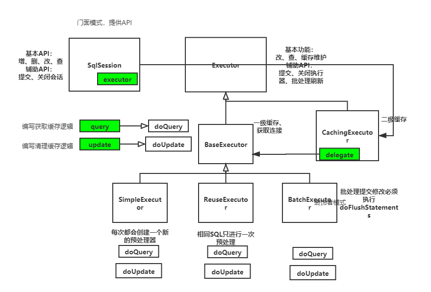
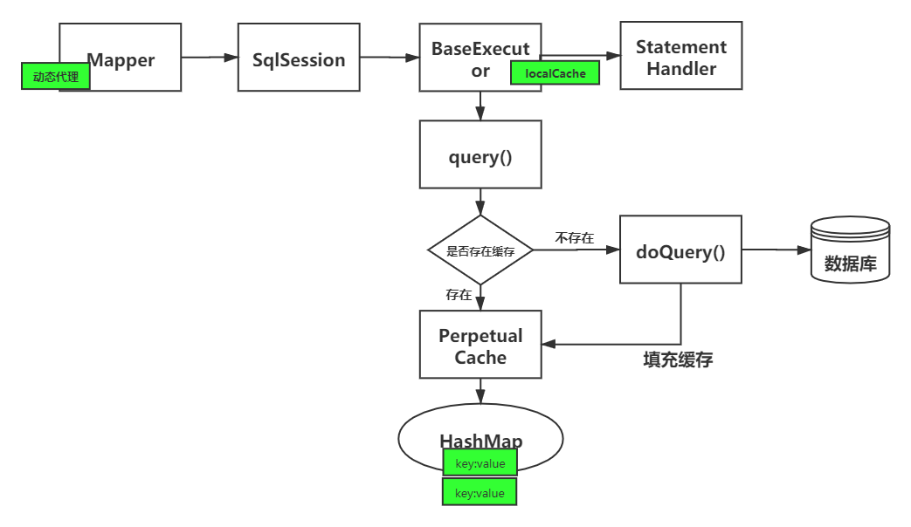

JDBC的执行过程：获取链接——> 预编译SQL——> 设置参数 ——> 执行SQL

 <!-- more --> 

```java
/** 获取链接*/
Connection connection = DriverManager.getConnection(JDBC.URL, JDBC.USERNAME, JDBC.PASSWORD);
/** 预编译SQL*/
PreparedStatement statement = connection.prepareStatement("select * from users");
/** 执行查询*/
ResultSet resultSet = statement.executeQuery();
/** 读取结果*/
readResultSet(resultSet);
```

MyBatis的执行过程：

* 获取连接

```java
//基于事务获取连接
protected Connection getConnection(Log statementLog) throws SQLException {
    Connection connection = transaction.getConnection();
    if (statementLog.isDebugEnabled()) {
        //如果需要打印Connection的日志，返回一个ConnectionLogger(代理模式, AOP思想)
        return ConnectionLogger.newInstance(connection, statementLog, queryStack);
    } else {
        return connection;
    }
}

public Connection getConnection() throws SQLException {
    if (connection == null) {
        openConnection();
    }
    return connection;
}
```

* 构建Statement
* 设置参数
* 执行修改

动态代理MapperProxy——> SQL会话SqlSession——>执行器Executor——> JDBC处理器StatementHandler



## 会话：SqlSession

门面模式，API，只提供API，具体的实现是交给Executor来实现的

* 基本API，增，删，改，查

* 辅助API 提交、关闭会话

## 执行器：Executor

* 基本功能：改(Query())、查(Update())

* 缓存维护：若缓存中有数据，就直接从缓存中查找；数据发生变更，则在缓存中的数据也要发生变更

* 辅助功能：提交增删改，关闭执行器的操作

* 批处理刷新功能

### 执行器实现一：简单执行器SimpleExecutor

```java
package cn.xiaohupao.excutortest;

import org.apache.ibatis.executor.SimpleExecutor;
import org.apache.ibatis.io.Resources;
import org.apache.ibatis.mapping.MappedStatement;
import org.apache.ibatis.session.Configuration;
import org.apache.ibatis.session.RowBounds;
import org.apache.ibatis.session.SqlSessionFactory;
import org.apache.ibatis.session.SqlSessionFactoryBuilder;
import org.apache.ibatis.transaction.jdbc.JdbcTransaction;
import org.junit.Before;
import org.junit.Test;

import java.io.IOException;
import java.sql.Connection;
import java.sql.DriverManager;
import java.sql.SQLException;
import java.util.List;

/**
 * @Author: xiaohupao
 * @Date: 2021/6/15 19:30
 */
public class ExecutorTest {

    /**
     * 配置信息
     */
    private Configuration configuration;

    private JdbcTransaction jdbcTransaction;
    private Connection connection;
    @Before
    public void init() throws SQLException, IOException {
        //创建SqlSessionFactory
        SqlSessionFactoryBuilder factoryBuilder = new SqlSessionFactoryBuilder();
        SqlSessionFactory build = factoryBuilder.build(Resources.getResourceAsStream("mybatis-config.xml"));
        configuration = build.getConfiguration();
        connection = DriverManager.getConnection("jdbc:mysql://localhost:3306/new_mybatis?useSSL=false&amp;useUnicode=true&amp;characterEncoding=UTF-8","root", "123456");
        jdbcTransaction = new JdbcTransaction(connection);
    }

    @Test
    public void simpleTest() throws SQLException {
        SimpleExecutor executor = new SimpleExecutor(configuration, jdbcTransaction);
        MappedStatement ms = configuration.getMappedStatement("cn.xiaohupao.dao.UserDao.findUserById");
        List<Object> list = executor.doQuery(ms, 1, RowBounds.DEFAULT, SimpleExecutor.NO_RESULT_HANDLER, ms.getBoundSql(1));
        System.out.println(list.get(0));
    }
}
```

无论SQL是否一样，每次都会进行预编译。

每次都会创建一个新的预处理器

### 执行器实现二：SQL声明重用ReuseExecutor

```java
/**
     * 重用执行器测试
     * @throws SQLException
     */
@Test
public void reuseTest() throws SQLException{
    ReuseExecutor executor = new ReuseExecutor(configuration, jdbcTransaction);
    MappedStatement ms = configuration.getMappedStatement("cn.xiaohupao.dao.UserDao.findUserById");
    List<Object> list = executor.doQuery(ms, 1, RowBounds.DEFAULT, ReuseExecutor.NO_RESULT_HANDLER, ms.getBoundSql(1));
    System.out.println(list.get(0));
}
```

相同的SQL只进行一次预处理

### 执行器实现三：批处理BatchExecutor

```java
/**
     * 批处理执行器测试
     * 只针对修改操作，查询操作和SimpleExecutor相同
     * 批处理需要手动刷新
     * @throws SQLException
     */
@Test
public void batchTest() throws SQLException{
    BatchExecutor executor = new BatchExecutor(configuration, jdbcTransaction);
    MappedStatement ms = configuration.getMappedStatement("cn.xiaohupao.dao.UserDao.updateUser");
    Map param = new HashMap<>();
    param.put("name", "kw");//设置
    param.put("pwd", "11111");//设置
    param.put("id", 3);//设置
    executor.doUpdate(ms, param);
    executor.doFlushStatements(false);
}
```

批处理提交修改必须执行doFlushStatements才会生效。

### 执行器抽象类BaseExector

一级缓存

获取连接

缓存执行的流程：调用query方法——>获取动态sql——>创建一个缓存的Key——>调用重载的query()方法——>获取本地一级缓存——>如果没有的话——>调用queryFromDatabase——调用子类实现的doQuery()方法。
再次调用时则会走缓存的逻辑。 

```java
@Test
public void basetest() throws SQLException{
    BaseExecutor executor = new SimpleExecutor(configuration, tran);
    executor.query(mappedStatement, null, RowBounds.DEFAULT, Executor.NO_RESULT_HANDLER);
    executor.query(mappedStatement, null, RowBounds.DEFAULT, Executor.NO_RESULT_HANDLER);
}
```

### 执行器实现四：二级缓存CachingExecutor

二级缓存通过设置才能开启，二级缓存与一级缓存的区别：一级缓存在执行查询语句后就有，二级缓存必须在提交事务后缓存才会有。

二级缓存需要将查询结果映射到POJO对象时，POJO对象需要实现java.io.Serializable接口。如果存在父类、成员POJO都需要实现序列化接口。

```java
@Test
public void cacheTest() throws SQLException{
    Executor executor = new SimpleExecutor(configuration, tran);
    CachingExecutor cachingExecutor = new CachingExecutor(executor);
    //二级缓存相关逻辑由CachingExecutor来实现  执行数据库相关逻辑由executor来实现
    cachingExecutor.query(mappedStatement, null, RowBounds.DEFAULT, Executor.NO_RESULT_HANDLER);
    cachingExecutor.commit(true);//先走二级缓存再走一级缓存
    cachingExecutor.query(mappedStatement, null, RowBounds.DEFAULT, Executor.NO_RESULT_HANDLER);
}
```

**使用SqlSession会话调用过程**

```java
@Test
public void sessionTest(){
    final SqlSession sqlSession = build.openSession(true);
    final List<Object> list = sqlSession.selectList("cn.xiaohupao.dao.UserDa.findAllUser");
    System.out.println(list);
}
```

通常使用sqlsession调用会使用SimpleExector，若想调用ReuseExector则可以在

SqlSession sqlSession = build.openSession(ExecutorType.Reuse, true);在oppenSession中指定Exectory的类型。

## MyBatis一级缓存命中场景

二级缓存是在CachingExecutor中实现的；一级缓存是在BaseExector中实现的。

一级缓存是默认打开的；一级缓存结构是一种key：value的形式，也就是HashMap。

一级缓存命中的场景与①运行时参数相关；②操作和配置相关。

```java
/**
* sql和参数必须相同
*/
@Test
public void test(){
    final UserDa mapper = sqlSession.getMapper(UserDa.class);
    final User user = mapper.findUserById(1);
    final User user1 = mapper.findUserById(1);
    System.out.println(user == user1);
}
```

**运行时参数相关**

* sql和参数相同
* 必须相同的statementID，接口名和方法名相同
* sqlSession必须相同(会话级缓存)
* RowBounds 返回的行范围必须相同

**操作和配置相关**

* 不能手动清空缓存
* 不能在执行接口中不能调用flushCache=true查询
* 未执行update，即在两次相同查询中，中间不能有修改操作，否则也将清空缓存clearCache()
* 缓存作用域不能为statement
* commit()、rollback()同样会清空缓存，与update相同

## 一级缓存源码解析

key中存着statementID、RowBounds分页条件、查询条件SQL语句、查询参数、环境变量(核心配置文件中的环境变量)



### 一级缓存总结

一级缓存与会话相关，只要会话关闭，一级缓存就会被清空。

一级缓存必须满足一级缓存命中条件才能通过一级缓存查询。因为这些条件就是缓存的key。

为了保证缓存的一致性，当在提交，回滚，执行update都将调用缓存清空方法。当配置flushCache=true时也不会走缓存，当作用域改为statement时，则不走一级缓存。

### Spring集成MyBatis一级缓存失效

本质原因是构造了不同的会话，导致一级缓存不能命中

```java
public void testBySpring(){
    ClassPathXmlApplicationContext context = new ClassPathXmlApplicationContext("Spring.xml");
    UserMapper mapper = context.getBean(UserMapper.class);
    User user = mapper.selecyByid(1);//每次都会构造一个新的会话  发起调用
    User user1 = mapper.selecyByid(1);//每次都会构造一个新的会话  发起调用
    
    System.out.println(user = user1);//false
}
```

**解决方法**

手动开启事务

```java
public void testBySpring(){
    ClassPathXmlApplicationContext context = new ClassPathXmlApplicationContext("Spring.xml");
    UserMapper mapper = context.getBean(UserMapper.class);
    
    DataSourceTransactionManager transactionManager = (DataSourceTransactionManager) context.getBean("txManager");
    TransactionStatus status = transactionManager.getTransaction(new DefaultTransactionDefinition());
    
    User user = mapper.selecyByid(1);//每次都会构造一个新的会话  发起调用
    User user1 = mapper.selecyByid(1);//每次都会构造一个新的会话  发起调用
    
    System.out.println(user = user1);//false
}
```


