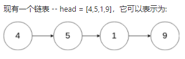

# 删除链表中的节点_237

## 请编写一个函数，使其可以删除某个链表中给定的（非末尾）节点。传入函数的唯一参数为要被删除的节点。



```java
输入：head = [4,5,1,9], node = 5
输出：[4,1,9]
解释：给定你链表中值为 5 的第二个节点，那么在调用了你的函数之后，该链表应变为 4 -> 1 -> 9.
    
输入：head = [4,5,1,9], node = 1
输出：[4,5,9]
解释：给定你链表中值为 1 的第三个节点，那么在调用了你的函数之后，该链表应变为 4 -> 5 -> 9.

```

```java
class Solution
{
    public void deleteNode(ListNode node)
    {
        node.val = node.next.val;
        node.next = node.next.next;
    }
}
```

思路分析：将要被删除节点的下一个节点的数据赋值给当前节点，将当前节点的next指向下一节点的next(跳过下一节点)。