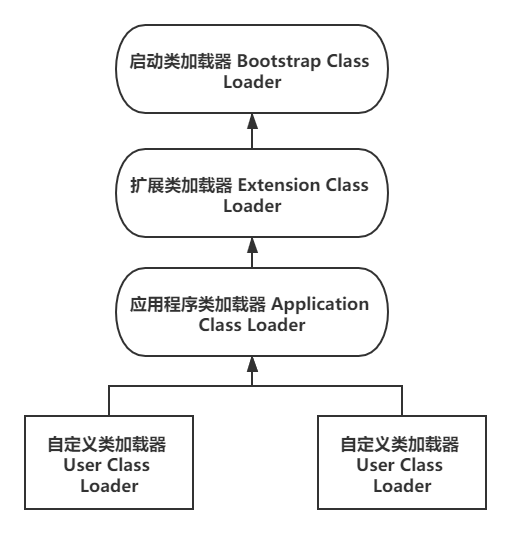

## 先导知识

​		在介绍双亲委派模型的时候不得不提到**类加载器**(ClassLoader)。在说ClassLoader的时候，我们还要先了解一下Java的基本知识。

​		Java是运行在Java虚拟机中(JVM)中的，但是它是如何运行在JVM中的呢？我们在IDE中编写的的.java文件通过javac被编译器编译成.class的字节码文件。然后将由Class Loader负责将这些Class文件加载到JVM中去执行。

​		站在JVM的角度来看，只存在两种不同的类加载器：一种是启动类加载器(BootStrap ClassLoader)，这个类加载器是由C++语言实现的，是虚拟机自身的一部分；另一种就是其他所有的类加载器，这些类加载器都由Java语言实现，独立存在于虚拟机外部，并且全都继承自抽象类java.lang.ClassLoader。

​		站在Java开发人员的角度来看，类加载器就应当划分得更细致一些。自JDK1.2以来，Java一直保持三层类加载器、双亲委派的类加载结构，尽管这套架构在Java模块化系统出现后有了一些调整变动，但依然未改变其主体结构。

 <!-- more --> 

## 三层类加载器

* 启动类加载器(Bootstrap Class Loader)：这个类加载器负责加载存放在\<JAVA_HOME\>\lib目录，或者被-Xbootclasspath参数所指定的路径中存放的，而且是Java虚拟机能够识别的(按照文件名，如rt.jar、tools.jar，名字不符合的类库即使放在lib目录中也不会被加载)类库加载到虚拟机的内存中。启动类加载器无法被Java程序直接引用，用户在编写自定义类加载器时，如果需要把加载请求委派给引导类加载器去处理，那直接使用null代替即可。
* 扩展类加载器(Extension Class Loader)：这个类加载器是在类sun.misc.Launcher\$ExtClassLoader中以Java代码的形式实现的。它负责加载\<JAVA_HOME\>\lib\ext目录中，或者被java.ext.dirs系统变量所指定的路径中所有的类库。根据“扩展类加载器”这个名称，就可以推断出这是一种Java系统类库的扩展机制，JDK的开发团队允许用户将具有通用性的类库放置在ext目录里以扩展JavaSE的功能，在JDK9之后，这种扩展机制被模块化带来的天然的扩展能力所取代。由于扩展类加载器是由Java代码实现的，开发者可以直接在程序中使用扩展类加载器来加载Class文件。
* 应用程序类加载器(Application Class Loader)：这个类加载器由sum.misc.Launcher\$AppClassLoader来实现。由于应用程序类加载器是ClassLoader类中的getSystemClassLoader()方法的返回值，所以有些场合也称它为“系统类加载器”。它负责加载用户类路径(ClassPath)上所有的类库，开发者同样可以直接在代码中使用这个类加载器。如果应用程序中没有自定义过自己的类加载器，一般情况下就是程序中默认的类加载器。


​		JDK9之前的Java应用都是由这三种类加载器互相配合来完成加载的，如果用户认为有必要，还可以加入自定义的类加载器来进行拓展，典型的如增加除了磁盘位置之外的Class文件来源，或者通过类加载器实现类的隔离、重载等功能。这些类加载之间的协作关系“通常”会如图所示。

## 双亲委派模型

​		双亲委派模型的工作过程：如果一个类加载器收到了类加载的请求，它首先不会自己去尝试加载这个类，而是把这个请求委派给父类加载器去完成，每一个层次的类加载器都是如此，因此所有的加载请求最终都应该传送到最顶层的启动类加载器中，只有当父加载器反馈自己无法完成这个加载的请求(它的搜索范围中没有找到所需的类)时，子加载器才会尝试自己去完成加载。

​		双亲委派模型的实现：

```java
public Class<?> loadClass(String name) throws ClassNotFoundException {
    return loadClass(name, false);
}

protected Class<?> loadClass(String name, boolean resolve)
    throws ClassNotFoundException
{
    synchronized (getClassLoadingLock(name)) {
        // 首先检查是否已经被类加载器加载过
        Class<?> c = findLoadedClass(name);
        if (c == null) {
            long t0 = System.nanoTime();
            try {
                //存在父加载器，递归的交给父加载器
                if (parent != null) {
                    c = parent.loadClass(name, false);
                } else {
                    //直到最上面的Bootstrap CLassLoader
                    c = findBootstrapClassOrNull(name);
                }
            } catch (ClassNotFoundException e) {
                // ClassNotFoundException thrown if class not found
                // from the non-null parent class loader
            }

            if (c == null) {
                // If still not found, then invoke findClass in order
                // to find the class.
                long t1 = System.nanoTime();
                c = findClass(name);

                // this is the defining class loader; record the stats
                sun.misc.PerfCounter.getParentDelegationTime().addTime(t1 - t0);
                sun.misc.PerfCounter.getFindClassTime().addElapsedTimeFrom(t1);
                sun.misc.PerfCounter.getFindClasses().increment();
            }
        }
        if (resolve) {
            resolveClass(c);
        }
        return c;
    }
}
```

## 双亲委派模式的优点

​		使用双亲委派模型来组织类加载器之间的关系，一个显而易见的好处就是Java中的类随着它的类加载器一起具备了一种带有优先级的层次关系。例如类java.lang.Object，它存放在rt.jar之中，无论哪一个类加载器要加载这个类，最终都是委派给处于模型最顶端的启动类加载器进行加载，因此Object类在程序的各种类加载器环境中都能保证是同一个类。

​		反之，如果没有使用双亲委派模型，都由各个类加载器自行去加载的话，如果用户自己也编写了一个名为java.lang.Object的类，并放在程序的ClassPath中，那系统中就会出现多个不同的Object类，Java类型体系中最基础的行为也就无从保证，应用程序将会变得一片混乱。

​		总结：

双亲委派模型的优势：

* 避免类的重复加载
* 保护程序安全，防止核心API被随意篡改

