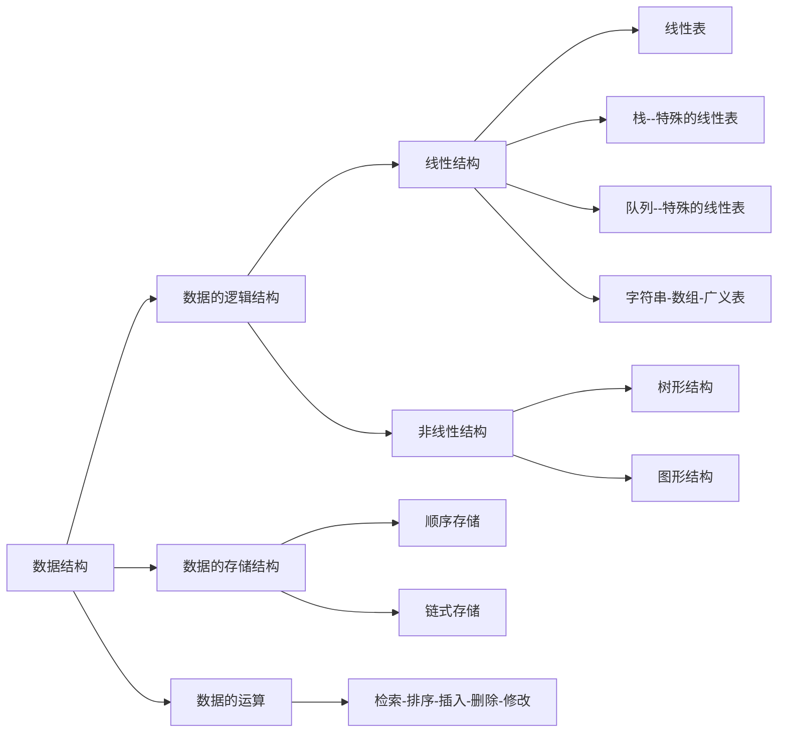

## 算法与算法分析

* 算法效率以下两个方面来考虑：
  * **时间效率**：指的是算法所耗费的时间
  * **空间效率**：指的是算法执行过程中所消耗的存储空间
* **时间效率和空间效率有时候是矛盾的**

 <!-- more --> 

### 算法时间效率度量

* 算法时间效率可以依据该算法编制的程序在计算机上执行所消耗的时间来度量
* 两种度量方式
  * 事后统计
    * 将算法实现，测算其时间和空间开销
    * 缺点：编写程序实现算法将花费较多的时间和精力；所得实验结果依赖于计算机得软硬件等环境因素，掩盖算法本身的优劣
  * 事前分析
    * 对算法所消耗资源的一种估算方法
    * 一个算法的运行时间是指一个算法在计算机上运行所消耗的时间大致可以等于计算机执行一种简单的操作所需的时间与算法中进行的简单操作次数乘积。

**算法的运行时间 = 一个简单操作所需的时间 x 简单操作次数**
**算法的运行时间 = $\sum$每条语句执行的次数 x 该语句执行一次所需要的时间**
**算法的运行时间 = $\sum$每条语句频度 x 该语句执行一次所需要的时间**

​		每条语句执行的一次所需要的时间，一般是随机器而异的。取决于机器的指令性能、速度以及编码的代码质量。是由机器本身软硬件环境决定的，它与算法无关。
​		所以，我们可以假设执行每条语句所需要的时间均为单位时间。此时对算法的运行时间的讨论就可以转化为该算法中所有语句的执行次数，即频度之和。
​		这就可以独立于不同机器的软硬件环境来分析算法的时间性能了。

```java
//矩阵乘法
public static int[][] MatrixMultiplication(int[][] a, int[][] b){
    int n = a.length;
    int[][] c = new int[n][n];
    for(int i = 0; i < n; i++){//n+1次
        for(int j = 0; j < n; j++){//n(n+1)次
            for(int k = 0; k < n; k++){//n*n(n+1)次
                c[i][j] += a[i][k] * b[k][j];//n*n*n次
            }
        }
    }
    return c;
}
```

​		我们把算法所消耗的时间定义为该算法中每条语句的频度之和，则上述算法的时间消耗T(n)为：$2n^3+3n^2+2n+1$

**算法时间复杂度的渐进表示法**

* 为了便于比较不同算法的时间效率，我们仅比较它们的数量级。
* 若有某个辅助函数f(n)，使得当n趋近于无穷大时，$T(n)/f(n)$的极限为不等于零的常数，则称f(n)是T(n)的同数量级函数。记作$T(n)=O(f(n))$，称$O(f(n))$为算法的渐进时间复杂度(O是数量级的符号)，简称时间复杂度。
* 一般情况下，不必计算所有操作的执行次数，而只考虑算法中基本操作执行的次数，它是问题规模n的某个函数，用$T(n)$表示。

上述矩阵相乘问题的时间复杂度为$O(n^3)$

### 算法时间复杂度定义

​		算法中基本语句重复执行的次数是问题规模n的某个函数f(n)，算法的时间量度记为：$T(n)=O(f(n))$

### 分析算法时间复杂度的基本方法

定理1.1 若$f(n)=a_mn^m+a_{m-1}n^{m-1}+...+a_1n+a_0$是m次多项式，则$T(n)=O(n^m)$

* 找出语句频度最大的那条语句作为基本语句
* 计算基本语句的频度得到问题规模n的某个函数$f(n)$
* 取其数量级用符号“O”表示

```c
//例1
for(int i = 1; i <= n; i++){
    for(int j = 1; j <= n; j++){
        c[i][j] = 0;
        for(k = 1; k <= n; k++)
            c[i][j] = c[i][j]+a[i][k] * b[k][j];
    }
}
```

$$
\sum_{i=1}^{n}\sum_{j=1}^{n}\sum_{k=1}^n1=\sum_{i=1}^{n}\sum_{j=1}^{n}n=\sum_{i=1}^{n}n^2=n^3
$$

```c
//例2
for(i = 1; i <= n; i++)
    for(j=1; j <= i; j++)
        for(k=1;k <= j; k++)
            x=x+1;
```

$$
\sum_{i=1}^n\sum_{j=1}^i\sum_{k=1}^j1=\sum_{i=1}^n\sum_{j=1}^ij=\sum_{i=1}^n\frac{(1+i)i}{2}=\frac{1}{2}(\sum_{i=1}^ni^2+\sum_{i=1}^ni)=(\frac{1}{2})(\frac{n(n+1)(2n+1)}{6}+\frac{n(n+1)}{2})=\frac{n(n+1)(n+2)}{6}
$$

```c
//例3
int i = 1;
while(i <= n)
    i = i * 2
```

$$
2^{f(n)} <= n;f(n)<=log_2n;T(n)=log_2n
$$

### 算法时间复杂度计算

​		请注意：有的情况下，算法中基本操作重复执行的次数还随问题的输入数据集不同而不同。

```c
//例如
for(i=0; i<n; i++)
    if(a[i]==e) return i+1;
return 0;
```

* 最好情况：1次
* 最坏情况：n次
* 平均时间复杂度为：$O(n)$

最坏时间复杂度：指在最坏情况下，算法的时间复杂度
平均时间复杂度：指在所有可能输入实例在等概率出现的情况下，算法的期望运行时间
最好时间复杂度：指在最好情况下，算法的时间复杂度

​		一般总是考虑在最坏情况下的时间复杂度，以保证算法的运行时间不会比它更长。

​		对于复杂的算法，可以将它分成几个容易估算的部分，然后利用大O加法法则和乘法法则，计算算法的时间复杂度：
​		加法规则：$T(n)=T_1(n)+T_2(n)=O(f(n))+O(g(n))=O(max(f(n),g(n)))$
​		乘法法则：
$T(n)=T_1(n)\times T_2(n)=O(f(n))\times O(g(n))=O(f(n)\times g(n))$

### 算法时间效率的比较

​		当n取得很大时，指数时间算法和多项式时间算法在所需时间上非常悬殊。

**时间复杂度$T(n)$按数量级递增顺序**

​		常数阶-> 对数阶 -> 线性阶 -> 线性对数阶 -> 平方阶 -> 立方阶 -> … ->K方阶 -> 指数阶。

### 渐进空间复杂度

​		空间复杂度：算法所需要存储空间的度量，记作：$S(n)=O(f(n))$，其中n为问题的规模大小。
​		算法要占据的空间：算法本身要占据的空间，输入/输出，指令，常数，变量等；算法要使用的**辅助空间**。

```c
//code1
for(i=0; i<n; i++){
    t=a[i];
    a[i]=a[n-i-1];
    a[n-i-1]=t;
}
//code2
for(i=0;i<n;i++)
    b[i]=a[n-i-1];
for(i=0;i<n;i++)
    a[i]=b[i];
```

​		code1中$S(n)=O(1)$原地工作，code2中$S(n)=O(n)$。

### 设计好算法的过程

抽象数据类型=数据的逻辑结构+抽象运算
		数据的逻辑结构可以有多种数据的存储结构；基于不同的数据存储结构可以有不同的算法；不同的算法考虑其渐进的时间复杂度和渐进的空间复杂度；最后得出好的算法。

### 总结




---

## 线性表

### 线性表的定义和特点

* 线性表(Linear List)：由$n(n>=0)$个数据元素(结点)$a_1,...,a_n$组成的有限序列
* 其中数据元素的个数为n定义为表的长度
* 当n=0时称为空表
* 将非空的线性表(n>0)记作：$(a_1,a_2,...,a_n)$
* 这里的数据元素$a_i(1<=i<=n)$只是一个抽象的符号，其具体含义在不同的情况下可以不同

同一线性表中的元素必定具有相同特性，数据元素间的关系是线性关系。

**线性表的逻辑特征**

* 从非空的线性表，有且仅有一个开始结点$a_1$，它没有直接前驱，而仅有一个直接后继$a_2$；
* 有且仅有一个终端结点$a_n$，它没有直接后继，而仅有一个直接前驱$a_{n-1}$
* 其余的内部结点$a_i(2<=i<=n-1)$都有仅有一个直接前驱$a_{i-1}$和一个直接后继$a_{i+1}$。

**线性表是一种典型的线性结构。**

### 案例引入

​		**一元多项式的运算：实现两个多项式加、减、乘运算**

$P_n(x)=p_0+p_1x+p_2x^2+...+p_nx^n$

例如：$P(x)=10+5z-4x^2+3x^3+2x^4$用数组来表示[10, 5, -4, 3, 2]

$R_n(x)=P_n(x)+Q_m(x)$->线性表$R=(p_0+q_0,p_1+q_1,...,p_m+q_m,p_{m+1},...p_n)$

​		**稀疏多项式的运算：**

$S(x)=1+3x^{10000}+2x^{20000}$

例如：$A(x)=7+3x+9x^8+5z^{17}$$B(X)=8x+22x^7-9x^8$

线性表$A=((7,0),(3,1),(9,8),(5,17))$；线性表$B=((8,1),(22,7),(-9,8))$

$P_n(x)=p_1x^{e1}+p_2x^{e2}+...+p_mx^{em}$->线性表$P=((p_1,e_1),(p_2,e_2),...,(p_m,e_m))$

​		**图书信息管理系统：**需要的功能：查找、插入、删除、修改、排序、计数

**总结**

​		线性表中数据元素的类型可以为简单类型，也可以为复杂类型。许多实际应用问题所涉及的基本操作有很大相似性，不应为每个具体应用单独编写一个程序。从具体应用中抽象出共性的逻辑结构和基本操作(抽象数据类型)，然后实现其存储结构和基本操作。

### 线性的类型定义

**基本操作**

* InitList(&L)：构造一个空的线性表L
* DestroyList(&L)：销毁线性表L
* ClearList(&L)：将线性表L重置为空表
* ListEmpty(&L)：若线性表L为空表，则返回true；否则返回false
* ListLength(&L)：返回线性表L中的数据元素个数
* GetElem(L,i,&e)：用e返回线性表L中第i个数据元素的值
* LocateElem(L,e,compare())：返回L中第一个与e满足compare()的数据元素的位序。若这样的数据元素不存在则返回值为0。
* PriorElem(L,cur_e,&pre_e)：若cur_e是L的数据元素，且不是第一个，则用pre_e返回它的前驱，否则操作失败；pre_e无意义
* NextElem(L,cur_e,&next_e)：若cur_e是L的数据元素，且不是最后一个，则用next_e返回它的后继，否则操作失败；next_e无意义
* ListInsert(&L,i,e)：在L的第i个位置之前插入新的数据元素e，L的长度+1
* ListDelete(&L,i,&e)：删除L的第i个数据元素，并用e返回其值，L的长度-1
* ListTraverse(&L,visited())：依次对线性表中每个元素调用visited()

以上所提及的运算是逻辑结构上定义的运算。只要给出这些运算的功能是“做什么”，至于“如何做”等实现细节，只有待确定了存储结构之后才考虑。

### 线性表的顺序表示和实现

**顺序存储结构**

​		线性表的顺序表示又称为顺序存储结构或顺序映像。
​		**顺序存储定义**：把逻辑上相邻的数据元素存储在物理上相邻的存储单元中的存储结构。线性表顺序存储结构占用一片连续的存储空间。知道某个元素的存储位置就可以计算其他元素的存储位置。

**顺序表中元素存储位置的计算**

​		假设线性表的每个元素需占l个存储单元，则第i+1个数据元素的存储位置和第i个数据元素的存储位置之间满足关系：$LOC(a_{i+1})=LOC(a_i) + l$。由此，所有数据元素的存储位置均可由第一个数据元素的存储位置得到：$LOC(a_i)=LOC(a_1) +(i-1)\times l$

​		顺序表的特点：以物理位置相邻表示逻辑关系。任一元素均可随机存取。

**顺序表的顺序存储表示**

```c
//模板
#define LIST_INIT_SIZE 100
typedef struct{
    ElemType elem[LIST_INIT_SIZE];
    int length;
}SqList;
```

多项式的顺序存储结构类型定义：

```c
#define MAXSIZE 1000
typedef struct{
    float p;//系数
    int e;//指数
}Polynomial;

typedef struct{
    Polynomial *elem;//存储空间基地址
    int length;//多项式中当前项的个数
}SqList;
```

**顺序表基本操作的实现**

```c++
Status InitList_Sq(SqList &L){
    L.elem= new ElemType[MAXSIZE];
    if(!L.elem) exit(OVERFLOW);
    L.length=0;
    return OK;
}
```

```c++
void DestroyList(SqList &L){
    if(L.elem) delete L.elem;
}
```

```c++
void ClearList(SqList &L){
    L.length=0;
}
```

```c++
int GetLength(SqList L){
    return (L.length);
}
```

```c++
int IsEmpty(SqList L){
    if(L.length == 0) return 1;
    else return 0;
}
```

```c++
//顺序表的取值
int GetElem(SqList L, int i, ElemType &e){
    if(i<1||i>L.length) return ERROR;
    e=L.elem[i-1];
    return OK;
}
//随机存取
```

**顺序表的查找**

​		在线性表L中查找与指定值e相同的数据元素的位置；从表的一端开始，逐个进行记录关键字和给定值的比较。

```c++
int LocateElem(SqList L, ElemType e){
    for(i=0;i<L.length;i++)
        if(L.elem[i] == e) return i+1;
    return 0;
}
//最坏时间复杂度：O(N);空间复杂度：O(1)
```

​		平均查找长度ASL(Average Search Length)：为确定记录在表中的位置，需要与给定值进行比较的关键字的个数的期望值叫做查找算法的平均查找长度。
$$
ASL=\sum_{i=1}^n P_iC_i
$$
若每个记录的查找概率相等则：
$$
ASL=\sum_{i=1}^n\frac{1}{n}C_i=\frac{1}{n}\frac{(1+n)n}{2}=\frac{n+1}{2}
$$
顺序表的平均查找时间复杂度为O(n)

**顺序表的插入**

插入不同的位置：插入位置在最后，插入位置在中间，插入位置在最前面。

算法思想：①判断插入位置是否合理；②判断顺序表存储空间是否满，若已满返回ERROR；③将第n至第i位的元素依次向后移动一个位置，空出第i个位置；④将要插入的新元素e放入第i个位置。

```c++
Status ListInsert_Sq(SqList &L, int i, ElemType e){
    if(i<1||i>L.length+1) return ERROR;
    if(L.length==MAXSIZE) return ERROR;
    for(j=L.length-1;j>=i-1;j--)
        L.elem[j+1]=L.elem[j];
    L.elem[i-1]=e;
    L.length++;
    return OK;
}
```

**顺序表的插入算法分析：**

* 若插入在尾节点之后，则根本无需移动
* 若插入在首结点之前，则表中元素全部后移
* 考虑在各种位置插入的平均移动次数为：

$$
E_{ins}=\frac{1}{n+1}\sum_{i=1}^{n+1}(n-i+1)=\frac{1}{n+1}\frac{n(n+1)}{2}=\frac{n}{2}
$$

顺序表插入算法的平均时间复杂度为O(n)

**顺序表的删除**

删除不同的位置：删除位置在最后，删除位置在中间，删除位置在最前面

算法思想：①判断删除位置i是否合法；②将删除的元素保留；③将第i+1至第n位的元素依次向前移动一个位置；④表长减一，删除成功返回OK

```c++
Status ListRemove_Sq(SqList &L, int i){
    if(i<1||i>L.length) return ERROR;
    for(j=i; j<=L.length-1;j++){
        L.elem[j-1]=L.elem[j];
    }
    L.length--;
    return OK;
}
```

**顺序表的删除算法分析：**

* 若删除尾节点，则根本无序移动
* 若删除首结点，则表中n-1个元素全部前移
* 若要考虑在各种位置上的平均移动次数为：

$$
E_{del}=\frac{1}{n}\sum_{i=1}^n(n-i)=\frac{1}{n}\frac{(0+n-1)n}{2}=\frac{n-1}{2}
$$

顺序表的删除算法的平均时间复杂度为：O(n)

**总结：**

​		顺序表的特点：①利用数据元素的存储位置表示线性表中相邻数据元素之间的前后关系，即线性表的逻辑结构与存储结构一致；②在访问线性表时，可以快速计算出任何一个数据元素的存储地址。因此可以粗略地认为，访问每个元素所花时间相等。这种存取元素的方法被称为随机存取法。

​		顺序表的操作算法分析：
时间复杂度：插入、查找、删除算法的平均时间复杂度为O(n)
空间复杂度：显然，顺序表操作算法的空间复杂度S(n)=O(1)

顺序表的优点：

* 存储密度大(结点本身所占存储量/结点结构所占存储量)
* 可以随机存取表中任一元素

顺序表的缺点：

* 在插入、删除某一个元素时，需要移动大量元素
* 浪费存储空间
* 属于静态存储形式，数据元素的个数不能自由扩张

### 线性表的链式表示和实现

**链式存储结构**

结点在存储器中的位置是任意的，即逻辑上相邻的数据元素在物理上不一定相邻
线性表的链式表示又称为非顺序映像或链式映像。

* 用一组物理位置任意的存储单元来存放线性表的数据元素。
* 这组存储单元既可以是连续的，也可以是不连续的，甚至是零散分布在内存中的任意位置上的。
* 链表中元素的逻辑次序和物理次序不一定相同。

**与链式存储有关的术语**

* 结点：数据元素的存储映像。由数据域和指针域两部分组成
* 链表：n个结点由指针链组成的一个链表。它是线性表的链式存储映像，称为线性表的链式存储结构。

**单链表、双链表、循环链表：**

* 结点只有一个指针域的链表，称为单链表或线性链表
* 结点有两个指针域的链表，称为双链表
* 首尾相接的链表称为循环链表

**头指针、头结点和首元结点：**

* 头指针：是指向链表中第一个结点的指针
* 首元结点：是指链表中存储第一个数据元素$a_1$的结点
* 头结点：是在链表的首元结点之前附设的一个结点

**链表的存储结构示意图有以下两种形式：**

* 不带头结点
* 带头结点

**如何表示空表？**

无头结点时，头指针为空时表示空表；有头结点时，当头结点的指针域为空表示空表。

**链表中设置头结点有什么好处？**

* 便于首元结点的处理：首元结点的地址保存在头结点的指针域中，所以在链表的第一个位置上的操作和其他位置一致，无需进行特殊处理。
* 便于空表和非空表的统一处理：无论链表是否为空，头指针都是指向头结点的非空指针，因此空表和非空表的处理也就统一了。

**头结点的数据域内装的是什么？**

头结点的数据域可以为空，也可以存放线性表长度等附加信息，但此结点不能计入链表长度值。

**链表(链式存储结构)的特点：**

* 结点在存储器中的位置是任意的，即逻辑上相邻的数据元素在物理上不一定相邻
* 访问时只能通过头指针进入链表，并通过每个结点的指针域依次向后顺序扫描其余结点，所以寻找第一个结点和最后一个结点所花费的时间不等

#### 单链表的定义和表示

单链表是由表头唯一确定，因此单链表可以用头指针的名字来命名若头指针名是L，则把链表称为表L。

**单链表的存储结构**

```c++
typedef struct Lnode{
    ElemType data;//结点的数据域
    struct Lnode *next;//结点的指针域
}Lnode, *LinkList;
```

例如，存储学生学号、姓名、成绩的单链表结点类型定义如下：

```c++
typedef Struct student{
    char num[8];//数据域
    char name[8];//数据域
    int score;//数据域
    struct student *next;//指针域
}Lnode, *LinkList;
```

**单链表基本操作的实现**

**单链表的初始化：**构造一个空表
算法步骤：①生成新结点作为头结点，用头指针L指向头结点；②将头结点的指针域置空。

```c++
Status InitList_L(LinkList &L){
    L=new LNode;
    L->next=NULL;
    return OK;
}
```

**判断链表是否为空：**
算法思路：判断头结点指针域是否为空

```c++
int ListEmpty(LinkList L){
    if(L->next)
        return 0;
    else
        return 1;
}
```

**单链表的销毁：**链表销毁后不存在
算法思路：从头指针开始，依次释放所有结点

```c++
Status DestroyList_L(LinkList &L){
    Lnode *p;
    while(L){
        p=L;
        L=L->next;
        delete p;
    }
    return OK;
}
```

**清空链表：**链表仍存在，但链表中无元素，成为空链表(头指针和头结点仍然在)
算法思路：依次释放所有结点，并将头结点指针域设置为空

```c++
Status clearList_L(LinkList &L){
    Lnode *p, *q;
    p=L->next;
    while(p){
        q=p->next;
        delete p;
        p=q;
    }
    L->next=NULL;
    return OK;
}
```

**求单链表的表长**
算法思路：从首元结点开始，依次计数所有结点

```c++
int ListLength_L(LinkList &L){
    LinkList p;
    p=L->next;
    i=0;
    while(p){
        i++;
        p=p->next;
    }
    return i;
}
```

**取值**——取单链表中的第i个元素的内容
算法思路：从链表的头指针出发，顺着链域next逐个结点向下搜索，直到搜索到第i哥结点为止。因此，链表不是随机存取结构。
算法步骤：①从第一个结点顺链扫描，用指针p指向当前扫描到的结点，p初值p=L->next；②j做计数器，累计当前扫描过的结点数，j初值为1；③当p指向扫描到的下一结点，计数器j+1；④当j==i时，p所指的结点就是要找的第i个结点。

```c++
Status getElem_L(LinkList L, int i, ElemType &e){
    p=L->next;
    for(j=1, j<i && p; j++)
        p=p->next;
    if(!p||j>i) return ERROR;
    e=p->next;
    return OK;
}
```

**查找：**①按值查找，根据指定数据获取该数据所在的位置；②按值查找，根据指定数据获取该数据所在的位置序号。

按值查找：
算法步骤：①从第一个结点起，依次和e相比较；②如果找到一个其值与e相等的数据元素，则返回其在链表中的“位置”或地址；③如果查遍整个链表都没有找到其值和e相等的元素，则返回0或“NULL”。

```c++
Lnode *LocateElem_L(LinkList L, Elemtype e){
    p=L->next;
    while(p &&p->data!=e)
        p=p->next;
    return p;       
}
```

```c++
int LocateELem_L(LinkList L, Elemtype e){
    p=L->next;j=1;
    while(p && p->data!=e){
        p=p->next;
        j++;
    }
    if(p) return j;
    else return 0;
}
```

**插入**—在第i个结点前插入值为e的新结点

算法步骤：①首先找到$a_{i-1}$的存储位置p；②生成一个数据域为e的新结点s；③插入新结点：(1)新结点的指针域指向结点$a_i$【s->next=p->next】；(2)结点$a_{i-1}$的指针域指向新结点【p->next = s】

```c++
Status ListInsert_L(LinkList &L, int i, ElemType e){
    p=L;j=0;
    while(p && j<i-1){
        p=p->next;
        ++j;
    }
    if(!p || j > i-1)return ERROR;
    s=new LNode;
    s->data=e;
    s->next=p->next;
    p->next=s;
    return OK;
}
```

**删除**——删除第i个结点
算法步骤：①首先找到$a_{i-1}$的存储位置p，保存要删除的$a_i$的值；②令p->next指向$a_{i+1}$

```c++
Status ListDelete_L(LinkList &L, int i, ElemType &e){
    p=L;j=0;
    while(p->next  && j<i-1){
        p=p->next;
        ==j;
    }
    if(!(p->next) || j>i-1)return ERROR;
    q=p->next;
    p->next=q->next;
    e=q->data;
    delete q;
    return OK;
}
```

**单链表的查找、插入、删除算法时间效率分析**

查找：O(n)；插入和删除：O(1)，但是，如果要在单链表中进行前插或删除操作，由于要从头查找前驱结点，所耗时间复杂度为O(n)。

**单链表的建立**

头插法：每次把新元素插在链表头部，也叫前插法。

算法步骤：①从一个空表开始，重复读入数据；②生成新结点，将读入数据存放到新结点的数据域中；③从最后一个结点开始，依次将各结点插入到链表的前端

```c++
void CreateList_H(LinkList &L, int n){
    L = new LNode;
    L->next=NULL;
    for(i=n;i>0;--i){
        p=new LNode;
        cin>>p->data;
        p->next=L->next;
        L->next=p;
    }
}
```

时间复杂度为：O(n)

尾插法：元素插入在链表尾部，也叫后插法。

算法步骤：①从一个空表L开始，将新结点逐个插入到链表的尾部，尾指针r指向链表的尾节点；②初始化，r同L均指向头结点。每读入一个数据元素则申请一个新结点，将新结点插入到尾节点后，r指向新结点。

```c++
void CreateList_R(LinkList &L, int n){
    L=new LNode;
    L->next = NULL;
    r=L;
    for(i=0;i<n;++i){
        p=new LNode;
        cin>>p->data;
        p->next=NULL;
        r->next=p;
        r=p;
    }
}
```

**循环链表**

​		循环链表是一种头尾相接的链表。

优点：从表中的任一结点出发均可以找到表中其他结点。

注意：由于循环链表中没有NULL指针，故涉及遍历操作时，其终止条件就不再像非循环链表那样判断p或p->next是否为空，而是判断它们是否等于头指针。

**带尾指针的循环链表的合并**

分析操作：p存表头结点、Tb表头链接到Ta表尾，释放Tb表头结点，修改指针

```c++
LinkList Connect(LinkList Ta, Linklist Tb){
    p=Ta->next;
    Ta->next=Tb->next->next;
    delete Tb->next;
    Tb->next = p;
    return Tb;
}
```

时间复杂度为：O(1)

**双向链表**

双向链表：在单链表的每个结点里再增加一个指向其直接前驱的指针域prior，这样链表中就形成了有两个方向不同的链，故称为双向链表。

双向链表的结构定义：

```c++
typedef struct DuLNode{
    Elemtype data;
    struct DuLNode *prior, *next;
}DuLNode, *DuLinkList;
```

**双向循环链表**

和单链表的循环链表类似，双向链表也可以有循环表：让头结点的前驱指针指向链表的最后一个结点；让最后一个结点的后继指针指向头结点。

双向链表结构的对称性：p->prior->next=p=p->next->prior

在双向链表中有些操作(如：ListLength、GetElem等)，因仅涉及一个方向的指针，故它们的算法与线性链表的相同。但在插入、删除时，则需要同时修改两个方向上的指针，两者的操作的时间复杂度均为O(n)。

**双向链表的插入**

```c++
void ListInsert_DuL(DuLinkList &L, Int i, ElemType e){
    if(!(p=GetElemp_DuL(L,i))) ERROR;
    s=new DuLNode;
    s->data = e;
    s->prior=p->prior;
    s->next=p;
    p->prior->next=s;
    p->prior=s;
    return OK;
}
```

**双向链表的删除**

```c++
void ListDelete_DuL(DuLink &L, Int i, Elemtyle &e){
    if(!(p=GetElemP_DuL(L,i))) return ERROR;
    e = p->data;
    p->prior->next=p->next;
    p->next->prior = p->prior;
    free(p);
    return OK;
}
```

**单链表、循环链表、双向链表的时间效率比较**

|                                 | 查找表头结点(首元结点) | 查找表尾结点                        | 查找结点\*p的前驱结点                   |
| ------------------------------- | ---------------------- | ----------------------------------- | --------------------------------------- |
| 带头结点的单链表L               | L->next时间复杂度O(1)  | 从L->next依次向后遍历时间复杂度O(n) | 通过p->next无法找到其前驱               |
| 带头结点仅设头指针L的循环单链表 | L->next时间复杂度O(1)  | 从L->next依次向后遍历时间复杂度O(n) | 通过p->next可以找到其前驱时间复杂度O(n) |
| 带头结点仅设尾指针R的循环单链表 | R->next时间复杂度O(1)  | R时间复杂度为O(1)                   | 通过p->next可以找到其前驱时间复杂度O(n) |
| 带头结点的双向循环链表L         | L->next时间复杂度O(1)  | L->prior时间复杂度O(1)              | p->prior时间复杂度O(1)                  |

### 顺序表和链表的比较

* 链式存储结构的优点：
  * 结点空间可以动态申请和释放
  * 数据元素的逻辑次序靠结点的指针来指示，插入和删除时不需要移动数据元素
* 链式存储的缺点：
  * 存储密度小，每个结点的指针域需要额外占用存储空间。当每个结点的数据域所占字节不多时，指针域所占存储空间的必重显得很大。
    * 存储密度：是指结点数据本身所占的存储量和整个结点结构中所占的存储量之比。
  * 链式存储结构是非随机存取结构。对任一结点的操作都要从头指针依指针链查找到该结点，这增加了散发的复杂度。

| 比较项目 | 存储结构   | 顺序表                                                       | 链表                                                   |
| -------- | ---------- | ------------------------------------------------------------ | ------------------------------------------------------ |
| 空间     | 存储空间   | 预先分配，会导致空间闲置或溢出现象                           | 动态分配，不会出现存储空间闲置或溢出现象               |
|          | 存储密度   | 不用为表示结点间的逻辑关系而增加额外的存储开销，存储密度等于1 | 需要借助指针来体现元素间的逻辑关系，存储密度小于1      |
| 时间     | 存取元素   | 随机存取，按位置访问元素的时间复杂度为O(1)                   | 顺序存取，按位置访问元素时间复杂度为O(n)               |
|          | 插入和删除 | 平均移动约表中一半元素，时间复杂度为O(n)                     | 不需要移动元素，确定插入、删除位置后，时间复杂度为O(1) |
| 适用情况 |            | 表长变化不大，且能事先确定变化的范围；很少进行插入或删除操作，经常按元素位置序号访问数据元素 | 长度变化较大；频繁进行插入或删除操作                   |

### 线性表的应用

**线性表的合并**

假设利用两个线性表La和Lb分别表示两个集合A和B，现要求一个新的集合A=AUB

算法步骤：依次取出Lb中的元素，执行以下操作：在La中查找该元素；如果找不到，则将其插入到La的最后

```c++
void union(List &La, List Lb){
    La_len=ListLength(La);
    Lb_len=ListLength(Lb);
    for(i=1;i<=Lb_len;i++){
        GetElem(Lb,i,e);
        if(!LocateElem(La,e))
            ListInsert(&La, ++La_len,e);
    }
}
```

**有序表的合并**

一致线性表La和Lb中的数据元素按值非递减有序排列，现要求将La和Lb归并为一个新的线性表Lc，且Lc中的数据元素按值非递减有序排列。

算法步骤：创建一个空表Lc；依次从La或Lb中摘取元素较小的结点插入到Lc表的最后，直至其中一个表空为止；继续将La或Lb其中一个表中的剩余结点插入在Lc表的最后。

**顺序表的实现**

```c++
void MergeList_Sq(SqList LA, SqList LB, SqList &LC){
    pa=LA.elem;
    pb=LB.elem;
    LC.length=LA.length+LB.length;
    LC.elem=new ElemTupe[LC.length];
    pc=LC.elem;
    pa_last=LA.elem+LA.length-1;
    pb_last=LB.elem+LB.length-1;
    while(pa <=pa_last && pb <= pb_last){
        if(*pa <= *pb) *pc++ = *pa++;
        else *pc++ = *pb++;
    }
    while(pa <= pa_last) *pc++ = *pa++;
    while(pb <= pb_last) *pc++ = *pb++;
}
```

时间复杂度为：O(ListLength(La) + ListLength(Lb))；算法的空间复杂度是：O(ListLength(La) + ListLength(Lb))

**链表的实现**

```c++
void MergeList_L(LinkList &La, LinkList &Lb, LinkList &Lc){
    pa=La->next;
    pb=Lb->next;
    pc=Lc=La;
    while(pa && pb){
        if(pa->data <= pb->data){
            pc->next=pa;
            pc=pa;
            pa=pa->next;
        }else{
            pc->next=pb;
            pc=pb;
            pb=pb->next;
        }
    }
    pc->next=pa ? pa : pb;
    delete Lb;
}
```

算法的时间复杂度为O(ListLength(La) + ListLength(Lb))；空间复杂度为：O(1)。

### 案例分析与实现

#### 一元多项式的运算：实现两个多项式加、减、乘运算

例如：$P_a(x)=10+5x-4x^2+3x^3+2x^4,P_b(x)=-3+8x+4x^2-5x^4+7x^5-2x^6$

#### 稀疏多项式的运算

例如：$A(x)=7+3x+9x^8+5x^{17}, B(X)=8x+22x^7-9x^8$
线性表A=((7,0), (3,1), (9,8), (5,17))；线性表B=((8,1), (22,7), (-9,8))

顺序存储结构实现：
算法步骤：创建一个新数组c；分别从头遍历比较a和b的每一项：指数相同，对应系数相加，若其和不为零，则在c中增加一个新项，指数不相同，则将指数较小的项复制到C中；一个多项式已遍历完毕，将另一个剩余项依次复制到c中即可。

链式存储结构实现：
算法步骤：①创建一个只有头结点的空链表；②根据多项式的项的个数n，循环n次执行以下操作：1.生成一个新结点\*s；2.输入多项式当前项的系数和指数赋给新结点的\*s的数据域；设置一个前驱指针pre，用于指向待找到的第一个大于输入项指数的结点的前驱，pre初值指向头结点；3.指针q初始化，指向首元结点；4.顺链向下逐个比较链中当前结点与输入项指数，找到第一个大于输入项指数的结点\*q；5.将输入项结点\*s插入到结点\*q之前。

```c++
void CreatePolyn(Polynomial &p, int n){
    P= new PNode;
    P->next=NULL;
    for(i=1;i<=n;i++){
        s=new PNode;
        cin>>s->coef>>s->expn;
        pre=P;
        q=P->next;
        while(q&&q->expn<s->expn){
            pre=q;
            q=q->next;
        }
        s->next=q;
        pre->next=s;
    }
}
```

相加算法步骤：①指针p1和p2初始化，分别指向pa和pb的首元结点；②p3指向多项式的当前结点，初值为pa的头结点；③当指针p1和p2均未到达相应表尾时，则循环比较p1和p2所指结点对应的指数值，有下列3种情况：(1)当p1->expn==p2->expn时，则将两个结点中的系数相加，若和不为零，则修改p1所指结点的系数值，同时删除p2所指结点，若和为零，则删除p1和p2所指结点；当p1->expn < p2->expn时，则应摘取p1所指结点插入到“和多项式”链表中去；当p1->expn > p2->expn时，则应摘取p2所指结点插入到“和多项式”链表中去；④将非空多项式的剩余段插入到p3所指结点之后；⑤释放Pb的头结点。

---

## 栈和队列

### 栈和队列的定义和特点

* 栈和队列是两种常用、重要的数据结构
* 栈和队列是限定插入和删除只能在表的“端点”进行的线性表
* 栈和队列是线性表的子集(是插入和删除位置受限的线性表)

**栈**

​		由于栈的操作具有后进先出的固有特性，使得栈成为程序设计中的有用工具。另外，若问题求解的过程具有“后进先出”的天然特性的话，则求解的算法中也必然需要利用“栈”。

**栈的定义和特点**

​		栈(Stack)是一个特殊的线性表，是限定仅在一端(通常是表尾)进行插入和删除操作的线性表。又称为后进先出(Last In First Out)的线性表，简称LIFO结构。

​		栈是仅在表尾进行插入、删除操作的线性表。表尾称为栈顶Top；表头称为栈底Base。插入元素到栈顶的操作，称为入栈。从栈顶删除最后一个元素的操作，称为出栈。

**队列**

​		由于队列的操作具有先进先出的特性，使得队列称为程序设计中解决类似排队问题的有用工具。

**队列的定义和特点**

​		队列(queue)是一种先进先出(First In First Out，FIFO)的线性表。在表一端插入(表尾)，在另一端(表头)删除。

### 案例引入

**进制转换**

十进制整数N向其它进制数d(二、八、十六)的转换是计算机实现计算的基本问题。

例如：把十进制数159转换成八进制数。

**括号匹配的检验**

假设表达式中允许包含两种括号：圆括号和方括号；其嵌套的顺序随意。

算法思路：可以利用一个栈结构保存每个出现的左括号，当遇到右括号时，从栈中弹出左括号，检验其匹配情况；在检验过程中，若遇到以下几种情况之一，就可以得出括号不匹配的结论：(1)当遇到某一个右括号时，栈已空，说明到目前为止，右括号多于左括号；(2)从栈中弹出的左括号与当前检验的右括号类型不同，说明出现了括号交叉情况；(3)算数表达式输入完毕，但栈中还没没有匹配的左括号，说明左括号多于右括号。

**表达式求值**

表达式求值是程序设计语言中一个最基本的问题，它的实现也需要运用栈。这里介绍的算法是由运算符优先级确定运算顺序的对表达式求值算法。

算法思路：为了实现表达式求值。需要两个栈：一个是算符栈OPTR，用于寄存运算符；另一个称为操作数OPND，用于寄存运算数和运算结果。

求值的处理过程是自左向右扫描表达式的每一个字符：

* 当扫描到的是运算数，则将其压入栈OPND
* 当扫描到的是运算符时
  * 若这个运算符比OPTR栈顶运算符的优先级高，则入栈OPTP，继续向后处理
  * 若这个运算符比ORTR栈顶运算符优先级低，则从OPND栈中弹出两个运算数，从栈OPTR中弹出栈顶运算符进行运算，并将运算结果压入栈OPND。
* 继续处理当前字符，知道遇到结束符为止。

**舞伴问题**

​		首先构造两个队列；依次将头元素出队配成舞伴；某队为空，则另外一队等待着则是下一舞曲第一个可获得舞伴的人。

### 栈的表示和操作的实现

* InitStack(&s)初始化操作：构造一个空栈S
* DestroyStack(&S)销毁栈操作：栈S被销毁
* StackEmpty(S)判定S是否为空战
* StackLength(S)求栈的长度
* GetTop(S, &e)取栈顶元素
* ClearStack(&S)栈置空操作
* Push(&S, e)入栈操作
* Pop(&S, &e)出栈操作

**栈的表示和实现**

​		由于栈本身就是线性表，于是栈也有顺序存储和链式存储两种实现方式。栈的顺序存储——顺序栈；栈的链式存储——链栈。

#### 顺序栈的表示和实现

​		存储方式：同一般线性表的顺序存储结构完全相同，利用一组地址连续的存储单元依次存放自栈底到栈顶的数据元素。栈底一般在低地址段。

​		附设top指针，指示栈顶元素在顺序栈中的位置(但是，为了方便操作，通常top指示真正的栈顶元素之上的下标地址)；另设base指针，指示栈底元素在顺序栈中的位置。另外，用stacksize表示栈可使用的最大容量。

​		使用数组作为顺序栈存储方式的特点：简单，方便，但易产生溢出(数组大小固定)。上溢(overflow)：栈已经满，又要压入元素；下溢(underflow)：栈已经空，还要弹出元素。注：上溢是一种错误，使问题的处理无法进行；而下溢一般认为是一种结束条件，即问题处理结束。

**顺序栈的表示**

```c++
#define MAXSIZE 100
typedef struct{
    SElemType *base;//栈底指针
    SElemType *top;//栈顶指针
    int stacksize;//栈可用最大容量
}SqStack;
```

**顺序栈的初始化**

```c++
Status InitStack(SqStack &S){
    S.base = new SElemType[MAXSIZE];
    if(!S.base)exit (OVERFLOW);
    S.top = S.base;
    S.stacksize = MAXSIZE;
    return OK;
}
```

**顺序栈判断栈是否为空**

```c++
Status StackEmpty(SqStack S){
    if(S.top == S.base)
        return TRUE;
    else
        return FALSE;
}
```

**求顺序栈的长度**

```c++
int Stacklength(SqStack S){
    return S.top - S.base;
}
```

**清空顺序栈**

```c++
Status ClearStack(SqStack &S){
    if(S.base) S.top = S.base;
    return OK;
}
```

**销毁顺序栈**

```c++
Status DestroyStack(SqStack &S){
    if(S.base){
        delete S.base;
        S.stacksize=0;
        S.base = S.top = NULL;
    }
    return OK;
}
```

**顺序栈的入栈**

判断是否满栈，若满则出错；元素e压入栈顶；栈顶指针+1

```c++
Status Push(SqStack &S, SElemType e){
    if(S.top - S.base == S.stacksize)
        return ERROR;
    *S.top++ = e;
    return OK;
}
```

**顺序栈的出栈**

判断是否栈空，若空则出错；获取栈顶元素e；栈顶指针-1。

```c++
Status Pop(SqStack &S, SElemType &e){
    if(S.top == S.base)
        return ERROR;
    e = *--S.top;
    return OK;
}
```

#### 链栈的表示和实现

链栈是运算受限的单链表，只能在链表头部进行操作。

```c++
typedef struct StackNode{
    SElemType data;
    struct StackNode *next;
}StackNode, *LinkStack;
LinkStack S;
```

​		链表的头指针就是栈顶；不需要头结点；基本不存在栈满的情况；空栈相当于头指针指向空；插入和删除仅在栈顶处执行。

**链栈的初始化**

```c++
void InitStack(LinkStack &S){
    S=NULL;
    return OK;
}
```

**判断链栈是否为空**

```c++
Status StackEmpty(LinkStack S){
    if(S==NULL) return TRUE;
    else return FALSE;
}
```

**链栈的入栈**

```c++
Status Push(LinkStack &S, SElemType e){
    p = new StackNode;
    p->data = e;
    p->next = S;
    S=p;
    return OK; 
}
```

**链栈的出栈**

```c++
Status Pop(LinkStack &S, SElemtype &e){
    if(S==NULL) return ERROR;
    e = S->data;
    p=S;
    S=S->next;
    delete p;
    return OK;
}
```

**取栈顶元素**

```c++
SElemType GetTop(LinkStack S){
    if(S!=NULL)
        return S->data;
}
```

### 栈与递归

递归的定义：

* 若一个对象部分地包含它自己，或用它自己给自己定义，则称这个对象是递归的；

* 若一个过程直接地或间接地调用自己，则称这个过程是递归的过程。

  * 递归求n的阶乘：

  ```c++
  long Fact(long n){
      if(n == 0) return 1;
      else return n * Fact(n-1);
  }
  ```

**以下三种情况常常用到递归方法：**

* 递归定义的数学函数：
  * 阶乘函数
  * 2阶Fibonaci数列：
* 具有递归特性的数据结构：
  * 二叉树
  * 广义表
* 可递归求解的问题
  * 迷宫问题
  * Hanoi塔问题

**递归问题——用分治法求解**
分治法：对于一个较为复杂的问题，能够分解成几个相对简单的且解法相同或类似的子问题来求解。

必备的三个条件：

* 能将一个问题转变成一个新的问题，而新的问题与原问题的解法相同或类同，不同的仅是处理的对象，且这些处理对象是变化有规律的。
* 可以通过上述转化而使问题简化
* 必须有一个明确的递归出口，或者递归的边界

**分治法求解递归问题算法的一般形式：**

```java
void p(参数列表){
    if(递归结束条件)	可直接求解步骤;
        else p(较小的参数);
}
```

**函数调用的过程：**

调用前，系统完成：

* 将实参、返回地址等传递给被调用函数
* 为被调用函数的局部变量分配存储区
* 将控制转移到被调用函数的入口

调用后，系统完成：

* 保存被调用函数的计算结果
* 释放被调用函数的数据区
* 依照被调用函数保存的返回地址将控制转移到调用函数

当多个函数构成嵌套调用时：遵循后调用的先返回。

递归的优缺点：

* 优点：结构清晰，程序易读
* 缺点：每次调用要生成工作记录，保存状态信息，入栈；返回时要出栈，恢复状态信息。时间开销较大。

递归->非递归：

* 方法1：尾递归、单项递归->循环结构

  ```c++
  //尾递归
  long Fact(long n){
      if(n==0) return 1;
      else return n *Fact(n-1);
  }
  
  //循环
  long Fact(long n){
      t=1;
      for(i=1;i<=n;i++) t=t*i;
      return t;
  }
  ```

  ```c++
  long Fib(long n){
      if(n==1 || n==2) return 1;
      else return Fib(n-1)  +Fib(n-2);
  }
  ```

  ```c++
  long Fib(long n){
      if(n==1 || n==2) return 1;
      else{
          t1 = 1;t2 = 1;
          for(i = 3 i <= n; i++){
              t3 = t1+t2;
              t1 = t2; t2=t3;
          }
          return t3;
      }
  }
  ```

* 自用栈模拟系统的运行时栈

### 队列的表示和操作的实现

**相关术语**

* 队列(Queue)是仅在表尾进行插入操作，在表头进行删除操作的线性表。
* 表尾即$a_n$端，称为队尾；表头即$a_1$端，称为队头。
* 它是一种先进先出(FIFO)的线性表。
* 插入元素称为入队；删除元素称为出队。
* 队列的存储结构为链队或顺序队(常用循环顺序队)

**队列的相关概念**

* 定义：只能在表的一端进行插入运算，在表的另一端进行删除运算的线性表。
* 逻辑结构：与同线性表相同，仍为一对一关系。
* 存储结构：顺序队和链队。
* 运算规则：只能在队首和队尾运算，且访问结点时依照先进先出(FIFO)的原则。
* 实现方式：关键是掌握入队和出队操作，具体实现依照顺序队和链队的不同而不同。

**队列的常见应用**

* 脱机打印输出：按申请的先后顺序依次输出
* 多用户系统中，多个用户排成队，分时地循环使用CPU和主存
* 按用户的优先级排成多个队，每个优先级一个队列
* 实时控制系统中，信号按接收的先后顺序依次处理
* 网络电文传输，按到达的时间先后顺序依次进行

**队列的抽象数据类型定义**

**队列的顺序表示**

```c++
#define MAXQSIZE 100
Typedef struct{
    QElemType *base;//初始化的动态分配存储空间
    int front;//头指针
    int rear;//尾指针
}SqQueue;
```

存在的问题：

设数组大小为MAXQSIZE，当rear=MAXQSIZE时，发生溢出；若front=0，rear=MAXQSIZE时再入队，则发生真溢出；当front$\neq 0$，rear=MAXQSIZE时，再入队，则发生假溢出。

解决假上溢的方法：

1.将队中元素依次向队头方向移动。缺点：浪费时间。每移动一次，队中元素都要移动

2.将队空间设想成一个循环的表即分配给队列的m个存储单元可以循环使用，当rear为maxqsize时，若向量的开始端空着，又可以从头使用空着空间。当front为maxqsize时，也是一样。

队空队满的判断：1.另外设一个标志以区别队空、队满；2.另一个变量，记录元素个数；3.少用一个元素空间

少用一个元素空间：队空：front==rear；队满：(rear+1)%MAXQSIZE\==front

**循环队列的操作——队列的初始化**

```c++
Status InitQueue(SqQueue &Q){
    Q.base = new QElemType[MAXQSIZE];//分配数组空间
    if(!Q.base) exit(OVERFLOW);//存储分配失败
    Q.front=Q.rear = 0;//头指针尾指针置为0，队列为空
    return OK;
}
```

**求队列的长度**

```c++
int QueueLength(SqQueue Q){
    return ((Q.rear - Q.front + MAXQSIZE) % MAXQSIZE);
}
```

**循环队列入队**

```c++
Status EnQueue(SqQueue &Q, QElemType e){
    if((Q.rear + 1) % MAXQSIZE == Q.front) return ERROR;//队满
    Q.base[Q.rear] = e;
    Q.rear = (Q.rear+1)%MAXQSIZE;//队尾指针+1
    return OK;
}
```

**循环队列出队**

```c++
Status DeQueue(SqQueue &Q, QElemType &e){
    if((Q.front == Q.rear)) return ERROR;//队空
    e = Q.base[Q.front];
    Q.front = (Q.front+1)%MAXQSIZE;
    return OK;
}
```

**取队头元素**

```c++
SElemType GetHead(SqQuere Q){
    if(Q.front != Q.rear){
        return Q.base[Q.front];
    }
}
```

**队列的链式表示和实现**

若用户无法估计所用队列的长度，则宜采用链队列

**链队列的类型定义**

```c++
#define MAXQSIZE 100
typedef struct Qnode{
    QElemType data;
    struct Qnode *next;
}QNode, *QuenePtr;
```

```c++
typedef struct{
    QuenePtr front;//队头指针
    QuenePtr rear;//队尾指针
}LinkQueue;
```

**链队列初始化**

```c++
Status InitQueue(LinkQueue &Q){
    Q.front = Q.rear = (QueuePtr)malloc(sizeof(QNode));
    if(!Q.front) exit(OVERFLOW);
    Q.front->next=NULL;
}
```

**销毁链队列**

```c++
Status DestroyQueue(LinkQueue &Q){
    while(Q.front){
        p = Q.front->next;
        free(Q.front);
        Q.front = p;
    }
    return OK;
}
```

**将元素e入队**

```c++
Status EnQueue(LinkQueue &Q, QElemType e){
    p = (QueuePtr)malloc(sizeof(QNode));
    if(!p) exit(OVERFLOW);
    P->data = e;
    p->next=null;
    Q.rear->next=p;
    Q.rear=p;
    return OK;
}
```

**链队列出队**

```c++
Status DeQueue(LinkQueue &Q, QElemType &e){
    if(Q.front == Q.rear) return ERROR;
    P = Q.front->next;
    e = p->data;
    Q.front->next = p->next;
    if(Q.rear == p)
        Q.rear = Q.front;
    delete p;
    return OK;
}
```

**链队列的队头元素**

```c++
Status GetHead(LinkQueue Q, QElemType &e){
    if(Q.front == Q.rear) return ERROR;
    e = Q.front->next->data;
    return OK;
}
```