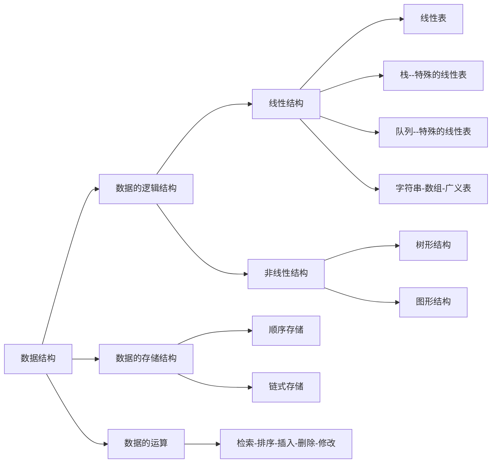

## 算法与算法分析

* 算法效率以下两个方面来考虑：
  * **时间效率**：指的是算法所耗费的时间
  * **空间效率**：指的是算法执行过程中所消耗的存储空间
* **时间效率和空间效率有时候是矛盾的**

 <!-- more --> 

### 算法时间效率度量

* 算法时间效率可以依据该算法编制的程序在计算机上执行所消耗的时间来度量
* 两种度量方式
  * 事后统计
    * 将算法实现，测算其时间和空间开销
    * 缺点：编写程序实现算法将花费较多的时间和精力；所得实验结果依赖于计算机得软硬件等环境因素，掩盖算法本身的优劣
  * 事前分析
    * 对算法所消耗资源的一种估算方法
    * 一个算法的运行时间是指一个算法在计算机上运行所消耗的时间大致可以等于计算机执行一种简单的操作所需的时间与算法中进行的简单操作次数乘积。

**算法的运行时间 = 一个简单操作所需的时间 x 简单操作次数**
**算法的运行时间 = $\sum$每条语句执行的次数 x 该语句执行一次所需要的时间**
**算法的运行时间 = $\sum$每条语句频度 x 该语句执行一次所需要的时间**

​		每条语句执行的一次所需要的时间，一般是随机器而异的。取决于机器的指令性能、速度以及编码的代码质量。是由机器本身软硬件环境决定的，它与算法无关。
​		所以，我们可以假设执行每条语句所需要的时间均为单位时间。此时对算法的运行时间的讨论就可以转化为该算法中所有语句的执行次数，即频度之和。
​		这就可以独立于不同机器的软硬件环境来分析算法的时间性能了。

```java
//矩阵乘法
public static int[][] MatrixMultiplication(int[][] a, int[][] b){
    int n = a.length;
    int[][] c = new int[n][n];
    for(int i = 0; i < n; i++){//n+1次
        for(int j = 0; j < n; j++){//n(n+1)次
            for(int k = 0; k < n; k++){//n*n(n+1)次
                c[i][j] += a[i][k] * b[k][j];//n*n*n次
            }
        }
    }
    return c;
}
```

​		我们把算法所消耗的时间定义为该算法中每条语句的频度之和，则上述算法的时间消耗T(n)为：$2n^3+3n^2+2n+1$

**算法时间复杂度的渐进表示法**

* 为了便于比较不同算法的时间效率，我们仅比较它们的数量级。
* 若有某个辅助函数f(n)，使得当n趋近于无穷大时，$T(n)/f(n)$的极限为不等于零的常数，则称f(n)是T(n)的同数量级函数。记作$T(n)=O(f(n))$，称$O(f(n))$为算法的渐进时间复杂度(O是数量级的符号)，简称时间复杂度。
* 一般情况下，不必计算所有操作的执行次数，而只考虑算法中基本操作执行的次数，它是问题规模n的某个函数，用$T(n)$表示。

上述矩阵相乘问题的时间复杂度为$O(n^3)$

### 算法时间复杂度定义

​		算法中基本语句重复执行的次数是问题规模n的某个函数f(n)，算法的时间量度记为：$T(n)=O(f(n))$

### 分析算法时间复杂度的基本方法

定理1.1 若$f(n)=a_mn^m+a_{m-1}n^{m-1}+...+a_1n+a_0$是m次多项式，则$T(n)=O(n^m)$

* 找出语句频度最大的那条语句作为基本语句
* 计算基本语句的频度得到问题规模n的某个函数$f(n)$
* 取其数量级用符号“O”表示

```c
//例1
for(int i = 1; i <= n; i++){
    for(int j = 1; j <= n; j++){
        c[i][j] = 0;
        for(k = 1; k <= n; k++)
            c[i][j] = c[i][j]+a[i][k] * b[k][j];
    }
}
```

$$
\sum_{i=1}^{n}\sum_{j=1}^{n}\sum_{k=1}^n1=\sum_{i=1}^{n}\sum_{j=1}^{n}n=\sum_{i=1}^{n}n^2=n^3
$$

```c
//例2
for(i = 1; i <= n; i++)
    for(j=1; j <= i; j++)
        for(k=1;k <= j; k++)
            x=x+1;
```

$$
\sum_{i=1}^n\sum_{j=1}^i\sum_{k=1}^j1=\sum_{i=1}^n\sum_{j=1}^ij=\sum_{i=1}^n\frac{(1+i)i}{2}=\frac{1}{2}(\sum_{i=1}^ni^2+\sum_{i=1}^ni)=(\frac{1}{2})(\frac{n(n+1)(2n+1)}{6}+\frac{n(n+1)}{2})=\frac{n(n+1)(n+2)}{6}
$$

```c
//例3
int i = 1;
while(i <= n)
    i = i * 2
```

$$
2^{f(n)} <= n;f(n)<=log_2n;T(n)=log_2n
$$

### 算法时间复杂度计算

​		请注意：有的情况下，算法中基本操作重复执行的次数还随问题的输入数据集不同而不同。

```c
//例如
for(i=0; i<n; i++)
    if(a[i]==e) return i+1;
return 0;
```

* 最好情况：1次
* 最坏情况：n次
* 平均时间复杂度为：$O(n)$

最坏时间复杂度：指在最坏情况下，算法的时间复杂度
平均时间复杂度：指在所有可能输入实例在等概率出现的情况下，算法的期望运行时间
最好时间复杂度：指在最好情况下，算法的时间复杂度

​		一般总是考虑在最坏情况下的时间复杂度，以保证算法的运行时间不会比它更长。

​		对于复杂的算法，可以将它分成几个容易估算的部分，然后利用大O加法法则和乘法法则，计算算法的时间复杂度：
​		加法规则：$T(n)=T_1(n)+T_2(n)=O(f(n))+O(g(n))=O(max(f(n),g(n)))$
​		乘法法则：
$T(n)=T_1(n)\times T_2(n)=O(f(n))\times O(g(n))=O(f(n)\times g(n))$

### 算法时间效率的比较

​		当n取得很大时，指数时间算法和多项式时间算法在所需时间上非常悬殊。

**时间复杂度$T(n)$按数量级递增顺序**

​		常数阶-> 对数阶 -> 线性阶 -> 线性对数阶 -> 平方阶 -> 立方阶 -> … ->K方阶 -> 指数阶。

### 渐进空间复杂度

​		空间复杂度：算法所需要存储空间的度量，记作：$S(n)=O(f(n))$，其中n为问题的规模大小。
​		算法要占据的空间：算法本身要占据的空间，输入/输出，指令，常数，变量等；算法要使用的**辅助空间**。

```c
//code1
for(i=0; i<n; i++){
    t=a[i];
    a[i]=a[n-i-1];
    a[n-i-1]=t;
}
//code2
for(i=0;i<n;i++)
    b[i]=a[n-i-1];
for(i=0;i<n;i++)
    a[i]=b[i];
```

​		code1中$S(n)=O(1)$原地工作，code2中$S(n)=O(n)$。

### 设计好算法的过程

抽象数据类型=数据的逻辑结构+抽象运算
		数据的逻辑结构可以有多种数据的存储结构；基于不同的数据存储结构可以有不同的算法；不同的算法考虑其渐进的时间复杂度和渐进的空间复杂度；最后得出好的算法。

### 总结




---

## 线性表

### 线性表的定义和特点

* 线性表(Linear List)：由$n(n>=0)$个数据元素(结点)$a_1,...,a_n$组成的有限序列
* 其中数据元素的个数为n定义为表的长度
* 当n=0时称为空表
* 将非空的线性表(n>0)记作：$(a_1,a_2,...,a_n)$
* 这里的数据元素$a_i(1<=i<=n)$只是一个抽象的符号，其具体含义在不同的情况下可以不同

同一线性表中的元素必定具有相同特性，数据元素间的关系是线性关系。

**线性表的逻辑特征**

* 从非空的线性表，有且仅有一个开始结点$a_1$，它没有直接前驱，而仅有一个直接后继$a_2$；
* 有且仅有一个终端结点$a_n$，它没有直接后继，而仅有一个直接前驱$a_{n-1}$
* 其余的内部结点$a_i(2<=i<=n-1)$都有仅有一个直接前驱$a_{i-1}$和一个直接后继$a_{i+1}$。

**线性表是一种典型的线性结构。**

### 案例引入

​		**一元多项式的运算：实现两个多项式加、减、乘运算**

$P_n(x)=p_0+p_1x+p_2x^2+...+p_nx^n$

例如：$P(x)=10+5z-4x^2+3x^3+2x^4$用数组来表示[10, 5, -4, 3, 2]

$R_n(x)=P_n(x)+Q_m(x)$->线性表$R=(p_0+q_0,p_1+q_1,...,p_m+q_m,p_{m+1},...p_n)$

​		**稀疏多项式的运算：**

$S(x)=1+3x^{10000}+2x^{20000}$

例如：$A(x)=7+3x+9x^8+5z^{17}$$B(X)=8x+22x^7-9x^8$

线性表$A=((7,0),(3,1),(9,8),(5,17))$；线性表$B=((8,1),(22,7),(-9,8))$

$P_n(x)=p_1x^{e1}+p_2x^{e2}+...+p_mx^{em}$->线性表$P=((p_1,e_1),(p_2,e_2),...,(p_m,e_m))$

​		**图书信息管理系统：**需要的功能：查找、插入、删除、修改、排序、计数

**总结**

​		线性表中数据元素的类型可以为简单类型，也可以为复杂类型。许多实际应用问题所涉及的基本操作有很大相似性，不应为每个具体应用单独编写一个程序。从具体应用中抽象出共性的逻辑结构和基本操作(抽象数据类型)，然后实现其存储结构和基本操作。

### 线性的类型定义

**基本操作**

* InitList(&L)：构造一个空的线性表L
* DestroyList(&L)：销毁线性表L
* ClearList(&L)：将线性表L重置为空表
* ListEmpty(&L)：若线性表L为空表，则返回true；否则返回false
* ListLength(&L)：返回线性表L中的数据元素个数
* GetElem(L,i,&e)：用e返回线性表L中第i个数据元素的值
* LocateElem(L,e,compare())：返回L中第一个与e满足compare()的数据元素的位序。若这样的数据元素不存在则返回值为0。
* PriorElem(L,cur_e,&pre_e)：若cur_e是L的数据元素，且不是第一个，则用pre_e返回它的前驱，否则操作失败；pre_e无意义
* NextElem(L,cur_e,&next_e)：若cur_e是L的数据元素，且不是最后一个，则用next_e返回它的后继，否则操作失败；next_e无意义
* ListInsert(&L,i,e)：在L的第i个位置之前插入新的数据元素e，L的长度+1
* ListDelete(&L,i,&e)：删除L的第i个数据元素，并用e返回其值，L的长度-1
* ListTraverse(&L,visited())：依次对线性表中每个元素调用visited()

以上所提及的运算是逻辑结构上定义的运算。只要给出这些运算的功能是“做什么”，至于“如何做”等实现细节，只有待确定了存储结构之后才考虑。

### 线性表的顺序表示和实现

**顺序存储结构**

​		线性表的顺序表示又称为顺序存储结构或顺序映像。
​		**顺序存储定义**：把逻辑上相邻的数据元素存储在物理上相邻的存储单元中的存储结构。线性表顺序存储结构占用一片连续的存储空间。知道某个元素的存储位置就可以计算其他元素的存储位置。

**顺序表中元素存储位置的计算**

​		假设线性表的每个元素需占l个存储单元，则第i+1个数据元素的存储位置和第i个数据元素的存储位置之间满足关系：$LOC(a_{i+1})=LOC(a_i) + l$。由此，所有数据元素的存储位置均可由第一个数据元素的存储位置得到：$LOC(a_i)=LOC(a_1) +(i-1)\times l$

​		顺序表的特点：以物理位置相邻表示逻辑关系。任一元素均可随机存取。

**顺序表的顺序存储表示**

```c
//模板
#define LIST_INIT_SIZE 100
typedef struct{
    ElemType elem[LIST_INIT_SIZE];
    int length;
}SqList;
```

多项式的顺序存储结构类型定义：

```c
#define MAXSIZE 1000
typedef struct{
    float p;//系数
    int e;//指数
}Polynomial;

typedef struct{
    Polynomial *elem;//存储空间基地址
    int length;//多项式中当前项的个数
}SqList;
```

**顺序表基本操作的实现**

```c++
Status InitList_Sq(SqList &L){
    L.elem= new ElemType[MAXSIZE];
    if(!L.elem) exit(OVERFLOW);
    L.length=0;
    return OK;
}
```

```c++
void DestroyList(SqList &L){
    if(L.elem) delete L.elem;
}
```

```c++
void ClearList(SqList &L){
    L.length=0;
}
```

```c++
int GetLength(SqList L){
    return (L.length);
}
```

```c++
int IsEmpty(SqList L){
    if(L.length == 0) return 1;
    else return 0;
}
```

```c++
//顺序表的取值
int GetElem(SqList L, int i, ElemType &e){
    if(i<1||i>L.length) return ERROR;
    e=L.elem[i-1];
    return OK;
}
//随机存取
```

**顺序表的查找**

​		在线性表L中查找与指定值e相同的数据元素的位置；从表的一端开始，逐个进行记录关键字和给定值的比较。

```c++
int LocateElem(SqList L, ElemType e){
    for(i=0;i<L.length;i++)
        if(L.elem[i] == e) return i+1;
    return 0;
}
//最坏时间复杂度：O(N);空间复杂度：O(1)
```

​		平均查找长度ASL(Average Search Length)：为确定记录在表中的位置，需要与给定值进行比较的关键字的个数的期望值叫做查找算法的平均查找长度。
$$
ASL=\sum_{i=1}^n P_iC_i
$$
若每个记录的查找概率相等则：
$$
ASL=\sum_{i=1}^n\frac{1}{n}C_i=\frac{1}{n}\frac{(1+n)n}{2}=\frac{n+1}{2}
$$
顺序表的平均查找时间复杂度为O(n)

**顺序表的插入**

插入不同的位置：插入位置在最后，插入位置在中间，插入位置在最前面。

算法思想：①判断插入位置是否合理；②判断顺序表存储空间是否满，若已满返回ERROR；③将第n至第i位的元素依次向后移动一个位置，空出第i个位置；④将要插入的新元素e放入第i个位置。

```c++
Status ListInsert_Sq(SqList &L, int i, ElemType e){
    if(i<1||i>L.length+1) return ERROR;
    if(L.length==MAXSIZE) return ERROR;
    for(j=L.length-1;j>=i-1;j--)
        L.elem[j+1]=L.elem[j];
    L.elem[i-1]=e;
    L.length++;
    return OK;
}
```

**顺序表的插入算法分析：**

* 若插入在尾节点之后，则根本无需移动
* 若插入在首结点之前，则表中元素全部后移
* 考虑在各种位置插入的平均移动次数为：

$$
E_{ins}=\frac{1}{n+1}\sum_{i=1}^{n+1}(n-i+1)=\frac{1}{n+1}\frac{n(n+1)}{2}=\frac{n}{2}
$$

顺序表插入算法的平均时间复杂度为O(n)

**顺序表的删除**

删除不同的位置：删除位置在最后，删除位置在中间，删除位置在最前面

算法思想：①判断删除位置i是否合法；②将删除的元素保留；③将第i+1至第n位的元素依次向前移动一个位置；④表长减一，删除成功返回OK

```c++
Status ListRemove_Sq(SqList &L, int i){
    if(i<1||i>L.length) return ERROR;
    for(j=i; j<=L.length-1;j++){
        L.elem[j-1]=L.elem[j];
    }
    L.length--;
    return OK;
}
```

**顺序表的删除算法分析：**

* 若删除尾节点，则根本无序移动
* 若删除首结点，则表中n-1个元素全部前移
* 若要考虑在各种位置上的平均移动次数为：

$$
E_{del}=\frac{1}{n}\sum_{i=1}^n(n-i)=\frac{1}{n}\frac{(0+n-1)n}{2}=\frac{n-1}{2}
$$

顺序表的删除算法的平均时间复杂度为：O(n)

**总结：**

​		顺序表的特点：①利用数据元素的存储位置表示线性表中相邻数据元素之间的前后关系，即线性表的逻辑结构与存储结构一致；②在访问线性表时，可以快速计算出任何一个数据元素的存储地址。因此可以粗略地认为，访问每个元素所花时间相等。这种存取元素的方法被称为随机存取法。

​		顺序表的操作算法分析：
时间复杂度：插入、查找、删除算法的平均时间复杂度为O(n)
空间复杂度：显然，顺序表操作算法的空间复杂度S(n)=O(1)

顺序表的优点：

* 存储密度大(结点本身所占存储量/结点结构所占存储量)
* 可以随机存取表中任一元素

顺序表的缺点：

* 在插入、删除某一个元素时，需要移动大量元素
* 浪费存储空间
* 属于静态存储形式，数据元素的个数不能自由扩张

### 线性表的链式表示和实现

**链式存储结构**

结点在存储器中的位置是任意的，即逻辑上相邻的数据元素在物理上不一定相邻
线性表的链式表示又称为非顺序映像或链式映像。

* 用一组物理位置任意的存储单元来存放线性表的数据元素。
* 这组存储单元既可以是连续的，也可以是不连续的，甚至是零散分布在内存中的任意位置上的。
* 链表中元素的逻辑次序和物理次序不一定相同。

**与链式存储有关的术语**

* 结点：数据元素的存储映像。由数据域和指针域两部分组成
* 链表：n个结点由指针链组成的一个链表。它是线性表的链式存储映像，称为线性表的链式存储结构。

**单链表、双链表、循环链表：**

* 结点只有一个指针域的链表，称为单链表或线性链表
* 结点有两个指针域的链表，称为双链表
* 首尾相接的链表称为循环链表

**头指针、头结点和首元结点：**

* 头指针：是指向链表中第一个结点的指针
* 首元结点：是指链表中存储第一个数据元素$a_1$的结点
* 头结点：是在链表的首元结点之前附设的一个结点

**链表的存储结构示意图有以下两种形式：**

* 不带头结点
* 带头结点

**如何表示空表？**

无头结点时，头指针为空时表示空表；有头结点时，当头结点的指针域为空表示空表。

**链表中设置头结点有什么好处？**

* 便于首元结点的处理：首元结点的地址保存在头结点的指针域中，所以在链表的第一个位置上的操作和其他位置一致，无需进行特殊处理。
* 便于空表和非空表的统一处理：无论链表是否为空，头指针都是指向头结点的非空指针，因此空表和非空表的处理也就统一了。

**头结点的数据域内装的是什么？**

头结点的数据域可以为空，也可以存放线性表长度等附加信息，但此结点不能计入链表长度值。

**链表(链式存储结构)的特点：**

* 结点在存储器中的位置是任意的，即逻辑上相邻的数据元素在物理上不一定相邻
* 访问时只能通过头指针进入链表，并通过每个结点的指针域依次向后顺序扫描其余结点，所以寻找第一个结点和最后一个结点所花费的时间不等

#### 单链表的定义和表示

单链表是由表头唯一确定，因此单链表可以用头指针的名字来命名若头指针名是L，则把链表称为表L。

**单链表的存储结构**

```c++
typedef struct Lnode{
    ElemType data;//结点的数据域
    struct Lnode *next;//结点的指针域
}Lnode, *LinkList;
```

例如，存储学生学号、姓名、成绩的单链表结点类型定义如下：

```c++
typedef Struct student{
    char num[8];//数据域
    char name[8];//数据域
    int score;//数据域
    struct student *next;//指针域
}Lnode, *LinkList;
```

**单链表基本操作的实现**

**单链表的初始化：**构造一个空表
算法步骤：①生成新结点作为头结点，用头指针L指向头结点；②将头结点的指针域置空。

```c++
Status InitList_L(LinkList &L){
    L=new LNode;
    L->next=NULL;
    return OK;
}
```

**判断链表是否为空：**
算法思路：判断头结点指针域是否为空

```c++
int ListEmpty(LinkList L){
    if(L->next)
        return 0;
    else
        return 1;
}
```

**单链表的销毁：**链表销毁后不存在
算法思路：从头指针开始，依次释放所有结点

```c++
Status DestroyList_L(LinkList &L){
    Lnode *p;
    while(L){
        p=L;
        L=L->next;
        delete p;
    }
    return OK;
}
```

**清空链表：**链表仍存在，但链表中无元素，成为空链表(头指针和头结点仍然在)
算法思路：依次释放所有结点，并将头结点指针域设置为空

```c++
Status clearList_L(LinkList &L){
    Lnode *p, *q;
    p=L->next;
    while(p){
        q=p->next;
        delete p;
        p=q;
    }
    L->next=NULL;
    return OK;
}
```

**求单链表的表长**
算法思路：从首元结点开始，依次计数所有结点

```c++
int ListLength_L(LinkList &L){
    LinkList p;
    p=L->next;
    i=0;
    while(p){
        i++;
        p=p->next;
    }
    return i;
}
```

**取值**——取单链表中的第i个元素的内容
算法思路：从链表的头指针出发，顺着链域next逐个结点向下搜索，直到搜索到第i哥结点为止。因此，链表不是随机存取结构。
算法步骤：①从第一个结点顺链扫描，用指针p指向当前扫描到的结点，p初值p=L->next；②j做计数器，累计当前扫描过的结点数，j初值为1；③当p指向扫描到的下一结点，计数器j+1；④当j==i时，p所指的结点就是要找的第i个结点。

```c++
Status getElem_L(LinkList L, int i, ElemType &e){
    p=L->next;
    for(j=1, j<i && p; j++)
        p=p->next;
    if(!p||j>i) return ERROR;
    e=p->next;
    return OK;
}
```

**查找：**①按值查找，根据指定数据获取该数据所在的位置；②按值查找，根据指定数据获取该数据所在的位置序号。

按值查找：
算法步骤：①从第一个结点起，依次和e相比较；②如果找到一个其值与e相等的数据元素，则返回其在链表中的“位置”或地址；③如果查遍整个链表都没有找到其值和e相等的元素，则返回0或“NULL”。

```c++
Lnode *LocateElem_L(LinkList L, Elemtype e){
    p=L->next;
    while(p &&p->data!=e)
        p=p->next;
    return p;       
}
```

```c++
int LocateELem_L(LinkList L, Elemtype e){
    p=L->next;j=1;
    while(p && p->data!=e){
        p=p->next;
        j++;
    }
    if(p) return j;
    else return 0;
}
```

**插入**—在第i个结点前插入值为e的新结点

算法步骤：①首先找到$a_{i-1}$的存储位置p；②生成一个数据域为e的新结点s；③插入新结点：(1)新结点的指针域指向结点$a_i$【s->next=p->next】；(2)结点$a_{i-1}$的指针域指向新结点【p->next = s】

```c++
Status ListInsert_L(LinkList &L, int i, ElemType e){
    p=L;j=0;
    while(p && j<i-1){
        p=p->next;
        ++j;
    }
    if(!p || j > i-1)return ERROR;
    s=new LNode;
    s->data=e;
    s->next=p->next;
    p->next=s;
    return OK;
}
```

**删除**——删除第i个结点
算法步骤：①首先找到$a_{i-1}$的存储位置p，保存要删除的$a_i$的值；②令p->next指向$a_{i+1}$

```c++
Status ListDelete_L(LinkList &L, int i, ElemType &e){
    p=L;j=0;
    while(p->next  && j<i-1){
        p=p->next;
        ==j;
    }
    if(!(p->next) || j>i-1)return ERROR;
    q=p->next;
    p->next=q->next;
    e=q->data;
    delete q;
    return OK;
}
```

**单链表的查找、插入、删除算法时间效率分析**

查找：O(n)；插入和删除：O(1)，但是，如果要在单链表中进行前插或删除操作，由于要从头查找前驱结点，所耗时间复杂度为O(n)。

**单链表的建立**

头插法：每次把新元素插在链表头部，也叫前插法。

算法步骤：①从一个空表开始，重复读入数据；②生成新结点，将读入数据存放到新结点的数据域中；③从最后一个结点开始，依次将各结点插入到链表的前端

```c++
void CreateList_H(LinkList &L, int n){
    L = new LNode;
    L->next=NULL;
    for(i=n;i>0;--i){
        p=new LNode;
        cin>>p->data;
        p->next=L->next;
        L->next=p;
    }
}
```

时间复杂度为：O(n)

尾插法：元素插入在链表尾部，也叫后插法。

算法步骤：①从一个空表L开始，将新结点逐个插入到链表的尾部，尾指针r指向链表的尾节点；②初始化，r同L均指向头结点。每读入一个数据元素则申请一个新结点，将新结点插入到尾节点后，r指向新结点。

```c++
void CreateList_R(LinkList &L, int n){
    L=new LNode;
    L->next = NULL;
    r=L;
    for(i=0;i<n;++i){
        p=new LNode;
        cin>>p->data;
        p->next=NULL;
        r->next=p;
        r=p;
    }
}
```

**循环链表**

​		循环链表是一种头尾相接的链表。

优点：从表中的任一结点出发均可以找到表中其他结点。

注意：由于循环链表中没有NULL指针，故涉及遍历操作时，其终止条件就不再像非循环链表那样判断p或p->next是否为空，而是判断它们是否等于头指针。

**带尾指针的循环链表的合并**

分析操作：p存表头结点、Tb表头链接到Ta表尾，释放Tb表头结点，修改指针

```c++
LinkList Connect(LinkList Ta, Linklist Tb){
    p=Ta->next;
    Ta->next=Tb->next->next;
    delete Tb->next;
    Tb->next = p;
    return Tb;
}
```

时间复杂度为：O(1)

**双向链表**

双向链表：在单链表的每个结点里再增加一个指向其直接前驱的指针域prior，这样链表中就形成了有两个方向不同的链，故称为双向链表。

双向链表的结构定义：

```c++
typedef struct DuLNode{
    Elemtype data;
    struct DuLNode *prior, *next;
}DuLNode, *DuLinkList;
```

**双向循环链表**

和单链表的循环链表类似，双向链表也可以有循环表：让头结点的前驱指针指向链表的最后一个结点；让最后一个结点的后继指针指向头结点。

双向链表结构的对称性：p->prior->next=p=p->next->prior

在双向链表中有些操作(如：ListLength、GetElem等)，因仅涉及一个方向的指针，故它们的算法与线性链表的相同。但在插入、删除时，则需要同时修改两个方向上的指针，两者的操作的时间复杂度均为O(n)。

**双向链表的插入**

```c++
void ListInsert_DuL(DuLinkList &L, Int i, ElemType e){
    if(!(p=GetElemp_DuL(L,i))) ERROR;
    s=new DuLNode;
    s->data = e;
    s->prior=p->prior;
    s->next=p;
    p->prior->next=s;
    p->prior=s;
    return OK;
}
```

**双向链表的删除**

```c++
void ListDelete_DuL(DuLink &L, Int i, Elemtyle &e){
    if(!(p=GetElemP_DuL(L,i))) return ERROR;
    e = p->data;
    p->prior->next=p->next;
    p->next->prior = p->prior;
    free(p);
    return OK;
}
```

**单链表、循环链表、双向链表的时间效率比较**

|                                 | 查找表头结点(首元结点) | 查找表尾结点                        | 查找结点\*p的前驱结点                   |
| ------------------------------- | ---------------------- | ----------------------------------- | --------------------------------------- |
| 带头结点的单链表L               | L->next时间复杂度O(1)  | 从L->next依次向后遍历时间复杂度O(n) | 通过p->next无法找到其前驱               |
| 带头结点仅设头指针L的循环单链表 | L->next时间复杂度O(1)  | 从L->next依次向后遍历时间复杂度O(n) | 通过p->next可以找到其前驱时间复杂度O(n) |
| 带头结点仅设尾指针R的循环单链表 | R->next时间复杂度O(1)  | R时间复杂度为O(1)                   | 通过p->next可以找到其前驱时间复杂度O(n) |
| 带头结点的双向循环链表L         | L->next时间复杂度O(1)  | L->prior时间复杂度O(1)              | p->prior时间复杂度O(1)                  |

### 顺序表和链表的比较

* 链式存储结构的优点：
  * 结点空间可以动态申请和释放
  * 数据元素的逻辑次序靠结点的指针来指示，插入和删除时不需要移动数据元素
* 链式存储的缺点：
  * 存储密度小，每个结点的指针域需要额外占用存储空间。当每个结点的数据域所占字节不多时，指针域所占存储空间的必重显得很大。
    * 存储密度：是指结点数据本身所占的存储量和整个结点结构中所占的存储量之比。
  * 链式存储结构是非随机存取结构。对任一结点的操作都要从头指针依指针链查找到该结点，这增加了散发的复杂度。

| 比较项目 | 存储结构   | 顺序表                                                       | 链表                                                   |
| -------- | ---------- | ------------------------------------------------------------ | ------------------------------------------------------ |
| 空间     | 存储空间   | 预先分配，会导致空间闲置或溢出现象                           | 动态分配，不会出现存储空间闲置或溢出现象               |
|          | 存储密度   | 不用为表示结点间的逻辑关系而增加额外的存储开销，存储密度等于1 | 需要借助指针来体现元素间的逻辑关系，存储密度小于1      |
| 时间     | 存取元素   | 随机存取，按位置访问元素的时间复杂度为O(1)                   | 顺序存取，按位置访问元素时间复杂度为O(n)               |
|          | 插入和删除 | 平均移动约表中一半元素，时间复杂度为O(n)                     | 不需要移动元素，确定插入、删除位置后，时间复杂度为O(1) |
| 适用情况 |            | 表长变化不大，且能事先确定变化的范围；很少进行插入或删除操作，经常按元素位置序号访问数据元素 | 长度变化较大；频繁进行插入或删除操作                   |

### 线性表的应用

**线性表的合并**

假设利用两个线性表La和Lb分别表示两个集合A和B，现要求一个新的集合A=AUB

算法步骤：依次取出Lb中的元素，执行以下操作：在La中查找该元素；如果找不到，则将其插入到La的最后

```c++
void union(List &La, List Lb){
    La_len=ListLength(La);
    Lb_len=ListLength(Lb);
    for(i=1;i<=Lb_len;i++){
        GetElem(Lb,i,e);
        if(!LocateElem(La,e))
            ListInsert(&La, ++La_len,e);
    }
}
```

**有序表的合并**

一致线性表La和Lb中的数据元素按值非递减有序排列，现要求将La和Lb归并为一个新的线性表Lc，且Lc中的数据元素按值非递减有序排列。

算法步骤：创建一个空表Lc；依次从La或Lb中摘取元素较小的结点插入到Lc表的最后，直至其中一个表空为止；继续将La或Lb其中一个表中的剩余结点插入在Lc表的最后。

**顺序表的实现**

```c++
void MergeList_Sq(SqList LA, SqList LB, SqList &LC){
    pa=LA.elem;
    pb=LB.elem;
    LC.length=LA.length+LB.length;
    LC.elem=new ElemTupe[LC.length];
    pc=LC.elem;
    pa_last=LA.elem+LA.length-1;
    pb_last=LB.elem+LB.length-1;
    while(pa <=pa_last && pb <= pb_last){
        if(*pa <= *pb) *pc++ = *pa++;
        else *pc++ = *pb++;
    }
    while(pa <= pa_last) *pc++ = *pa++;
    while(pb <= pb_last) *pc++ = *pb++;
}
```

时间复杂度为：O(ListLength(La) + ListLength(Lb))；算法的空间复杂度是：O(ListLength(La) + ListLength(Lb))

**链表的实现**

```c++
void MergeList_L(LinkList &La, LinkList &Lb, LinkList &Lc){
    pa=La->next;
    pb=Lb->next;
    pc=Lc=La;
    while(pa && pb){
        if(pa->data <= pb->data){
            pc->next=pa;
            pc=pa;
            pa=pa->next;
        }else{
            pc->next=pb;
            pc=pb;
            pb=pb->next;
        }
    }
    pc->next=pa ? pa : pb;
    delete Lb;
}
```

算法的时间复杂度为O(ListLength(La) + ListLength(Lb))；空间复杂度为：O(1)。

### 案例分析与实现

#### 一元多项式的运算：实现两个多项式加、减、乘运算

例如：$P_a(x)=10+5x-4x^2+3x^3+2x^4,P_b(x)=-3+8x+4x^2-5x^4+7x^5-2x^6$

#### 稀疏多项式的运算

例如：$A(x)=7+3x+9x^8+5x^{17}, B(X)=8x+22x^7-9x^8$
线性表A=((7,0), (3,1), (9,8), (5,17))；线性表B=((8,1), (22,7), (-9,8))

顺序存储结构实现：
算法步骤：创建一个新数组c；分别从头遍历比较a和b的每一项：指数相同，对应系数相加，若其和不为零，则在c中增加一个新项，指数不相同，则将指数较小的项复制到C中；一个多项式已遍历完毕，将另一个剩余项依次复制到c中即可。

链式存储结构实现：
算法步骤：①创建一个只有头结点的空链表；②根据多项式的项的个数n，循环n次执行以下操作：1.生成一个新结点\*s；2.输入多项式当前项的系数和指数赋给新结点的\*s的数据域；设置一个前驱指针pre，用于指向待找到的第一个大于输入项指数的结点的前驱，pre初值指向头结点；3.指针q初始化，指向首元结点；4.顺链向下逐个比较链中当前结点与输入项指数，找到第一个大于输入项指数的结点\*q；5.将输入项结点\*s插入到结点\*q之前。

```c++
void CreatePolyn(Polynomial &p, int n){
    P= new PNode;
    P->next=NULL;
    for(i=1;i<=n;i++){
        s=new PNode;
        cin>>s->coef>>s->expn;
        pre=P;
        q=P->next;
        while(q&&q->expn<s->expn){
            pre=q;
            q=q->next;
        }
        s->next=q;
        pre->next=s;
    }
}
```

相加算法步骤：①指针p1和p2初始化，分别指向pa和pb的首元结点；②p3指向多项式的当前结点，初值为pa的头结点；③当指针p1和p2均未到达相应表尾时，则循环比较p1和p2所指结点对应的指数值，有下列3种情况：(1)当p1->expn==p2->expn时，则将两个结点中的系数相加，若和不为零，则修改p1所指结点的系数值，同时删除p2所指结点，若和为零，则删除p1和p2所指结点；当p1->expn < p2->expn时，则应摘取p1所指结点插入到“和多项式”链表中去；当p1->expn > p2->expn时，则应摘取p2所指结点插入到“和多项式”链表中去；④将非空多项式的剩余段插入到p3所指结点之后；⑤释放Pb的头结点。

---

## 栈和队列

### 栈和队列的定义和特点

* 栈和队列是两种常用、重要的数据结构
* 栈和队列是限定插入和删除只能在表的“端点”进行的线性表
* 栈和队列是线性表的子集(是插入和删除位置受限的线性表)

**栈**

​		由于栈的操作具有后进先出的固有特性，使得栈成为程序设计中的有用工具。另外，若问题求解的过程具有“后进先出”的天然特性的话，则求解的算法中也必然需要利用“栈”。

**栈的定义和特点**

​		栈(Stack)是一个特殊的线性表，是限定仅在一端(通常是表尾)进行插入和删除操作的线性表。又称为后进先出(Last In First Out)的线性表，简称LIFO结构。

​		栈是仅在表尾进行插入、删除操作的线性表。表尾称为栈顶Top；表头称为栈底Base。插入元素到栈顶的操作，称为入栈。从栈顶删除最后一个元素的操作，称为出栈。

**队列**

​		由于队列的操作具有先进先出的特性，使得队列称为程序设计中解决类似排队问题的有用工具。

**队列的定义和特点**

​		队列(queue)是一种先进先出(First In First Out，FIFO)的线性表。在表一端插入(表尾)，在另一端(表头)删除。

### 案例引入

**进制转换**

十进制整数N向其它进制数d(二、八、十六)的转换是计算机实现计算的基本问题。

例如：把十进制数159转换成八进制数。

**括号匹配的检验**

假设表达式中允许包含两种括号：圆括号和方括号；其嵌套的顺序随意。

算法思路：可以利用一个栈结构保存每个出现的左括号，当遇到右括号时，从栈中弹出左括号，检验其匹配情况；在检验过程中，若遇到以下几种情况之一，就可以得出括号不匹配的结论：(1)当遇到某一个右括号时，栈已空，说明到目前为止，右括号多于左括号；(2)从栈中弹出的左括号与当前检验的右括号类型不同，说明出现了括号交叉情况；(3)算数表达式输入完毕，但栈中还没没有匹配的左括号，说明左括号多于右括号。

**表达式求值**

表达式求值是程序设计语言中一个最基本的问题，它的实现也需要运用栈。这里介绍的算法是由运算符优先级确定运算顺序的对表达式求值算法。

算法思路：为了实现表达式求值。需要两个栈：一个是算符栈OPTR，用于寄存运算符；另一个称为操作数OPND，用于寄存运算数和运算结果。

求值的处理过程是自左向右扫描表达式的每一个字符：

* 当扫描到的是运算数，则将其压入栈OPND
* 当扫描到的是运算符时
  * 若这个运算符比OPTR栈顶运算符的优先级高，则入栈OPTP，继续向后处理
  * 若这个运算符比ORTR栈顶运算符优先级低，则从OPND栈中弹出两个运算数，从栈OPTR中弹出栈顶运算符进行运算，并将运算结果压入栈OPND。
* 继续处理当前字符，知道遇到结束符为止。

**舞伴问题**

​		首先构造两个队列；依次将头元素出队配成舞伴；某队为空，则另外一队等待着则是下一舞曲第一个可获得舞伴的人。

### 栈的表示和操作的实现

* InitStack(&s)初始化操作：构造一个空栈S
* DestroyStack(&S)销毁栈操作：栈S被销毁
* StackEmpty(S)判定S是否为空战
* StackLength(S)求栈的长度
* GetTop(S, &e)取栈顶元素
* ClearStack(&S)栈置空操作
* Push(&S, e)入栈操作
* Pop(&S, &e)出栈操作

**栈的表示和实现**

​		由于栈本身就是线性表，于是栈也有顺序存储和链式存储两种实现方式。栈的顺序存储——顺序栈；栈的链式存储——链栈。

#### 顺序栈的表示和实现

​		存储方式：同一般线性表的顺序存储结构完全相同，利用一组地址连续的存储单元依次存放自栈底到栈顶的数据元素。栈底一般在低地址段。

​		附设top指针，指示栈顶元素在顺序栈中的位置(但是，为了方便操作，通常top指示真正的栈顶元素之上的下标地址)；另设base指针，指示栈底元素在顺序栈中的位置。另外，用stacksize表示栈可使用的最大容量。

​		使用数组作为顺序栈存储方式的特点：简单，方便，但易产生溢出(数组大小固定)。上溢(overflow)：栈已经满，又要压入元素；下溢(underflow)：栈已经空，还要弹出元素。注：上溢是一种错误，使问题的处理无法进行；而下溢一般认为是一种结束条件，即问题处理结束。

**顺序栈的表示**

```c++
#define MAXSIZE 100
typedef struct{
    SElemType *base;//栈底指针
    SElemType *top;//栈顶指针
    int stacksize;//栈可用最大容量
}SqStack;
```

**顺序栈的初始化**

```c++
Status InitStack(SqStack &S){
    S.base = new SElemType[MAXSIZE];
    if(!S.base)exit (OVERFLOW);
    S.top = S.base;
    S.stacksize = MAXSIZE;
    return OK;
}
```

**顺序栈判断栈是否为空**

```c++
Status StackEmpty(SqStack S){
    if(S.top == S.base)
        return TRUE;
    else
        return FALSE;
}
```

**求顺序栈的长度**

```c++
int Stacklength(SqStack S){
    return S.top - S.base;
}
```

**清空顺序栈**

```c++
Status ClearStack(SqStack &S){
    if(S.base) S.top = S.base;
    return OK;
}
```

**销毁顺序栈**

```c++
Status DestroyStack(SqStack &S){
    if(S.base){
        delete S.base;
        S.stacksize=0;
        S.base = S.top = NULL;
    }
    return OK;
}
```

**顺序栈的入栈**

判断是否满栈，若满则出错；元素e压入栈顶；栈顶指针+1

```c++
Status Push(SqStack &S, SElemType e){
    if(S.top - S.base == S.stacksize)
        return ERROR;
    *S.top++ = e;
    return OK;
}
```

**顺序栈的出栈**

判断是否栈空，若空则出错；获取栈顶元素e；栈顶指针-1。

```c++
Status Pop(SqStack &S, SElemType &e){
    if(S.top == S.base)
        return ERROR;
    e = *--S.top;
    return OK;
}
```

#### 链栈的表示和实现

链栈是运算受限的单链表，只能在链表头部进行操作。

```c++
typedef struct StackNode{
    SElemType data;
    struct StackNode *next;
}StackNode, *LinkStack;
LinkStack S;
```

​		链表的头指针就是栈顶；不需要头结点；基本不存在栈满的情况；空栈相当于头指针指向空；插入和删除仅在栈顶处执行。

**链栈的初始化**

```c++
void InitStack(LinkStack &S){
    S=NULL;
    return OK;
}
```

**判断链栈是否为空**

```c++
Status StackEmpty(LinkStack S){
    if(S==NULL) return TRUE;
    else return FALSE;
}
```

**链栈的入栈**

```c++
Status Push(LinkStack &S, SElemType e){
    p = new StackNode;
    p->data = e;
    p->next = S;
    S=p;
    return OK; 
}
```

**链栈的出栈**

```c++
Status Pop(LinkStack &S, SElemtype &e){
    if(S==NULL) return ERROR;
    e = S->data;
    p=S;
    S=S->next;
    delete p;
    return OK;
}
```

**取栈顶元素**

```c++
SElemType GetTop(LinkStack S){
    if(S!=NULL)
        return S->data;
}
```

### 栈与递归

递归的定义：

* 若一个对象部分地包含它自己，或用它自己给自己定义，则称这个对象是递归的；

* 若一个过程直接地或间接地调用自己，则称这个过程是递归的过程。

  * 递归求n的阶乘：

  ```c++
  long Fact(long n){
      if(n == 0) return 1;
      else return n * Fact(n-1);
  }
  ```

**以下三种情况常常用到递归方法：**

* 递归定义的数学函数：
  * 阶乘函数
  * 2阶Fibonaci数列：
* 具有递归特性的数据结构：
  * 二叉树
  * 广义表
* 可递归求解的问题
  * 迷宫问题
  * Hanoi塔问题

**递归问题——用分治法求解**
分治法：对于一个较为复杂的问题，能够分解成几个相对简单的且解法相同或类似的子问题来求解。

必备的三个条件：

* 能将一个问题转变成一个新的问题，而新的问题与原问题的解法相同或类同，不同的仅是处理的对象，且这些处理对象是变化有规律的。
* 可以通过上述转化而使问题简化
* 必须有一个明确的递归出口，或者递归的边界

**分治法求解递归问题算法的一般形式：**

```java
void p(参数列表){
    if(递归结束条件)	可直接求解步骤;
        else p(较小的参数);
}
```

**函数调用的过程：**

调用前，系统完成：

* 将实参、返回地址等传递给被调用函数
* 为被调用函数的局部变量分配存储区
* 将控制转移到被调用函数的入口

调用后，系统完成：

* 保存被调用函数的计算结果
* 释放被调用函数的数据区
* 依照被调用函数保存的返回地址将控制转移到调用函数

当多个函数构成嵌套调用时：遵循后调用的先返回。

递归的优缺点：

* 优点：结构清晰，程序易读
* 缺点：每次调用要生成工作记录，保存状态信息，入栈；返回时要出栈，恢复状态信息。时间开销较大。

递归->非递归：

* 方法1：尾递归、单项递归->循环结构

  ```c++
  //尾递归
  long Fact(long n){
      if(n==0) return 1;
      else return n *Fact(n-1);
  }
  
  //循环
  long Fact(long n){
      t=1;
      for(i=1;i<=n;i++) t=t*i;
      return t;
  }
  ```

  ```c++
  long Fib(long n){
      if(n==1 || n==2) return 1;
      else return Fib(n-1)  +Fib(n-2);
  }
  ```

  ```c++
  long Fib(long n){
      if(n==1 || n==2) return 1;
      else{
          t1 = 1;t2 = 1;
          for(i = 3 i <= n; i++){
              t3 = t1+t2;
              t1 = t2; t2=t3;
          }
          return t3;
      }
  }
  ```

* 自用栈模拟系统的运行时栈

### 队列的表示和操作的实现

**相关术语**

* 队列(Queue)是仅在表尾进行插入操作，在表头进行删除操作的线性表。
* 表尾即$a_n$端，称为队尾；表头即$a_1$端，称为队头。
* 它是一种先进先出(FIFO)的线性表。
* 插入元素称为入队；删除元素称为出队。
* 队列的存储结构为链队或顺序队(常用循环顺序队)

**队列的相关概念**

* 定义：只能在表的一端进行插入运算，在表的另一端进行删除运算的线性表。
* 逻辑结构：与同线性表相同，仍为一对一关系。
* 存储结构：顺序队和链队。
* 运算规则：只能在队首和队尾运算，且访问结点时依照先进先出(FIFO)的原则。
* 实现方式：关键是掌握入队和出队操作，具体实现依照顺序队和链队的不同而不同。

**队列的常见应用**

* 脱机打印输出：按申请的先后顺序依次输出
* 多用户系统中，多个用户排成队，分时地循环使用CPU和主存
* 按用户的优先级排成多个队，每个优先级一个队列
* 实时控制系统中，信号按接收的先后顺序依次处理
* 网络电文传输，按到达的时间先后顺序依次进行

**队列的抽象数据类型定义**

**队列的顺序表示**

```c++
#define MAXQSIZE 100
Typedef struct{
    QElemType *base;//初始化的动态分配存储空间
    int front;//头指针
    int rear;//尾指针
}SqQueue;
```

存在的问题：

设数组大小为MAXQSIZE，当rear=MAXQSIZE时，发生溢出；若front=0，rear=MAXQSIZE时再入队，则发生真溢出；当front$\neq 0$，rear=MAXQSIZE时，再入队，则发生假溢出。

解决假上溢的方法：

1.将队中元素依次向队头方向移动。缺点：浪费时间。每移动一次，队中元素都要移动

2.将队空间设想成一个循环的表即分配给队列的m个存储单元可以循环使用，当rear为maxqsize时，若向量的开始端空着，又可以从头使用空着空间。当front为maxqsize时，也是一样。

队空队满的判断：1.另外设一个标志以区别队空、队满；2.另一个变量，记录元素个数；3.少用一个元素空间

少用一个元素空间：队空：front==rear；队满：(rear+1)%MAXQSIZE\==front

**循环队列的操作——队列的初始化**

```c++
Status InitQueue(SqQueue &Q){
    Q.base = new QElemType[MAXQSIZE];//分配数组空间
    if(!Q.base) exit(OVERFLOW);//存储分配失败
    Q.front=Q.rear = 0;//头指针尾指针置为0，队列为空
    return OK;
}
```

**求队列的长度**

```c++
int QueueLength(SqQueue Q){
    return ((Q.rear - Q.front + MAXQSIZE) % MAXQSIZE);
}
```

**循环队列入队**

```c++
Status EnQueue(SqQueue &Q, QElemType e){
    if((Q.rear + 1) % MAXQSIZE == Q.front) return ERROR;//队满
    Q.base[Q.rear] = e;
    Q.rear = (Q.rear+1)%MAXQSIZE;//队尾指针+1
    return OK;
}
```

**循环队列出队**

```c++
Status DeQueue(SqQueue &Q, QElemType &e){
    if((Q.front == Q.rear)) return ERROR;//队空
    e = Q.base[Q.front];
    Q.front = (Q.front+1)%MAXQSIZE;
    return OK;
}
```

**取队头元素**

```c++
SElemType GetHead(SqQuere Q){
    if(Q.front != Q.rear){
        return Q.base[Q.front];
    }
}
```

**队列的链式表示和实现**

若用户无法估计所用队列的长度，则宜采用链队列

**链队列的类型定义**

```c++
#define MAXQSIZE 100
typedef struct Qnode{
    QElemType data;
    struct Qnode *next;
}QNode, *QuenePtr;
```

```c++
typedef struct{
    QuenePtr front;//队头指针
    QuenePtr rear;//队尾指针
}LinkQueue;
```

**链队列初始化**

```c++
Status InitQueue(LinkQueue &Q){
    Q.front = Q.rear = (QueuePtr)malloc(sizeof(QNode));
    if(!Q.front) exit(OVERFLOW);
    Q.front->next=NULL;
}
```

**销毁链队列**

```c++
Status DestroyQueue(LinkQueue &Q){
    while(Q.front){
        p = Q.front->next;
        free(Q.front);
        Q.front = p;
    }
    return OK;
}
```

**将元素e入队**

```c++
Status EnQueue(LinkQueue &Q, QElemType e){
    p = (QueuePtr)malloc(sizeof(QNode));
    if(!p) exit(OVERFLOW);
    P->data = e;
    p->next=null;
    Q.rear->next=p;
    Q.rear=p;
    return OK;
}
```

**链队列出队**

```c++
Status DeQueue(LinkQueue &Q, QElemType &e){
    if(Q.front == Q.rear) return ERROR;
    P = Q.front->next;
    e = p->data;
    Q.front->next = p->next;
    if(Q.rear == p)
        Q.rear = Q.front;
    delete p;
    return OK;
}
```

**链队列的队头元素**

```c++
Status GetHead(LinkQueue Q, QElemType &e){
    if(Q.front == Q.rear) return ERROR;
    e = Q.front->next->data;
    return OK;
}
```

---

## 串、数组和广义表

### 串

#### 串的定义

串(String)——零个或多个任意字符串组成的有限序列

字串：串中任意个连续字符组成的子序列称为该串的子串。真子串是指不包含自身的所有子串。

主串：包含子串的串相应地称为主串

字符位置：字符在序列中的序号为该字符在串中的位置

字串位置：子串第一个字符在主串中的位置

空格串：由一个或多个空格串组成的串

串相等：当且仅当两个串的长度相等并且各个对应位置上的字符都相同时，这两个串才是相等的。所有的空串都是相等的。

#### 案例引入

串的应用非常广泛，计算机上的非数值处理的对象大部分是字符串数据，例如：文字编辑、符号处理、各种信息处理系统等等。

案例：病毒感染检测

研究者将人的DNA和病毒DNA均表示成由一些字母组成的字符串序列。然后检测某种病毒DNA序列是否在患者的DNA序列中出现过，如果出现过，则此人感染了该病毒，否则没有感染。

例如：假设病毒的DNA序列为baa，患者1的DNA序列为aaabbba，则感染，患者2的DNA序列为babbba，则未感染。(注意，人的DNA序列是线性的，而病毒的DNA序列是环状的)

#### 串的类型定义、存储结构及运算

串中元素逻辑关系与线性表的相同，串可以采用与线性表相同的存储结构。

**串的顺序存储结构**

```c++
#define MAXLEN 255
typedef struct{
    char ch[MAXLEN+1];//存储串的一维数组
    int length;//串的当前长度长度
}SString;
```

**串的链式存储结构**

优点：操作方便；缺点：存储密度较低。【存储密度=串所占的存储/实际分配的存储】

可以将多个字符存放在一个结点中，以克服其缺点。

```c++
#define CHUNKSIZE 80
typedef struct Chunk{
    char ch[CHUNKSIZE];
    struct Chunk *next;
}Chunk;

typedef struct{
    Chunk *head, *tail;//串的头指针和尾指针
    int curlen;//串的当前长度
}LString;//字符串的块链结构
```

**串的模式匹配算法**

算法的目的：确定主串中所含子串(模式串)第一次出现的位置

算法应用：搜索引擎、拼写检查、语言翻译、数据压缩

算法种类：BF算法(Brute-Force，又称古典的、经典的、朴素的、穷举的)、KMP算法(特点：速度快)

#### BF

**BF算法**

Brute-Force简称为BF算法，亦称简单匹配算法。采用穷举法的思路。

算法设计思想：将主串中的第pos个字符和模式串的第一个字符比较；若相等，继续逐个比较后续字符；若不相等，从主串的下一字符起，重新与模式串的第一个字符比较。直到主串中的第一个连续子串字符序列与模式串相等。返回值为S中与T匹配的子序列第一个字符的序号，即匹配成功。否则，匹配失败，返回值0。

```c++
int Index_BF(SString S, SString T, int pos){
    int i=pos, j=1;
    while(i<=S.length && j <= T.length){
        if(S.ch[i] == t.ch[j]){//主串和子串依次匹配字符
            i++;
            j++;
        }else{//主串和子串指针回溯重新开始下一次匹配
            i = i-(j-1)+1;
            j=1;
        }
    }
    if(j > S.length){
        return j-i+1;//返回匹配的第一个字符的下标 i-T.length
    }else{
        return 0;//模板匹配不成功
    }
}
```

BF算法的时间复杂度：若n为主串长度，m为子串长度；最好的情况：比较m此；最坏情况：主串前面n-m个位置都部分匹配到子串的最后一位，(n-m)\*m+m=(n-m+1)\*m，若n>>m，则算法复杂度为O(n\*m)。

#### KMP

在定义next[j]函数，表名当前模式中第j个字符与主串中相应字符“失配”时，在模式中需重新和主串中该字符进行比较和字符的位置。

```c++
int Index_KMP(SString S, SString T, int pos){
    i = pos, j = 1;
    while(i <= S.length && j <= T.length){
        if(j==0 || S.ch[i] == T.ch[j]){
            i++;
            j++;
        }else{
            j=next[j];
        }
        if(j > T,length) return i-T.length;
        else return 0;
    }
}

void get_next(SString T, int &next[]){
    i = 1; next[1] = 0; j = 0;
    while(i < T.length){
        if(j==0 || T.ch[i] == T.ch[j]){
            i++;
            j++;
            next[i] = j;
        }else{
            j = next[j];
        }
    }
}
```

#### next函数的改进

```c++
void get_nextval(SString T, int &nextval[]){
    i = 1; nextval[1] = 0; j = 0;
    while(i < T.length){
        if(j==0 || T,ch[i] == T.ch[j]){
            i++;
            j++;
            if(T.ch[i] != T.ch[j]){
                nextval[i] = j;
            }else{
                nextval[i] = nextval[j];
            }
        }else{
            j = nextval[j];
        }
    }
}
```

### 数组

按一定格式排列起来具有相同类型的数据元素的集合。

一维数组：若线性表中的数据元素为非结构的简单元素，则称为一维数组。

一维数组的逻辑结构：线性结构。定长的线性表。

声明格式：数据类型 变量名称[长度]

二维数组：若一维数组中的数据元素又是一维数组结构，则称为二维数组。每一个元素既在一个行表中，又在一个列表中。该线性表的每个元素也是一个定长的线性表。

二维数组的逻辑结构：1.非线性结构；2.线性结构定长的线性表

声明格式：数据类型 变量名称\[行数\]\[列数]。在C语言中，一个二维数组类型也可以定义为一维数组类型。

三维数组：若二维数组中的元素又是一个一维数组，则称作三维数组。

n维数组：若n-1维数组中的元素又是一个一维数组结构，则称作n维数组。

**结论：线性表结构是数组结构的一个特例，而数组结构又是线性表结构的扩展。**

**数组的特点：结构固定——定义后，维数和维界不再改变。**

数组基本操作：除了结构的初始化和销毁之外，只有取元素和修改元素值的操作。

#### 数组的抽象数据类型定义

#### 数组的顺序存储

因为数组的特点：结构固定；数组基本操作：一般不做插入和删除操作。所以：一般都是采用顺序存储结构来表示数组。

**注意：**数组可以是多维的，但存储元素的内存单元地址是一维的，因此，在存储数组结构之前，需要解决多维关系映射到一维关系的问题。

**一维数组**

例，有数组定义：int a[5]。每个元素占用4字节，假设a[0]存储在2000单元，a[3]地址是多少？2012。LOC(0)=2000，L=4，LOC(3)=LOC(0)+3XL=2012。LOC(i) = LOC(0)+L$\times$i。

**二维数组**

两种顺序存储方式：1.以行序为主序BASIC、COBOL和PASCAL；2.以列为主序FORTRAN。

以行序为主序：数组元素a[i\][j\]的存储位置是：LOC(i，j)\=LOC(0,0)+(n\*i+j)\*L

**三维数组**

按页/行/列存放，页优先的顺序存储。

$LOC(i_1,i_2,i_3)=a+(i_1*m_2*m_3+i_2*m_3+i_3)*L$

**n维数组**

$LOC(i_1,i_2,...,i_n)=a+(i_1*m_2*m_3*...m_n+i_2*m_3*m_4*...m_n+...+i_{n-1}*m_n+i_n)*L$

例：设有一个二维数组A[m\][n\]按行优先存储，假设A[0\][0\]存放位置在$644_{(10)}$，A[2\][2\]存放在$676_{(10)}$，每个元素占一个空间，问A[3\][3\]存放在什么位置？

676=x+(2n+2);644=x; ——> n=15 ——> A[3][3\]=644+(3*15+3)=692

**特殊矩阵的压缩存储**

矩阵的常规存储：将矩阵描述为一个二维数组。

矩阵的常规存储的特点：可以对其元素进行随机存取；矩阵运算非常简单；存储的密度为1。

不适宜常规存储的矩阵：值相同的元素很多且呈某种规律分布；零元素较多

**矩阵的压缩存储：**为多个相同的非零元素只分配一个存储空间；对零元素不分配空间。

什么样的矩阵能够压缩存储？一些特殊矩阵，如：对称矩阵、对角矩阵、三角矩阵、稀疏矩阵等。

什么叫稀疏矩阵？矩阵中非零元素的个数较少(一般小于5%)

**对称矩阵**

特点：在$n\times n$的矩阵a中，满足如下性质：$a_{ij}=a_{ji}(1\leq i, j\leq n)$

存储方法：只存储下(或者上)三角(包括主对角线)的数据元素。共占用n(n+1)/2个元素空间。

可以以行序为主序将元素存放在一个一维数组sa[n(n+1)/2]中。$a_{ij}=(1+i)(i)/2+j=i(i+1)/2+j$

**三角矩阵**

特点：对角线以下(或者以上)的数据元素(不包括对角线)全部为常数C。

存储方法c共享一个元素存储空间，共占用n(n+1)/2+1个元素空间：sa[n(n+1)/2+1]

上三角矩阵：
$$
a_{ij}=
\begin{cases} 
(2n-i-1)i/2+j, i\leq j\\
n(n+1)/2+1, i>j\\
\end{cases}
$$
下三角矩阵：
$$
a_{ij}=
\begin{cases}
i(i+1)/2+j,i\geq j\\
n(n+1)/2+1, i<j\\
\end{cases}
$$
**对角矩阵**

特点：在n$\times$n的方针中，所有非零元素都集中在以主对角线为中心的带状区域中，区域外的值为0，则称为对角矩阵。常见的有三对角矩阵、五对角矩阵、七对角矩阵等。

**稀疏矩阵**

特点：在m$\times$n的矩阵中有t个非零元素。令$\delta=t(m\times n)$当$\delta \leq0.05$时称为稀疏矩阵。

压缩存储原则：存各非零元的值、行列位置和矩阵的行列数。三元组的不同表示方法可以决定稀疏矩阵不同的压缩存储方法。

三元组顺序表又称有序的双下标法。三元组顺序表的优点：非零元素在表中按行序有序存储，因此便于进行依行顺序处理的矩阵运算。三元组顺序表的缺点：不能随机存取。若按行号存取某一行中的非零元，则需从头开始进行查找。

稀疏矩阵的链式存储结构：十字链表

优点：它能够灵活地插入因运算而产生的新的非零元素，删除因运算而产生的新的零元素，实现矩阵的各种运算。

在十字链表中，矩阵的每一个非零元素用一个结点表示，该结点除了(row,col,value)以外，还要有两个域：right：用于链接同一行中的下一个非零元素；down：用以链接同一列中的下一个非零元素。

### 广义表

广义表(又称列表Lists)是$n\geq 0$个元素$a_0,a_1,...a_{n-1}$的有限序列，其中每一个$a_i$或者是原子，或者是一个广义表。

广义表通常记作：$LS=(a_1,a_2,..,a_n)$其中：LS为表名，n为表的长度，每一个$a_i$为表的的元素。

习惯上，一般用大写字母表示广义表。小写字母表示原子。

表头：若LS非空，则其中第一个元素$a_1$就是表头。记作head(LS)=$a_1$。注：表头也可以是原子，也可以是子表。

表尾：除表头之外的其它元素组成的表。记作tail(LS)=$(a_2,...a_n)$。注：表尾不是最后一个元素，而是一个子表。

例：(1) A=() 空表，长度为0；(2) B=(()) 长度为1，表头，表尾均为()；(3) C=(a, (b, c)) 长度为2，由原子a和子表(b, c)构成。表头为a；表尾为((b, c))；(4) D=(x, y, z) 长度为3，每一项都是原子。表头为x；表尾为(y,z)；(5) E=(C, D) 长度为2，每一项都是子表。表头为C，表尾为(D)；(6) F(a, F) 长度为2，第一项为原子，第二项为它本身。表头为a，表尾为(F)。

#### 广义表的性质

* 广义表中的数据元素有相对次序；一个直接前驱和一个直接后继。

* 广义表的长度定义为最外层所包含元素的个数；如：C=(a, (b, c))是长度为2的广义表。

* 广义表的深度定义为该广义表展开后所包含括号的重数；A=(b, c)的深度为1，B=(A, d)的深度为2，C=(f, B, h)的深度为3。注意：“原子”的深度为0；“空表”的深度为1。

* 广义表可以为其他广义表共享，如：广义表B就共享表A。在B中不必列出A的值，而是通过名称来引用，B=(A)。

* 广义表可以是一个递归的表。如：F=(a, F)=(a, (a, (a, …)))。注意：递归表是深度是无穷值，长度是有限值。

* 广义表是多层次的结构，广义表的元素可以是单元素，也可以是子表，而子表的元素还可以是子表。可以用图形象地表示。例：D=(E, F)，其中：E=(a, (b, c)) F=(d, (e))

**广义表与线性表的区别？**

广义表可以看成是线性表的推广，线性表是广义表的特例。广义表的结构相当灵活，在某种前提下，它可以兼容线性表、数组、树和有向图等各种常用的数据结构。

当二维数组的每行(或每列)作为子表处理时，二维数组即为一个广义表。

另外，树和有向图也可以用广义表来表示。

由于广义表不仅集中了线性表、数组、树、有向图等常见的数据结构的特点，而且可有效地利用存储空间，因此在计算机的许多领域都有成功使用广义表的实例。

#### 广义表的基本运算

求表头GetHead(L)：非空广义表的第一个元素，可以是一个原子，也可以是一个子表

求表尾GetTail(L)：非空广义表除去表头元素以外其它元素所构成的表。表尾一定是一个表。

例：D=(E, F)=((a,(b, c)), F) GetHead(D) = E；GetTail(D) = (F)；GetHead(E) = a；GetTail(E) = ((b, c))；GetHead(((b, c))) = (b, c)；GetTail(((b, c))) = ()；GetHead((b, c)) = b；GetTail((b, c)) = (c)；GetHead((c)) = c；GetTail((c)) = ()。

### 案例分析与实现

案例：病毒感染检测

研究者将人的DNA和病毒DNA均表示成由一些字母组成的字符串序列。然后检测某种病毒DNA序列是否在患者的DNA序列中出现过，如果出现过，则此人感染了该病毒，否则没有感染。

例如：假设病毒的DNA序列为baa，患者1的DNA序列为aaabbba，则感染，患者2的DNA序列为babbba，则未感染。(注意，人的DNA序列是线性的，而病毒的DNA序列是环状的)

分析：

* 因为患者的DNA和病毒DNA均是由一些字母组成的字符串序列，要检测某种病毒DNA序列是否在患者的DNA序列中出现过，实际上就是字符串的模式匹配问题。
* 可以利用BD算法，也可以利用更高效的KMP算法。
* 但与一般的模式匹配问题不同的是，此案例中病毒的DNA序列是环状的。
* 这样需要对传统的BF算法或KMP算法进行改进。

案例实现：

* 对于每一个待检测的任务，假设病毒DNA序列的长度是m，因为病毒DNA序列是环状的，为了线性取到每个可行的长度为m的模式串，可将存储病毒DNA序列的字符串长度扩大为2m，将病毒DNA序列连续存储两次。
* 然后循环m次，依次取得每个长度为m的环状字符串，将次字符串作为模式串，将人的DNA序列作为主串，调用BF算法进行模式串，将人的DNA序列作为主串，调用BF算法进行模式匹配。
* 只要匹配成功，即可中止循环，表名该人感染了对应的病毒；否则，循环m次结束循环时，可通过BF算法的返回值判断该人是否感染了对应的病毒。

## 树和二叉树

树形结构(非线性结构)：结点之间有分支、具有层次关系。

### 树和二叉树的定义

#### 树的定义

树(Tree)是$n\geq 0$个结点的有限集。若n=0，称为空数；若$n > 0$，则它满足如下两个条件：(1)有且仅有一个特定的称为根(Root)的结点；(2)其余结点可以分为m$(m\geq 0)$个互不相交的有限集$T_1,T_2,T_3,...,T_m$，其中每一个集合本身又是一棵树，并称为根的子树(SubTree)。

显然，树的定义是一个递归的定义。

#### 树的基本术语

结点：数据元素以及指向子数的分支。

根结点：非空树中无前驱结点的结点。

结点的度：结点拥有的子树数。

树的度：树内各结点的度的最大值。

叶子结点(终端结点)：度为0的结点。

分支结点(非终端结点)：度不为0的结点。

内部结点：除根结点以外的其他分支结点。

结点的子树的根称为该结点的**孩子**，该结点称为孩子的**双亲**。

结点的祖先：从根到该结点所经分支上的所有结点。

结点的子孙：以某结点为根的子数中的任一结点。

树的深度：树中结点的最大层次。

有序树：树中结点的各子树从左到右有次序。

无序树：树中结点的各子树无次序。

森林：是m$(m\geq0)$棵互不相交的树的集合。

#### 树结构和线性结构的比较

|         线性结构         |        树结构        |
| :----------------------: | :------------------: |
|  第一个数据元素(无前驱)  |    根结点(无双亲)    |
| 最后一个数据元素(无后继) | 叶子结点(可以有多个) |
|       其它数据元素       |  其它结点——中间结点  |
|    一个前驱，一个后继    |  一个双亲，多个孩子  |
|          一对一          |        一对多        |

#### 二叉树的定义

为什么要重点研究每结点最多只有两个“叉”的树？

二叉树的结构最简单，规律性最强；可以证明，所有树都能转为唯一对应的二叉树，不失一般性。

普通树(多叉树)若不转化为二叉树，则运算很难实现。

二叉树在树结构的应用中起着非常重要的作用，因为对二叉的许多操作算法简单，而任何树都可以与二叉树相互转换，这样就解决了树的存储结构及其运算中存在的复杂性。

二叉树是$n\geq 0$个结点的有限集，它或者是空集(n=0)，或者由一个根结点及两棵互不相交的分别称作这个根的左子树和右子树的二叉树组成。

特点：

* 1.每个结点最多有两个孩子(二叉树中不存在度大于2的结点)。
* 2.子树有左右之分，其次序不能颠倒。
* 二叉树可以是空集合，根可以有空的左子树或空的右子树。

注：二叉树不是树的特殊情况，它们是两个概念

二叉树结点的子树要区分左子树和右子树，即使只有一颗树也要进行区分，说明它是左子树，还是右子树。

树当结点只有一个孩子时，就无需区分它是左还是右的次序。因此二者是不同的。这是二叉树与树的最主要的差别。

二叉树的五种基本形态：空二叉树、根和空的左右子树、根和左子树、根和右子树、根和左右子树。

注：虽然二叉树和树概念不同，但有关树的基本术语对二叉树都适用。

### 案例引入

案例1：数据压缩问题

将数据文件转换成由0、1组成的二进制串，称之为编码。编码的形式：(a)等长编码；(b)不等长编码方案1；(c)不等长编码方案2。

案例2：利用二叉树求解表达式的值

以二叉树表示表达式的递归定义如下：(1)若表达式为数或简单变量，则相应二叉树中仅有一个根结点，其数据域存放该表达式信息；(2)若表达式为“第一操作数运算符第二操作数”的形式，则相应的二叉树中以左子树表示第一操作数，右子树表示第二操作数，根结点的数据域存放运算符，其中，操作数本身又为表达式。

### 树和二叉树的抽象数据类型定义

**二叉树的抽象数据类型定义**

数据对象D：D是具有相同特性的数据元素的集合

数据关系R：

基本操作P：创建二叉树、前序遍历、中序遍历、后序遍历。。。

### 二叉树的性质和存储结构

性质1：在二叉树的第i层上至多有$2^{i-1}$个结点。在第i层上至少有1个结点。

性质2：深度为k的二叉树至多有$2^k-1$个结点。深度为k的二叉树至少有k个结点。

性质3：对任意一颗二叉树T，如果其叶子数为$n_0$，度为2的结点数为$n_2$，则$n_0=n_2+1$。

性质4：具有n个结点的完全二叉树的深度为[logn]+1。[x]称作x的底，表示不大于x的最大整数。

性质5：如果对一颗有n个结点的完全二叉树的结点按层序编号，则对任一结点i，有：(1)如果i=1，则结点i是二叉树的根，无双亲；如果i>1，则其双亲是结点[i/2]；(2)如果2i>n，则结点i为叶子结点，无左孩子；否则，其左孩子是结点2i；(3)如果2i+1>n，则结点i无右孩子；否则，其右孩子是结点2i+1。(性质5表名了完全二叉树中双亲结点编号与孩子结点编号之间的关系)

#### 两种特殊形式的二叉树

**满二叉树**

一棵深度为k且有$2^k-1$个结点的二叉树称为满二叉树。

特点：每一层上的结点数都是最大结点数；叶子结点全部在最底层。

对满二叉树结点位置进行编号：编号规则：从根结点开始，自上而下，自左而右；每一个结点位置都有元素。

满二叉树在同样深度的二叉树中结点个数最多；满二叉树在同样深度的二叉树中叶子结点个数最多。

**完全二叉树**

深度为k的具有n个结点的二叉树，当且仅当其每一个结点都与深度为k的满二叉树中的编号为1~n的结点——对应时，称之为完全二叉树。

注：在满二叉树中，从最后一个结点开始，连续去掉任意个结点，即是一颗完全二叉树。

特点：1.叶子只可能分布在层次最大的两层上；2.对任一结点，如果其右子树的最大层次为i，则其左子树的最大层次必须为i或i+1。

#### 二叉树的存储结构

* 1.顺序存储结构；

* 2.链式存储结构：
  * 1.二叉链表；
  * 2.三叉链表；

**二叉树的顺序存储结构**

实现：按满二叉树的结点层次编号，依次存放二叉树中的数据元素。

```c++
# define MAXTSIZE 100
typedef TElemType SqBiTree[MAXTSIZE]
SqBiTree bt;
```

二叉树的顺序存储特点：最坏情况：深度为k的且只有k个结点的单支树需要长度为$2^k-1$的一维数组。

特点：结点间关系蕴含在其存储位置中，浪费空间，适于存满二叉树和完全二叉树。

**二叉树的链式存储结构**

```c++
typedef struct BiNode{
    TElemType data;
    struct BiNode *lchild, *rchild;//左右孩子指针
}BiNode, *BiTree;
```

在n个结点的二叉链表中，有n+1个空指针域。分析：必有2n个链域。除根结点外，每个结点有且仅有一个双亲，所以只会有n-1个结点的链域存放指针，指向非空子女结点。空指针数目=2n - (n-1) = n+1。

**三叉链表**

```c++
typedef struct TriTNode{
    TelemType data;
    struct TriTNode *lchild, *parent, *rchild; 
}TriTNode, *TriTNode;
```

### 遍历二叉树和线索二叉树

遍历定义——顺着某一条搜索路径巡访二叉树中的结点，使得每个结点均被访问一次，而且仅被访问一次。(“访问”的含义很广，可以是对结点做各种处理，如：输出结点的信息、修改结点的数据值等，但要求这种访问不破坏原来的数据结构。)

遍历目的——得到树中所有结点的一个线性排列。

遍历用途——它是树结构插入、删除、修改、查找和排序运算的前提，是二叉树一切运算的基础和核心。

#### 遍历二叉树算法描述

* 遍历方法：假设L：遍历左子树；D：访问根结点；R：遍历右子树；则遍历整个二叉树方案共有：DLR、LDR、LRD、DRL、RDL、RLD六种。
  若规定先左后右，则只有前三种情况：

  * DLR——根左右，前序遍历
  * LDR——左根右，中序遍历
  * LRD——左右根，后序遍历

  前序遍历二叉树的操作定义：若二叉树为空，则空操作；否则：(1)访问根结点；(2)前序遍历左子树；(3)前序遍历右子树。

  中序遍历二叉树的操作定义：若二叉树为空，则空操作；否则：(1)中序遍历左子树；(2)访问根结点；(3)中序遍历右子树。

  后序遍历二叉树的操作定义：若二叉树为空，则空操作；否则：(1)后序遍历左子树；(2)后序遍历右子树；(3)访问根结点。

#### 根据遍历序列确定二叉树

若二叉树中各结点的值均不相同，则二叉树结点的前序序列、中序序列、后序序列都是唯一的。

由二叉树的前序序列和中序序列，或由二叉树的后序序列和中序序列可以确定唯一一颗二叉树

#### 遍历算法的递归实现

**二叉树的前序遍历算法**

```c++
Status PreOrderTraverse(BiTree T){
    if(T == NULL) return OK;
    visit(T);//访问根结点
    PreOrderTraverse(T->lchild);//递归遍历左子树
    PreOrderTraverse(T->rchild);//递归遍历右子树
}
```

**二叉树的中序遍历算法**

```c++
Status InOrderTraverse(BiTree T){
    if(T == NULL)return OK;
    InOrderTraverse(T->lchild);
    visit(T);
    InOrderTraverse(T->rchild);
}
```

**二叉树的后序遍历算法**

```c++
Status PostOrderTraverse(BiTree T){
    if(T == NULL) return OK;
    PostOrderTraverse(T->lchild);
    PostOrderTraverse(T->rchild);
    visit(T);
}
```

**遍历算法的分析**

如果去掉输出语句，从递归的角度看，三种算法是完全相同的，或说这三种算法的访问路径是相同的，只是访问结点的时机不同。

时间复杂度：O(n)；空间复杂度：O(n)

#### 遍历算法的非递归实现

**二叉树的中序遍历算法**

二叉树的中序遍历的非递归算法的关键：在中序遍历过某结点的整个左子树，如何找到该结点的根以及右子树。

基本思想：(1)建立一个栈；(2)根结点进栈，遍历左子树；(3)根结点出栈，输出根结点，遍历右子树

```c++
Status InOrderTraverse(BiTree T){
    BiTree p; InitStack(S); p=T;
    while(p || !StackEmpty(S)){
        if(p){
            Push(S, p);
            p = p->lchild;
        }else{
            Pop(S, q);
            printf("%c", q->data);
            p = q->rchild;
        }
    }
    return OK;
}
```

#### 二叉树的层次遍历方法

对于一棵二叉树，从根结点开始，从上到下、从左到右的顺序访问每一个结点。每一个结点仅仅访问一次。

算法设计思路：(1)将根结点进队；(2)队不空时循环：从队列中出列一个结点p，访问它；若它有左孩子结点，将左孩子结点进队；若它有右孩子结点，将右孩子结点进队。

使用的队列类型定义如下：

```c++
typedef struct{
    BTNode data[MaxSize];
    int front, rear;
}SqQueue;
```

二叉树的层次遍历算法：

```c++
void LevelOrder(BTNode *b){
    BTNode *p; SqQueue *qu;
    InitQueue(qu);//初始化队列
    enQueue(qu, b);//根结点指针入队
    while(!QueueEmpty(qu)){//队列不为空，则循环
        deQueue(qu, p);//出队结点p
        printf("%c", p->data);//访问结点p
        if(p->lchild != NULL){
            enQueue(qu, p->lchild);
        }
        if(p->rchild != NULL){
            enQueue(qu, p->rchild);
        }
    }
}
```

#### 二叉树遍历算法的应用

**二叉树的建立**

按前序遍历建立二叉树的二叉链表

(1)从键盘输入二叉树的结点信息，建立二叉树的存储结构；(2)在建立二叉树的过程中按照二叉树前序方式建立；

```c++
Status CreateBiTree(BiTree &T){
    scanf(&ch);
    if(ch == "#"){
        T = NULL;
    }else{
        if(!(T=(BiTNode*)malloc(sizeof(BiTNode)))){
            exit(OVERFLOW);
        }
        T->data = ch;
        CreateBiTree(T->lchild);
        CreateBiTree(T->rchild);
    }
    return OK;
}
```

**复制二叉树**

如果是空树，递归结束；否则，申请新结点空间，复制根结点；递归复制左子树，递归复制右子树。

```c++
int Copy(BiTree T, BiTree &NewT){
    if(T == NULL){
        NewT = NULL;
        return 0;
    }else{
        NewT = new BiTNode;
        NewT->data = T->data;
        Copy(T->lchild, NewT->lchild);
        Copy(T->rchild, NewT->rchild);
    }
}
```

**计算二叉树深度**

如果是空树，则深度为0；否则，递归计算左子树的深度记为m，递归计算右子树的深度记为n，二叉树的深度则为m与n的较大者加1。

```c++
int Depth(BiTree T){
    if(T == NULL){
        return 0;
    }else{
        m = Depth(T->lchild);
        n = Depth(T->rchild);
        if(m>n){
            return m+1;
        }else{
            return n+1;
        }
    }
}
```

**计算二叉树结点总数**

如果是空树，则结点个数为0；否则，结点个数为左子树的结点个数+右子树的结点 个数+1。

```c++
int NodeCount(BiTree T){
    if(T == NULL){
        return 0;
    }else{
        return NodeCount(T->lchild) + NodeCount(T->rchild) + 1;
    }
}
```

**计算叶子结点数**

如果是空树，则叶子结点个数为0；否则，为左子树的叶子结点个数+右子数的叶子结点个数。

```c++
int LeafCount(BiTree T){
    if(T == NULL){
        return 0;
    }
    if(T->lchild == NULL && T->rchild == NULL){
        return 1;
    }else{
        return LeafCount(T->lchild) + LeafCount(T->rchild);
    }
}
```

#### 线索二叉树

为什么要研究线索二叉树？当用二叉树链表作为二叉树的存储结构时，可以很方便地找到某个结点的左右孩子；但一般情况下，无法直接找到该结点在某种遍历序列中的前驱和后继结点。

如何寻找特定遍历序列中的二叉树结点的前驱和后继？

1.通过遍历寻找——费时间；2.再增设前驱、后继指针域——增加了存储负担；3.利用二叉链表中的空指针域。

利用二叉链表中的空指针域：

如果某个结点的左孩子为空，则将空的左孩子指针域改为指向其前驱；如果某结点的右孩子为空，则将空的右孩子指针域改为指向其后继。

这种改变指向的指针称为**线索**。加上了线索的二叉树称为**线索二叉树**(Threaded Binary Tree)。

对二叉树按某种遍历次序使其变为线索二叉树的过程叫**线索化**。

为区分lrchild和rchild指针到底是指向孩子的指针，还是指向前驱或者后继的指针，对二叉链表中每个结点增设两个标志域ltag和rtag，并约定：ltag=0 lchild指向该结点的孩子左孩子；ltag=1 lchild指向该结点的前驱；rtag=0 rchild指向该结点的右孩子；rtag=1 rchild指向该结点的后继。

这样，结点的结构为：

```c++
typedef struct BiThrNode{
    int data;
    int ltag, rtag;
    Struct BiThrNode *lchild, *rchild;
}BiThrNode, *BiThrTree;
```

增设了一个头结点：ltag=0，lchild指向根结点，rtag=1，rchild指向遍历序列中最后一个结点；遍历序列中第一个结点的lc域和最后一个结点的rc域都指向头结点。

### 树和森林

树(Tree)是n$(n\geq0)$个结点的有限集。若n=0，称为空树；若n>0：(1)有且仅有一个特定的称为根(Root)的结点；(2)其余结点可分为m$(m\geq0)$个互不相交的有限集$T_1,T_2,T_3,...,T_n$。

森林：是m$(m\geq0)$棵互不相交的树的集合。

#### 树的存储结构

**双亲表示法**

实现：

定义结构数组；

存放树的结点，每个结点含两个域：

* 数据域：存放结点本身信息
* 双亲域：指示本结点的双亲结点在数组中的位置

特点：找双亲容易，找孩子结点苦难

结点：

```c++
typedef struct PTNode{
    TElemType data;
    int parent;
}PTNode;
```

树结构：

```c++
#define MAX_TREE_SIZE 100
typedef struct{
    PTNode nodes[MAX_TREE_SIZE];
    int r, n;
}PTree;
```

**孩子链表**

把每个结点的孩子排列起来，看成是一个线性表，用单链表存储，则n个结点有n个孩子链表(叶子的孩子链表为空表)。而n个头指针又组成一个线性表，用顺序表(含n个元素的结构数组)存储。

孩子结点结构：

```c++
typedef struct CTNode{
    int child;
    struct CTNode *next;
}*ChildPtr;
```

双亲结点结构：

```c++
typedef struct{
    TElemType data;
    ChildPtr firstchild;
}CTBox;
```

树结构：

```c++
typedef struct{
    CTBox nodes[MAX_TREE_SIZE];
    int n, r;
}CTree;
```

特点：找孩子容易，找双亲难。

**孩子兄弟表示法**

实现：用二叉链表作树的存储结构，链表中每个结点的两个指针域分别指向其第一个孩子结点和下一个兄弟结点。

```c++
typedef struct CSNode{
    ElemType data;
    struct CSNode *firstchild, *nextsibling;
}CSNode, *CSTree;
```

#### 树与二叉树的转换

将树转化为二叉树进行处理，利用二叉树的算法来实现对树的操作。

由于树和二叉树都可以用二叉链表作存储结构，则以二叉链表作为媒介可以导出树与二叉树之间的一个对应关系。

**将树转化成二叉树**

①加线：在兄弟之间加一连线；②抹线：对每个结点，除了其左孩子外，去除其与其余孩子之间的关系；③旋转：以树的根结点为轴心，将整树顺时针转45°。(兄弟相连留长子）

**将二叉树转换成树**

①加线：若p结点是双亲结点的左孩子，则将p的右孩子，右孩子的右孩子…沿分支找到的所有右孩子，都与p的双亲用线连起来；②抹线：抹掉原二叉树这双亲与右孩子之间的连线；③调整：将结点按层次排序，形成树结构。(左孩子右右连双亲，去掉原来右孩线)

#### 森林与二叉树的转换

**森林转换成二叉树**

①将各棵树分别转换成二叉树；②将每棵树的根结点用线相连；③以第一棵树根结点为二叉树的根，再以根结点为轴心，顺时针旋转，构成二叉树型结构。(树变二叉根相连)

**二叉树转换成森林**

①抹线：将二叉树中根结点与其右孩子连线，及沿右分支搜索到的所有右孩子间连线全部抹掉，使之变成孤立的二叉树；②还原：将孤立的二叉树还原成树

#### 树与森林的遍历

树的遍历(三种方式)

* 先根遍历：
  * 若树不空，则先访问根结点，然后依次先根遍历各棵子树
* 后根遍历：
  * 若树不空，则先依次后跟遍历各棵子树，然后访问根结点
* 按层次遍历：
  * 若树不空，则自上而下自左至右访问树中的每个结点

森林的遍历

将森林看作由三个部分构成：

* 森林中第一棵树的根结点
* 森林中第一棵树的子树森林
* 森立中其他树构成的森林

### 哈夫曼树及其应用

#### 哈夫曼树的基本概念

路径：从树中一个结点到另一个结点之间的分支构成这两个结点间的路径

结点的路径长度：两结点间路径上的分支数

树的路径长度：从树根到每一个结点的路径长度之和。记作：TL

权(weight)：将树中结点赋给一个有着某种含义的数值，则这个数值称为该结点的权。

结点的带权路径长度：从根结点到该结点之间的路径长度与该结点的权的乘积

树的带权路径长度：树中所有叶子结点的带权路径长度之和。

哈夫曼树(最优树)：带权路径长度最短的树

注：带权路径长度最短是在“度相同”的树中比较而得的结果，因此有最优二叉树、最优三叉树等。

哈夫曼树(最优二叉树)：带权路径长度最短的二叉树

特点：

* 满二叉树不一定是哈夫曼树
* 哈夫曼树中权值越大的叶子离根越近
* 具有相同带权结构结点的哈夫曼树不唯一

#### 哈夫曼树的构造算法

①根据n个给定的权值$\{W_1, W_2,...,W_n\}$构成的n棵二叉树的森林$F=\{T_1,T_2,...,T_n\}$，其中$T_i$只有一个带权为$W_i$的根结点(构造森林全是根)

②在F中选取两个最小的树作为左右子树，构造一颗新的二叉树，且设置新的二叉树的根结点的权值为其左右子树上根结点的权值之和。(选用两小造新树)

③在F中删除这两棵树，同时将新得到的二叉树加入森林中。(删除两小添新树)

④重复②和③，直到森林只有一棵树为止，这棵树即为哈夫曼树。(重复2，3剩单根)

哈夫曼树的结点的度数为0或2，没有度为1的结点。

包含n个叶子结点的哈夫曼树共有2n-1个结点。

**总结：**

* 在哈夫曼算法中，初始时有n棵二叉树，要经过n-1次合并最终形成哈夫曼树。
* 经过n-1次合并产生n-1个新结点，且这n-1个新结点都是具有两个孩子的分支结点。
* 可见，哈夫曼树共有n+n-1=2n-1个结点，且其所有的分支结点的度均不为1。

#### 哈夫曼树构造算法的实现

采用顺序存储结构——一维结构数组

采用类型定义

```c++
typedef struct{
    int weight;
    int parent, lch, rch;
}HTNode, *HuffmanTree;
```

1.初始化HT[1…2n-1]：lch=rch=parent=0;
2.输入初始n个叶子结点：置HT[1…n]的weight值；
3.进行n-1次合并，依次产生n-1个结点HT[i]，i=n+1…2n-1
3.1在HT[1…i-1]中选两个未被选过(从parent==0的结点中选则)的weight最小的结点HT[s1]和HT[s2]，s1、s2为最小结点下标；
3.2修改HT[s1]和HT[s2]的parent值：HT[s1].parent = i;HT[s2].parent = i
3.3修改新产生的HT[i]：HT[i].weight=HT[s1].weight+HT[s2].weight; HT[i].lch=s1; HT[i].rch=s2;

```c++
void CreatHuffmanTree(HuffmanTree HT, int n){
    if(n <= 1){
        return;
    }
    m = 2*n-1;
    HT = new HTNode[m+1];
    for(i = 1; i <= m; i++){
        HT[i].lch=0;
        HT[i].rch=0;
        HT[i].parent=0;
    }
    for(i = 1; i <= n; i++){
        cin >> HT[i].weight;
    }
    for(i = n+1; i <= m; i++){
        Select(HT, i-1, s1, s2);
        HT[s1].parent = i;
        HT[s2].parent = i;
        HT[i].lch = s1;
        HT[i].rch = s2;
        HT[i].weight = HT[s1].weight + HT[s2].weight;
    }
}
```

#### 哈夫曼编码

在远程通信中，要将待传字符转换成由二进制的字符串：

例如：设要传送的字符为：ABACCDA

若编码为A-00，B-01，C-10，D-11

若将编码设计为长度不等的二进制编码，即让待传字符串中出现次数较多的字符采用尽可能短的编码，则转换的二进制字符串便可能减少。

若编码为：A-0，B-00，C-1，D-01

关键：要设计长度不等的编码，则必须使任一字符的编码都不是另一个字符的编码的前缀。(前缀编码)

**哈夫曼编码**

1.统计字符集中每个字符在电文中出现的平均概率。
2.利用哈夫曼树的特点：权越大的叶子离根越近；将每个字符的概率值作为权值，构造哈夫曼树。则概率越大的结点，路径越短。
3.在哈夫曼树的每个分支上标上0或1：结点的左分支0，右分支标1，把从根到每个叶子的路径上的标号连接起来，作为该叶子代表的字符的编码。

**为什么哈夫曼编码能够保证是前缀码？**

因为没有一片树叶是另一片树叶的祖先，所以每个叶结点的编码就不可能是其它叶结点编码的前缀。

**为什么哈夫曼编码能够保证字符编码总长最短？**

因为哈夫曼树的带权路径长度最短，故字符编码的总长度最短。

哈夫曼编码是前缀码；哈夫曼编码是最优前缀码。

#### 哈夫曼编码的算法实现

```c++
void CreatHuffmanCode(HuffmanTree HT, HuffmanCode &HC, int n){
    HC = new char *[n+1];
    cd = new char[n];
    cd[n-1] = '\0';
    for(i = 1; i <=n; i++){
        start = n-1; c = i; f=HT[i].parent;
        while(f!=0){
            --start;
            if(HT[f].lchild == c){
                cd[start] = '0';
            }else{
                cd[start] = '1';
            }
            c=f;f=HT[f].parent;
        }
        HC[i] = new char [n-start];
        strcpy(HC[i], &cd[start]);
    }
    delete cd;
}//CreatHuffanCode
```

#### 文件的编码和解码——应用举例

* 明文：378个字符，存储ASCII码，每个字符8位，378*8bit=3024bit
* Huffman编码：1596bit

1.编码：

* 输入各字符及其权值
* 构造哈夫曼树——HT[i]
* 进行哈夫曼编码——HC[i]
* 查HC[i]，得到各字符的哈夫曼编码

2.解码：

* 构造哈夫曼树
* 依次读入二进制码
* 读入0，则走向左孩子；读入1，则走向右孩子
* 一旦到达某叶子时，即可移出字符
* 然后再从根出发继续译码，直到结束

## 图

### 图的定义和基本术语

图：G=(V,E)，V：顶点(数据元素)的有穷非空集合；E：边的有穷集合。

无向图：每条边都是无方向的

有向图：每条边都是有方向的

完全图：任意两个点都有一个条边相连。无向完全图：n个顶点，n(n-1)/2；有向完全图：n个顶点，n(n-1)条边

稀疏图：有很少边或弧的图(e<nlogn)

稠密图：有很多边或弧的图

网：边/弧带权的图

邻接：有边/弧相连的两个顶点之间的关系。存在$(v_i, v_j)$，则称$v_i与v_j$互为邻接点；存在$<v_i, v_j>$，则称$v_i邻接到v_j$，$v_j邻接于v_i$。

关联(依附)：边/弧与顶点之间的关系

顶点的度：与该顶点相关联的边的数目，记为TD(v)；在有向图中，顶点的度等于该顶点的入度与出度之和。顶点v的入度是以v为终点的有向边的条数，记作ID(v)；顶点v的出度是以v为始点的有向边的条数，记作OD(v)

问：当有向图仅1个顶点的入度为0，其余顶点的入度均为1，此时是何形状？树，是一颗有向树

路径：接续的边构成的顶点序列。

路径长度：路径上边或弧的数目/权值之和

回路(环)：第一个顶点和最后一个顶点相同的路径

简单路径：除路径起点和终点路径相同外，其余顶点均不相同的路径。

简单回路(简单环)：除路径起点和终点相同外，其余顶点均为不相同的路径

连通图(强连通图)：在无(有)向图G=(V,{E})中，若对任何两个顶点v、u都存在从v到u的路径，则称G是连通图(强连通图)。

权与网：图中边或弧所具有的相关树称为权。表名从一个顶点到另一个顶点的距离或耗费。带权的图称为网。

子图：设有两个图G=(V,{E})、G1=(v1,{E1})，若V1包含于V，E1包含于E，则称G1是G的子图。

连通分量(强连通分量)：无向图G的极大连通子图称为G的连通分量。极大连通子图意思是：该子图是G连通子图，将G的任何不在该子图中的顶点加入，子图不再连通。
有向图G的极大强连通子图称为G的强连通分量。极大强连通子图意思是：该子图是G的强连通子图，将D的任何不在该子图中的顶点加入，子图不再是强连通的。

极小连通子图：该子图是G的连通子图，在该子图删除任何一条边，子图不再连通。

生成树：包含无向图G所有顶点的极小连通子图。

生成森林：对非连通图，由各个连通分量的生成树的集合。

### 案例引入

### 图的类型定义

### 图的遍历

### 图的应用

### 案例分析与实现

## 排序

### 基本概念和排序方法概述

**什么是排序？**

排序：将一组杂乱无章的数据按一定规律排列起来。即，将无序序列排成一个有序序列的运算

如果参加排序的数据结点包含多个数据域，那么排序往往是针对其中某个域而言的。

**排序的应用非常广泛**

* 软件中直接应用
* 程序中间接应用
  * 二分查找
  * 最短路径、最小生成树

排序方法的分类

* 按数据存储介质
  * 内部排序：数据量不大、数据在内存，无需内外存交换数据
  * 外部排序：数据量较大、数据在外存
* 按比较器个数
  * 串行排序：单处理机
  * 并行排序：多处理机
* 按主要操作
  * 比较排序：插入排序、交换排序、选择排序、归并排序
  * 基数排序：不比较元素的大小
* 按辅助空间
  * 原地排序：辅助空间用量为O(1)
  * 非原地排序：辅助空间用量超过O(1)
* 按稳定性
  * 稳定排序：能够使任何数值相等的元素，排序后相对次序不变
  * 非稳定排序：排序后相对次序改变
* 按自然性
  * 自然排序：输入数据越有序，排序速度越快
  * 非自然排序：不是自然排序

**存储结构——记录序列以顺序表存储**

```c
#define MAXSIZE 20
typedef int KeyType;
```

```c++
Typedef struct{
    KeyType key;
    OnfoType otherinfo;
}RedType;
```

```c++
Typedef stuct{
    RedType r[MAXSIZE+1];
    
    int length;
}SqList;
```

### 插入排序

基本思想：将每一个待排序的对象，按其关键码大小，插入到前面已经排好序的一组对象的适当位置上，直到对象全部插入为止。

基本操作：有序插入

* 在有序的序列中插入一个元素，保持序列有序，有序长度不断增加
* 起初，将a[1]至a[n-1]插入到有序子序列中。

**有序插入方法：**

* 在插入a[i]前，数组a的前半段(a[0]\~a[i-1])是有序段，后半段(a[i]\~a[i-1])是停留于输入次序的“无序段”。
* 插入a[i]使a[0]\~a[i-1]有序，也就是要为a[i]找到有序的位置j(0<=j<=i)，将a[i]插入在a[j]的位置上。

**插入排序的种类**

* 顺序法定位插入位置：直接插入排序
* 二分法定位插入位置：二分插入排序
* 缩小增量多遍插入排序：希尔排序

#### 直接插入排序

采用顺序查找法查找插入位置

* 复制插入元素
* 记录后移，查找插入位置
* 插入到正确位置

```c++
void InsertSort(SqList &L){
    int i, j;
    for(i = 2; i <= L.length; ++i){
        if(L.r[i].key < Lr[i-1].key){
            L.r[0] = L.r[i];
            for(j = i-1;L.r[0].key<L.r[j].key;j--){
                L.r[j+1] = L.r[j];
            }
            L.r[j+1]=L.r[0];
        }
    }
}
```

**直接插入排序——性能分析**

实现排序的基本操作有两个：

* 比较序列中两个关键字的大小 ：
* 移动记录：

最好的情况(关键字在记录序列中顺序有序)

比较：n-1；移动0

最坏情况(关键字在记录序列中逆序有序)

比较：（1+n-1）\*(n-1)/2

移动：(n+4)(n-1)/2

时间复杂度结论：

* 原始数据越接近有序，排序速度越快
* 最坏情况O(n^2)
* 平均(O(n^2)
* 要提高查找速度
  * 减少元素的比较次数
  * 减少元素的移动次数

算法稳定

#### 折半插入算法

查找插入位置时采用折半查找法

```c++
void BInsertSort(SqList &L){
    for(i = 2; i <= L.length; i++){
        L.r[0] = L.r[i];
        low = 1; high = i-1;
        while(low <= high){
            mid = ((high-lo) >> 1) + lo;
            if(L.r[0].key < L.r[mid].key){
                high = mid - 1;
            }else{
                low = mid + 1;
            }
        }//循环结束,high+1则为插入位置
        for(j = i-1; j>=high+1; j--){
            L.r[j+1] = L.r[j];
        }
        L.r[high+1] = L.r[0];
    }
}
```

**折半插入排序——算法分析**

折半查找比顺序查找快，所以折半插入排序就平均性能来说比直接插入排序要快；

它所需要的关键码比较次数与待排序对象序列的初始排列无关，仅依靠于对象个数。在插入第i个对象时，需要经过[log2(i)]+1次关键码比较，才能确定它应插入的位置；

当n较大时，总关键码比较次数比直接插入排序的最坏情况要好得多，但比其最好情况要差

在对象的初始排列已经按关键码排好序或接近有序时，直接插入排序比折半插入排序执行的关键码比较次数要少

折半插入排序的对象移动次数与直接插入排序相同，依赖于对象的初始排序

* 减少了比较次数，但没有减少移动次数
* 平均性能优于直接插入排序

时间复杂度为O(n^2)

空间复杂度为O(1)

算法稳定

**希尔排序**

基本思想：先将整个待排记录序列分割成若干子序列，分别进行直接插入排序，待整个序列中的记录“基本有序”时，再对全体记录进行一次直接插入排序

特点：缩小增量；多遍插入排序

**希尔排序思路：**

1.定义增量序列；2.对每个序列进行间隔插入排序

**希尔排序的特点：**

* 一次移动，移动位置较大，跳跃式地接近排序后的最终位置
* 最后一次只需要少量移动
* 增量序列必须是递减的，最后一个必须是1
* 增量序列应该是互质的

```c++
void ShellSort(Sqlist &L, int dlta[], int t){
    for(k=0; k < t; k++){
        ShellInsert(L, dlta[k]);
    }
}
```

```c++
void ShellInsert(SqList &L, int dk){
    for(i = dk+1; i <= L.length; i++){
        if(r[i].key < r[i-dk].key){
            r[0] = r[i];
            for(j = i-dk; j > 0 && (r[0].key < r[j].key); j = j-dk){
                r[j+dk] = r[j];
            }
            r[j+dk] = r[0];
        }
    }
}
```

**希尔排序算法分析**

希尔排序算法效率与增量序列的取值有关

希尔排序算法是一种不稳定的排序算法。

O(n\^1.25)\~O(1.6n\^1.25)

空间复杂度为O(1)

如何选择最佳D序列，目前尚未解决
最后一个增量必须为1，无除了1之外的公因子
不适合在链式存储结构上实现

### 交换排序

**基本思想**

两两比较，如果发生逆序则交换，直到所有记录都排好序为止。

常见的交换排序方法：

* 冒泡排序
* 快速排序

#### 冒泡排序

基于简单交换思想：每趟不断将记录两两比较，并按“前小后大”规则交换

总结：n个记录，总共需要n-1趟；第m躺需要比较n-m次

```c++
void bubble_sort(SqList &L){
    int m, i, j;
    RedType x;
    for(m = 1; m <= n-1; m++){
        for(j = 1; j <= n-m; j++){
            if(L.r[j].key > L.r[j+1].key){
                x = L.r[j];
                L.r[j] = L.r[j+1];
                L.r[j+1] = x;
            }
        }
    }
}
```

**冒泡排序算法改进**

```c++
void bubble_sort(SqList &L){
    int m, i, j flag = 1;
    RedType x;
    for(m = 1; m <= n-1 && flag == 1; m++){
        flag = 0;
        for(j = 1; j <= n-m; j++){
            if(L.r[j].key > L.r[j+1].key){
                flag = 1;
                x = L.r[j];
                L.r[j] = L.r[j+1];
                L.r[j+1] = x;
            }
        }
    }
}
```

最好情况：序列有序，比较次数n-1，移动次数0

最坏情况：序列逆序，比较次数：(n\^2-n)/2，移动次数：3(n\^2-n)/2

**冒泡排序的性能分析**

最好的时间复杂度是O(n)；最坏的时间复杂度为O(n^2)，空间复杂度为O(1)

冒牌排序是稳定的

#### 快速排序

基本思想：任取一个元素为中心，所有比它小的元素一律前放，比它大的元素一律后放，形成左右两个子表；对各子表重新选择中心元素并依次规则调整；直到每个子表的元素只剩下一个

具体实现：先择一个中间数作为参考，所有元素与之比较，小的调到其左边，大的调到其右边。

中间数：可以是第一个数、最后一个数、最中间一个数、随机一个数。

**快速排序的特点：**

每一趟的子表的形成采用两头向中间交替式逼近法；由于每趟中对各子表的操作相似，可采用递归算法。

```c++
void main(){
    QSort(L, 1, L.length);
}

void QSort(SqList &L, int low, int high){
    if(low < high){
        pivotloc = Partition(L,low, high);
        QSort(L, low, pivotloc-1);
        QSort(L, pivotloc+1, high;
    }
}          
```

```c++
int Partition(SqList &L, int low, int high){
    L.r[0] = L.r[low];
    pivotkey = L.r[low].key;
    while(low < high){
        while(low < high && L.r[high].key >= pivotekey){
            high--;
            L.r[low] = L.r[high];
        }
        while(low < high && L.r[low].key <= pivotekey){
            low++;
            L.r[high] = L.r[low];
        }
        L.r[low] = L.r[0];
    }
    
    return low;
}
```

**快速排序的性能分析：**

时间复杂度：O(nlog2(n))

空间复杂度：平均情况下需要O(logn)的栈空间；最坏情况下：栈空间O(n)

稳定性：不稳定

快速排序不适于对原本有序或基本有序的记录序列进行排序。

* 划分元素的选取是影响时间性能的关键
* 输入数据次序越乱，所划分元素值的随机性越好，排序速度越快，快速排序不是自然排序方法


### 选择排序

### 归并排序

### 基数排序

### 外部排序


