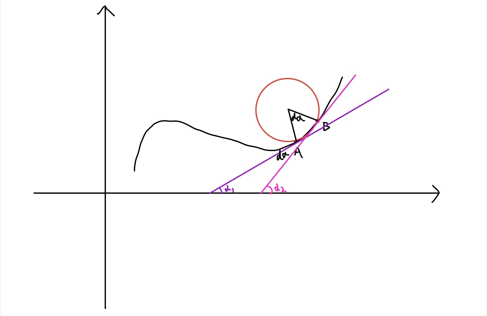

## 曲率公式：
$k = \frac {|y''|}{(1+y'^2)^{\frac{3}{2}}}$

## 曲率及曲率半径的定义
对于一条曲线来说我们可以研究其曲率。通常来想，以一条连续光滑的曲线上无限接近的两个点为端点的一弧线总可以视为是某个圆上的一段弧（可以简单的认为曲率半径在连续光滑的曲线上不会发生突变，所以在某点的无穷小领域内曲率半径可以作为一个常量）。而这个圆的半径就被定义为曲线在这一点的曲率半径，而曲率则被定义为曲率半径的倒数。

那么如何求曲率的半径呢？我们可以回想一下刚接触到弧度制的时候是怎么定义弧度的。弧度是圆弧长与该圆半径的比值，即$\alpha = \frac{S}{R}$；显然当$S=2\pi R$即整个圆周长时弧度为$2\pi$。

那么显然曲率半径很自然的可以定义为$R=\frac{dS}{d\alpha}$，即无穷小的一段弧长与其相对应的弧度的比值。

 <!-- more --> 

为了能使用最简单的运算步骤，我们要先研究一下几何关系：

如图，$A,B$即为连续光滑曲线上无线逼近的两个点，根据几何关系可以看出$d\alpha = \alpha _2 - \alpha_1$

## 求$d\alpha$:
回想一下什么是曲线斜率，曲线的斜率就是其切线在这一点与水平线夹角的正切值，那么图片上曲线在$A,B$两点的斜率自然就是$\tan \alpha_1$与$\tan \alpha_2$。而我们需要的是这两个倾斜角的差值$d\alpha$。

则有$\tan \alpha = \frac{dy}{dx}$，我们对其求微分可得：
$d\tan \alpha = \frac{d\tan \alpha}{d\alpha} d\alpha = \sec ^2\alpha d\alpha = (1+\tan ^2\alpha)d\alpha = [1+(\frac{dy}{dx})^2]d\alpha$
这样可得：$d\alpha = \frac{d\tan \alpha}{1+(\frac{dy}{dx})^2} = \frac{d\frac{dy}{dx}}{1+(\frac{dy}{dx})^2}$

## 求$dS$:
这就是对弧长进行微分，也叫弧微分。简单来说就是用线段$AB$来代替弧$AB$，因为当这两点无限趋近的时候，它们基本就没什么区别了，也就是取一阶近似或者说线性近似的意思。

设$A(x_1,y_1),B(x_2,y_2)$，线段$AB$的长度很好计算，就是勾股定理：
$|AB| = dS = \sqrt {(x_2 - x_1)^2+(y_2-y_1)^2} = (x_2 - x_1) \sqrt {1+(\frac{y_2-y_1}{x_2-x_1})^2} = \sqrt {1+(\frac{dy}{dx})^2}dx$

## 将$d\alpha$与$dS$代入公式：
加一个绝对值，曲率半径就是被定义为一个正数，暂且没必要牵扯的负数，就这么解释一哈吧！
$R = |\frac{dS}{d\alpha}| = \frac{[1+(\frac{dy}{dx})^2]^{\frac{3}{2}}}{|d \frac{dy}{dx}\cdot \frac{1}{dx}|} = \frac{[1+(\frac{dy}{dx})^2]^{\frac{3}{2}}}{|\frac{d}{dx}\frac{dy}{dx}|} = \frac{[1+(\frac{dy}{dx})^2]^{\frac{3}{2}}}{|\frac{d^2y}{dx^2}|}$

而曲率就是曲率半径的一个倒数，即$\frac{|y''|}{(1+y'^2)^\frac{3}{2}}$