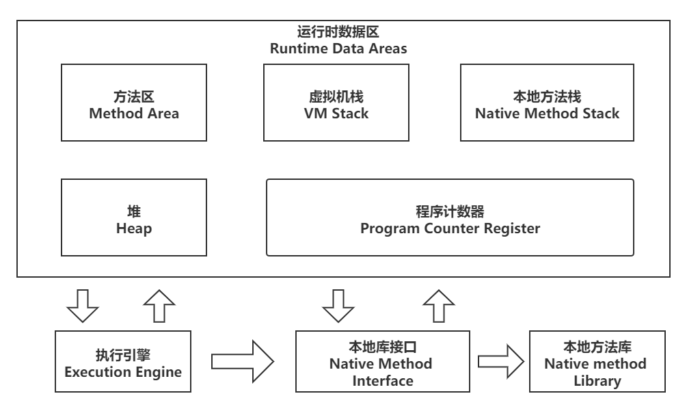

## 介绍

​		程序计数器(Program Counter Register)是一块较小的内存空间，它可以看作是当前线程所执行的字节码的行号指示器。在Java虚拟机的概念模型里，字节码解释器工作时就是通过改变这个计数器的值来选取下一条需要执行的字节码指令，它是程序控制流的指示器，分支、循环、跳转、异常处理、线程恢复等基础功能都需要依赖这个计数器来完成。

​		由于Java虚拟机的多线程是通过线程轮流切换、分配处理器执行时间的方式来实现的，在任何一个确定的时刻，一个处理器(对于多核处理器来说是一个内核)都只会执行一条线程中的指令。因此，为了线程切换后能恢复到正确的执行位置，每条线程都需要有一个独立的程序计数器，各条线程之间计数器互不影响，独立存储，我们称这类内存区域为“线程私有”的内存。

 <!-- more --> 

​		如果线程正在执行的是一个Java方法，这个计数器记录的是正在执行的虚拟机字节码指定的地址；如果执行的是本地(Native)方法，这个计数器值应为空(Undefined)。此内存区域是唯一一个在《Java虚拟机规范》中没有规定任何OutOfMemoryError情况的区域。

## 总结

**作用：**PC寄存器用来存储指向下一条指令的地址，即将要执行的指令代码。由执行引擎读取下一条指令。

**使用PC寄存器存储字节码指令地址有什么用：**因为CPU需要不停的切换各个线程，这时候切换回来以后，就得知道接着从哪里开始继续执行。JVM的字节码解释器就需要通过改变PC寄存器的值来明确下一条应该执行什么样的字节码指令。

**PC寄存器为什么被设定为私有的：**我们都知道所谓的多线程在一个特定的时间段内只会执行某一个线程的方法，CPU会不停地做任务切换，这样必然导致经常中断或恢复，如何保证分毫无差呢？为了能够准确地记录各个线程正在执行的当前字节码指令地址，最好的办法自然是为每一个线程都分配一个PC寄存器，这样一来各个线程之间便可以进行独立计算，从而不会出现互相干扰的情况。

## 补充

**CPU时间片：**CPU时间片即CPU分配给各个程序的时间，每个线程被分配一个时间段，称作它的时间片。在宏观上：我们可以认为同时打开了多个应用程序，每个程序并行不悖，同时运行；在微观上，由于只有一个CPU，一次只能处理程序要求的一部分，如何处理公平，一种方法就是引入时间片，每个程序轮流执行。

