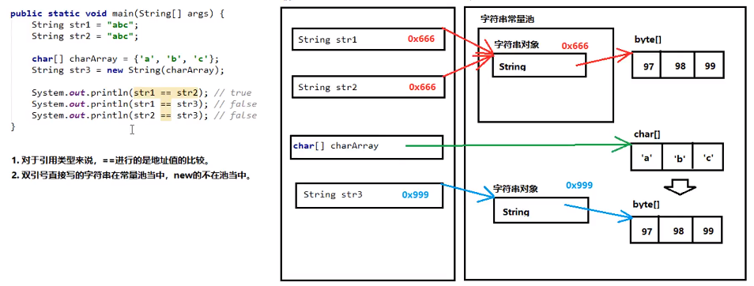

# 第三章 Java的基本程序设计结构

## 3.1 一个简单的Java应用程序

## 3.2 注释

## 3.3 数据类型

### 3.3.1 整型

### 3.3.2 浮点类型

三个特殊的浮点类型：

* 正无穷大 (Double.POSITIVE_INFINITY)以及相应的Float类型
* 负无穷大(Double.NEGATIVE_INFINITY)以及相应的Float类型
* NaN (Double.NaN)以及相应的Float类型

检测一个特定值是否等于Double.NaN:

```java
if (x == Double.NaN)// is never true
```

```java
if(Double.isNaN(X))
```

浮点数不适用于无法接受舍入误差的金融计算，可以使用BigDecimal类。

### 3.3.3 char类型

### 3.3.4 Unicode和char类型

### 3.3.5 boolean类型

## 3.4 变量与常量

### 3.4.1 声明变量

### 3.4.2 变量初始化

### 3.4.3 常量

可以利用关键字final 指示常量。关键字final表示这个变量只能被赋值一次，一旦被赋值之后就不能够再更改了；常量使用全大写。

当希望某个常量可以在一个类的多个方法中使用，通常将这些常量称为类常量（class constant）；可以使用static final设置一个常量；类常量的定义位于main方法的外部，在同一个类的其他方法也可以使用这个常量。若一个常量被声明为public，那么其他类的方法也可以使用这个常量。

### 3.4.4 枚举类型

变量的取值只有在一个有限的集合内。

```java
enum Size {SMALL,MEDIUM,LARGE,EXTRA_LARGE};
Size s = Size.MEDIUM;
```

Size类型的变量只能存储这个类型声明中给定的某个枚举值，或是特殊值null。

 <!-- more --> 

## 3.5 运算符

### 3.5.1 算术运算符

### 3.5.2 数学函数与常量

### 3.5.3 数值类型之间的转换

当一个二元运算符连接两个值时，先要将两个操作数值转换为同一类型，然后再进行计算。

* 如果两个操作数中有一个是double类型，另一个操作数就会转换为double；
* 否则，如果其中一个操作数是float类型，另一个操作数将会转为float；
* 否则，如果其中一个操作数是long类型，另一个操作数将会转换为long类型；
* 否则，两个操作数都被转换为int类型。

### 3.5.4 强制类型转换

若想对浮点数进行舍入运算

```java
double x =9.997;
int nx = (int) Math.round(x) //round 方法返回结果为long类型 +0.5向下取整
```

对于byte/short/char三种类型来说，如果右侧赋值的数值没有超过范围，那么javac编译器会自动隐含地为我们补上一个强制类型转换；编译器的常量优化；

### 3.5.5 结合赋值和运算符

### 3.5.6 自增与自减运算符

### 3.5.7 关系和boolean运算符

三元操作符：condition? expression1 : expression2；如果条件为true，就为第一个表达式的值，否则计算为第二个表达式的值。

### 3.5.8 位运算符

### 3.5.9 括号与运算符级别

## 3.6 字符串

创建字符串的常见3+1种方式：

三种构造方法：

public String()；创建一个空白字符串，不含有任何内容。

public String(char[] array)：根据字符数组的内容，来创建对应的字符串。

public String(byte[] array)：根据字节数组的内容，来创建对应的字符串。

一种直接创建。

```java
public class Demo3_String
{
    public static void main(String[] args)
    {
        String str1 = new String();//使用空参构造
        System.out.println("第一个字符串："+ str1);

        //根据字符数组创建字符串
        char[] charArray = {'A','B','C'};
        String str2 = new String(charArray);
        System.out.println("第二个字符串:"+str2);//ABC

        //根据字节数组来创建数组
        byte[] byteArray = {97,98,99};
        String str3 = new String(byteArray);
        System.out.println("第三个字符串："+str3);//abc

        //直接创建
        String str4 = "ABCD";
    }
}
```


### 3.6.1 子串

String类的substring 方法可以从一个较大的字符串提取一个子串

```java
String greeting = "Hello";
String s = greeting.substring(0,3);//从0开始计数，直到3为止，但不包含3。
```

### 3.6.2 拼接

如果需要把多个字符串放在一起，用一个界定符号分隔，可以使用静态join方法。

```java
String all = String.join("/","S","M","L","XL"); // all is the string "S / M / L / XL"

String repeated = "java".repeat(3);//java 11 中的repeat方法
```

### 3.6.3 不可变字符串

字符串的特点：

* 字符串的内容用不可变。
* 正是因为字符串不可改变，所以字符串是可以共享使用的。
* 字符串效果上相当于char[]字符数组，但底层原理是byte[]字节数组。

### 3.6.4 检测字符串是否相等

可以使用equals方法检测两个字符串是否相等；s.equals(t)，可以是字符串变量，也可以是字符串字面量；“Hello”.equals(greeting)。

若想检测两个字符串是否相等，而不区分大小写，可以使用equilsIgnoreCase方法；“Hello”.equalsIgnoreCase(“Hello”)。

一定不要使用 == 运算符检测两个字符串是否相等！这个运算符只能确定两个字符串是否存放在同一个位置上。若字符串在同一个位置上，它们必然相等；但完全有可能将内同相同的多个字符串副本放在不同的位置上。

字符串常量池：程序当中直接写上的双引号字符串，就在字符串常量池中。

对于基本类型来说==是进行数值的比较；对于引用类型来说\==地址值的比较。

```java
public class Demo3_StringPool
{
    public static void main(String[] args) {
        String str1 = "abc";
        String str2 = "abc";

        char[] charArray = {'a','b','c'};
        String str3 = new String(charArray);

        System.out.println(str1 == str2);//true
        System.out.println(str1 == str3);//false
        System.out.println(str2 == str3);//false
    }
}
```



字符串的比较相关方法

public boolean equals(Object obj)：参数可以是任何对象，只有参数是一个字符串并且内容相同的才会给true；否则返回false。任何对象都能用Object进行接收。

```java
public class Demo3_StringEquals
{
    public static void main(String[] args)
    {
        String str1 = "abc";
        String str2 = "abc";

        char[] charArray = {'a','b','c'};
        String str3 = new String(charArray);

        System.out.println(str1.equals(str2));//true
        System.out.println(str1.equals(str3));//true
        System.out.println(str2.equals(str3));//true
    }
}
```

注意事项：

* 任何对象都能用Object进行接收
* equals方法具有对称性
* 如果比较双方一个常量一个变量，推荐把常量字符串写在前面。(防止空指针异常)

public boolean equalsIgnoreCase(String str)：忽略大小写，进行内容比较。

### 3.6.5 空串与Null串

空串“”是长度为0的字符串，可以调用以下代码来检查字符串是否为空：

```java
if(str.length() == 0)//1
if(str.equals(""))//2
```

空串是一个java对象，有自己的长度0和内容空；不过String变量还可以存放一个特殊的值，名为null，表示目前没有任何对象与该变量关联。要检查一个字符串是否为null，要使用以下条件：

```java
if(str == null)//1
if(str != null && str.length() != 0)//检查一个字符串既不是null，也不是空串
```

### 3.6.6 码点与代码单元

调用s.charAt(n)将返回位置n的代码单元

### 3.6.7 String API

String当中与获取相关的常用方法有：

public int length()：获取字符串当中还有的字符个数，拿到字符串长度。

public String concat(String str)：将当前字符串和参数字符串拼接成为返回值新的字符串。

public char charAt(int index)：获取索引位置的单个字符(索引从0开始)

public int indexOf(String str)：查找参数字符串在本字符串当中首次出现的索引位置，如果没有则返回-1。

```java
public class Demo3_StringGet
{
    public static void main(String[] args)
    {
        //获取字符串的长度
        String str = "iroghvaiosuigbbvapwur";
        System.out.println("字符串的长度为："+str.length());

        //拼接字符串
        String str1 = "Hello";
        String str2 = "World";
        String str3 = str1.concat(str2);
        System.out.println(str3);

        //获取指定索引位置的单个字符
        char ch = str.charAt(5);
        System.out.println(ch);

        //查找参数字符串在本来字符串当中出现的第一次索引位置，没有返回-1
        int index1 = str.indexOf("osu");
        System.out.println(index1);
        int index2 = str.indexOf("hdc");
        System.out.println(index2);
    }
}
```

字符串的截取方法：

public String substring(int index)：截取从参数位置一直到字符串末尾，返回新字符串。

public String substring(int begin,int end)：截取从begin开始，一直到end结束，中间的字符串。备注：[begin,end)，即包含左边，不包含右边。

```java
public class Demo3_StringSubstring
{
    public static void main(String[] args)
    {
        String str1 = "puytbbvnbjkajbdfvthtugh";
        String str2 = str1.substring(8);
        System.out.println(str2);//bjkajbdfvthtugh

        String str3 = str1.substring(8,16);
        System.out.println(str3);//bjkajbdf
    }
}
```

String当中与转换相关的常用方法有：

public char[] toCharArray()：将当前字符串拆分成字符数组作为返回值。

public byte[] getBytes()：获得当前字符串底层的字节数组。

public String replace(CharSequence oldString，CharSequence newString)；将所有出现的老字符串替换成新的字符串，返回替换后的结果新字符串。

```java
public class Demo3_StringConvert
{
    public static void main(String[] args)
    {
        //转换成为字符串数组
        char[] chars = "Helloworld".toCharArray();
        System.out.println(chars[0]);
        System.out.println(chars.length);

        //转换成为字节数组
        byte[] bytes = "abc".getBytes();
        for (int i = 0; i < bytes.length; i++) {
            System.out.println(bytes[i]);
        }

        String str1 = "How do you do?";
        String str2 = str1.replace("o","*");
        System.out.println(str2);
    }
}
```

定义一个方法，把数组{1，2，3}按照指定的格式拼接成一个字符串。格式参照如下：[word1#word2#word3]

```java
public class Demo3_StringPractise
{
    public static void main(String[] args)
    {
        int[] array = new int[]{1, 2, 3};
        String str1 = fromArrayToString(array);
        System.out.println(str1);
    }

    public static String fromArrayToString(int[] array)
    {
        String str = "[";
        for (int i = 0; i < array.length; i++) {
            if (i == array.length -1 )
            {
                str += "word"+array[i]+ "]";
            }else
            {
                str += "word"+array[i] + "#";
            }
        }
        return str;

    }
}
```

键盘输入一个字符，并且统计其中各种字符出现的次数，大写字母，小写字母，数字，其他。

```java
import java.util.Scanner;

public class Demo7_StringCount
{
    public static void main(String[] args)
    {
        Scanner sc = new Scanner(System.in);
        System.out.println("请输入一个字符串：");
        String str = sc.next();

        int countUpper = 0;
        int countLower = 0;
        int countNumber = 0;
        int countOther = 0;

        char[] chars = str.toCharArray();
        for (int i = 0; i < chars.length; i++)
        {
            char ch = chars[i];
            if ('A' <= ch && ch <='Z')
            {
                countUpper++;
            }else if ('a' <= ch && ch <= 'z')
            {
                countLower++;
            }else if ('0' <= ch && ch <= '9')
            {
                countNumber++;
            }else
            {
                countOther++;
            }
        }

        System.out.println("大写字母有："+countUpper+"个");
        System.out.println("小写字母有："+countLower+"个");
        System.out.println("数字有："+countNumber+"个");
        System.out.println("其他的有："+countOther+"个");
    }
}
```


### 3.6.8 阅读联机API文档

### 3.6.9 构建字符串

若需要用许多小段的字符串来构建一个字符串，可以

```java
StringBuilder builder = new StringBuilder();
builder.append(ch);
builder.append(str);
//字符串构建完成时就调用toSting方法
String completedString = builder.toSring();
```

## 3.7 输入与输出

### 3.7.1 读取输入

```java
import java.util.Scanner;

public class InputTest
{
    public static void main(String[] args)
    {
        Scanner sc = new Scanner(System.in);

        System.out.println("What is your name ?");
        String name = sc.nextLine();

        System.out.println("How old are you ?");
        int age = sc.nextInt();

        System.out.println("Hello!"+name+".Next year,you'll be "+(age + 1));
    }
}
```


### 3.7.2 格式化输出

%\[argument_index$]\[flags]\[width]\[.precision]conversion

### 3.7.3 文件输入与输出

Scanner类的功能：可以实现键盘输入数据到程序当中。

1.导包：

```java
import java.util.Scanner;
```

2.创建：

```java
Scanner sc = new Scanner(System.in);//System.in代表从键盘输入
```

3.使用：

```java
int num = sc.nextInt();//获取键盘输入的一个int数字
String str = sc.next();//获取键盘输入的一个字符串
```


想要读取一个文件，需要构造一个Scanner对象

```java
Scanner in = new Scanner(Path.of("myfile.txt"),StandardCharsets.UTF_8);
```

若文件名中包含反斜杠符号，就要记住在每个反斜杠之前加一个额外的反斜杠转义：“c:\\mydirectory\\myfile.text”。

想要写入文件，就需要构造一个PrintWriter对象。在构造器中，需要提供文件名和字符编码：

```java
PrintWriter out = new PrintWriter("myfile.txt",StandardCharsets.UTF_8);
```

若文件不存在，则创建该文件。

## 3.8 控制流程

### 3.8.1 块作用域

不能在嵌套的两个块中声明同名变量

```java
public static void main(String[] args)
{
    int n;
    ...
    {
        int k;
        int n;//ERROR
    }
}
```

### 3.8.2 条件语句

### 3.8.3 循环

```java
import java.util.Scanner;

public class Retirement
{
    public static void main(String[] args)
    {
        Scanner sc = new Scanner(System.in);

        System.out.println("How much money do you need to retire?");
        double goal = sc.nextDouble();

        System.out.println("How much money will you contribute every year?");
        double payment = sc.nextDouble();

        System.out.print("Interest rate is in %:");
        double interestRate = sc.nextDouble();

        double balance = 0;
        int year = 0;

        while (balance < goal)
        {
            balance += payment;
            double interest = balance * interestRate / 100;
            balance += interest;
            year++;
        }

        System.out.println("you can retire in "+year+" years");
    }
}
```


### 3.8.4 确定循环

```java
import java.util.Scanner;

public class LotteryOdds
{
    public static void main(String[] args)
    {
        Scanner sc = new Scaner(System.in);
        
        System.out.println("How many numbers do you need to draw?");
        int k = sc.nextInt();
        
        System.out.println("What is the highest number you can draw?");
        int n = sc.nextInt();
        
        int lotteryOdds = 1;
        for(int i = 1; i <= k; i++)
        {
            lotteryOdds = lotteryOdds * (n - i + 1) / i;
        }
        System.out.println("Your odds are 1 in "+lotteryOdds);
    }
}
```

```java
import java.util.Scanner;

public class Retirement2
{
    public static void main(String[] args)
    {
        Scanner sc = new Scanner(System.in);

        System.out.println("How much money will you contribute every year ?");
        double payment = sc.nextDouble();

        System.out.print("Interest rate in %:");
        double interestRate = sc.nextDouble();

        double balance = 0;
        int years = 0;
        String input;
        do
        {
            balance += payment;
            double interest = balance * interestRate / 100;
            balance += interest;
            years++;

            System.out.printf("After year %d, you balance is %,.2f",years,balance);

            System.out.print("Ready to retire ? (Y/N)");
            input = sc.next();

        }
        while (input.equals("N"));
    }
}
```


### 3.8.5 多重选择：switch语句

多个case后面的数值不可以重复；switch后面小括号当中只能是下列数据类型：基本数据类型：byte/short/char/int，引用数据类型：String字符串、enum枚举； switch语句可以很灵活，前后顺序可以颠倒，break语句可以省略，匹配哪一个case就从哪一个位置向下执行，直到遇到break或整体结束为止。

### 3.8.6 中断控制流程的语句

## 3.9 大数

若基本的整数和浮点数精度不能够满足需求，可以使用java.math包中两个很有用的类：BigInteger和BigDecimal。可以使用静态的valueOf方法将普通的数值转换为大数：

```java
BigInteger a = BigInteger.valueOf(100);
```

对于更大的数，可以使用一个带字符串参数的构造器：

```java
BigInteger reallyBig = new BigInteger("223432532432993288872843924002048423");
```

注意：不能使用熟悉的算术运算符（+，*）处理大数，而需要使用大数类中的add和multiply方法。

```java
BigInteger c = a.add(b);//c = a + b
BigInteger d = c.multiply(b.add(BigInteger.valueOf(2)));// d = c * (b + 2)
```

```java
import java.math.BigInteger;
import java.util.Scanner;

public class BigIntegerTest
{
    public static void main(String[] args)
    {
        Scanner sc = new Scanner(System.in);

        System.out.println("How many numbers do you need to draw?");
        int k = sc.nextInt();

        System.out.println("What is the highest number you can draw?");
        int n = sc.nextInt();

        BigInteger lotteryOdds = BigInteger.valueOf(1);
        for (int i = 1; i <= k; i++)
        {
            lotteryOdds = lotteryOdds.multiply(BigInteger.valueOf(n - i +1)).divide(BigInteger.valueOf(i));
        }
        System.out.println("Your odds are 1 in "+lotteryOdds);
    }
}
```

* BigInteger add(BigInteger other)
* BigInteger subtract(BigInteger other)
* BigInteger multiply(BigInteger other)
* BigInteger divide(BigInteger other)
* BigInteger mod(BigInteger other)

返回这个大整数和另一个大整数other的和、差、积、商、余数。

* BigInteger sqrt()

得到这个大数的平方根。

* int compareTo(BigInteger other)

若这个大数与另一个大数other相等，返回0；若这个大整数小于另一个大整数other，返回负数；否则返回正数。

* static BigInteger valueOf(long x)

返回值等于x的大整数。

* BigDecimal add(BigDecimal other)
* BigDecimal subtract(BigDecimal other)
* BigDecimal multiplyBigDecimal other)
* BigDecimal divide(BigDecimal other)
* BigDecimal divide(BigDecimal other，RoundingMode mode)

返回一个大实数与other的和、差、积、商。若商是一个无限循环小数，第一个divide方法会抛出异常。要得到一个舍入的结果，就要使用第二个方法。RoundingMode.HALF_UP是四舍五入方式。

* int compareTo(BigDecimal other)

若这个大实数与other相等，返回0；若这个大实数小于另一个大实数other，返回负数；否则返回正数。

* static BigDecimal valueOf(long x)
* static BigDecimal valueOf(long x，int scale)

返回值等于x或$x/10^{scale}$的一个大实数。

## 3.10 数组

数组：是一种容器，可以同时存放多个数组。

特点：数组是一种引用数据类型；数组中的多个数据，类型必须统一；数组的长度在程序运行期间不可改变

### 3.10.1 声明数组

两种常见的初始化方式：动态初始化；静态初始化。

如果不确定数组当中的具体内容，用动态初始化；否则，已经确定了具体内容，用静态初始化。

```java
int[] a;
int[] a = new int[100];
int[] smallPrimes = {2,3,5,7,11,13};
```

### 3.10.2 访问数组元素

访问数组元素的格式：数组名称[索引值]；索引值，就是一个int数字，代表数组当中元素的编号；索引值从0开始，一直到数组长度-1为止。

使用动态初始化数组的时候，其中的元素将会自动拥有一个默认值。规则如下：

* 整数类型默认为0；
* 浮点类型默认为0.0；
* 字符类型默认为‘\u0000’；
* 布尔类型默认为false；
* 引用类型默认为null；

如果访问数组元素的时候，索引编号并不存在，那么将会发生数组索引越界异常。ArrayIndexOutBoundsException

数组必须进行new初始化才能使用其中的元素，如果只是赋值一个null，没有进行new创建，那么将会发生空指针异常。NullPointerException

### 3.10.3 for each循环

for(variable：collection) statement

### 3.10.4 数组拷贝

在java中，允许将一个数组变量拷贝到另一个数组变量。这时，两个变量将引用同一个数组。

```java
int[] luckyNumbers = smallPrimes;
luckyNumbers[5] = 12;//now smallPrimes[5] is also 12
```

若希望将一个数组的所有值拷贝到一个新的数组中去，就要使用Arrays类的copyOf方法：

```java
luckyNumbers = Arrays.copyOf(luckyNumbers, 2 * luckNumbers.length)
```

第二个参数是新数组的长度。这个方法通常用来增加数组的大小。如果数组元素是数值型，那么额外的元素将被赋值为0；如果数组是布尔型，则将赋值为false。相反，若长度小于原始数组的长度，则只拷贝前面的值。

### 3.10.5 命令行参数

### 3.10.6 数组排序

想要对数值型数组进行排序，可以使用Arrays类中的sort方法：

```java
int[] a = new int[1000];
...
Array.sort(a);
```

```java
import java.util.Arrays;
import java.util.Scanner;

public class LotteryDrawing
{
    public static void main(String[] args)
    {
        Scanner sc = new Scanner(System.in);

        System.out.println("How many numbers do you need to draw ?");
        int k = sc.nextInt();

        System.out.println("What is the highest number you can draw ?");
        int n = sc.nextInt();

        System.out.println("=========================================");
        
        int[] numbers = new int[n];
        for(int i = 0; i < numbers.length; i++)
        {
            numbers[i] = i + 1;
        }
        
        int[] results = new int[k];
        for(int i = 0; i < results.length; i++)
        {
            int result = (int)(Math.random() * n);
            results[i] = numbers[result];
            numbers[result] = numbers[n - 1];
            n--;
        }
        
        Arrays.sort(results);
        
        for(int r : results)
        {
            System.out.println(r);
        }
    }
}
```

数组中的最值实现

```java
public class Demo5_ArrayMax
{
    public static void main(String[] args)
    {
        int[] array = new int[] {2,5,4,8,99,6,35,57,68,266,-13};

        int max = array[0];
        int min = array[0];
        for (int i = 1; i < array.length; i++)
        {
            if (array[i] > max)
            {
                max = array[i];
            }
            if (array[i] < min)
            {
                min = array[i];
            }
        }

        System.out.println("max = "+ max);
        System.out.println("min = "+ min);
    }
}
```

数组元素反转

```java
public class Demo5_Reverse
{
    public static void main(String[] args)
    {
        int[] array = new int[]{1,4,7,8,5,3,76,24};

        for (int i = 0, j = array.length - 1;i < j; i++, j--)
        {
            int temp = array[i];
            array[i] = array[j];
            array[j] = temp;
        }

        for (int r : array)
        {
            System.out.print(" "+ r);
        }
    }
}
```

数组作为方法的参数时，传递的其实是数组的地址值；数组作为方法的返回值，返回的其实也是数组的地址值。

### 3.10.7 多维数组

```java
public class CompoundInterset
{
    public static void main(String[] args)
    {
        final double STARTRATE = 10;
        final int COL = 6;
        final int ROW = 10;

        double[] interestRate = new double[COL];
        for (int i = 0; i < interestRate.length; i++)
        {
            interestRate[i] = (STARTRATE + i) / 100.0;
        }

        double[][] balances = new double[ROW][COL];
        for (int i = 0; i < balances[0].length; i++)
        {
            balances[0][i] = 10000;
        }

        for (int i = 1; i < balances.length; i++)
        {
            for (int j = 0; j < balances[i].length; j++)
            {
                double oldBalance = balances[i - 1][j];
                double interset = oldBalance * interestRate[j];
                balances[i][j] = oldBalance + interset;
            }
        }

        for (int i = 0; i < interestRate.length; i++)
        {
            System.out.printf("%9.0f%%",100 * interestRate[i]);
        }
        System.out.println();

        for (double[] row : balances)
        {
            for (double r : row)
            {
                System.out.printf("%10.2f",r);
            }
            System.out.println();
        }
    }
}
```

### 3.10.8 不规则数组

java实际上没有多维数组，只有一维数组；多维数组被解释为数组的数组。

```java
public class LotteryArray
{
    public static void main(String[] args)
    {
        final int ROW = 10;

        int[][] odds = new int[ROW + 1][];
        for (int i = 0; i < odds.length; i++)
        {
            odds[i] = new int[i + 1];
        }

        for (int n = 0; n < odds.length; n++)
        {
            for (int k = 0; k < odds[n].length; k++)
            {
                int lotteryOdds = 1;
                for (int i = 1; i <= k; i++)
                {
                    lotteryOdds = lotteryOdds * (n - i + 1) / i;
                }

                odds[n][k] = lotteryOdds;
            }
        }

        for (int[] row : odds)
        {
            for (int r : row)
            {
                System.out.printf("%5d",r);
            }
            System.out.println();
        }
    }
}
```

