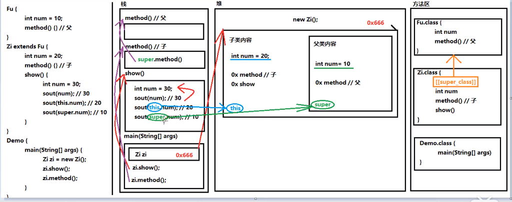
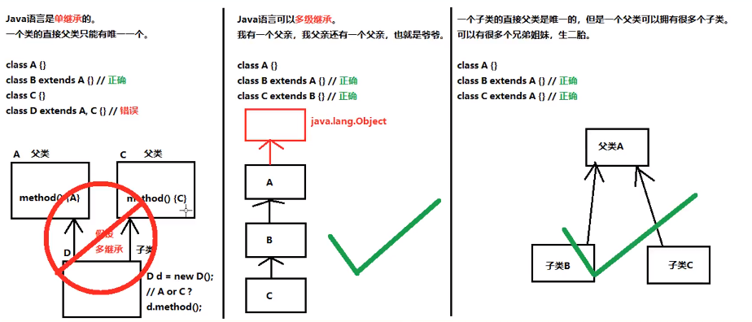
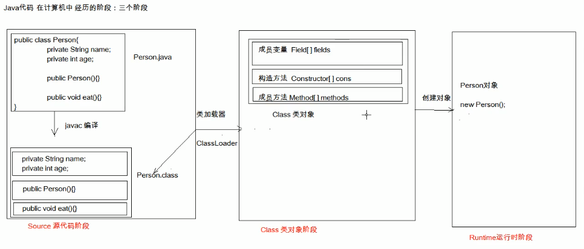

# 第五章 继承

本章将学习面向对象程序设计的另外一个基本概念：继承(inheritance)。继承的基本思想是，可以基于已有的类创建新的类。继承已存在的类就是复用(继承)这些类的方法，而且可以增加一些新的方法和字段，使新类能够适应新的情况。这是Java程序设计中的一项核心技术。

另外，本章还阐述了反射(reflection)的概念。反射是指在程序运行期间更多地了解类及其属性的能力。反射是一个功能强大的特性，不过，不可否认它也相当复杂。

继承主要解决的问题就是：共性抽取。

## 5.1 类、超类和子类

回忆一下在前一章中讨论过的Employee类。假设你在某个公司工作，这个公司里的经理的待遇与普通员工的待遇存在着一些差异。不过，他们之间也存在着很多相同的地方，例如，他们都领取薪水。只是普通员工在完成本职任务之后仅领取薪水，而经理在完成了预期的业绩之后还能得到奖金。这种情形下就需要使用继承。为什么呢？因为需要为经理定义一个新类Manager，并增加一些新功能。但可以重用Employee类中已经编写的部分代码，并保留原来Employee类中的所有字段。从理论上讲，在Manager与Employee之间存在着明显的“is-a”关系，每个经理都是一个员工：“is-a”关系是继承的一个明显特征。

### 5.1.1 定义子类

可以如下继承Employee类来定义Manager类，这里使用关键字extends表示继承。

```java
public class Manager extends Employee
{
    added methods and fields
}
```

关键字extends表明正在构建的新类派生于一个已经存在的类。这个已存在的类称为超类(superclass)、基类(base class)

或父类(parent class)；新类称为子类(subclass)、派生类(derived class)或孩子类(child class)。

尽管Employee类是一个超类，但并不是因为它优于子类或者拥有比子类更多的功能。实际上恰恰相反，子类比超类拥有更多的功能。

继承关系的特点：

* 子类可以拥有父类的内容
* 子类还可以拥有自己专有的内容

直接通过子类对象访问成员变量：等号左边是谁，就优先用谁，没有则向上找。

间接通过成员方法访问成员变量：方法属于谁，就优先用谁，没有则向上找。

区分子类方法中重名的三种变量：

* 局部变量： 直接写
* 本类的成员变量：this.成员变量名
* 父类的成员变量：super.成员变量名

 <!-- more --> 

### 5.1.2 覆盖方法

重写(override)：方法名称一样，参数列表也【一样】。

重载(overload)：方法名称一样，参数列表【不一样】。

方法的覆盖重写特点：创建的是子类对象，则有先用子类方法。

方法覆盖的注意事项：

* 必须保证父子类之间方法的名称相同，参数列表也相同。@override：写在方法前面，用来检测是不是有效的正确覆盖重写。这个注解就算不写，只要满足要求，也是正确的方法覆盖。
* 子类方法的返回值必须【小于等于】父类方法的返回值范围。String有一个父类是Object，Object类是所有类的公共最高父类(祖宗类)java.lang.Object。
* 子类方法的权限必须【大于等于】父类方法的权限修饰符 public > protected > default > private (default)不是关键字default，而是什么都不写，留空。

超类中的有些方法对子类Manager并不一定适用。具体来说，Manager类中的getSalary方法应该返回薪水和奖金的总和。为此，需要提供一个新的方法来覆盖(override)超类中的这个方法：

```java
public class Manager extends Employee
{
    ...;
    public double getSalary()
    {
        ...;
    }
    ...;
}
```

应该如何实现这个方法呢？乍看起来似乎简单，只要返回salary和bonus字段的总和就可以了：

```java
public double getSalary()
{
    return salary + bonus;//won't work
}
```

不过这样不行。回想一下，只有Employee方法直接访问Employee类的私有字段。这意味着，Manager类的getSalary方法不能直接访问Salary字段。如果Manager类的方法想要访问那些私有字段，就要像所有其他方法一样使用公共接口，在这里就是要使用Employee类中的公共方法getSalary。

```java
public double getSalary()
{
    double baseSalary = getSalary();
    return baseSalary + bonus;
}
```

上面这段代码仍有问题。问题出现在调用的getSalary的语句上，它只是在调用自身，这是因为Manager类也有一个getSalary方法(就是我们正在实现的这个方法)，所以这条语句将会导致无限次地调用自己，直到整个程序最终崩溃。

这里需要指出：我们希望调用超类Employee中的getSalary方法，而不是当前类的这个方法。为此，可以使用特殊的关键字super解决这个问题：

```java
super.getSalary()
```

这个语句调用的是Employee类中的getSalary方法。下面是Manager类中getSalary方法的正确版本：

```java
public double getSalary()
{
    double baseSalary = super.getSalary();
    return bseSalary + bonus;
}
```

在父子类的继承关系当中，创建子类对象，访问成员方法的规则：

* 创建的对象是谁，就优先用谁，如果没有则向上找。
* 无论是成员方法还是成员变量，如果没有都是想上找，绝不会向下找子类的。

### 5.1.3 子类构造器

在例子的最后，我们来提供一个构造器。

```java
public Manager(String name, double salary, int year, int month, int day)
{
    super(name,salary,year,month,day);
    bonus = 0;
}
```

这里的关键字super具有不同的含义。是调用超类Employee中带有n,s,year,month和day参数的构造器的简写形式。

由于manager类的构造器不能访问Employee类的私有字段，所以必须通过一个构造器来初始化这些私有字段。可以利用特殊的super语法来调用这个构造器。使用super调用这个构造器的语法必须是子类构造的第一条语句。

如果子类的构造器没有显示地调用超类的构造器，将自动地调用超类的无参数构造器。如果超类没有无参数的构造器，并且在子类的构造器中又没有显示地调用超类的其他构造器，Java编译器就会报告一个错误。

继承关系中，父子类构造方法的访问特点：

* 子类构造方法当中有一个默认隐含的“super()”调用，所以一定先调用的父类构造，后执行子类构造。
* 子类构造可以通过super关键字来调用父类重载构造。
* super的父类调用必须是子类构造方法的第一个语句。不能一个子类构造调用多次super构造。

```java
package com.NoTrouble.inheritance;

public class ihheritance_ManagegerTest
{
    public static void main(String[] args)
    {
        inheritance_Manager boss = new inheritance_Manager("carl",80000,1987,12,15);
        boss.setBonus(5000);

        inheritance_Employee[] staff = new inheritance_Employee[3];
         staff[0] = boss;
         staff[1] = new inheritance_Employee("Harry Hacker",50000,1989,10,1);
         staff[2] = new inheritance_Employee("Tommy Tester",40000,1990,3,15);

         for (inheritance_Employee e : staff)
         {
             System.out.println("name="+e.getName()+", salary="+e.getSalary());
         }
         /*
         for (int i = 0; i < staff.length; i++)
         {
             System.out.println("name="+staff[i].getName()+", salary"+staff[i].getSalary());
         }
          */
    }
}
```

```java
package com.NoTrouble.inheritance;

import java.time.LocalDate;

public class inheritance_Employee
{
    private String name;
    private double salary;
    private LocalDate hireDay;

    public inheritance_Employee() {
    }

    public inheritance_Employee(String name, double salary, int year,int month,int day) {
        this.name = name;
        this.salary = salary;
        this.hireDay = LocalDate.of(year,month,day);
    }

    public String getName() {
        return name;
    }

    public void setName(String name) {
        this.name = name;
    }

    public double getSalary() {
        return salary;
    }

    public void setSalary(double salary) {
        this.salary = salary;
    }

    public LocalDate getHireDay() {
        return hireDay;
    }

    public void setHireDay(LocalDate hireDay) {
        this.hireDay = hireDay;
    }

    public void raiseSalary(double byPercent)
    {
        double raise = this.salary * byPercent / 100;
        this.salary += raise;
    }
}
```

```java
package com.NoTrouble.inheritance;


public class inheritance_Manager extends inheritance_Employee
{
    private double bonus;

    public inheritance_Manager()
    {}

    public inheritance_Manager(String name, double salary, int year, int month,int day)
    {
        super(name,salary,year,month,day);
    }

    @Override
    public double getSalary()
    {
        double baseSalary = super.getSalary();
        return baseSalary + bonus;
    }

    public void setBonus(double bonus)
    {
        this.bonus = bonus;
    }
}
```

super关键字的三种用法：

* 在子类的成员方法中，访问父类的成员变量
* 在子类的成员方法中，访问父类的成员方法。
* 在子类的构造方法中，访问父类的构造方法。

this关键字的三种用法：

* 在本类的成员方法中，访问本类的成员变量。
* 在本类的成员方法中，访问本类的另一个成员方法。
* 在本类的构造方法中，访问本类的另一个构造方法。



### 5.1.4 继承层次

继承不限于一个层次。例如，可以由Manager类派生Executive类。由一个公共超类派生出来的所有类的集合称为继承层次(inheritance hierarchy)。在继承层次中，从某个特定的类到其祖先的路径称为该类的继承链(inheritance chain)。通常一个祖先类可以有多个子孙链。

Java继承的三个特点：

* java语言是单继承的。一个类的直接父类只能有一个。
* java语言可以多级继承。
* 一个子类的直接父类是唯一的，但一个父类可以拥有很多个子类。



### 5.1.5 多态

有一个简单规则可以用来判断是否应该将数据设计为继承关系，这就是“is-a”规则，它指出子类的每个对象也是超类的对象。例如，每个经理都是员工，因此，将manager类设计为Employee类的子类是有道理的；反之则不然，并不是每一个员工都是经理。

“is-a”规则的另一种表述是替换原则(substitution principle)。它指出程序中出现超类对象的任何地方都可以使用子类对象替换。

```java
Employee e;
e = new Employee(...);
e = new Manager(...);
```

可以将子类的对象赋给超类变量。

在Java程序设计语言中，对象变量是多态的(polymorphic)。一个Employee类型的变量既可以引用一个Employee类型的对象，也可以引用Employee类的任何一个子类的对象。

``` java
Manager boss = new Manager(...);
Employee[] staff = new Employee[3];
staff[0] = boss;
boss.setBonus(5000);//OK
staff[0].setBonus(5000);//ERROR
```

因为staff[0]声明的类型是Employee，而setBonus不是Employee类的方法。

extends继承或implements实现，是多态性的前提。

代码中体现多态性，其实就是一句话：父类引用指向子类对象。

【格式：父类名称 对象名 = new 子类名称();】或者【接口名称 对象名 = new 实现类名称()；】

访问成与变量的两种方式：

1.直接通过对象名称访问成员变量：等号左边是谁，优先用谁，没有则向上找。

2.间接通过成员方法访问成员变量：该方法属于谁，优先用谁，没有则向上找。被重写优先看子类

多态中的成员方法：

1.看new谁，就优先用谁，没有则向上找；

2.编译看左边，运行看右边。

### 5.1.6 理解方法调用

准确理解如何在对象上应用方法调用非常重要。下面假设要调用x.f(args)，隐式参数x声明为类C的一个对象。下面调用过程的详细描述：

* 编译器查看对象的声明类型和方法名。需要注意的是：有可能存在多个名字为f但参数类型不一样的方法。编译器将会一一例举C类中所有名为f的方法和其超类中所有名为f而且可访问的方法(超类的私有方法不可访问)。至此，编译器已经知道所有可能被调用的候选方法。
* 接下来，编译器要确定方法调用中提供的参数类型。如果在所有名为f的方法中存在一个所提供参数类型完全匹配的方法，就选择这个方法。这个过程称为重载解析(overloading resolution)。至此，编译器已经知道需要调用的方法的名字和参数类型。
* 如果是private方法、static方法、final方法或者构造器，那么编译器将可以准确地知道应该调用哪个方法。这称为静态绑定(static binding)。于此对应的是，如果要调用的方法依赖于隐式参数的实际类型，那么必须在运行时使用动态绑定。
* 程序运行并采用动态绑定调用方法时，虚拟机必须调用于x所引用对象的实际类型对应的那个方法。假设x的实际类型是D，它是C类的子类。如果D类定义了方法f(String)，就会调用这个方法；否则，将在D类的超类中寻找f(String)，以此类推。

每次调用方法都要完成这个搜索，时间开销相当大。因此，虚拟机预先为每个类计算了一个方法表(method table)，其中列出了所有方法的签名和调用的实际方法。这样一来，在真正调用方法的时候，虚拟机仅要找这个表就行了。

在覆盖一个方法的时候，子类方法不能低于超类方法的可见性。特别是，如果超类方法是public，子类方法必须也要声明为public。

### 5.1.7 阻止继承：final 类和方法

有时候我们可能希望阻止人们利用某个类定义子类。不允许被扩展的类被称为final类。如果在定义类的时候使用了final修饰符就表明这个类是final类。例如，假设希望阻止人们派生Executive类的子类，就可以声明这个类的时候使用final修饰符。

```java
public final class Excutive extends Manager
{
    ...;
}
```

类中某个特定的方法也可以被声明为final，如果这样做，子类就不能覆盖这个方法。

```java
public class Employee
{
    ...;
    public final String getName()
    {
        return name;
    }
    ...;
}
```


注意：字段也可以声明为final。对于字段来说，构造对象之后就不允许改变他们的值了。不过，如果将一个类声明为final，只有其中的方法自动地称为final，而不包括字段。

### 5.1.8 强制类型转换

第三章曾经讲过，将一个类型强制转换为另外一个类型的过程称为强制类型转换。

```java
double x = 3.405;
int nx = int(x);
```

正像有时候需要浮点数转换为整数一样，有时候也可能需要将某个类的对象引用转换成另外一个类的对象引用。要完成对象引用的强制类型转换，转换语法与数值表达式的强制类型转换类似，仅需要一对圆括号将目标类名括起来，并放置在需要转换的对象引用之前就可以了。

```java
Manager boss = (Manager)staff[0];
```

进行强制类型转换的唯一原因是：要在暂时忽视对象的实际之后使用对象的全部功能。例如，在ManagerTest类中，由于某些元素是普通员工，所以staff数组必须是Employee对象数组。我们需要将数组中引用经理的元素复原成Manager对象，以便能够访问新增加的所有变量。

如果试图在继承链上进行向下的强制类型转换，并且“谎报”对象包含的内容，会发生什么情况呢？

```java
Manager boss = (Manager)staff[1];//ERROR
```

运行这个程序时，Java运行时系统将注意到你的承诺不符，并产生一个ClassCastException异常。为此只需要使用instanceof操作符就可以实现。

* 只能在继承层次内进行强制类型转换；
* 在将超类强制转成子类之前，应该使用instanceof进行检查。

实际上，通过强制类型转换来转换对象类型通常并不是一种好的做法。在我们的示例中，大多数情况并不需要将Employee对象强制转换成Manager对象，两个类的对象都能够正确地调用getSalary，这是因为实现多态性的动态绑定机制能够自动地找到正确的方法。

对象的向上转型：其实就是多态的写法：父类名称 对象名 = new 子类名称()；含义：右侧创建一个子类，把它当作父类看待使用。向上转型一定是安全的。弊端：对象一旦向上转型为父类，那么就无法调用子类原本特有的方法。解决：用对象的向下转型。

对象的向下转型：对象的向下转型，其实是一个还原的动作【格式：子类名称 对象名 = (子类名称)父类对象】含义：将父类对象，还原成子类对象。注意事项：必须保证对象本来创建的就是子类，才能向下转型成该子类。如果对象创建不是该子类非要转型为该子类，就会报错。ClassCastException。

如何才能知道一个父类引用的对象，本来是什么子类？

对象 instanceof 类型，这将得到一个boolean值结果，也就是判断前面的对象能不能当做后面类型的实例。

```java
Animal animal =  new Cat();

if(animal instanceof Dog)
{
    Dog dog = (Dog)annimal;
    ...;
}
if(annimal instanceof Cat)
{
    Cat cat = (Cat)animal
}
```


### 5.1.9 抽象类

如果自下而上在类的继承层次结构中上移，位于上层的类更具有一般性，可能更加抽象。当前，可以让Person.getDescription()返回一个空字符串。不过还有一个更好的方法，就是使用abstract关键字，这样就完全不需要实现这个方法了。

抽象方法：就是加上abstract关键字，然后去掉大括号，直接分号结束。

抽象类：抽象方法所在的类，必须是抽象类。在class之前写上abstract即可。

```java
public abstract String getDescription();
```

为了提高程序的清晰度，包含一个或多个抽象方法的类本身必须被声明为抽象的。

```java
public abstract class Person
{
    ...;
    public abstract String getDescription();
}
```

除了抽象方法之外，抽象类还可以包含字段和具体方法。抽象方法充当着占位方法的角色，它们在子类中具体实现。扩展抽象类可以有两种选择。一种是在子类中保留抽象类中的部分或所有抽象方法仍未定义，这样就必须将子类也标记为抽象类；另一种做法是定义全部方法，这样一来，子类就不是抽象的了。

如何使用抽象类和抽象方法：

* 抽象类不能实例化。但可以创建一个具体子类的对象。
* 必须用一个子类来继承抽象类
* 子类必须覆盖重写抽象父类当中所有的抽象方法：子类去掉抽象方法的abstract关键字，然后补上方法体大括号。
* 创建子类对象进行使用

注意事项：

* 抽象类不能创建对象
* 抽象类中，可以有构造方法，供子类创建对象时，初始化父类成员使用。
* 抽象类中，不一定包含抽象方法，但是有抽象方法的类必定是抽象类。
* 抽象类的子类，必须重写抽象父类所有的抽象方法，否则，编译无法通过。除非该子类也是抽象类。

即使不含抽象方法，也可以将类声明为抽象类。


```java
package com.NoTrouble.abstractClasses;

public class PersonTest
{
    public static void main(String[] args)
    {
        Person[] people = new Person[2];

        people[0] = new Employee("Harry Hacker",50000,1989,10,1);
        people[1] = new Student("Maria Morris","computer sscience");

        for (Person p : people)
        {
            System.out.println(p.getName()+","+p.getDescription());
        }
    }
}
```

```java
package com.NoTrouble.abstractClasses;

public abstract class Person
{
    public abstract String getDescription();
    private String name;

    public Person(){}

    public Person(String name)
    {
        this.name = name;
    }

    public String getName()
    {
        return this.name;
    }
}
```

```java
package com.NoTrouble.abstractClasses;

import java.time.LocalDate;

public class Employee extends Person
{
    private double salary;
    private LocalDate hireDay;

    public Employee(){}

    public Employee(String name, double salary, int year, int month, int day)
    {
        super(name);
        this.salary = salary;
        this.hireDay = LocalDate.of(year,month,day);
    }

    public double getSalary()
    {
        return this.salary;
    }

    public LocalDate getHireDay()
    {
        return this.hireDay;
    }

    public String getDescription()
    {
        return String.format("an employee with a salary of $%.2f",this.salary);
    }

    public void raiseSalary(double byPercent)
    {
        double raise = this.salary * byPercent / 100;
        this.salary += raise;
    }

}
```

```java
package com.NoTrouble.abstractClasses;

public class Student extends Person
{
    private String major;

    public Student(){}

    public Student(String name,String major)
    {
        super(name);
        this.major = major;
    }

   public String getDescription()
    {
        return "a studengt majoring in"+major;
    }


}
```

发红包案例

```java
package com.NoTrouble.sendredPacket;

public class User
{
    private String name;
    private double money;

    public User(){}

    public User(String name, double money)
    {
        this.name = name;
        this.money = money;
    }

    public String getName()
    {
        return this.name;
    }

    public double getMoney()
    {
        return this.money;
    }

    public void setName(String name)
    {
        this.name = name;
    }

    public void setMoney(double money)
    {
        this.money = money;
    }

    public void show()
    {
        System.out.println("name="+this.name+",money="+this.money);
    }
}
```

```java
package com.NoTrouble.sendredPacket;

import java.util.ArrayList;
import java.util.Random;

public class Member extends User
{
    public Member(){}
    public Member(String name, double money)
    {
        super(name,money);
    }

    public void receive(ArrayList<Double> list)
    {
        int index = new Random().nextInt(list.size());
        double delta = list.remove(index);
        double money = super.getMoney();
        super.setMoney(money + delta);
    }
}
```

```java
package com.NoTrouble.sendredPacket;

import java.util.ArrayList;

public class Manager extends User
{
    public Manager(){}

    public Manager(String name, double money)
    {
        super(name,money);
    }

    public ArrayList<Double> send(double totalMoney,int count)
    {
        ArrayList<Double> redlist = new ArrayList<>();

        double letfMoney = super.getMoney();
        if (letfMoney < totalMoney)
        {
            System.out.println("余额不足！");
            return redlist;
        }

        super.setMoney(letfMoney - totalMoney);

        double avg = totalMoney / count;
        for (int i = 0; i < count; i++) {
            redlist.add(avg);
        }

        return redlist;
    }
}
```

```java
package com.NoTrouble.sendredPacket;

import java.util.ArrayList;

public class SendRedPacketTest
{
    public static void main(String[] args)
    {
        Manager manager = new Manager("Manager",5000);
        Member[] members = new Member[3];
        members[0] = new Member("memberA",0);
        members[1] = new Member("memberB",0);
        members[2] = new Member("memberC",0);

        manager.show();
        for (Member m : members)
        {
            m.show();
        }

        System.out.println("=================================");

        ArrayList<Double> lista = manager.send(30,3);
        for (Member m : members)
        {
            m.receive(lista);
        }

        manager.show();
        for (Member m : members)
        {
            m.show();
        }

    }
}
```

### 5.1.10 受保护访问

大家都知道，最好将类中的字段标记为private，而方法标记为public。任何声明为private的内容对其他类都是不可见的。这对于子类来说也完全适用，即子类也不能访问超类的私有字段。

不过，在有些时候，你可能希望限制超类中的某个方法只允许子类访问，或者更少见地，可能希望允许子类的方法访问超类的某个字段。为此，需要将这些类方法或字段声明为受保护(protected)。例如，如果将超类Employee中的hireDay字段声明为proteced，而不是private，Manager方法就可以直接访问这个字段。

在Java中，保护字段只能由同一个包中的类访问。

下面对Java中的四个访问控制修饰符做个小结：

* 仅对本类可见–private
* 对外部完全可见–public
* 对本包和所有子类可见–protected
* 对本包可见–默认，不需要修饰符。

## 5.2 Object：所有类的超类

Object类是Java中所有类的始祖，在Java中每个类都扩展了object。但是并不需要这样写：

```java
public class Employee extends Object
```

如果没有明确地指出超类，Object就被认为是这个类的超类。

### 4.2.1 Object类型的变量

可以使用Object类型的变量引用任何类型的对象

```java
Object obj = new Employee("Harry Hacker",35000);
```

当然，Object类型的变量只能用于作为各种值的一个泛型容器。想要对其中的内容进行具体操作，还需要清楚对象的原始类型，并进行相应的强制类型转换：

```java
Employee e = (Employee) obj;
```

在Java中，只有基本类型(primitive type)不是对象。所有的数组类型，不管是对象数组还是基本类型的数组都扩展了Object类。

```java
Employee[] staff = new Employee[10];
obj = staff;//ok
obj = new int[10];//ok
```

### 5.2.2 equals 方法

Object类中的equals方法用于检测一个对象是否等于一个对象。Object类中实现的equals方法将确定两个对象引用是否相等。

```java
public class Employee
{
    ...;
    public boolean equals(Object otherObject)
    {
        if (this == otherObject)
        {
            return true;
        }
        if(otherObject == null)
        {
            return false;
        }
        if(this.getClass() != otherObject.getClass())
        {
            return false;
        }
        
        Employee other = (Employee)otherObject;
        
        return this.name.equals(other.name) && this.salary == other.salary && this.hireDay.equals(other.hireDay);
    }
}
```

getClass方法将返回一个对象所属的类。在我们的检测中，只有两给对象属于同一个类时，才有可能相等。

在子类中定义equals方法时，首先调用超类的equals。如果检测失败，对象就不可能相等。如果超类中的字段都相等，就需要比较子类中的实例字段。

```java
public class Manager extends Employee
{
    ...;
    if(! super.equals(otherObject))
    {
        return false;
    }
    Manager other = (Manager) otherObject;
    return this.bonus == other.bonus;
}
```

### 5.2.3 相等测试与继承

如果隐式和显示参数不属于同一个类，equals方法将如何处理呢？这是一个很有争议的问题。在前面的例子中，如果发现类不匹配，equals方法就返回false。但是，许多程序却喜欢使用instanceof进行检测：

```java
if(!(otherObject instanceof Employee))
{
    return false;
}
```

这样就允许otherObject属于一个子类。但是这种方法可能会招致一些麻烦。正因为这些麻烦，所以建议不要采用这种处理方式。Java语言规范要求equals方法具有下面的特性：

* 自反性：对于任何非空引用x，x.equals(x)应该返回true；
* 对称性：对于任何引用x和y，当且仅当y.equals(x)返回true，x.equals(y)返回true；
* 传递性：对于任何引用x，y，z如果x.equals(y)返回true，y.equals(z)返回true,x.equals(z)也应该返回true
* 一致性：如果x和y引用的对象没有发生变化，反复调用x.equals(y)应该返回同样的结果；
* 对于任意非空引用x，x.equals(null)应该返回false。

不过，就对称性规则来说，当参数不属于同一个类的时候会有一些微妙的结果。

```java
e.equals(m)
```

这里e是一个Employee对象，m是一个Manager对象，并且两个对象有相同的名字、薪水和雇佣日期。如果在Employee.equals中用instanceof进行检测，这个调用将返回true。然而这意味着反过来调用：

```java
m.equals(e)
```

也需要返回true。这就使得Manager类收到了束缚。

就现在看来，有两种完全不同的情形：

* 如果子类可以有自己的相等性概念，则对称性需求将强制使用getClass检测。
* 如果由超类决定相等性概念，那么就可以使用instanceof检测，这样可以在不同子类的对象之间进行相等性比较。

下面给出编写一个完美的equals方法的建议：

* 显示参数命名为otherObject，稍后需要将它强制转换为另一个名为other的变量；
* 检测this与otherObject是否相等；
* 检测otherObject是否为null，为null，返回false
* 比较this与otherObject的类。
* 将otherObject强制转换为相应类型的变量
* 根据相等性概念的要求比较字段。使用==比较基本类型字段，使用Objects.equals比较对象字段。

如果在子类中重新定义equals，就要在其中包含一个super.equals(other)调用。

### 5.2.4 hashCode方法

散列码(hash code)是由对象导出的一个整形值。散列码是没有规律的。如果x和y是两个不同的对象，x.hashCode()和y.hashCode()基本上不会相同。

String类使用以下算法计算散列码：

```java
int hash = 0;
for(int i = 0; i < length(); i++)
{
    hash = 31 * hash + charAt(i);
}
```

如果重新定义了equals方法，就必须为用户可能插入散列表的对象重新定义hashCode方法。

例如，下面是Employee类的hashCode方法。

```java
public class Employee
{
    public int hashCode()
    {
        return 7 * name.hashCode() + 11 * new Double(salary).hashCode() + 13 * hireDay.hashCode();
    }
}
```

不过，还可以做的更好。首先，最好使用null安全的方法Objects.hashCode。若其参数为null，这个方法返回0，否则返回参数调用hashCode的结果。另外，使用静态方法Double.hashCode来避免创建Double对象：

```java
public class Employee
{
    public int hashCode()
    {
        return 7 * Objects.hashCode(name) + 11 * Double.hashCode(salary) + 13 * Objects.hashCode(hireDay);
    }
}
```

还有更好的做法，需要组合多个散列值时，可以调用Object.hash并提供所有这些参数。这个方法会对各个参数调用Objects.hashCode，并组合这些散列值。

```java
public class Employee
{
    return Objects.hash(name, salary, hireDay);
}
```

### 5.2.5 toString方法

它会返回表示对象值的一个字符串。下面是一个典型例子。Point类的toString方法将返回下面这样的字符串：

```java
public String toString()
{
    return "Employee[name=" + name + ",salary=" + salary + ",hireDay" + hireDay + "]";
}
```

实际上。还可以设计更好的一些。最好通过调用getClass().getName()获得类名的字符串。而不要将类名硬编码写道toString方法中。

```java
public String toSting()
{
    return getClass().getName() + "[name=" + name + ",salary=" + salary + ",hireDay" + hireDay + "]";
}
```

这样toSting方法也可以由子类调用。当然，设计子类应该自己定义的toString方法，并加入子类的字段。如果超类使用了getClass().getName()，那么子类只要调用super.toString()就可以了。例如下面是Manager类中的toString方法：

```java
public class Manager extends Employee
{
    ...;
    public String toString()
    {
        return super.toString() + "[bonus=" + bonus + "]";
    }
}
```

随处可见toString方法的主要原因是：只要对象与一个字符串通过操作符“+”连接起来Java编译器就会自动地调用toString方法来获得这个对象的字符串描述。例如：

```java
Point p = new Point(10,20);
String message = "The current position is" + p;
```

如果x是一个任意对象，并调用

```java
System.out.println(x);
```

println方法就会简单地调用x.toString()，并打印输出得到的字符串。Object类定义了toString方法，可以打印对象的类名和散列码。例如调用

```java
System.out.println(System.out)
```

将生成以下输出：

```java
java.io.PrintStream@2f6684
```

之所以得到这样的结果，是因为PrintStream类的实现者没有覆盖toString方法。

```java
package com.NoTrouble.equals;

public class EqualsTest
{
    public static void main(String[] args)
    {
        Employee alice1 = new Employee("Alice Adams",75000,1987,12,15);
        Employee alice2 = alice1;
        Employee alice3 = new Employee("Alice Adams",75000,1987,12,15);
        Employee bob = new Employee("Bob Brandson",50000,1989,10,1);

        System.out.println("alice1 == alice2:"+(alice1 == alice2));
        System.out.println("alice1 == alice3:" + (alice1 == alice3));

        System.out.println("alice1.equals(alice3):" + alice1.equals(alice3));
        System.out.println("alice1.equals(Bob):" + alice1.equals(bob));

        System.out.println("bob.toString():" + bob);

        Manager carl = new Manager("Carl Cracker",80000,1987,12,15);
        Manager boss = new Manager("Carl Cracker",80000,1987,12,15);
        boss.setBonus(5000);
        System.out.println("boss.toString():" + boss);
        System.out.println("carl.equals(boss):" + carl.equals(boss));
        System.out.println("alice1.hashCode():" + alice1.hashCode());
        System.out.println("alice3.hashCode():" + alice3.hashCode());
        System.out.println("bob.hashCode():" + bob.hashCode());
        System.out.println("Carl.hashCode()" + carl.hashCode());
    }
}
```

```java
package com.NoTrouble.equals;

import java.time.LocalDate;
import java.util.Objects;

public class Employee
{
    private String name;
    private LocalDate hireDay;
    private double salary;

    public Employee(){}

    public Employee(String name, double salary, int year, int month, int day)
    {
        this.name = name;
        this.salary = salary;
        this.hireDay = LocalDate.of(year,month,day);
    }

    public String getName()
    {
        return this.name;
    }

    public double getSalary()
    {
        return salary;
    }

    public LocalDate getHireDay()
    {
        return this.hireDay;
    }

    public void raiseSalary(double byPercent)
    {
        double raise = this.salary * byPercent / 100;
        this.salary += raise;
    }

    @Override
    public boolean equals(Object obj)
    {
        if (this == obj)
        {
            return true;
        }
        if (obj == null)
        {
            return false;
        }
        if (getClass() != obj.getClass())
        {
            return false;
        }
        Employee other = (Employee) obj;
        return Objects.equals(this.name,other.name) && this.salary == other.salary && Objects.equals(this.hireDay,other.hireDay);
    }

    @Override
    public int hashCode()
    {
        return Objects.hash(name,salary,hireDay);
    }

    @Override
    public String toString()
    {
        return this.getClass().getName()+ "[name=" + this.name + ",salary=" + this.salary + ",hireDay=" + this.hireDay + "]";
    }
}
```

```java
package com.NoTrouble.equals;

import java.util.Objects;

public class Manager extends Employee
{
    private double bonus;

    public Manager(){}

    public Manager(String name, double salary, int year, int month, int day)
    {
        super(name,salary,year,month,day);
    }

    @Override
    public double getSalary()
    {
        double baseSalary = super.getSalary();
        return bonus + baseSalary;
    }

    public void setBonus(double bonus)
    {
        this.bonus = bonus;
    }

    @Override
    public boolean equals(Object otherObject)
    {
        if (!super.equals(otherObject))
        {
            return false;
        }
        Manager other = (Manager)otherObject;
        return this.bonus == other.bonus;
    }

    @Override
    public int hashCode()
    {
        return Objects.hash(super.hashCode(),this.bonus);
    }

    @Override
    public String toString()
    {
        return super.toString() + "[bonus=" + this.bonus + "]";
    }
}
```


## 5.3 泛型数组列表

数组有一个缺点，一旦创建，程序运行期间长度不可以发生改变。

ArrayList是一个有参数类型(type parameter)的泛型类(generic class)。为了指定数组列表保存的元素对象的类型，需要一对尖括号将类名括起来追加到ArrayList后面，例如ArrayList\<Employee>。

对于ArrayList来说，有一个尖括号<E>代表泛型；泛型：就是装在集合当中的所有元素，全部是统一的什么类型。

注意：泛型只能是引用类型，不能是基本类型。

对于ArrayList集合来说，直接打印得到的不是地址值而是内容。如果内容为空，得到的是空的中括号：[ ]。

### 5.3.1 声明数组列表

声明和构造一个保存Employee对象的数组列表：

```java
ArrayList<Employee> staff = new ArrayList<Employee>();
var staff = new ArrayList<Employee>();//java10
ArrayList<Employee> staff = new ArrayList<>(); 
```

使用add方法可以将元素添加到数组列表中。

```java
staff.add(new Employee("Harry Hacker",...));
staff.add(new Employee("Tony Tester",...));
```

```java
import java.util.ArrayList;

public class Demo2_ArrayList
{
    public static void main(String[] args)
    {
        ArrayList<String> list = new ArrayList<>();//创建了一个ArrayList集合，集合的名称是list，里面装的全部是String字符串类型的数据

        System.out.println(list);
        //向集合中添加一些数据，需要用到add方法。
        list.add("qwe");
        System.out.println(list);//[qwe]
        list.add("asd");
        list.add("zxc");
        System.out.println(list);//[qwe, asd, zxc]
    }
}
```

如果已经知道或是能估计出数组可能存储的元素数量，就可以在填充数组之前调用ensureCapacity方法：

```java
staff.ensureCapacity(100);
```

这个方法调用将分配一个包含100个对象的内部数组。这样一来，前100次add调用不会带来开销很大的重新分配空间。另外，还可以把初始容量传递给ArrayList构造器：

```java
ArrayList<Employee> staff = new ArrayList<>(100); 
```

size方法将返回数组列表中包含的实际元素个数：

```java
staff.size();
```

将返回staff数组列表的当前元素个数，它等价于数组a的a.length。

trimToSize()将数组列表的存储空间削减到当前大小。

ArrayList当中常用的方法：

* public boolean add(E e)：向集合当中添加元素，参数类型和泛型一致。(对于ArrayList集合来说，add添加动作一定是成功的，所以返回值可以不用；但是对于其他集合来说，add添加动作不一定成功。)
* public E get (int index)：从集合中获取元素，参数是索引编号，返回值就是对应位置的元素。
* public E remove(int index)：从集合当中删除元素，参数是索引编号，返回值就是被删除掉的元素。
* public int size()：获取集合的尺寸长度，返回值是集合中包含的元素个数。

```java
import java.util.ArrayList;

public class Demo2_ArrayListMethod
{
    public static void main(String[] args)
    {
        ArrayList<String> list = new ArrayList<>();
        System.out.println(list);

        boolean success = list.add("qwe");
        System.out.println(list);
        System.out.println("添加动作是否成功呢"+success);

        list.add("asd");
        list.add("zxc");
        list.add("rty");
        list.add("fgh");
        list.add("vbn");
        System.out.println(list);
        //从集合中获取元素：get，索引值从0开始
        String name = list.get(2);
        System.out.println(name);
        //从集合中删除元素：remove，索引值从0开始
        String whoRemove = list.remove(3);
        System.out.println(list);
        //获取集合的长度尺寸，也就是元素个数
        int size = list.size();
        System.out.println(size);
    }
}
```


### 5.3.2 访问数组列表元素

要设置第i个元素，可以使用：

```java
staff.set(i,harry);
```

它等价于对数组a的元素赋值

```java
a[i] = harry;
```

要得到一个数组列表的元素，可以使用：

```java
Employee e = staff.get(i);
```

这等价于：

```java
Employee e = a[i];
```

可以使用for each循环遍历数组列表：

```java
for(Employee e : staff)
{
    do something with e;
}
//相同效果
for(int i = 0; i < staff.size(); i++)
{
    Employee e = staff.get(i);
    do something with i;
}
```

如果希望向集合ArrayList当中存储基本类型数据，必须使用基本类型对应的“包装类”

```java
import java.util.ArrayList;

public class Demo2_ArrayListBasic
{
    public static void main(String[] args)
    {
        ArrayList<Integer> list = new ArrayList<>();//泛型只能使用引用类型，不能使用基本类型
        list.add(100);
        list.add(120);
        list.add(220);
        System.out.println(list);

        int num = list.get(2);
        System.out.println(num);
    }
}
```

```java
package com.NoTrouble.ArrayListTest;
import com.NoTrouble.equals.Employee;

import java.util.ArrayList;

public class ArrayTest
{
    public static void main(String[] args)
    {
        ArrayList<Employee> staff = new ArrayList<>();

        staff.add(new Employee("Carl Cracker",75000,1987,12,15));
        staff.add(new Employee("Harry Hacker",50000,1989,10,1));
        staff.add(new Employee("Tony Tester",40000,1990,3,15));

        for (Employee e : staff)
        {
            e.raiseSalary(5);
        }

        for (Employee e : staff)
        {
            System.out.println("e="+e);
        }
    }
}
```

### 5.3.3 类型化与原始数组列表的兼容性

## 5.4 对象包装器与自动装箱

有时，需要将int这样的基本类型转换为对象。所有基本类型都有一个与之对应的类。例如，Integer类对应基本类型int。通常，这些类称为包装器(wrapper)。这些包装器类有显而易见的名字：Integer、Long、Float、Double、Short、Byte、Character、Boolean。包装器类是不可变的，即一旦构造了包装器，就不允许更改包装在其中的值。同时，包装器类还是final，因此因此不能派生它们的子类。

假设想要定义一个整型数组列表。遗憾的是，尖括号中的类型参数不允许是基本类型，也就是说，不允许写成ArrayList\<int>。这里就可以用到Integer包装器类。我们可以声明一个Integer对象的数组列表。

```java
ArrayList<Integer> list = new ArrayList<>();
```

幸运的是，有一个很有用的特性，从而可以很容易地向ArrayList\<Integer>添加int类型的元素：

```java
list.add(3);
```

将自动变换成：

```java
list.add(Integer.valueOf(3));
```

这种变换称为自动装箱(aotoboxing)。

相反地，当一个Integer对象赋给一个int值时，将会自动地拆箱。

```java
int n = list.get(i);
//转换为
int n = list.get(i).intValue();
```

自动地装箱和拆箱甚至也适用于算术表达式。

```java
Integer n = 3;
n++;
```

大多数情况下容易有一种假象，认为基本类型与它们的对象包装器是一样的。但它们有一点有很大不同：同一性。大家都知道，==运算符可以应用于包装器对象，不过检测的是对象是否有相同的内存位置，因此，下面的比较通常会失败：

```java
Integer a = 1000;
Integer b = 1000;
if(a == b )
{
    ...;
}
```

不过，Java实现却有可能(如果选择这么做)让他成立。如果经常出现的值包装到相同的对象中，这种比较就可能成功这种不确定的结果并不是我们所希望的。解决这个问题的办法是在比较两个包装器对象时调用equals方法。

注意：自动装箱规范要求boolean、byte、cahr<=127，介于-128和127之间的short和int被包装到固定的对象中。例如在前面的例子中将a和b初始化为100，那么他们的比较结果一定成功。

关于自动装箱还有几点需要说明。首先，由于包装器类引用可以为null，所以自动装箱有可能会抛出一个NullPointerException异常：

```java
Integer n = null;
System.out.println(2 * n);//throws NullPointerException
```

另外，如果在一个条件表达式混合使用Integer和Double类型，Integer值就会拆箱，提升为double，再装箱为Double：

```java
Integer n = 1;
Double x =2.0;
System.out.println(true ? n : x);//prints 1.0
```

最后强调一下，装箱和拆箱是编译器要做的工作，而不是虚拟机。编译器在生成类字节码时会插入必要的方法调用。虚拟机只是执行这些字节码。

API：java.lang.Integer

* int intValue()：将这个Integer对象的值作为一个int返回
* static String toString(int i)：返回一个新的String对象，表示指定数值i的十进制表示。
* static String toString(int i, int radix)：返回数值i基于radix参数指定进制的表示。
* static int parseInt(String s)：
* static int parseInt(String s, int radix)：返回字符串s表示整数，指定字符串必须表示一个十进制整数(第一种方法)，或者采用radix参数指定的进制(第二种进制)。
* static Integer valueOf(String s)
* static Integer valueOf(String s, int radix)：返回一个新的Integer对象，用字符串s表示的整数初始化。指定字符串必须表示一个十进制整数(第一种方法)，或者采用radix参数指定的进制(第二种方法)。

API：java.text.NumberFormat

* Number parse(String s)：返回数字值，假设给定的String表示一个值。

## 5.5 参数数量可变的方法

可以提供参数数量可变的方法(有时候这些方法称为“参变”(varargs)方法)。前面已经看到过这样一个方法：printf。下面的方法调用：

```java
System.out.printf("%d",n);
System.out.printf("%d%s",n,"widgets");
```

这两条语句都调用一个方法，不过一个调用有两个参数，另一个调用有三个参数。

printf方法是这样定义的：

```java
public class PrintStream
{
    public PrintStream printf(String fmt,Object... args)
    {
        return format(fmt,args);
    }
}
```

这里省略号…是Java代码的一部分，它表明这个方法可以接收任意数量的对象(除fmt参数之外)。实际上，printf方法接收两个参数，一个是格式字符串，另外一个是Object[]数组，其中保存着所有其他参数(如果调用者提供的是整数或者其他基本类型的值，会把它们装箱为对象)。现在不可避免地要扫描fmt字符串，并将第i个格式化说明符与args[i]的值匹配起来。

换句话说，对于printf的实现者来说，Object…参数类型与Object[]完全一样。编译器需要转换每个printf调用，将参数绑定到数组中，并在必要的时候进行自动装箱：

```java
System.out.printf("%d %s",new Object[]{new Integer(n),"widegts"});
```

你自己也可以定义有可变参数的方法，可以为参数指定任意类型，甚至是基本类型。下面是一个简单的示例：

```java
public static double max(double...values)
{
    double largest = Double.NEGATIVE_INFINITY;
    for(double v : values)
    {
        if(v > largest)
        {
            largest = v;
        }
    }
    return largest;
}
```

## 5.6 枚举类

在第三章已经看到如何定义一个枚举类型。

```java
public enum Size{SMALL,MEDIUM,LARGE,EXTRA_LARGE};
```

实际上，这个声明定义的类型是一个类，它刚好有四个实例，不可能构造新的对象。

因此，在比较两个枚举类型的值时，并不需要调用equals，直接用“==”就可以了。

如果需要的话，可以为枚举类型增加构造器 、方法和字段。

```java
public enum Size
{
    SMALL("S"),MEDIUM("M"),LARGE("L"),EXTRA_LARGE("XL");
    
    private String abbreviation;
    
    private Size(String abbreviation)
    {
        this.abbreviation = abbreviation;
    }
    public String getAbbreviation()
    {
        return this.abbreviation;
    }
}
```

枚举的构造器是私有的。可以像前例中一样省略private修饰符。如果声明一个enum构造器为public或protected，会出现语法错误。所有的枚举类型都是Enum类的子类。它们继承了这个类的许多方法。其中最有用的一个是toString，这个方法会返回枚举常量名。例如，Size.SMALL.toString()将会放回字符串“SMALL”。

toString的逆方法是静态方法valueOf。

```java
Size s =Enum.valueOf(Size.class,"SMALL");
```

将s设置成Size.SMALL。

每个枚举类型都有一个静态的values方法，它将返回一个包含全部枚举值的数组。

```java
Size[] values = Size.values();
```

返回包含元素Size.SMALL，Size.MEDIU，Size.LARGE，Size.EXTRA_LARGE的数组。

```java
package com.NoTrouble.enums;

import java.util.Scanner;

public class EnumTest
{
    public static void main(String[] args)
    {
        Scanner sc = new Scanner(System.in);
        System.out.print("Enter a size:(SMALL,MEDIUM,LARGE,EXTRA_LARGE)");
        String input = sc.next().toUpperCase();//将字符串小写转为大写
        Size size = Enum.valueOf(Size.class,input);
        System.out.println("abbreviation=" + size.getAbbreviation());
        if (size == Size.EXTRA_LARGE)
        {
            System.out.println("GOOD JOB--you paid attention to the .");
        }
    }

}

enum Size
{
    SMALL("S"),MEDIUM("M"),LARGE("L"),EXTRA_LARGE("XL");

    private String abbreviation;

    private Size(String abbreviation)
    {
        this.abbreviation = abbreviation;
    }

    public String getAbbreviation()
    {
        return this.abbreviation;
    }
}
```

## 5.7 反射

反射库(fefiection library)提供le'yi'ge 丰富且精巧的工具集，可以用来编写能够动态操纵Java代码的程序。使用反射，Java可以支持用户界面生成器、对象关系映射器以及很多其他需要动态查询类能力的开发工具。

反射的机制：将类的各个组成部分封装为其他对象



能够分析类能力的程序称为反射(reflective)。反射机制的功能极其强大，在下面几小节可以看到，反射机制可以用来：

* 在运行时分析类的能力；
* 在运行时检查类对象，例如，编写一个适用于所有类的toString方法；
* 实现泛型数组操作代码；
* 利用Method对象，这个对象很像C++中的函数指针。

反射是一种功能强大复杂的机制。主要是开发工具的程序员对它感兴趣，一般程序员并不需要考虑反射机制。

### 5.7.1 Class类

在程序运行期间，Java运行时系统始终为所有对象维护一个运行时类标识。这个信息会跟踪每个对象所属的类。虚拟机利用运行时类信息选择要执行的正确的方法。

不过，可以使用一个特殊的Java类访问这些信息。保存这些信息的类名为Class，这个名字有些让人困惑。Object类中的getClass()方法将会返回一个class类型的实例。

```java
Employee e;
...;
Class cl = e.getClass();
```

就像Employee对象描述一个特定员工的属性一样，Class对象会描述一个特定类的属性。可能最常用的Class方法就是getName。这个方法将会返回类的名字。

```java
System.out.Println(e.getClass().getName() + "" + e.getName());//Employee Harry Hacker
```

如果类在一个包，包的名字也作为类名的一部分：

```java
Random generator = new Random();
Class cl = generation.Class();
String name = cl.getName();//name is set to "java.util.Random"
```

还可以使用静态方法forName获得类对应的Class对象

```java
String className = "java.util.Random";
Class cl = Class.forName(className);//1
```

如果类名保存在一个字符串中，这个字符串会在运行时变化，就可以使用这个方法。如果ClassName是一个类名或接口名，这个方法可以正常执行。否则，forName方法将抛出一个检查型异常(checked exception)。无论如何使用这个方法，都应该提供一个异常处理器(exception handler)。关于如何提供异常处理器，请参看下一节。

获得Class类对象的第三种方法是一个很方便的快捷方式。如果R是任意的Java类型，T.class将代表匹配的类的对象。例如：

```java
Class cl1 = Random.class;// if you import java.util.*;2
class cl2 = int.class;
Class cl3 = Double.class;
```

请注意，一个Class对象实际上表示的是一个类型，这可能是类，也可能不是类。例如，int不是类，但int.Class是一个Class类型的对象。

虚拟机为每一个类型管理一个唯一的Class对象。因此，可以利用==运算符实现两个类对象的比较。例如：

```java
if(e.getClass == Employee.class)...;//3
```

如果e是一个Employee实例，这个测试将通过。与条件e instanceof Employee不同，如果e是某个子类的实例，这个测试将失败。

如果有一个Class类型的对象，可以用它构造类的实例。调用getConstrustor方法将得到一个Construstor类型的对象，然后使用newInstance方法来构造一个实例。例如：

```java
String className = "java.util.Random";
Class cl = Class.forName(className);
Object obj = cl.getConstructor().newInstance();
```

如果这个类没有无参数的构造器，getConstructor方法会抛出一个异常。可参见5.7.7节了解如何调用其他构造器。

获取Class对象的方式：

* Class.forName(全类名)；将字节码文件加载进内存，返回Class对象；(多用于配置文件，将类名定义在配置文件中)
* 类名.Class：通过类名的属性class获取；(多用于参数的传递)
* 对象.getClass()：getClaa()方法在Object类中定义着。(多用于对象获取字节码的方式)

使用Class对象功能：

* 获取功能：

  * 获取成员变量：
    * Field[ ] getFields()：获取所有public 修饰的成员变量；
    * Field getField(String name)：获取指定名称的public 修饰的成员变量；
    * Field[ ] getDeclaredFields()：获取所有的成员变量，不考虑修饰符。
    * Field getDeclaredField(String name)：获取指定名称的成员变量，不考虑修饰符。 
  * 获取构造方法：
    * Constructor[ ] getConstructors()
    * Constructor getConstructor(String name,类<?>…parameterTypes)
    * Constructor[ ] getDeclaredConstructors()
    * Constructor getDeclaredConstructor(String name,类<?>…parameterTypes)
  * 获取成员方法：
    * Method[ ] getMethods()
    * Method getMethod(String name,类<?>…parameterTypes)
    * Method[ ] getDeclaredMethods()
    * Method[ ] getDeclaredMethod(String name,类<?>…parameterTypes)
  * 获取类名：
    * String getName( )

  Field：成员变量

  * 操作：
    * 设置值：void set(Object obj,Object value)
    * 获取值：get(Object obj)
    * 忽略访问修饰符的安全检查：setAccessible(true)

  Constructor：构造器

  * 创建对象：
    * T newInstance(object…initargs)：如果使用空参构造方法创建对象，操作可以简化：Class.newInstacne();
    * Class对象.getDeclaredConstructor().newInstance()

  Method：成员方法

  * 执行方法：
    * Object invoke(Object obj,Object…args)
    * String getName()

```java
package com.NoTrouble.reflection;

import java.io.InputStream;
import java.lang.reflect.Method;
import java.util.Properties;

public class ReflecTest
{
    public static void main(String[] args) throws Exception {
        //可以执行创建任意类的对象，执行任意方法
        //1.加载配置文件：
        //1.1创建Properties对象
        Properties pro = new Properties();
        //1.2加载配置文件，转换为一个集合
        //1.2.1获取文件的路径
        ClassLoader classLoader = ReflecTest.class.getClassLoader();
        InputStream is = classLoader.getResourceAsStream("Pro.Properties");
        pro.load(is);
        //2.获取配置文件中定义的数据
        String className = pro.getProperty("className");
        String methodName = pro.getProperty("methodName");
        //3.加载该类进内存
        Class cl = Class.forName(className);
        //4.创建对象
        Object obj = cl.getDeclaredConstructor().newInstance();
        //5.获取方法对象
        Method method = cl.getMethod(methodName);
        //6.执行方法
        method.invoke(obj);

    }
}
```


API：java.lang.Class

* static Class forName(String className)：返回一个class对象，表示名为className的类
* Constructor getConstructor(class… paprameterTypes)：生成一个对象，描述有指定参数类型的构造器。

java.lang.reflect.Constructor

* Object newInstance(object… params)：将params传递到构造器，来构造这个构造声明类的一个新实例

java.lang.Throwable

* void printStackTrace()：将Throwable对象和堆栈轨迹打印到标准错误流。

### 5.7.2 声明异常入门

我们将在第七章全面地介绍异常处理机制，但现在时常遇到一些可能抛出异常的方法。

当运行时放生错误时，程序就会抛出一个异常。抛出异常比终止程序要灵活的多，这是因为可以提供一个处理器(handler)捕获这个异常并进行处理。

如果没有提供处理器，程序就会终止，并在控制台打印出一个消息，给出异常的类型。你可能在前面已经看到过一些异常报告，例如，偶然使用null引用或者数组越界等。

异常有两种类型：非检查型(unchecked)异常和检查型(checked)异常。对于检查型异常，编译器将会检查你是否知道这个异常并做好准备来处理后果。不过，有很多常见的异常，例如，越界错误或访问null引用，都属于非检查型异常。编译器并不期望你为这些异常提供处理器。毕竟，你应该集中精力避免这些错误的发生，而不要将精力花在编写异常处理器上。

不是所有错误都是可以避免的。如果竭尽全力还是可能发生异常，大多数JavaAPI都会抛出一个检查型异常。Class.forName方法就是一个例子。没有办法确保有指定名字的类一定存在。在第七章，将会看到几种异常处理的策略。现在我们只介绍最简单的一个策略。

如果一个方法包含一条可能抛出检查异常的语句，则在方法名上增加一个throws子句。

```java
public static void doSomethingWithClass(String name) throws ReflectiveOperationException
{
    Class cl = Class.forName(name);
    do something with cl;
}
```

调用这个方法的任何方法也都需要一个throws声明。这也包括main方法。如果一个异常确实出现，main方法将终止并提供一个堆栈轨迹。

### 5.7.3 资源

类通常有一些关联的数据文件，例如：

* 图像和声音文件；
* 包含消息字符串和按钮标签的文本文件。

在Java中，这些关联文件都被称为资源(resource)。

### 5.7.4 利用反射分析类的能力

下面简要介绍反射机制最重要的内容——检查类的结构。

在java.lang.reflect包中有三个类Field、Method和Constructor分别用于描述类的字段、方法和构造器。这三个类都有一个叫getName的方法、用来返回字段、方法或构造器的名称。Field类有个getType方法，用来返回描述字段类的一个对象，这个对象的类型同样是Class。Method和Constructor类有报告参数类型的方法，method类还有一个报告返回值类型的方法。这三个类都有一个名为getModifiers的方法，它将返回一个整数，用于不同0/1位描述所使用的修饰符，如public和static。另外，还可以利用java.lang.reflect包中的Modifier类的静态方法分析getModifiers返回的这个整数。例如，可以使用Modifier类中isPublic、isPrivate或isFinal判断方法或构造器是public、private还是final。我们需要做的就是在getNodifiers返回的整数上调用Modifier类中适当的方法，另外们还可以将方法修饰符打印出来。

Class类中的getFields、getMethods和getConstructors方法将分别返回这个类支持的公共字段、方法和构造器的数组，其中包括超类的公共成员。Class类的getDeclareFields、getDeclareMethods和getDeclareConstructors方法将分别返回类中声明的全部字段、方法和构造器的数组，其中包括私有成员、包成员、受保护成员，但不包括超类的成员。

```java
package com.NoTrouble.reflection;

import java.lang.reflect.Constructor;
import java.lang.reflect.Field;
import java.lang.reflect.Method;
import java.lang.reflect.Modifier;
import java.util.Scanner;

public class ReflectionTest {
    public static void main(String[] args) throws ReflectiveOperationException
    {
        String name;
        if (args.length > 0)
        {
            name = args[0];
        }else
        {
            Scanner sc = new Scanner(System.in);
            System.out.println("Enter class name (e.g. java.util.Date):");
            name = sc.next();
        }

        Class cl = Class.forName(name);
        Class supercl = cl.getSuperclass();
        String modifiers = Modifier.toString(cl.getModifiers());
        if (modifiers.length() > 0)
        {
            System.out.print(modifiers + "");
        }
        System.out.print("class" + name);
        if (supercl != null && supercl != Object.class)
        {
            System.out.print("extends" + supercl.getName());
        }

        System.out.print("\n{\n");
        printConstructors(cl);
        System.out.println();
        printMethods(cl);
        System.out.println();
        printFields(cl);
        System.out.println("}");
    }


    /**
     * print all constructors of a class
     *
     * @param cl a class
     */
    public static void printConstructors(Class cl) {
        Constructor[] constructors = cl.getDeclaredConstructors();//构造器数组

        for (Constructor c : constructors) {
            String name = c.getName();
            System.out.print("   ");
            String modifiers = Modifier.toString(c.getModifiers());//构造器的修饰符
            if (constructors.length > 0) {
                System.out.print(modifiers + " ");
            }
            System.out.print(name + "(");

            //print parameter types
            Class[] paramTypes = c.getParameterTypes();
            for (int j = 0; j < paramTypes.length; j++) {
                if (j > 0) {
                    System.out.print(", ");
                    System.out.print(paramTypes[j].getName());
                }
            }
            System.out.print(");");
        }
    }

    /**
     * prints all methods of a class
     *
     * @para cl a class
     */
    public static void printMethods(Class cl) {
        Method[] methods = cl.getDeclaredMethods();

        for (Method m : methods) {
            Class retType = m.getReturnType();
            String name = m.getName();

            System.out.print("   ");
            //print modifiers,return type and method name
            String modifiers = Modifier.toString(m.getModifiers());
            if (modifiers.length() > 0) {
                System.out.print(modifiers + " ");
            }
            System.out.print(retType.getName() + " " + name + "(");

            //print parameter
            Class[] paraTypes = m.getParameterTypes();
            for (int j = 0; j < paraTypes.length; j++) {
                if (j > 0) {
                    System.out.print(", ");
                }
                System.out.println(paraTypes[j].getName());
            }
            System.out.print(");");
        }
    }

    /**
     * prints all fields of a class
     * @param cl a class
     */
    public static void printFields(Class cl)
    {
        Field[] fields = cl.getDeclaredFields();

        for (Field f : fields)
        {
            Class type = f.getType();
            String name = f.getName();
            System.out.print("   ");
            String modifiers = Modifier.toString(f.getModifiers());
            if (modifiers.length() > 0)
            {
                System.out.print(modifiers + " ");
            }
            System.out.print(type.getName() + " " + name + ";");
        }
    }
}
```

### 5.7.5 使用反射在运行时分析对象

从前面一节，我们已经知道如何查看任意对象数据字段字段的名字和类型：

* 获得对应的Class对象
* 在这个Class对象上调用getDeclaredFields

本节将进一步查看字段的具体内容。当然，在编写程序时，如果想查看字段名和类型，查看对象中指定字段的内容是一件很容易地事情。而利用反射机制可以查看在编译时还不知道的对象字段。

要做到这一点，关键方法是Field类中的get方法。如果f是一个Field类型的对象，（通过getDeclaredFields得到的对象）obj是某个包含f字段的类的对象，f.get(obj)将返回一个对象，其值为obj的当前字段值。例如：

```java
Employee harry = new Employee("Harry hacker",50000,10,1,1989);
Class cl = harry.getClass();
Field f = cl.getDeclaredField("name");
Object v = f.get(harry);
```

当然，不仅可以获得值，也可以设置值。调用f.set(obj,value)将把对象obj的f表示的字段设置为新值。

实际上，这段代码存在一个问题。由于name是一个私有字段，所以get和set方法会抛出一个IllegalAccessException。只能对可以访问的字段使用get和set方法。Java安全机制允许查看一个对象有哪些字段，但是除非拥有访问权限，否则不允许写那些字段的值。

反射机制的默认行为受Java的访问控制。不过，可以调用Field、Method或Constructor对象的setAccessible方法覆盖Java的访问控制。例如：

```java
f.setAccessible(true);//now OK to call f.get(harry)
```

serAccessible方法是AccessibleObject类中的一个方法，它是Field、Method和Constructor类的公共超类。这个特性是为调试、持久存储和类似机制提供的。本节将利用它编写一个通用的toString方法。如果不允许访问，setAccessible调用会抛出一个异常。

由于太多的库都是用了反射，所以当你使用反射访问一个模块中的非公共特性时，Java9和10只会给出一个警告。

```java
package com.NoTrouble.objectAnalyzer;

import java.lang.reflect.AccessibleObject;
import java.lang.reflect.Array;
import java.lang.reflect.Field;
import java.lang.reflect.Modifier;
import java.util.ArrayList;

public class ObjectAnalyzer
{
    private ArrayList<Object> visited = new ArrayList<>();

    public String toString(Object obj)throws ReflectiveOperationException
    {
        if (obj == null)
        {
            return "null";
        }
        if (visited.contains(obj))
        {
            return "...";
        }
        visited.add(obj);
        Class cl = obj.getClass();
        if (cl == String.class)
        {
            return (String)obj;
        }
        if (cl.isArray())
        {
            String r = cl.getComponentType() + "[]{";
            for (int i = 0; i < Array.getLength(obj); i++)
            {
                if (i > 0)
                {
                    r += ",";
                    Object val = Array.get(obj,i);
                    if (cl.getComponentType().isPrimitive())
                    {
                        r += val;
                    }else
                    {
                        r += toString(val);
                    }
                }
            }
            return r + "}";
        }

        String r = cl.getName();
        do {
            r += "[";
            Field[] fields = cl.getDeclaredFields();
            AccessibleObject.setAccessible(fields,true);
            for (Field f : fields)
            {
                if (!Modifier.isStatic(f.getModifiers()))
                {
                    if (!r.endsWith("["))
                    {
                        r += ",";
                    }
                    r += f.getName() + "=";
                    Class t = f.getType();
                    Object val = f.get(obj);
                    if (t.isPrimitive())
                    {
                        r += val;
                    }else {
                        r += toString(val);
                    }

                }
            }
            r +="]";
            cl = cl.getSuperclass();
        }
        while (cl != null);

        return r;
    }
}
```

### 5.7.6 使用反射编写泛型数组代码

java.lang.reflect包中的Array类允许动态地创建数组。例如，Array类中的copyOF方法实现就使用了这个类。回想一下，这个方法可以用于扩展一个已经填满的数组。

```java
Employee[] a = new Employee[100];
// array is full
a = Arrays.copyOf(a,2 * a.length);
```

```java
public static Object[] badCopyOf(Object[] a, int newLength)
{
    Object[] newArray = new Object[newLength];
    System.arraycopy(a,0,newArray,0,Math.min(a.length,newLength));
    return newArray;
}
```

不过，在实际使用得到的数组时会遇到一个问题。这段代码返回的数组类型是一个对象数组(Object[ ])，这是因为我们使用了下面这行代码来创建这个数组：

```java
new Object[newLength]
```

对象数组不能强制转换称为员工数组(Employee[ ])。如果这样做，Java虚拟机在运行时生成一个ClassCastException异常。这里的关键是，前面已经看到，Java数组会记住每个元素的类型，即创建数组时new表达式中使用的元素类型。将一个Employee[ ]临时转换成Object[ ]数组，然后再把它转换回来是可以的，但一个从开始就是Object[ ]的数组却永远不能转换成Employee[ ]数组。为了编写这类通用的数组代码，需要能够创建与原数组类型相同的新数组。为此，需要java,lang.reflect包中Array类的一些方法。其中最关键的是Array类的静态方法newInstance，这个方法能够构造一个新数组。在调用这个方法时必须提供两个参数，一个是数组的元素类型，一个是数组的长度。

```java
Object newArray = Array.newInstance(componentType,newLength);
```

为了通过具体实现，需要获得新数组的长度和元素类型。

可以通过调用Array.getLength(a)获得数组的长度。Array类的静态getLength方法会返回一个数组的长度。要获得新数组的元素类型，就需要完成以下工作：

* 首先获得a数组的类对象；
* 确认它确实是一个数组；
* 使用Class类的getComponentType方法(只为表示数组的类对象定义了这个方法)确定数组的正确类型。

```java
public static Object goodCopyOf(Object a, int newLength)
{
    Class cl = a.getClass();
    if(!cl.isArray())
    {
        return null;
    }
    Class componentType = cl.getComponentType();
    int length = Array.getLength(a);
    Object newArray = Array.newInstance(componentType,length);
    System.arraycopy(a,0,newArray,0,Math.min(length,newLength));
    return newArray;
}
```

请注意，这个CopyOf方法可以用来扩展任意类型的数组，而不仅是对象数组。

```java
int[] a= {1,2,3,4,5};
a = (int[]) goodCopyOf(a,10);
```

为了能够实现上述操作，应该将goodCopyOf的参数声明为Object类型，而不要声明为对象型数组(Object [ ])。整型数组类型int[ ]可以转换成Object，但不能转成对象数组！

```java
package com.NoTrouble.arrays;

import java.lang.reflect.Array;
import java.util.Arrays;

public class CopyOfTest
{
    public static void main(String[] args) {
        int[] a = {1,2,3};
        a = (int[])goodCopyOf(a,10);
        System.out.println(Arrays.toString(a));

        String[] b= {"Tom","Dick","Harry"};
        b = (String[])goodCopyOf(b,10);
        System.out.println(Arrays.toString(b));

        System.out.println("The following call will generate an exception");
        b = (String[])badCopyOf(b,10);
    }

    public static Object[] badCopyOf(Object[] a, int newLength)
    {
        Object[] newArray = new Object[newLength];
        System.arraycopy(a,0,newArray,0,Math.min(a.length,newLength));
        return newArray;
    }

    public static Object goodCopyOf(Object a, int newLength)
    {
        Class cl = a.getClass();
        if (!cl.isArray())
        {
            return null;
        }
        Class componentType = cl.getComponentType();
        int length = Array.getLength(a);
        Object newArray = Array.newInstance(componentType,newLength);
        System.arraycopy(a,0,newArray,0,Math.min(length,newLength));
        return newArray;
    }
}
```

### 5.7.7 调用任意方法和构造器

回想一下，可以用Field类的get方法查看一个对象的字段。与之类似，Method类有一个invoke方法，允许你调用包装在当前Method对象中的方法。invoke方法的签名是：

```java
Object invoke(Object obj,Object...args)
```

第一个参数是隐式参数，其余的对象提供了显示参数。对于静态方法，第一个参数可以忽略，即可以将它设置为null。

例如，假设用ml表示Employee类的getName方法，下面这条语句显示了如何调用这个方法：

```java
String n  = (String)ml.invoke(harry);
```

如果返回类型是基本类型，invoke方法会返回其包装类型。例如，假设m2表示Employee类的getSalary方法，那么会返回的对象实际上是一个Double，必须相应地完成强制类型转换。可以使用自动拆箱将它转换为一个double：

```java
double s = (Double)m2.invoke(harry);
```

如何得到Method对象呢？当然，可以调用getDelareMethods方法，然后搜索返回的Method对象数组，直到发现想要的方法为止。也可以调用Class类的getMethod方法得到想要的方法。它与getField方法类似。getField方法根据表示字段名的字符串，返回一个Field对象。不过，有可能存在若干个同名的方法，因此要准确地得到想要的方法必须格外小心。有鉴于此，还必须提供想要的方法的参数类型。getMethod的签名是：

```java
Method getMethod(String name,Class...parameterTypes)
```

例如，下面说明如何获得Employee类的getName方法和raiseSalary方法的方法指针。

```java
Method m1 = Employee.class.getMethod("getName");
Method m2 = Employee.class.getMethod("raiseSalary",double.class);
```

可以使用类似的方法调用任意的构造器。将构造器的参数类型提供给Class.getConstructor方法，并把参数值提供给Constructor.newInstance方法：

```java
Class cl = Random.class;
Constructor cons = cl.getConstructor(long.class);
Object obj = cons.newInstance(42L);
```

```java
package com.NoTrouble.methods;

import java.lang.reflect.Method;

public class Methods
{
    public static void main(String[] args)throws ReflectiveOperationException
    {
        Method square =  Methods.class.getMethod("square", double.class);
        Method sqrt = Math.class.getMethod("sqrt", double.class);

        printTable(1,10,10,square);
        printTable(1,10,10,sqrt);
    }

    /**
     * Return the square of a number
     * @param x a number
     * @return x squared
     */
    public static double square(double x)
    {
        return x * x;
    }

    public static void printTable(double from, double to, int n, Method f)throws ReflectiveOperationException
    {
        System.out.println(f);

        double dx = (to - from) / (n - 1);
        for (double x = from; x <= to; x += dx)
        {
            double y = (Double)f.invoke(null,x);
            System.out.printf("%10.4f | %10.4f%n",x,y);
        }

    }
    
}
```

这个例子清楚地表明，利用method对象可以实现C语言中函数指针所完成的所有操作。同C中一样，这种编程风格不是很简便，而且总是很容易出错。如果在调用方法的时候提供了错误的参数会放生什么？invoke方法将会抛出一个异常。另外，invoke的参数和返回值必须是Object类型。这就意味着必须来回进行多次强制类型转换。这样一来，编译器会丧失检查代码的机会，以至于等到测试阶段才会发现错误，而这个时候查找和修正错误会麻烦的多。不仅如此，使用反射获得方法指针的代码比直接调用方法的代码慢得多。

有鉴于此，建议仅在绝对必要的时候才在你自己的程序中使用Method对象。通常更好的是使用接口以及Java8引入的lambda表达式。特别要强调：我们建议Java开发者不要使用回调函数的Method对象。可以使用回调的接口，这样不仅代码执行的速度更快，也更易于维护。

## 5.8 继承的设计技巧

在本章的最后，我们给出对设计继承很有帮助的一些技巧：

* 将公共操作和字段放在超类中：这就是将姓名字段放在Person类中，而没有将它重复放在Employee和Student类中的原因。
* 不要使用受保护的字段：protected机制并不能够带来更多的保护，这有两方面的原因：第一，子类集合是无限制的，任何一个人都能够有你的类派生一个子类，然后编写代码直接访问protected实例字段，从而破坏了封装性。第二，在Java中，在同一包中的所有类都可以访问protected字段，而不管它们是否为这个类的子类。
* 使用继承实现“is - a”关系
* 除非所有继承的方法都有意义，否则不要使用继承
* 在覆盖方法时，不要改变预期的行为
* 使用多态，而不要使用类型信息
* 不要滥用反射：反射机制使人们可以在运行时查看字段和方法，从而能编写出更具有通用性的程序。这种功能对于编写系统程序及其有用，但是通常不适用于编写应用程序。反射是很脆弱的，如果使用反射，编译器将无法帮助你查找编写错误，因此只有在运行时才会发现错误并导致异常。