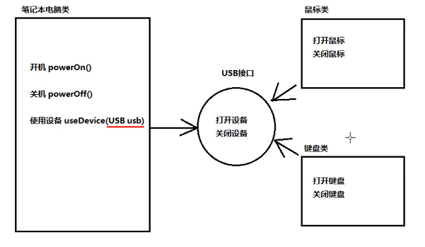

# 第六章 接口、lambda表达式与内部类

到目前为止，你已经学习了Java中面向对象编程的核心思想：类和继承。本章将介绍几种常用的高级技术。尽管这些内容可能不太容易理解，但一定要掌握，以完善你的Java工具箱。首先介绍第一种技术，即接口(interface)，接口用来描述类应该做什么，而不指定他们具体应该如何做。一个类可是实现(implement)一个接口或多个接口。有些情况可能要求符合这些接口，只要有这种要求，就可以实现了这个接口的类(及实现类)的对象。了解接口以后，再继续介绍lambda表达式，这是一种很简洁的方法，用来创建可以在将来某个时间点执行的代码块。通过使用lambda表达式，可以用一种精巧而简洁的方式表示使用回调或可变行为的代码。

接下来，我们将讨论内部类(inner class)机制。理论上讲，内部类有些复杂，内部类定义在另外一个类的内部，它们的方法可以访问包含它们的外部类的字段。内部类技术在设计具有相互协作关系的类集合时很有用。

在本章的最后还将介绍代理(proxy)，这是一种实现任意接口的对象。代理是一种非常专业的构造工具，可以用来构建系统级的工具。第一次阅读本书时可以先跳过那一节。

## 6.1 接口

### 6.1.1 接口的概念

在Java程序设计语言中，接口不是类，而是对希望符合这个接口的类的一组需求。

我们经常听到服务提供商这样说：“如果你的类符合某个特定接口，我们就会履行这项服务。”下面给出一个具体示例。Array类中的sort方法承诺可以对对象数组进行排序，但要求满足下面这个条件：对象所属的类实现Comparable接口。

```java
public interface Comparable
{
    int compareTo(Object other);
}
```

这说明，任何实现Comparable接口的类都需要包含compapreTo方法，这个方法有一个Object参数，并且返回一个整数。

接口中的所有方法都是自动public方法。因此，在接口中声明方法时，不必提供关键字public。

当然，这个接口还有一个没有明确说明的附加要求：在调用x.compareTo(y)的时候，这个compareTo方法必须确实能够比较两个对象，并返回比较结果，即x和y哪一个更大 。当x小于y时返回一个负数；当x等于y时，返回0；否则返回一个正数。

上面这个接口只有一个方法，而有些接口可能包含多个方法。稍后可以看到，接口还可以定义常量。不过，更重要的是要知道接口不能提供什么。接口绝不会有实例字段，在Java8之前，接口绝对不会实现方法。

提供实例字段和方法实现的任务应该由实现接口的那个类来完成。因此，可以将接口看成是没有实例字段的抽象类。但是这两个概念还是有一定区别的，稍后将会给出i详细的解释。

现在，假设希望使用Arrays类的sort方法对Employee对象数组进行排序，Employee类就必须实现Comparable接口。

 <!-- more --> 

为了实现一个接口，通常需要完成下面两个步骤：

* 将类声明为实现给定的接口；
* 对接口中的所有方法提供定义

要将类声明为实现某个接口，需要使用关键字implements：

```java
class Employee implements Comparable
```

当然，这里的Employee类需要提供compareTo方法。假设希望根据员工的薪水进行比较。以下是compareTo方法的实现：

```java
public int compareTo(Object otherObject)
{
    Employee other = (Employee) otherObject;
    return Double.compare(salary,other.salary);
}
```

这里，我们使用了静态Double.compare方法。如果第一个参数小于第二个参数，它会返回一个负值；如果二者相等则返回0；否则返回一个正值。

我们可以做的更好一些，可以为泛型Comparable接口提供一个类型参数

```java
class Employee implements Comparable<Employee>
{
    public int compareTo(Employee other)
    {
        return Double.compare(salary,other.salary);
    }
    ...;
}
```

请注意，对Object参数进行类型转换总是让人感觉不太顺眼，但现在已经不见了。

现在，我们已经看到，要让一个类使用排序服务必须让它实现compareTo方法。这是理所当然的，因为要向sort方法提供对象的比较方式。但是为什么不能在Employee类中直接提供一个compareTo方法，而必须实现Compareble接口呢？

主要在于Java程序设计语言是一种强类型(strongly typed)语言。在调用方法的时候，编译器要能检查这个方法确实存在。在sort方法中可能会有下面这样的语句：

```java
if(a[i].compareTo(a[j]) > 0)
{
    ...;
}
```

编译器必须确认a[i]一定有一个compareTo方法。如果a是一个Comparable对象的数组，就可以确保拥有compareTo方法，因为每个实现Comparable接口的类都必须提供这个方法的定义。

```java
package com.NoTrouble.interfaces;

import java.util.Arrays;

public class EmployeeSortTest
{
    public static void main(String[] args)
    {
        Employee[] staff = new Employee[3];

        staff[0] = new Employee("Harry hacker",35000);
        staff[1] = new Employee("Carl Cracker",75000);
        staff[2] = new Employee("Tony Tester",38000);

        Arrays.sort(staff);
        for (Employee e : staff)
        {
            System.out.println("name =" + e.getName() + ",salary = " + e.getSalary());
        }
    }
}
```

```java
package com.NoTrouble.interfaces;

public class Employee implements Comparable<Employee>
{
    private String name;
    private double salary;

    public Employee(){}

    public Employee(String name, double salary)
    {
        this.name = name;
        this.salary = salary;
    }

    public String getName()
    {
        return this.name;
    }

    public double getSalary()
    {
        return this.salary;
    }

    public void raiseSalary(double byPercent)
    {
        double raise =  this.salary * byPercent / 100;
        this.salary += raise;
    }

    public int compareTo(Employee other)
    {
        return Double.compare(this.salary,other.salary);
    }

}
```

如何定义一个接口的格式：public interface 接口名字{ // 接口内容} 【备注：换成关键字interface之后，编译生成的字节码文件仍然是.java –> .class】

### 6.1.2 接口的属性

接口不是类。具体来说，不能使用new运算符实例化一个接口：

```java
x = new Comparable(...);//ERROR
```

不过，尽管不能构造接口的对象，却能声明接口的变量:

```java
Comparable x;//OK
```

接口变量必须引用实现了这个接口的类对象：

```java
x = new Employee(...);//OK provided Employee inplements Compaprable
```

接下来，如同使用instanceof检查一个对象是否属于某个特定类一样，也可以使用instanceof检查一个对象是否实现了某个特定的接口：

```java
if(anObject instanceof Comparable){...}
```

与建立类的继承层次一样，也可以扩展接口。这里允许有多条接口链，从通用性较高的接口扩展到专用性较高的接口。例如，假设有一个名为Moveable的接口：

```java
public interface Moveable
{
    void move(double x, double y);
}
```

然后，可以假设一个名为Powered的接口扩展了以上Moveable的接口：

```java
public interface Powered extends Moveable
{
    double milesPerGallon();
}
```

虽然在接口中不能包含实例字段，但是可以包含常量。例如：

```java
public interface Powered extends Moveable
{
    double milesPerGallon();
    double SPEED_LIMIT = 95；
}
```

与接口中的方法都自动被设置为public一样，接口中的字段总是public static final。

有些接口只定义常量，而没有定义方法。例如，标准库中的SwingConstants就是这样一个接口，其中只包含NORTH、SOUTH、HORIZONTAL等常量。任何实现SwingConstants接口的类都自动地继承了这些常量，并可以在方法中直接地引用NORTH，而不必采用SwingConstants.NORTH这样繁琐的书写形式。不过，这样使用接口更像是退化，所以我们建议最好不要这样使用。

尽管每个类只能有一个超类，但却可以实现多个接口。这就定义类的行为提供了极大的灵活性。例如，Java程序设计语言有一个非常重要的的内置接口，名为Cloneable。如果某个类实现了这个Cloneable接口，Object类中的clone方法就可以创建你的类对象的一个标准副本。如果希望自己设计的类拥有克隆和比较的能力，只要实现这两个接口就可以了。可以使用逗号将想要实现的各个接口分隔开。

```java
class Employee implements Cloneable, Comparable
```

接口当中的常量：必须使用public static final三个关键字进行修饰。

格式：public static final 数据类型 常量名称 = 数据值；

注意事项：

1.接口中的常量，可以省略public static final；

2.接口中的常量，必须进行赋值：不能不赋值;

3.接口一种常量的名称，使用完全大写的字母，用下划线进行分隔。

```java
public interface MyInterfaceConst
{
    public static final int NUM_OF = 10;//一旦使用final关键字进行修饰，说明不可变
    Syestem.out.println(MyInterfaceConst.NUM_OF);//常量的调用，接口名.常量名
}
```


如果是java7，那么接口中可以包含的内容有：1.常量；2.抽象方法；

如果是java8，还可以额外包含有：3.默认方法；4.静态方法；

如果是java9，还可以额外包含有：5.私有方法

### 6.1.3 接口与抽象类

如果阅读了第五章中有关抽象类的那一节，那就可能会产生这样一个疑问：为什么Java程序设计语言的设计者要那么麻烦地接口概念呢？为什么不将Comparable直接设计成一个抽象类呢？

```java
abstract class Comparable//why NOT?
{
    public abstract int compareTo(Object other);
}
```

这样一来，Employee类只要需要扩展这个抽象类，并提供compareTo方法的实现：

```java
class Employee enxteds Comparable//why NOT?
{
    public int compareTo(Object other){...}
}
```

非常遗憾，使用抽象类表示通用属性存在一个严重的问题。每个类只能扩展一个类。假如设Employee类已经扩展了另外一个类，例如Person，他就不能再扩展第二个类了。

```java
class Employee entends Person, Comparable//ERROR
```

但每个类可以实现多个接口

```java
class Employee extends Person implements Comparable//OK
```

有些程序设计语言(C++)允许一个类有多个超类。我们将这个特性称为多重继承(multiple inheritance)。Java的设计者选择了不支持多重继承，其主要原因是多重继承会让语言变得非常复杂（C++），或者效率会降低(Eiffel)。实际上，接口可以提供多重继承的大多数好处，同时还能避免多重继承的复杂性和低效性。

在任何版本的java中，接口都能定义为抽象方法：

public abstract 返回类型 方法名称(参数列表)；

注意事项：

1.接口当中的抽象方法，修饰符必须是两个固定的关键字public abstract;

2.这两个关键字修饰符可以省略;

3.方法的三要素，可以随意定义；

```java
public interface MyInterfaceAbstract
{
    public abstract void methodAbs1();
    abstract void methodAbs2();
    public void methodAbs3();
    void methodAbs4();
}
```

接口的使用步骤：

* 接口不能直接使用，必须有一个实现类来实现该接口【格式：】public class 实现类名称 implemetns 接口名称{…}
* 接口的实现类必须覆盖重写接口中所有的抽象方法。去掉abstract关键字，加上方法体大括号
* 创建实现类的对象，进行使用。

```java
public class MyInterfaceAbstractImpl implements MyInterfaceAbstract
{
    @Override
    public void methodAbs1()
    {
 		System.out.println("这是第一个方法！");
    }
        @Override
    public void methodAbs2()
    {
        System.out.println("这是第二个方法！");
    }
        @Override
    public void methodAbs3()
    {
        System.out.println("这是第三个方法！");
    }
        @Override
    public void methodAbs4()
    {
        System.out.println("这是第四个方法！");
    }
}
```

```java
public class DemoInterface
{
    public static void main(String[] args)
    {
        MyInterfaceAbstractImpl impl = new MyInterfaceAbstractImpl();
        impl.methodAbs1();
        impl.methodAbs2();
    }
}
```

注意事项：如果实现类并没有覆盖重写接口中所有的抽象方法，那么这个实现类自己就必须是抽象类。

### 6.1.4 静态和私有方法

在Java8中，允许在接口中增加静态方法。理论上讲，没有任何理由认为这是不合法的。只是这有违归于将接口作为抽象规范的初衷。

目前为止，通常的做法都是将静态方法放在伴随类中。在标准库中，你会看到成对出现的接口和实用工具，如Collection/Collections或Path/Paths。

可以由一个URI或者字符串序列构造一个文件或目录的路径，如Paths.get(“jdk-11”,“conf”,”security”)。在java11中，Path接口提供了等价的方法：

```java
public interface Path
{
    public static Path of (URI uri){...}
    public static Path of(String first, String...more){...}
    ...
}
```

这样一来，Paths类就不再是必要的了。

类似地，实现你自己的接口时，没有理由再为实用工具方法另外提供一个伴随类。

在Java9中，接口中的方法可以是private。private方法可以是静态方法或实例方法。由于私有方法只能在接口本身的方法中使用，所以它们的用法很有限，只能作为接口中其他方法的辅助方法。

接口的静态方法：

从java8开始，接口当中允许定义静态方法：

【格式：】public static 返回值类型 方法名称(参数列表)

提示：就是将abstract或者default换成static即可，带上方法体。

```java
public interface MyInterfaceStatic
{
    public static void methodStatic()
    {
        System.out.println("这是接口的静态方法！");
    }
}
```

```java
public class MyInterfaceStaticImpl implements MyInterfaceStatic
{
}
```

注意：不能通过接口实现类的对象来调用接口当中的静态方法。

正确用法：通过接口名称直接调用静态方法。【格式：】接口名.静态方法名(参数)

```java
public class Demo03Interface
{
    public static void main(String[] args)
    {
        MyInterfaceStaticImpl impl = new MyInterfaceStaticImpl();
        
        //错误写法：impl.methodStatic();
        MyInterfaceStatic.methodStatic();
    }
}
```

接口的私有方法：

我们需要抽取一个公有方法，用来解决两个默认方法之间重复代码的问题。但这个公有方法不应该让实现类使用，应该是私有化的。

```java
public interface MyInterfacePrivateA
{
    public default void methodDefault1()
    {
        System.out.println("默认方法1");
        methodCommon();
    }
    
    public default void methodDefault2()
    {
        System.out.println("默认方法2");
        methodCommon();
    }
    
    private void methodCommon()
    {
        System.out.println("AAA");
        System.out.println("BBB");
        System.out.println("CCC");
    }
    
}
```

```java
public interface MyInterfacePrivateB
{
    public static void methodDefault1()
    {
        System.out.println("默认方法1");
        methodCommon();
    }
    
    public static void methodDefault2()
    {
        System.out.println("默认方法2");
        methodCommon();
    }
    
    private static void methodCommon()
    {
        System.out.println("AAA");
        System.out.println("BBB");
        System.out.println("CCC");
    }
    
}
```

从java9开始，接口当中允许定义私有方法：

* 普通私有方法，解决多个默认方法之间重复代码问题；【格式：】private 返回值类型 方法名称(参数列表){方法体}
* 静态私有方法，解决多个静态方法之间重复代码问题。【格式：】private static 返回值类型 方法名称(参数列表){方法体}

### 6.1.5 默认方法

可以为接口方法提供一个默认实现。必须使用default修饰符标记这样一个方法。

```java
public interface Comparable<T>
{
    public default int compareTo(T other)
    {
        return 0;
    }
}
```

当然，这并没有太大用处，因为Comparable的每一个具体实现都会覆盖这个方法。不过有些情况下，默认方法可能很有用。例如，在第九章会看到一个Iterator接口，用于访问一个数据结构中的元素。这个接口声明了remove方法

```java
public interface Iterator<E>
{
    boolean hasNext();
    E next();
    default void remove()
    {
        throw new UnsupportedOperationException("remove");
    }
    ...;
}
```

如果你要实现一个迭代器，就需要提供hasNext和next方法。这些方法没有默认实现——它们依赖于你要遍历访问的数据结构。不过，如果你的迭代器是只读的，就不用操心实现remove方法。

默认方法可以调用其他方法。例如，Collection接口可以定义一个便利方法：

```java
public interface Collection
{
    int size();
    default boolean isEmpty
    {
        return size() == 0;
    }
    ...;
}
```

这样实现Collection的程序员就不再操心实现isEmpty方法了。

默认方法的一个重要用法是“接口演化”(interface evolution)。以Collection为例。这个接口作为Java的一部分已经有很多年了。假设很久以前你提供了这样一个类：

```java
public class Bag implements Colloction
```

后来，在java8中，又为这个接口增加了Stream方法。

假设Stream方法不是一个默认方法，那么Bag类将不能编译，因为它没有实现这个新方法。为接口增加一个非默认方法不能保证“源代码兼容”(source compatible)。不过，假设不重新编译这个类，而只是使用原先的一个包含这个类的JAR文件。这个类仍能正常加载，尽管没有这个新方法。程序仍然可以正常构造Bag实例，不会有意外发生。不过，如果程序在一个Bag实例上调用stream，就会出现一个AbstractMethodError。

将方法实现为一个默认(default)方法就可以解决这两个问题。Bag类又能正常编译了。另外如果没有重新编译而直接加载这个类，并在一个Bag实例上调用stream方法，将调用Collection.stream。

从Java8开始，接口允许定义默认方法。【格式：】public default 返回值类型 方法名称(参数列表){方法体}

接口当中的默认方法，可以解决接口升级的问题。

```java
public interface MyInterfaceDefault
{	
    //抽象方法
    public abstract void methodAbs();
    
    //新添加一个抽象方法,正常情况下需要在类中覆盖重写这个抽象方法
    //public abstract void methodAbs2();
    //新添加的方法，改成默认方法
    public default void methodDefault()
    {
        System.out.println("这是新添加的默认方法");
    }
}
```

```java
public class MyInterfaceDefaultA implements MyInterfaceDefault
{	
    @Override
    public void methodAbs()
    {
        System.out.println("实现了抽象方法AAA")
    }
}
```

```java
public class MyInterfaceDefaultB implements MyInterfaceDefault
{	
    @Override
    public void methodAbs()
    {
        System.out.println("实现了抽象方法BBB")
    }
}
```

```java
public class DemoInterface
{
    public static void main(String[] args)
    {	
        //创建类对象
        MyInterfaceDefaultA a = new MyInterfaceDefaultA();
        a.methodAbs();//调用抽象方法，实际运行的是右侧实现类
        a.methodDefault();//调用默认方法，如果实现类当中没有，会向上找
    }
}
```

接口的默认方法，可以通过接口实现类对象，直接调用。

接口的默认方法，也可以被接口实现类进行覆盖重写。

接口的内容小结：

在java9+，接口的内容有：

1.成员变量其实是常量，【格式：[public] [static] [final] 常量名 = 数据值;】【注意：常量必须进行赋值，而且一旦赋值不能改变；常量名称完全大写，用下划线进行分隔】；

2.接口中最重要的就是抽象方法，【格式：[public] [abstract] 返回值类型 方法名称(参数列表);】【注意：实现类必须覆盖重写接口所有的抽象方法，除非实现类是抽象类】

3.从Java8+开始接口中允许定义默认方法，【格式：[public] default 返回值类型 方法名称(参数列表){方法体}】【注意：默认方法也可以被覆盖重写，若没覆盖，就用接口中的；若被覆盖，就用实现类的】

4.从Java8开始，接口中允许定义静态方法，【格式：[public] static 返回值类型 方法名称(参数列表){方法体}】【注意：应该通过接口名称进行调用，不能通过实现类对象调用接口静态方法】

5.从Java9开始，接口中允许定义私有方法，【格式：普通私有方法——private 返回值类型 方法名称(参数列表){方法体}；静态私有方法——private static 返回值类型 方法名称(参数列表){方法体}；【注意：private的方法只有接口自己才能调用，不能被实现类或别人使用。】

使用接口注意事项：

1.接口不能有静态代码块或构造方法；

2.一个类的直接父类是唯一的，但是一个类可以同时实现多个接口。

3.如果实现类所实现的多个接口当中，存在重复的抽象类，那么只需要覆盖重写一次就行。

4.如果实现类没有覆盖所有接口当中的抽象方法，那么实现类就必须是一个抽象类。

5.如果实现类所实现的多个接口当中，存在重复的默认方法，那么实现类一定要对冲突的默认方法进行覆盖重写

6.一个类如果直接父类当中的方法，和接口当中的默认方法，产生了冲突，优先使用父类的方法

### 6.1.6 解决默认方法冲突

如果先在一个接口中将一个方法定义为默认方法，然后又在超类或另一个接口中定义同样的方法，会发生什么情况？Java的相应规则如下：

* 1.超类优先。如果超类提供了一个具体方法，同名而且有相同参数的默认方法会被忽略。
* 2.接口冲突。如果一个接口提供一个默认方法，另一个接口提供了一个同名而且参数类型相同的方法，必须覆盖这个方法来解决冲突。

```java
interface Person
{
    default String getName()
    {
        return "";
    }
}
interface Named
{
    default String getName()
    {
        return getClass().getName() + "_" + hashCode();
    }
}
```

如果有一个类同时实现了这两个接口会怎么样呢？

```java
class Student implements Person, Named
{
    ...;
}
```

类会继承Person和Named接口提供的两个不一致的getName方法。并不是从中选择一个，Java编译器会报告一个错误，让程序员来解决这个二义性问题。只需要在Student类中提供一个getName方法即可。在这个方法中，可以选择两个冲突方法中的一个：

```java
class Student implements Person, Named
{
    public String getName()
    {
        return Person.super.getName();
    }
    ...;
}
```

现在假设Named接口没有为getName提供默认实现：

```java
interface Named
{
    String getName();
}
```

Student类会从Person接口继续继承默认方法么？不过Java设计者更强调一致性。两个接口如何冲突并不重要。如果至少有一个接口提供了一个实现，编译器就会报告错误，程序员就必须解决这个二义性。

我们只讨论了两个接口的命名冲突。现在来考虑另外一种情况，一个类扩展了一个超类，同时实现了一个接口，并从超类和接口继承了相同的方法。例如，假设Person是一个类，Student定义为：

```java
class Student extends Person implements Named
{
    ...;
}
```

在这种情况下，只会考虑超类方法，接口的所有默认方法都会被忽略。在我们的例子中，Student从Person继承了getName方法，Named接口是否为getName提供提供了默认实现并不会带来什么区别。这正是“类优先”规则。

“类优先”规则可以确保与Java7的兼容性。如果为一个接口增加默认方法，这对于有些默认方法之前能正常工作的代码不会有任何影响。

接口当中的继承:

1.类与类之间是单继承的.直接父类只能有一个

2.类与接口之间是多实现的。一个类可以实现多个接口

3.接口与接口之间是多继承的。

```java
public interface MyInterface extends MyInterfaceA, MyInterfaceB
{
    public abstract void method();
}
```

```java
public interface MyInterfaceA
{
    public abstract void methodA();
    public abstract void Common();
}
```

```java
public interface MyInterfaceB
{
    public abstract void methodB();
    public abstract void Common();
}
```

这个子接口当中有几个方法？4个

注意事项：

1.多个父接口当中的抽象方法如果重复，没关系。

2.多个父接口当中的默认方法如果重复，有关系，那么子接口必须进行默认方法的覆盖重写，而且要带着default关键字。


接口多态的综合案例：进行描述笔记本类，实现笔记本使用USB鼠标、USB键盘：

* USB接口，包含打开设备、关闭设备功能
* 笔记本类，包含开机功能、关机功能、使用USB设备功能
* 鼠标类，实现USB接口，并具备点击的方法
* 键盘类，实现USB接口，具备敲击的方法



```java
package com.NoTrouble.interfaces;

public interface USB
{
    public abstract void open();

    public abstract void close();
}
```

```java
package com.NoTrouble.interfaces;

public class Mouse implements USB
{
    @Override
    public void open()
    {
        System.out.println("打开鼠标！");
    }

    @Override
    public void close()
    {
        System.out.println("关闭鼠标！");
    }

    public void click()
    {
        System.out.println("鼠标点击！");
    }
}
```

```java
package com.NoTrouble.interfaces;

public class Keyboard implements USB
{
    @Override
    public void open()
    {
        System.out.println("打开键盘！");
    }

    @Override
    public void close()
    {
        System.out.println("关闭键盘！");
    }

    public void type()
    {
        System.out.println("敲击键盘！");
    }
}
```

```java
package com.NoTrouble.interfaces;

public class Laptop
{
    public void powerOn()
    {
        System.out.println("开机");
    }

    public void powerOff()
    {
        System.out.println("关机！");
    }

    //使用USB设备的方法，使用接口作为参数
    public void useDevice(USB usb)
    {
        usb.open();
        if (usb instanceof Mouse)
        {
            ((Mouse) usb).click();
        }else if (usb instanceof Keyboard)
        {
            ((Keyboard)usb).type();
        }
        usb.close();
    }
}
```

```java
package com.NoTrouble.interfaces;

public class LaptopTest
{
    public static void main(String[] args)
    {
        //创建一个笔记本
        Laptop computer = new Laptop();

        //开机
        computer.powerOn();

        //准备一个鼠标，供电脑使用
        Mouse mouse = new Mouse();

        //使用鼠标
        computer.useDevice(mouse);
        //使用键盘
        Keyboard keyboard = new Keyboard();
        computer.useDevice(keyboard);
        
        computer.powerOff();
    }
}
```


### 6.1.7 接口与回调

回调(callback)是一种常见的程序设计模式。在这种模式中，可以指定某个特定事件发生时应该采取的动作。例如，按下鼠标或选择某个菜单项时，你可能希望完成某个特定的动作。不过，由于至此还没有介绍如何实现用户界面，所以只能讨论一种与此类似但更简单的情况。

在java.swing包中有一个Timer类，如果希望经过一定时间间隔就得到通知，Timer类就很有用。例如，假如程序中有一个时钟，可以请求每秒通知一次，以便更新时钟的表盘。

构造定时器时，需要设置一个时间间隔，并告诉定时器经过这个时间间隔时需要做些什么。

如何告诉定时器要做什么呢？在很多程序设计语言中，可以提供一个函数名，定时器要定期地调用这个函数。但是，Java标准类库中的采用的是面向对象方法。你可以向定时器传入某个类的对象，然后，定时器调用这个对象的方法。由于对象可以携带一些附加的信息，所以传递一个对象比传递一个函数要灵活的多。

### 6.1.8 Comparator 接口

6.1.1节中，我们已经了解了如何对一个对象数组进行排序，前提是这些对象是实现了Comparable接口的类的实例。例如，可以对一个字符串数组进行排序，因为String类实现了Comparable\<String>，而且String.compareTo方法可以按字典顺序比较字符串。

现在假设我们希望按长度递增的顺序对字符串进行排序，而不是按字典顺序进行排序。肯定不能让String类用两种不同的方式实现compareTo方法——更何况，String类也不应由我们来修改。

要处理这种情况，Arrays.sort方法还有第二个版本，有一个数组和一个比较器（comparator）作为参数，比较器是实现了Comparator接口的实例。

```java
public interface Comparator<T>
{
    int compare(T first, T second);
}
```

要按长度比较字符串，可以如下定义一个实现Comparator\<String>的类：

```java
class LengthComparator implements Comparator<String>
{
    public int compare(String first, String second)
    {
        return first.length() - second.length();
    }
}
```

具体完成比较时，需要建立一个实例：

```java
LengthComparator comp = new LengthComparator();
if(comp.compare(words[i],words[j]) > 0)
{
    ...;
}
```

将这个调用与word[i].compareTo(words[j])进行比较。这个compare方法要在比较器对象上调用，而不是在字符串本身上调用。

要对一个数组排序，需要为Arrays.sort方法传入一个LengthComparator对象：

```java
String[] friends = {"Peter","Paul","Mary"};
Arrays.sort(friends, new LengthComparator());
```

现在这个数组可能是["Paul","Mary","Peter"]或["Mary”,"Paul","Peter"]。

### 6.1.9 对象克隆

本节我们会讨论Cloneable接口，这个接口指示一个类提供了一个安全的clone方法。由于克隆并不太常见，而且有关的细节技术性很强，你可能只是想稍做了解，等真正需要时再深入学习。

要了解克隆的具体含义，先来回忆为一个包含对象引用的变量建立副本时会发生什么。原变量和副本都是同一对象的引用。这说明，任何一个变量改变都会影响另一个变量。

```java
Employee original = new Employee("John Public",50000);
Employee copy = original;
copy.raiseSalary(10);//oops- -also changed original
```

如果希望copy是一个新对象，它的初始状态与original相同，但是之后它们各自会有自己不同的状态，这种情况下就要使用clone方法。

```java
Employee copy = original.clone();
copy.raiseSalary(10);//OK- -original unchanged
```

不过并没有这么简单。clone方法是Object的一个protected方法，这说明你的代码不能直接调用这个方法。只有Employee类可以克隆Employee对象。这个限制是有原因的。想想看Object类如何实现clone。它对于这个对象一无所知，所以只能逐个字段地进行拷贝。如果对象中所有数据字段都是数值或其他基本类型，拷贝这些字段没有任何问题。但是如果对象包含子对象的引用，拷贝字段就会得到相同子对象的引用，拷贝字段就会得到相同子对象的另一个引用，这样一来，原对象和克隆的对象仍然会共享一些信息。

默认的克隆操作是“浅拷贝”，并没有克隆对象中的引用的其他对象。浅拷贝会有什么影响？这要看具体影响？这要看具体情况。如果原来对象和浅克隆对象共享的子对象是不可变的，那么这种共享就是安全的。如果子对象属于一个不可变列的类，如String，就是这种情况。或者在对象的生命周期中，子对象一直包含不变的常量，没有更改器方法会改变它，也没有方法会生成它，这种情况下同样是安全的。

不过，通常子对象都是可变的，必须重新定义clone方法来建立一个深拷贝(deep copy)，同时克隆所有子对象。在这个例子中，hireDay字段是一个Date，这是可变的，所以它必须克隆。

对于每个类，需要确定：

* 默认的clone方法是否满足要求；
* 是否可以在可变的子对象上调用clone来修补默认的clone方法；
* 是否不该使用clone；

实际上第三个选项是默认选项。如果选择第一项或第二项，类必须：

* 实现Cloneable接口；
* 重新定义clone方法，并指定public访问修饰符

在这里，Cloneable接口的出现与接口的正常使用并没有关系。具体来说，他并没有指定clone方法，这个是从Object类继承的。这个接口只是作为一个标记，指示类设计者了解克隆过程。对象对于克隆很“偏执”，如果一个对象请求克隆，但是没有实现这个接口，就会产生一个检查型异常。

必须当心子类的克隆。例如，一旦Employee类定义了clone方法，任何人都可以用它来克隆Manager对象。Employee克隆方法能完成工作吗？这取决了Manager类的字段。在这里是没有问题的，因为bonus字段是基本类型。但Manager可能会有需要拷贝或不可克隆的字段。不能保证子类的实现者一定会修正clone方法让它正常工作。出于这个原因，在Object类中clone方法声明为protected。不过，如果你希望类用户调用clone，就不能这样做。

要不要在自己的类中实现clone呢？如果你的客户需要建立深拷贝，可能就需要实现这个方法。有些人认为应该完全避免使用clone，而实现另一个方法来达到同样的目的。clone相当笨拙，这一点我们也同意，不过如果让另一个方法来完成这个工作，还是会遇到同样的问题。毕竟，克隆没有你想象中那么常用。标准类中只有不到5%的类实现了clone。

```java
package com.NoTrouble.clone;

import sun.util.calendar.Gregorian;

import java.util.Date;
import java.util.GregorianCalendar;

public class Employee implements Cloneable
{
    private String name;
    private double salary;
    private Date hireDay;

    public Employee(){}

    public Employee(String name, double salary)
    {
        this.name = name;
        this.salary = salary;
        this.hireDay = new Date();
    }

    @Override
    public Employee clone() throws CloneNotSupportedException
    {
        Employee clone = (Employee)super.clone();

        clone.hireDay = (Date)hireDay.clone();

        return clone;
    }

    public void setHireDay(int year, int month, int day)
    {
        Date newHireDay = new GregorianCalendar(year,month - 1, day).getTime();

        this.hireDay.setTime(newHireDay.getTime());
    }

    public void raiseSalary(double byPercent)
    {
        double raise = this.salary * byPercent / 100;
        this.salary += raise;
    }

    @Override
    public String toString()
    {
        return "Employee[name=" + this.name + ",salary=" + this.salary + ",hireDay=" + this.hireDay + "]";
    }

}
```

```java
package com.NoTrouble.clone;

public class CloneTest
{
    public static void main(String[] args)throws CloneNotSupportedException
    {
        Employee original = new Employee("John Q. Public",5000);
        original.setHireDay(2000,1,1);
        Employee copy = original.clone();
        copy.raiseSalary(10);
        copy.setHireDay(2002,12,31);
        System.out.println("original" + original);
        System.out.println("copy" + copy);

    }
}
```

## 6.2 lambda 表达式

### 6.2.1 为什么引入lambda表达式

lambda表达式是一个可传递的代码块，可以以后执行一次或多次。下面先退一步，观察一下我们在Java中的哪些地方用过这种代码块。

在6.1.4节中，你已经了解如何按指定时间间隔完成工作。将这个工作放在一个ActionListener的actionPerformed方法中：

```java
class Woker implements ActionListence
{
    public void ationPerformed(ActionEvent event)
    {
        //do some work
    }
}
```

想要反复执行这个代码，可以构造Worker类的一个实例。然后把这个实例提交到一个Timer对象。

这里重点是actionPerformed方法包含希望以后执行的代码。

或者可以考虑如何使用一个定制比较器完成排序。如果想长度而不是默认的字典顺序对字符进行排序，可以向sort方法传入一个Comparator对象：

```java
class LengthComparator implements Comparator<String>
{
    public int compare(Stirng first, String second)
    {
        return first.length - second,lentgh;
    }
}
...;
Arrays.sort(Strings, new LengthComparator);
```

compare方法不是立即调用。实际上，在数组完成排序之前，sort方法会一直调用compare方法，只要元素的顺序不正确就会重新排列元素。将比较元素所需的代码段放在sort方法中，这个代码将其余的排序逻辑集成(你可能不打算重新实现其余的这部分逻辑)。

这两个例子有一些共同点，都是讲一个代码块传递到某个对象。这个代码块会在将来某个时间调用。

到目前为止，在Java中传递一个代码段并不容易，你不能直接传递代码段。Java是一种面向对象语言，所以必须构造一个对象，这个对象的类需要有一个方法包含所需的代码。

### 6.2.2 lambda 表达式的语法

再来考虑上一节讨论的排序例子。我们传入代码来检查一个字符串是否比另一个字符串短。这里计算：

```java
first.length() - second.length();
```

first和second是什么？他们都是字符串。Java是一种强类型语言，所以我们还要指定它们的类型：

```java
(String first, String second)
 -> first.length() - second.length()
```

这就是你看到的第一个lambda表达式。lambda表达式就是一个代码块，以及必须传入代码的变量规范。

你已经见过java中的一种lambda表达式形式：参数，箭头(->)以及一个表达式。如果代码要完成的计算无法放在一个表达式中，就可以像写方法一样，把这些代码放在{}中，并包含显示的的return语句。例如：

```java
(String first, String second) ->
{
    if(first.length() < second.length()) return -1;
    else if(first.length() > second.length) return 1;
    else return 0;
}
```

即使lambda表达式没有参数，仍然要提供括号，就像无参数方法一样：

```java
() -> {for(int i = 100l i >= 0; i--) System.out.println(i);}
```

如果可以推导出一个lambda表达式的参数类型，则可以忽略其类型。例如：

```java
Comparator<String> comp
    = (first, second)//same as (String first, String second)
    -> first.length() - second.length()
```

在这里，编译器可以推导出first和second必然是字符串，因为这个lambda表达式将赋给一个字符串比较器。

如果方法只有一个参数，而且这个参数的类型可以推导得出，那么甚至还可以省略小括号：

```java
ActionListener listener = event ->
    System.out,println("The time is"
    + Instant.ofEpochMilli(event,getWhen()));
```

无需指定lambda表达式的返回类型。lambda表达式的返回类型总是会由上下文推导得出。例如，下面的表达式：

```java
(String first, String second) -> first.length() - second.length()
```

可以在需要int类型结果的上下文中使用。

```java
package com.NoTrouble.lambda;

import javax.swing.*;
import javax.swing.Timer;
import java.util.Arrays;
import java.util.Date;

public class LambdaTest
{
    public static void main(String[] args)
    {
            String[] plants = new String[]{"Mercury","Venus","Earth","Mars","Jupiter","Saturn","Uranus","Neptune"};
        System.out.println(Arrays.toString(plants));
        System.out.println("Sorted in dictionary order");
        Arrays.sort(plants);
        System.out.println(Arrays.toString(plants));
        System.out.println("Sorted by length:");
        Arrays.sort(plants,(first,second)->first.length() - second.length());
        System.out.println(Arrays.toString(plants));

        Timer timer = new Timer(1000,e ->
                System.out.println("The time is" + new Date()));
        timer.start();
        JOptionPane.showMessageDialog(null,"Quit program?");
        System.exit(0);
    }
}
```

### 6.2.3 函数式接口

对于只有一个抽象方法的接口，需要这种接口的对象时，就可以提供一个lambda表达式。这种接口称为函数式接口(functional interface)。

为了展示如何转换为函数式接口，下面考虑Arrays.sort方法。它的第二个参数需要一个Cmparator实例，Comparator就是只有一个方法的接口，所以可以提供一个lambda表达式：

```java
Arrays.sort(words,(first, second) -> first.length() - second.length());
```

在底层，Arrays.sort方法会接受实现了<Comparator\<String>的某个类的对象。在这个对象上调用compare方法会执行这个lambda表达式的体。这些对象和类的管理完全取决于具体实现，与传统的内联类相比，这样可能要高效得多。最好把labmda表达式看作一个函数，而不是对象，另外要接受lambda表达式可以传递到函数式接口。

lambda表达式可以转换为接口，这一点让lambda表达式很有吸引力。具体的语法很简短。

```java
Timer timer = new Timer(1000,e ->
                        {
                            System.out.println("AT the tone, the time is" + Instant.ofEpochMilli(e.getWhen()));
Toolkit.getDefaultTookit().beep();
                        })
```

与使用实现了ActionListener接口的类相比，这段代码的可读性要好得多。

实际上，在Java中，对lambda表达式所能做的也只是转化为函数式接口。在其他支持函数字面量的程序设计语言中，可以声明函数类型(如(String, String) -> int)，声明这些类型的变量，还可以使用变量保存函数式表达式。不过，Java设计者还是决定保持我们熟悉的接口的概念，没有为Java语言增加函数类型。

Java API 在java.util.function包中定义了很多非常通用的函数式接口。其中一个接口BiFunction<T,U,R>描述了参数类型为T和U而且返回类型为R的函数。可以把我们的字符串比较lambda表达式保存在这个类型的变量中：

```java
BiFunction<String, String, Integer>comp
    = (first,second) -> first.length() - second.length();
```

### 6.2.4 方法引用

### 6.2.5 构造器引用

### 6.2.6 变量作用域

### 6.2.7 处理lambda表达式

### 6.2.8 再谈Comparator

## 6.3 内部类

内部类(inner class)是定义在另外一个类中的类。为什么需要使用内部类呢？主要有两个原因：

* 内部类可以对同一个包中的其他类隐藏。
* 内部类方法可以访问这个类的作用域中的数据，包括原本私有数据。

内部类原先对于简洁地实现回调非常重要。不过如今lambda表达式在这方面可以做得更好。但内部类对于构建代码还是很有用的。

内部类的分类：

1.成员内部类

2.局部内部类(包含匿名内部类)

### 6.3.1 使用内部类访问对象状态

内部类的语法复杂。鉴于此情况，我们选择一个简单但不太实用的例子来说明内部类的使用。我们将重构TimerTest实例，抽象出一个TalkingClock类。构造一个语音时钟需要提供两个参数：发出通知的间隔和开关铃声的标志。

```java
public class TalkingClock
{
    private int interval;
    private boolean beep;
    
    public TalkingClock(int interval, boolean beep){...}
    public void start(){...}
    
    public class TimePrint implements ActionListener
    {
        // an inner class
    }
}
```

需要注意的，这里的TimePrinter类位于TalkingClock类内部。这并不意味着每个TalkingClock都有一个TimePrinter实例字段。如前所示，TimePrinter对象是由Talkingclock类的方法构造的。

下面是TimePrinter类的详细内容。需要注意的一点，actionPerformed方法在发出铃声之前会检查beep标志。

```java
public class TimePrint implements ActionListener
{
    public void actionPerformed(ActionEvent event)
    {
        System.out.println("At the tone, the time is" + Instant,ofEpochMilli(event.getWhen()));
        if(beep)
        {
            Toolkit.getDefaultToolkit().beep();
        }
    }
}
```

令人惊讶的事情发生了。TimePrinter类没有实例字段或者名为beep的变量，实际上，beep指示TalkingClock对象中创建这个TimePrinter的字段。可以看到，一个内部类方法可以访问自身的数据字段，也可以访问创建它的外围对象的数据字段。

为此，内部类的对象总有一个隐式引用，指向创建它的外部类对象。

这个引用在内部类的定义是不可见的。不过，为了说明这个概念，我们将外围类对象的引用称为outer。于是actionPerformed方法将等价于以下代码：

```java
public void actionPerformed(ActionEvent event)
{
    System.out.println("At the tone,the time is" + Instant.ofEpochMilli(event.getWhen()));
    if(outer.beep)
    {
        Toolkit.getDefaultToolkit().beep();
    }
}
```

外围类的引用在构造器中设置。编译器会修改所有内部类构造器，添加一个对应外围类引用的参数。因为TimePrinter类没有定义构造器，所有编译器为这个类生成了无参数构造器，生成的代码如下：

```java
public TimePrinter(TalkingClock clock)
{
    outer = clock;
}
```

再次强调，注意outer不是java关键字。我们只是用它说明内部类的有关机制。在start方法中构造了一个TimePrinter对象后，编译器就会将当前语音时钟的this引用传递给这个构造器：

```java
TimePrinter listener = new TimePrinter(this);
```

```java
package com.NoTrouble.innerClass;

import javax.swing.*;
import java.time.*;
import java.awt.*;
import java.awt.event.*;


public class InnerClassTest
{
    public static void main(String[] args)
    {
        TalkingClock clock = new TalkingClock(1000,true);

        clock.start();

        JOptionPane.showMessageDialog(null,"QUIT program?");
        System.exit(0);
    }
}

class TalkingClock
{
    private int interval;
    private boolean beep;

    public TalkingClock(int interval, boolean beep)
    {
        this.interval = interval;
        this.beep = beep;
    }

    public void start()
    {
        TimePrinter listener = new TimePrinter();
        Timer timer = new Timer(interval,listener);
    }

    public class TimePrinter implements ActionListener
    {
        public void actionPerformed(ActionEvent event)
        {
            System.out.println("At the tone, the time is" + Instant.ofEpochMilli(event.getWhen()));
            if (beep)Toolkit.getDefaultToolkit().beep();
        }
    }
}
```

成员内部类的定义格式：

```java
修饰符 class 类名称{
	修饰符 class 内部类名称{
        ...;
	}
    ...;
}
```

### 6.3.2 内部类的特殊语法规则

在上一节，我们解释了内部类有一个外围类的引用，我们把它叫做outer。事实上，使用外围类引用的正规语法还要复杂一些。表达式

```java
OuterClass.this
```

表示外围类引用。例如，可以像下面这样编写TimePrinter内部类的actionPerformed方法：

```java
public void actionPerformed(ActionEvent event)
{
    ...;
    if(TalkingClock.thi.beep) Toolkit.egtDefaultToolkit().beep();
}
```

可以采用以下语法更加明确的编写内部类对象的构造器：

outerObject.new.InnerClass(constrution parameters)

例如：

```java
ActionListener listener = this.new TimePrinter();

TalkingClock jabberer = new TalkingClock(1000,true);
TalkingClock.TimePrinter listener = jabberer.new TimePrinter();
```

在外围类的作用于之外，可以这样引用内部类；

```java
OuterClass.InnerClass
```

注意：内用外，随意访问；外用内，需要内部类对象。

```java
public class Body//外部类
{
    private String name;
    
    public class Heart//成员内部类
    {
        public void beat()//内部类的方法
        {
            System.out.println("心脏跳动！");
            System.out.println("我叫：" + this.name);
        }
    }
    public void methodBody()
    {
        System.out.println("外部类的方法");
        new Heart().beat();
    }
    
    public String getName()
    {
        return this.name;
    }
    
    public void setName(String name)
    {
        this.name = name;
    }
}
```

```java
public class InnerClassTest
{
    public static void main(String[] args)
    {
        Body body = new Body;//外部类的对象
        body.methodBody();//通过外部类的对象，调用外部类的方法，里面间接使用了内部类Heart
        
        Body.Heart heart = new Body().new hear();
        heart.beat();
    }
}
```

如何使用内部类？有两种方式：

1.间接方式：外部类的方法当中使用内部类；然后main只是调用外部类的方法。

2.直接方式：公式：外部类名称.内部类名称 对象名 = new 外部类名称().new内部类名称()；

内部类的同名变量访问：

如果出现了重名现象：外部类名称.this.外部类成员变量名

```java
public class Outer
{
    int num = 10;//外部类成员变量
    
    public class Inner//
    {
        int num = 20;//内部类成员变量
        
        public void methodInner()
        {
            int num = 30;//内部类方法的局部变量
            System.out.println(num);//30,局部变量，就近原则
            System.out.println(this.num);//内部类的成员变量
            System.out.println(Outer.this.num);//外部类的成员变量
        }
    }
}
```


### 6.3.3 内部类是否有用、必要和安全

不能否认，内部类的语法很有复杂。它与访问控制和安全性等其他语言特性没有明显的关联。

需要指出，内部类是一个编译器现象，与虚拟机无关。编译器将会把内部类转换为常规的类文件，用\$(美元符号)分隔外部类名与内部类名，而虚拟机则对此一无所知。

例如，TalkingClock类内部的TimePrinter类被转换文件TalkingClock$TimePrinter.class。

### 6.3.4 局部内部类

如果仔细查看TalkingClock示例的代码，就会发现，类型TimePrinter的名字只出现了一次：只是在start方法中创建这个类型的对象时使用一次。

当遇到这类情况时，可以在一个方法中局部地定义这个类。

```java
public void start()
{
    class TimePrinter implements ActionListener
    {
        System.out.println("At the tone, the time is" + Instant.ofEpochMilli(event,getWhen()));
        if(beep) Toolkit.getDefaultTookit().beep();
    }
}
```

声明局部类时不能有访问修饰符(public ,private)。局部类的作用域被限定在声明这个局部类的块中。局部类有一个很大的优势，即对外部世界完全隐藏，甚至TalkingClock类中的其他代码也不能访问它。除start方法之外，没有任何方法知道TimePrinter类的存在。

局部内部类：

如果一个类定义在一个方法内部，那么就是一个局部内部类

局部：只有当前所属的方法才能使用它，出了这个方法外就不能使用了！

定义格式：

```java
修饰符 class 外部类名称
{
    修饰符 返回值类型 外部方法名(参数列表)
    {
        class 局部内部类名称
        {
            ...;
        }
    }
}
```

```java
public class Outer
{
    public void methodOuter()
    {
        class Inner
        {
            int num = 10;
            public void methodInner()
            {
                system.out.println(num);
            }
        }
        
        Inner inner = new Inner();
        inner.methodInner();
    }
}
```

小结一下类的权限修饰符：public > protected>(default)>private

定义一个类的时候，权限修饰符的规则是：

1.外部类：public / (defalut)

2.成员内部类：public / protected / default / private

3.局部内部类：什么都不能写

使用内部类的final问题：

局部内部类，如果希望访问所在方法的局部变量，那么这个局部变量必须是有效final的。

从java8+开始，只要局部变量事实不变，那么final关键字可以省略。

```java
public class Myouter
{
    public void methodOuter()
    {
        int num = 10;//final int num = 10;
        num = 20;
        
        class MyInner
        {
            public void methoInner()
            {
                System.out.println(num);//错误了
            }
        }
    }
}
```


### 6.3.5 由外部方法访问变量

与其他内部类相比，局部类还有一个优点。它们不仅能够访问外部类的字段，话可以访问局部变量！不过，那些局部变量！不过，那些局部变量必须是事实最终变量(effectively final)。这说明，他们一旦赋值就绝不会改变。

下面是一个典型的示例。这里，将TalkingClock构造器的参数interval和beep移至start方法。

```java
public void start(int interval, boolean beep)
{
    class TimePrinter implements ActionListener
    {
        System.out.println("At the tone, the time is" + Instant.ofEpochMilli(event.getWhen()));
        if(beep) Toolkit.getDefaultToolkit().beep();
    }
    
    TimePrinter listener =  new TimePrinter();
    Timer timer = new Timer(interval,listener);
    time.start();
}
```

请注意，TalkingClock类不再需要存储实例变量beep；它只是引用start方法中的beep参数变量。

这看起来好像没什么值得大惊小怪的。代码行if(beep)…

毕竟最后会在start方法内部，为什么不能访问beep变量的值呢？

仔细考察这个控制流程：

* 调用start方法
* 调用内部类TimePrinter的构造器，以便初始化对象变量listener
* listener引用传递给Timer构造器，定时器开始计数，start方法退出。此时，start方法的beep参数变量不复存在
* 1秒后，actionPerformed方法执行if(beep)…

### 6.3.6 匿名内部类

使用局部内部类时，通常还可以再进行一步。假如只想创建这个类的一个对象，甚至不需要为类指定名字。这样一个类被称为匿名内部类(anonymous inner class)。

```java
public void start(int interval, boolean beep)
{
    AcitionListenner listener = new ActionListenner()
    {
        public void actionPerformed(ActionEvent event)
        {
            System.out.println("At the tone, the time is" + Instant.ofEpochMilli(event.getWhen()));
            if(beep) Toolkit.getDefaultToolkit().beep();
        }
    };
    Timer timer = new Timer(interval, listener);
    timer.start();
}
```

这个语法确实晦涩难懂。它的含义是：创建一个类的新对象，这个类实现了ActionListenner接口，需要实现的方法actionPerformed在括号{}内定义。

一般地，语法如下：

```java
new SuperType(construction parameters)
{
    inner class methods and data
}
```

其中，SuperType可以是接口，如ActionListenner，如果是这样，内部类就要实现这个接口。SuperType也可以是一个类，如果是这样，内部类就要扩展这个类。

由于构造器的名字必须与类名相同，而匿名类内没有类名，所以，匿名内部类不能有构造器。实际上，构造器参数要传给超类(superclass)构造器。具体地，只要内部类实现一个接口，就不能有任何构造参数。不过，仍然要提供一组小括号，如下所示：

```java
new InterfaceType()
{
    methods and data;
}
```

必须仔细研究构造一个类的新对象与构造一个扩展了那个类的匿名内部类的对象之间有什么差别。

```java
Person queen = new Person("mary");// a Person object
Person count = new Person("Dracula")// an object of an inner class extending Person
{
    ...
};
```

如果构造参数列表的结束小括号后面跟一个开始打括号，就是在定义匿名内部类。

```java
package com.NoTrouble.anonymousInner;


import javax.swing.*;
import java.awt.*;
import java.awt.event.ActionEvent;
import java.awt.event.ActionListener;
import java.time.Instant;


public class AnonymousInnerClassTest
{
    public static void main(String[] args)
    {
            TalkingClock clock = new TalkingClock();
            clock.start(1000,true);

        JOptionPane.showMessageDialog(null,"Quit program?");
        System.exit(0);
    }
}

class TalkingClock
{
    public void start(int interval, boolean beep)
    {
        ActionListener listener = new ActionListener()
        {
            public void actionPerformed(ActionEvent event)
            {
                System.out.println("At the tone, the time is " + Instant.ofEpochMilli(event.getWhen()));
                if (beep) Toolkit.getDefaultToolkit().beep();
            }
        };

        javax.swing.Timer timer = new javax.swing.Timer(interval,listener);
        timer.start();
    }
}
```

匿名内部类：

如果接口实现类只需要使用唯一的一次，那么这种情况下就可以省略该类的定义，而改为使用匿名内部类：

格式：

接口名 对象名 = new 接口名(){ 覆盖重写接口中的抽象方法};

```java
public class DemoMain
{
    public static void main(String[] args)
    {
        MyInterface obj = new MyInterface()
        {
            @Override
            public void method()
            {
                System.out.println("匿名内部类实现了方法！");
            }
        };
        obj.method();
    }
}
```

使用匿名内部类的注意事项：

对格式的解析：接口名 对象名 = new 接口名(){ 覆盖重写接口中的抽象方法};

1.new代表代表创建对象的动作；

2.接口名就是匿名内部类要实现的哪个接口

3.{…}匿名内部类的内容

注意的问题：

1.匿名内部类，在创建对象的时候，只能使用唯一的一次。如果希望多次创建对象，而且类的内容一样的话，那么必须使用单独定义的实现类了。

2.匿名对象，在调用方法的时候，只能调用唯一的一次。如果希望给同一个对象，调用多次方法，那么必须给对象一个名字。

3.匿名内部类是省略了【实现类/子类】，但匿名对象是省略了【对象名称】

### 6.3.7 静态内部类

有时候，使用内部类只是为了把一个类隐藏在另外一个类的内部，并不需要内部类有外围类对象的一个引用。为此，可以将内部类声明为static，这样就不会生成那个引用。下面是一个想要使用静态内部类的典型例子。考虑这样一个任务：计算数组中的最小值和最大值。当然，可以编写两个方法，一个方法用于计算最小，另一个方法用于计算最大。在调用这两个方法的时候，数组被遍历了两次。如果只遍历数组一次，并能同时计算出最大值和最小值，那么就可以大大地提高效率了。

```java
double min = Double.POSITIVE_INFINITY;
double max = Double.NEGATIVE_INFINITY;
for(double v : values)
{
    if(min > v) min = v;
    if(max < v) max = v;
}
```

然而这个方法必须返回两个数，为此，可以定一个包含两个值的类Pair：

```java
class Pair
{
    private double first;
    private double second;
    
    public pair(double first, double second)
    {
        this.first = first;
        this.second = second;
    }
    
    public double getFirst()
    {
        return this.first;
    }
    
    public double getSecond()
    {
        return this.second;
    }
}
```

minman 方法可以返回一个Pair类型的对象：

```java
class ArrayAlg
{
    public static pair minmax(double[] values)
    {
        ...;
        return new Pair(min,max);
    }
}
```

这个方法的调用者可以使用get方法获得答案：

```java
Pair p = ArrayAlg.minmax(d);
System.out.println("min = " + p.getFirst());
System.out.println("max = " + p.getSecond());
```

当然,Pair是一个十分大众化的名字。在大型项目中，其他程序员也很有可能使用这个名字，只不过可能会定义一个Pair类包含一对字符串。这样就会产生名字冲突，解决这个问题的办法是将Pair定义为ArrayAlg的一个公共内部类。此后可以通过ArrayAlg.pair访问它：

```java
ArrayAlg.pair p = ArrayAlg.minmax(d);
```

不过，与前面例子中所使用的内部类不同，在Pair对象中不需要任何其他对象的引用：

```java
class ArrayAlg
{
    public static class pair
    {
        ...;
    }
    ...;
}
```

当然，只有内部类可以声明为static。静态内部类就类似于其他内部类，只不过静态内部类的对象没有生成它的外围类引用的对象。在我们的实例中，必须使用静态内部类，这是由于内部类对象是在静态方法中构造的：

```java
public static Pair minmax(double[] d)
{
    ...;
    return new Pair(min,max);
}
```

如果没有将Pair类声明为static，那么编译器将会报错，指出没有可用的隐式ArrayAlg类型对象来初始化内部类。

```java
package com.NoTrouble.staticInnerClass;

public class StaticInnerClassTest
{
    public static void main(String[] args)
    {
        double[] values = new double[20];
        for (int i = 0; i < values.length; i++)
        {
            values[i] = 100 * Math.random();
        }

        ArrayAlg.Pair p = ArrayAlg.minmax(values);
        System.out.println("min =" + p.getFirst());
        System.out.println("max =" + p.getSecond());
    }
}

class ArrayAlg
{
    public static class Pair
    {
        private double first;
        private double second;

        public Pair(double first, double second)
        {
            this.first = first;
            this.second = second;
        }

        public double getFirst()
        {
            return this.first;
        }

        public double getSecond()
        {
            return this.second;
        }
    }

    public static Pair minmax(double[] values)
    {
        double min = Double.POSITIVE_INFINITY;
        double max = Double.NEGATIVE_INFINITY;
        for (double v : values)
        {
            if (v < min) min = v;
            if (v > max) max = v;
        }

        return new Pair(min,max);
    }
}
```


## 6.4 服务加载器

## 6.5 代理

### 6.5.1 何时使用代理

### 6.5.2 创建代理对象

### 6.5.3 代理类的特性

