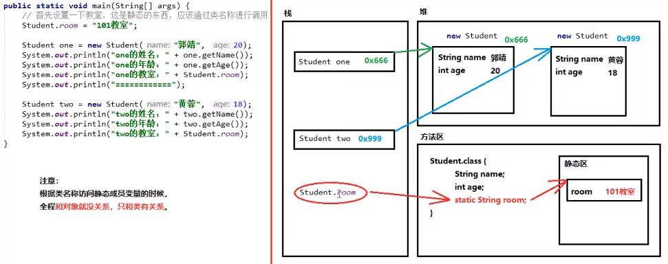

#  第四章 对象与类

## 4.1 面向对象程序设计概述

面向对象程序设计(object-oriented programming，OOP)；面向对象的程序是由对象组成的，每个对象包含对用户公开的特定功能部分和隐藏的实现部分。程序中的很多对象来自标准库，还有一些自定义的。

面向对象三大特征：封装、继承、多态。

### 4.1.1 类

类(class)是构造对象的模板或蓝图。由类构造(construct)对象的过程称为创建类的实例(instance)。

封装(encapsulation)是处理对象的一个重要概念。从形式上看，封装就是将数据和行为组合在一个包中，并对对象的使用者隐藏具体的实现方式。对象中的数据称为实例字段(instance field)，操作数据的过程称为方法(method)。

实现封装的关键在于，绝对不能让类中的方法直接访问其他类的实例字段。程序只能通过对象的方法与对象数据进行交互。封装给对象赋予“黑盒”特征，这是提高重用性和可靠性的关键。

在扩展一个已有的类时，这个扩展后新类具有被扩展的类的全部属性和方法。你只需要在新类提供适用于这个新类的新方法和数据字段就可以了。通过扩展一个类来建立另外一个类的过程称为继承(inheritance)。

### 4.1.2 对象

对象的三个主要特性：

* 对象的行为(behavior)，可以完成哪些操作，或者可以对对象应用哪些方法。
* 对象的状态(state)，当调用那些方法时，对象会如何相应。
* 对象的标识(identity)，如何区分具有相同行为与状态的不同对象。

### 4.1.3 识别类

### 4.1.4 类之间的关系

在类之间，最常见的关系有：

* 依赖(dependence)(“uses-a”)
* 聚合(aggregation)(“has-a”)
* 继承(inheritance)(“is-a”)

 <!-- more --> 

## 4.2 使用预定义类

### 4.2.1 对象与对象变量

想要使用对象，首先必须构造对象，并指定其初始状态。然后对对象应用方法。

在Java在程序设计语言中，要使用构造器(constructor)构造新实例。构造器是一种特殊的方法，用来构造并初始化对象。

构造器的名字应该与类名相同。因此Date类的构造器名为Date。想要构造一个Date对象，需要在构造器前面加上new操作符

```java
new Date();//这个表达式构造了一个新对象。这个对象被初始化为当前的日期和时间。
System.out.println(new Date());//可以将这个对象传递给一个方法
```

Date类中有一个toString方法，这个方法返回日期的字符串描述。

```java
String s = new Date().toString();
```

在这两个例子中，构造对象仅使用了一次。通常，你会希望构造的对象可以多次使用，因此，需要将对象存放在一个变量中：

```java
Date birthday = new Date();
```

对象变量并没有实际包含一个对象，它只是引用一个对象。在Java中，任何对象变量的值都是对存储在另外一个地方的某个对象的引用。new操作符的返回值也是一个引用。

### 4.2.2 Java类库中的 LocalDate类

不要使用构造器来构造LocalDate类的对象。实际上，应当使用静态工厂方法(factory method)，它会代表你调用构造器。下面的表达式：

```java
LocalDate.now()
```

会构造一个新对象、表示构造这个对象时的日期。

可以提供年、月、日来构造对应一个特定日期的对象：

```java
LocalDate newYearsEve = LocalDate.of(1999,12,31)
```

有了LocalDate对象，可以使用方法getYear、getMonthValue、getDayOfMonth得到年、月、日。

```java
int year = newYearsEve.getYear();//1999
int month = newYearsEve.getMonthValue();//12
int day = newYearsEve.getDayOfMonth();//31
```

```java
LocalDate aThousandDaysLater = newYearsEve.plusDay(1000);
int year = newYearsEve.getYear();//2002
int month = newYearsEve.getMonthValue();//09
int day = newYearsEve.getDayOfMonth();//26
```

### 4.2.3 更改器方法与访问器方法

上一节中的plusDays方法调用，这个调用后newYearsEve会有什么变化？它会改为1000天后的日期吗？事实上，并没有。plusDays方法会生成一个新的LocalDate对象，然后把这个新对象赋给aThousandDaysLater变量。原来的对象不做任何改动。我们说plusDays方法没有更改调用这个方法的对象。

与LocalDate.plusDays方法不同，GregorianCalendar.add方法是一个更改器方法(mutator method)。相反，只访问对象而不修改对象的方法有时称为访问器方法(accessor method)。

```java
public class CalendarText
{
    public static void main(String[] args)
    {
        LocalDate date = LocalDate.now();
        int month = date.getMonthValue();
        int today = date.getDayOfMonth();
        
        date = date.minusDay(today - 1);
        DayOfWeek weekday = date.getDayOfWeek();
        int value = weekday.getValue();
        
        System.out.println("Mon Tue Wed Thu Fri Sat Sun");
        for(int i = 1; i < value; i++)
        {
            System.out.print("    ");
        }
        
        while(data.getMonthValue == month)
        {
            System.out.printf("%3d",date.getDayOfMonth);
            if(date,getDayOfMonth == today)
            {
                System.out.print("*");
            }else
            {
                System.out.print(" ")
            }
            date = date.plusDay(1);
            if(date.getDayOfWeek().getValue() == 1)
            {
                System.out.println();
            }
        }
        if(date.getDayOfWeek().getValue() != 1)
        {
            System.out.println();
        }
    }
}
```

## 4.3 用户自定义类

### 4.3.1 Employee类

成员变量是直接定义在类当中的，在方法外边；成员方法不要写static关键字。

通常情况下，一个类并不能直接使用，需要根据类创建一个对象，才能使用：

* 1.导包：也就是指出需要使用的类，在什么位置。import 包名称.类名称；import cn.itcast.day05.demo01.Student；对于和当前类属于同一个包的情况，可以省略导包语句不写。
* 创建，格式：类名称 对象名 = new 类名称()；
* 使用，分两种情况：使用成员变量：对象名.成员变量名；使用成员方法：对象名.成员方法名(参数)

在Java中，最简单的类定义形式为：

```java
class ClassName
{
    field_1;
    field_2;
    ...;
    constructor_1;
    constructor_2;
    ...;
    method_1;
    method_2;
    ...;
}
```

```java
import java.time.LocalDate;

public class EmployeeTest
{
    public static void main(String[] args)
    {
        Employee_1[] staff = new Employee_1[3];

        staff[0] = new Employee_1("Carl Cracker",75000,1987,12,15);
        staff[1] = new Employee_1("Harry Hacker",50000,1989,10,1);
        staff[2] = new Employee_1("Tony Tester",40000,1990,3,15);

        for (Employee_1 e : staff)
        {
            e.raiseSalary(5);
        }

        for (Employee_1 e : staff)
        {
            System.out.println("name="+e.getName()+",salary="+e.getSalary()+",hireDay="+e.getHireDay());
        }
    }


}

class Employee_1
{
    private String name;
    private double salary;
    private LocalDate hireDay;

    public Employee_1(String name, double salary, int year, int month, int day)
    {
        this.name = name;
        this.salary = salary;
        this.hireDay = LocalDate.of(year,month,day);
    }

    public String getName()
    {
        return this.name;
    }

    public double getSalary()
    {
        return this.salary;
    }

    public LocalDate getHireDay()
    {
        return this.hireDay;
    }

    public void raiseSalary(double byPercent)
    {
        double raise = this.salary * byPercent / 100 ;
        this.salary += raise;
    }
}
```

在这个程序中，我们构造了一个Employee_1数组，并填入了3个Employee_1对象；接下来，使用Employee类的raiseSalary方法将每个员工的薪水提高5%；最后调用getName、getSalary、getHireDay方法打印各个员工的信息。

注意，在这个示例程序中包含两个类：Emloyee_1和带有public访问修饰符的EmplyeeTest。在一个源文件中，只能有一个公共类，但可以有任意数目的非公共类。

### 4.3.2 多个源文件的使用

### 4.3.3 剖析Employee类

这个类包含了一个构造器和4个方法；这个类的所有方法都被标记为public。关键字public意味着任何类的任何方法都可以调用这些方法。

在Employee类的实例中有3个实例字段用来存放将要操作的数据，关键字private确保只有Employee类自身的方法能够访问这些实例字段，而其他类的方法不能够写这些字段。

有两个实例字段本身就是对象：name字段是Sting类对象，hireDay字段是LocalDate类对象。

一个标准的类通常要有四个组成部分：

* 所有成员变量都要使用private关键字修饰
* 每一个成员变量编写一对儿Getter/Setter方法
* 编写一个无参数的构造方法
* 编写一个全参数的构造方法

这样标准的类也叫做Java Bean。

### 4.3.4 从构造器开始

构造器与类同名。在构造Employee类的对象时，构造器会运行，从而将实例字段初始化为所有希望的初始状态。

构造器与其他方法有一个重要的不同，构造器总是结合new操作符来调用的。不能对一个已经存在的对象调用构造器来达到重新实例字段的目的。

```java
james.Employee("James Bond",250000,1950,1,1);//ERROR
```

构造器的特点：

* 构造器与类同名；
* 每个类可以有一个以上的构造器；
* 构造器可以有0个、1个或多个参数；
* 构造器没有返回值；
* 构造器总是伴随着new操作符一起调用。

构造方法的格式：public 类名称(参数类型 参数名称){方法体}

* 构造方法的名称必须和所在的类名称完全一样，就连大小写也要一样
* 构造方法不要写返回值类型，连void都不写。
* 构造方法不能return一个具体的返回值
* 如果没有任何构造方法，那么编译器会默认赠送一个构造方法，没有参数、方法体什么事情都不做。
* 一旦编写了至少一个构造方法，那么编译器将不再赠送。
* 构造方法也是可以进行重载的

### 4.3.5 用var声明局部变量

在Java10中，如果可以从变量的初始值推导出它们的类型，那么可以用var关键字声明局部变量，从而无需指定类型。注意var关键字只能用于方法中的局部变量，参数和字段的类型必须声明。

### 4.3.6 使用null引用

一个对象变量包含一个对象的引用，或者包含一个特殊值null，后者表示没有引用任何对象。听上去这是一种处理特殊情况的便捷机制，如未知的名字或雇佣日期。不过使用null值时要非常小心。如果对null值应用一个方法，会产生一个NullPointerException异常。

```java
LocalDate birthday = null;
String s = birthday.toString();//NullPointerException
```

定义一个类时，最好清楚地知道哪些字段可能为null。对此有两种解决方法。“宽容型”方法是把null参数转换为一个适当的非null值：

```java
if(n == null)
{
    name = "unknown";
}else
{
    name = n;
}
```

在Java9中，Objects类对此提供了一个便利方法：

```java
public Employee(String n, double s, int year, int month, int day)
{
    name = Objects.requireNonNullElse(n,"unknown");
    ...;
}
```

“严格型”方法则是干脆拒绝null参数：

```java
public Employee(String n, double s, int year, int month, int day)
{
    Objects.requireNonNull(n,"The name cannot be null");
    name = n;
}
```

### 4.3.7 隐式参数与显示参数

```java
public void raiseSalary(double byPercent)
{
    double raise = salary * byPercent / 100;
    salary += raise;
}
```

salary称为隐式(implicit)参数，byPercent位于方法名后面的括号中，这是一个显示(explicit)参数。可以把隐式参数称为方法调用的目标或接收者。在每一个方法中，关键字this指示隐式参数。

```java
public void raiseSalary(double byPercent)
{
    double raise = this.salary * byPercent / 100;
    this.salary += raise;
}
```

当方法的局部变量和类的成员变量重名的时候，根据就近原则，优先使用局部变量，如果需要访问本类当中的成员变量，需要使用格式：this.成员变量名。

局部变量和成员变量的区别：

* 局部变量在方法的内部，成员变量在方法的外部，直接写在类当中；
* 作用域不一样，局部变量只有方法中才可以使用，出了方法就不能再用；成员变量整个类都可以通用。
* 默认值不一样，局部变量没有默认值，要想使用必须手动赋值；成员变量：如果没有赋值，会有默认值，规则和数组一样。
* 内存的位置不一样，局部变量位于栈内存；成员变量位于堆内存。
* 生命周期不一样，局部变量随着方法进栈而诞生，随着方法出栈而消失；成员变量，随着对象创建而诞生，随着对象被垃圾回收而消失。

### 4.3.8 封装的优点

封装性在java当中的体现：

* 方法就是一种封装
* 关键字private也是一种封装

一旦使用private进行修饰后，那么本类当中仍然可以随意访问；但是！超出本类范围之外就不能再直接访问了。

有些时候，可能想要获得或设置实例字段的值。那么你需要提供下面三项内容：

* 一个私有的数据字段；
* 一个公共的字段访问器方法；
* 一个公共的字段更改器方法。

间接访问private成员变量，就是定义一对setter/getter方法。

对于基本类型当中的boolean值，getter方法一定要写成isXxx的形式。

### 4.3.9 基于类的访问权限

方法可以访问调用这个方法的对象的私有数据。一个方法可以访问所属类的所有对象的私有数据。

```java
class Employee
{
    ...;
    public boolean equals(Employee other)
    {
        return name.equals(other.name);
    }
}
```

典型的调用方式是：

```java
if(harry.equals(boss))...
```

### 4.3.10 私有方法

在实现一个类时，由于公共数据非常危险，所以应该将所有的数据字段设置为私有的。尽管绝大多数方法都被设计为公共的，但在某些特殊情况况下，将方法设计为私有可能很有用。有时，你希望将一个计算机代码分解成若干个独立的辅助方法。通常，这些辅助方法不应该成为公共接口的一部分，这是由于它们与当前实现关系非常紧密，或者需要一个特殊协议或者调用次序。最好将这样的方法设计为私有方法。

在java中，要实现私有方法，只需要将关键字public改为private即可。

### 4.3.11 final实例字段

可以将实例字段定义为final。这样的字段必须在构造对象初始化。必须保证在每一个构造器执行之后，这个字段的值已经设置，并且以后不能再修改这个字段，即没有set方法。

## 4.4 静态字段与静态方法

### 4.4.1 静态字段

静态字段只在类中保存唯一一份，那所有本类对象共享同一份。一旦使用static关键字，那么这样的内容不再属于对象自己，而是属于类的。凡是本类的对象，都共享一份。

如果将一个字段定义为static，每个类只有一个这样的字段。而对于非静态的实例字段，每个对象都有自己的一个副本。例如，假设需要给每一个员工赋予唯一的标识码。这里给Employee类添加一个实例字段id和一个静态字段nextId。

### 4.4.2 静态常量

静态变量使用得比较少，但静态常量却很常用。例如，在Math类中定义一个静态常量：

```java
public class Math
{
    ...;
    public static final double PI = 3.14159265358979323846;
    ...;
}
```

### 4.4.3 静态方法

静态方法是不在对象上执行的方法。例如，Math类的pow就是一个静态方法。

一旦使用static修饰成员方法，那么就成为了静态方法。静态方法不属于对象，而是属于类。

如果没有static关键字，那么必须首先创建对象，然后通过对象才能使用；如果有了static关键字，那么不需要对象，直接就能通过类名称来使用它。

无论是成员变量，还是成员方法。如果有了static，都推荐使用类名称进行调用。

静态变量：类名称.静态变量

静态方法：类名称.静态方法()

对于本类当中的静态方法，可以省略类名

注意事项：

* 静态只能直接访问静态，不能直接访问非静态。 (成员方法可以访问成员变量，成员方法可以访问静态变量；静态方法可以访问静态变量，静态方法不能直接访问成员变量)(原因：内存当中先有静态内容，后有非静态内容)
* 静态方法中不能用this：this代表当前对象，通过谁调用的方法，谁就是当前对象。

在下面两种情况下可以使用静态方法：

* 方法不需要访问对象状态，因为它需要的所有参数都是通过显式参数提供
* 方法只需要访问类的静态字段

静态static的内存图：



### 4.4.4  工厂方法

静态方法还有另外一种常见的用途。类似LocalDate和NumberFormat的类使用静态工厂方法(factory method)来构造对象。

### 4.4.5  main 方法

```java
public class StaticTest
{
    public static void main(String[] args)
    {
        Employee_2[] staff = new Employee_2[3];

        staff[0] = new Employee_2("Tom",40000);
        staff[1] = new Employee_2("Dick",60000);
        staff[2] = new Employee_2("Harry",65000);

        for (Employee_2 e : staff)
        {
            e.setId();
            System.out.println("name = "+e.getName()+"salary ="+e.getSalary()+"Harry = "+e.getId());
        }

        int n = Employee_2.getNextId();
        System.out.println("Next available id="+n);
    }
}

class Employee_2
{
    private static int nextId = 1;
    private String name;
    private double salary;
    private int id;

    public Employee_2(String name, double salary)
    {
        this.name = name;
        this.salary = salary;
        this.id = 0;
    }

    public String getName()
    {
        return this.name;
    }

    public double getSalary()
    {
        return this.salary;
    }

    public int getId()
    {
        return this.id;
    }

    public void setId()
    {
        id = nextId;
        nextId++;
    }

    public static int getNextId()
    {
        return nextId;
    }
}
```


## 4.5 方法参数

程序设计语言中关于如何将参数传递给方法(或函数)的一些专业术语。按值调用(call by value)表示方法接收的是调用者提供的值。而按引用调用(call by reference)表示方法接收的是调用者提供的变量地址。方法可以修改按引用传递的变量的值，而不能修改按值传递的变量的值。

java程序设计语言总是采用按值调用。也就是说，方法得到的是所有参数值的一个副本。具体来讲，方法不能修改传递给它的任何参数变量的内容。

```java
double percent = 10;
harry.reiseSalary(percent);
public static void tripleValue(double x)
{
    x = 3 * x;
}
double percent = 10;
tripleValue(percent);
```

然而，有两种类型的方法参数：基本数据类型，对象引用。你已经看到，一个方法不可能修改基本数据类型的参数，而对象引用作为参数就不同了。

```java
public static void tripleSalary(Employee x)
{
    x.raiseSalary(200)
}
harry = new Employee(...);
tripleSalary(harry);
```

下面总结一下在Java中对方法参数能做什么和不能做什么：

* 方法不能修改基本数据类型的参数
* 方法可以改变对象参数的状态
* 方法不能让一个对象参数引用一个新的对象。

```java
public class ParamTest
{
    public static void main(String[] args)
    {
        System.out.println("Test 1:Method can't modify numeric parameters");
        double percent = 10;
        System.out.println("Before: percent= "+percent);
        tripleValue(percent);
        System.out.println("After: percent= "+percent);

        System.out.println("Test 2:Methods can change the state of object parameters");
        Employee_3 harry = new Employee_3("harry",50000);
        System.out.println("Before: salary="+harry.getSalary());
        tripleSalary(harry);
        System.out.println("After: salary="+harry.getSalary());

        System.out.println("Test 3:Methods can't attach new objects to object");
        Employee_3 a = new Employee_3("Alice",70000);
        Employee_3 b = new Employee_3("Bob",60000);
        System.out.println("Before: a="+a.getName());
        System.out.println("Before: b="+b.getName());
        swap(a,b);
        System.out.println("After: a="+a.getName());
        System.out.println("After: b="+b.getName());

    }

    public static void tripleValue(double x)
    {
        x = x * 3;
        System.out.println("End of method:x= "+x);
    }

    public static void tripleSalary(Employee_3 x)
    {
        x.raiseSalary(200);
        System.out.println("End of method: salary="+x.getSalary());
    }

    public static void swap(Employee_3 x, Employee_3 y)
    {
        Employee_3 temp = x;
        x = y;
        y = temp;
        System.out.println("End of method: x="+x.getName());
        System.out.println("End of method: y="+y.getName());
    }
}

class Employee_3
{
    private String name;
    private double salary;

    public Employee_3() {
    }

    public Employee_3(String name, double salary)
    {
        this.name = name;
        this.salary = salary;
    }

    public String getName() {
        return name;
    }

    public void setName(String name) {
        this.name = name;
    }

    public double getSalary() {
        return salary;
    }

    public void setSalary(double salary) {
        this.salary = salary;
    }

    public void raiseSalary(int byPercent)
    {
        double raise = this.salary * byPercent / 100;
        this.salary += raise;
    }
}
```

## 4.6 对象构造

### 4.6.1 重载

有些类有多个构造器。这种功能叫做重载(overloading)。如果多个方法(构造器方法)有相同的名字、不同的参数，便出现了重载。编译器必须挑选出具体调用哪个方法。它用各个方法首部中的参数类型与特定方法调用中所使用的值类型进行匹配，来选出正确的方法。如果编译器找不到匹配的参数，就会产生编译时错误，因为根本不存在匹配，或者没有一个比其他的更好(这个查找匹配的过程被称为重载解析(overloading resolution))。

方法重载与下列因素相关：

* 参数个数不同；
* 参数类型不同；
* 参数的多类型顺序不同

方法重载与下列因素无关：

* 与参数的名称无关；
* 与方法的返回值类型无关；

### 4.6.2 默认字段初始化

如果在构造器中没有显示地为字段设置初值，那么就会被自动赋为默认值：数值为0，布尔值为false，对象引用为null。有些人认为以来默认值的做法是一种不好的编程实践。确实，如果不明确地对字段进行初始化，就会影响程序代码地可读性。

### 4.6.3 无参数的构造器

很多类包含了一个无参数的构造器，由无参数构造器创建对象时，对象的状态会设置为适当的默认值。

如果写一个类时没有编写构造器，就会为你提供一个无参数构造器。这个构造器将所有实例字段设置为默认值。

如果类中提供了至少一个构造器，但没有提供无参数构造器，那么构造对象时如果不提供参数就是不合法的。

### 4.6.4 显示字段初始化

通过重载类的构造器方法，可以采用多种形式设置类的实例字段的初始状态。不管怎么调用构造器，每个实例字段都要设置为一个有意义的初值，确保这一点总是一个好主意。

### 4.6.5 参数名

### 4.6.6 调用另一个构造器

关键字this指示一个方法的隐式参数。不过，这个关键字还有另外一个含义。如果构造器的第一个语句形如this(…)，这个构造器将调用同一个类的另一个构造器。

```java
public Employee(double s)
{
    this("Employee #"+nextId,s);
    nextId++;
}
```

当调用new Employee(60000)时，Employee(double)构造器将调用Employee(String,double)构造器。采用这种方式使用this关键字非常有用，这样对公共的构造器代码只需要编写一次即可。

### 4.6.7 初始化块

前面已经讲过两种初始化数据字段的方法：

* 在构造器中设置值；
* 在声明中赋值。

实际上，Java还有第三种机制，称为初始化块(initialization block)。在一个类的声明中，可以包含任意多个代码块。只要构造这个类，这些块就会被执行。

首先运行初始化块，然后才运行构造器的主体部分。这种机制不是必须的，也不常见。通常会直接将初始化代码放在构造器中。

下面是调用构造器的具体处理步骤：

* 如果构造器的第一行调用了另一个构造器，则基于所提供的参数执行第二个构造器。
* 否则，所有数据字段初始化为默认值，按照在类声明中出现的顺序，执行所有字段初始化方法和初始化块。
* 执行构造器主体代码。

当第一次用到本类时，静态代码块执行唯一一次。静态内容总是优先于非静态，所以静态代码块比构造方法先执行。静态代码块的典型用途：用来一次性地对静态成员变量进行赋值。

在类第一次加载的时候，将会进行静态字段的初始化。与实例字段一样，除非将静态字段显式地设置成其他值，否则默认地初始值为0，false，null。所有的静态字段初始化方法以及静态初始化块都是依照类声明中出现的顺序执行。

```java
import java.util.Random;

public class ConstructorTest
{
    public static void main(String[] args)
    {
        Employee_4[] staff = new Employee_4[3];

        staff[0] = new Employee_4("Harry",40000);
        staff[1] = new Employee_4(60000);
        staff[2] = new Employee_4();

        for (Employee_4 e : staff)
        {
            System.out.println("name="+e.getName()+",id="+e.getId()+",salary="+e.getSalary());
        }
    }
}

class Employee_4
{
    private static int nextId;
    private int id;
    private String name = "";
    private double salary;

    static
    {
        Random r = new Random();
        nextId = r.nextInt(10000);
    }

    {
        id = nextId;
        nextId++;
    }

    public Employee_4(String name, double salary)
    {
        this.name = name;
        this.salary = salary;
    }

    public Employee_4(double salary)
    {
        this("Employee #"+nextId,salary);
    }

    public Employee_4(){}

    public String getName()
    {
        return this.name;
    }

    public double getSalary()
    {
        return this.salary;
    }

    public int getId()
    {
        return this.id;
    }

}
```

### 4.6.8 对象析构与finalize方法

由于Java会完成自动的垃圾回收，不需要人工回收内存，所以Java不支持析构器。当然，某些对象使用了内存之外的其他资源，例如，文件或使用了系统资源的另一个对象的句柄。在这种情况下，当资源不再需要时，将其回收和再利用显得十分重要。如果一个资源一旦使用完毕就需要立即关闭，那么应当提供一个close方法来完成必要的清理工作。可以在对象使用完时调用这个close方法。

## 4.7 包

Java允许使用包(package)将类组织在一个集合中。借助包可以方便地组织自己的代码，并将自己的代码与别人提供的代码库分开管理。

### 4.7.1 包名

使用包的主要原因是确保类名的唯一性。假如两个程序员不约而同地建立了Employee类。只要将这些类放置在不同的包中，就不会产生冲突。事实上，为了保证包名的绝对唯一性，要使用一个因特网域名以逆序的形式作为包名，然后对于不同的工程使用不同的子包。例如，考虑域名horstman.com。如果逆序来写，就得到了包名com.horstman。然后可以追加一个工程名，如com.horstman.corejava。如果把Employee类放在这个包里，那么让这个类的“完全限定”名就是com.horstman.corejava.Employee。

### 4.7.2 类的导入

一个类可以使用所属包中的所有类，以及其他包中的公共类(public class)。可以采用两种方式访问另一个包中的公共类。第一种方式就是完全限定名(fully qualified name)；就是包名后面跟着类名。例如：

```java
java.time.LocalDate today = java,time.LocalDate.now();
```

这显然很繁琐。更简单更常用的方式是使用import语句。import语句是一种引用包中名个类的简单方式。一旦使用了import语句，在使用类时，就不必写出类的全名了。

可以使用import语句导入一个特定的类或者整个包。import语句应该位于源文件的顶部。例如，可以使用下面这条语句导入java.util包中的所有类。

```java
import java.time.*;
```

import java.time.*;的语法比较简单，对代码的规模也没有任何负面影响。不过，如果能够明确地指出所导入的类，代码的读者就能更加准确地知道你使用了哪些类。

但是，需要注意的是，只能使用星号\*导入的包，而不能使用import java.*或import.java.\*.\*导入以java为前缀的所有包。在大多数情况下，可以只导入你需要的包，并不必过多地考虑他们。但在发生命名冲突的时候，就要注意包了。例如java.util和java.sql包都有Date类。如果在程序中导入了这两个包：

```java
import java.util.*;
import java.sql.*;
```

在程序中使用Date类的时候，就会出现一个编译错误。此时编译器无法确定你想使用的是哪一个Date类。可以增加一个特定的import语句来解决这个问题。

```java
import java.util.*;
import java.sql.*;
import java.util.Date;
```

如果这两个类都修要使用，又该怎么办呢？答案是，在每个类名的前面加上完整的包名。

```java
var deadline = new java.util.Date();
var today = new java.sql.Date();
```

### 4.7.3 静态导入

### 4.7.4 在包中增加类

想要将类放入包中，就必须将包的名字放在源文件的开头，即放在定义这个包中各个类的代码之前。

```java
package com.horstmann.corejava;
public class Employee
{
    ...;
}
```

### 4.7.5 包访问

前面已经接触过访问修饰符public和private。标记为publice的部分可以由任意类使用；标记为private的部分只能由定义他们的类使用。如果没有指定public和private，这个部分(类、方法或变量)可以被同一个包中的所有方法访问。

### 4.7.6 类路径

### 4.7.7 设置类路径

## 4.8 JAR文件

### 4.8.1 创建JAR文件

### 4.8.2 清单文件

### 4.8.3 可执行JAR文件

### 4.8.4 多版本JAR文件

### 4.8.5 关于命令行选项的说明

## 4.9 文档注释

### 4.9.1 注释的插入

### 4.9.2 类注释

类注释必须放在import语句之后，类定义之前。

### 4.9.3 方法注释

### 4.9.4 字段注释

### 4.9.5 通用注释

### 4.9.6 包注释

### 4.9.7 注释抽取

## 4.10 类设计技巧

* 一定要保证数据私有
* 一定要对数据进行初始化
* 不要在类中使用过多的基本类型
* 不是所有的字段都需要单独的字段访问器和字段更改器
* 分解有过多指职责的类
* 类名和方法名要能够体现它们的职责
* 优先使用不可变的类