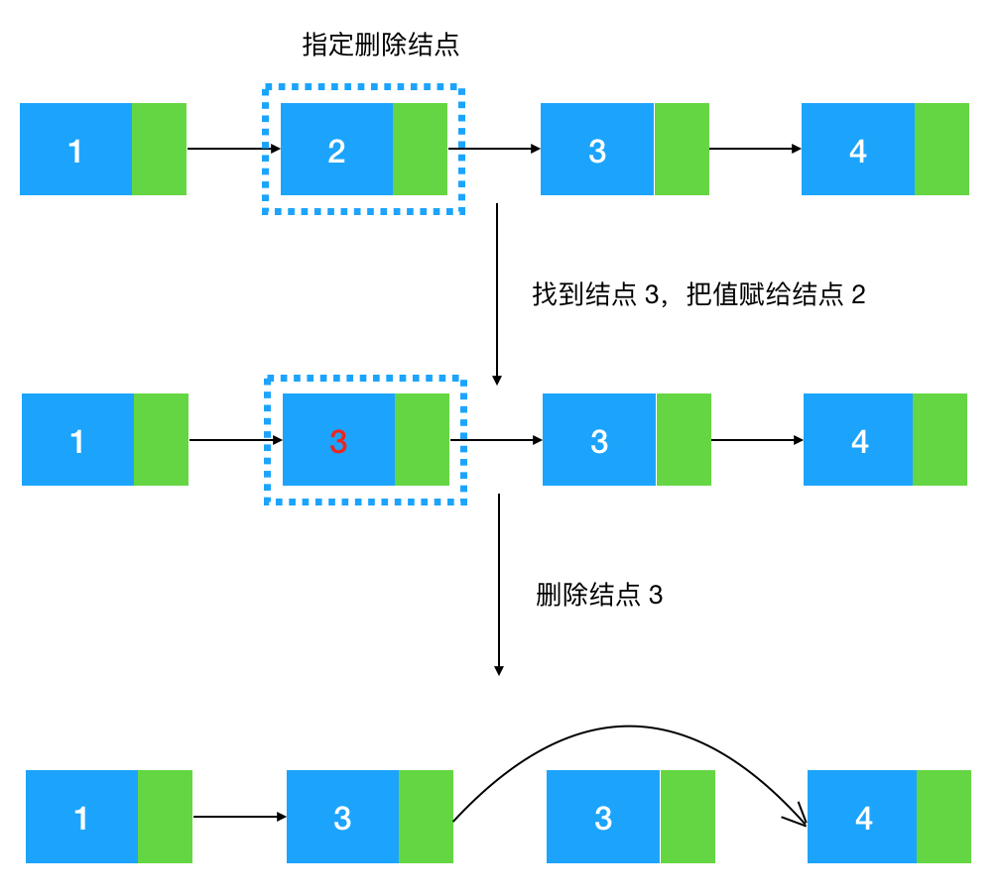
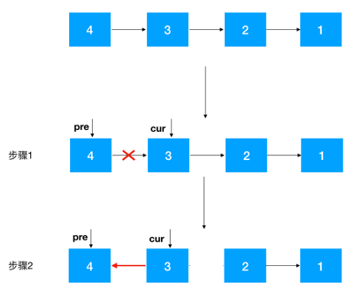

# 链表

## 链表的定义

链表是物理存储单元上非连续、非顺序的存储结构，它由一个个结点，通过指针来联系起来，其中每个结点都包括数据和指针。


链表的非连续，非顺序，对应数组的连续、顺序，来看一个例子：整型数组1，2，3，4在内存中是如何表示的


可以看到数组的每个元素都是连续紧邻分配的，这叫连续性，同时由于数组的元素占用的大小是一样的，在Java中int型大小固定为4个字节，所以如果数组的起始位置是100，由于这些元素在内存中都是连续紧邻分配的，大小也一样，可以很容易地找出数组中任意一个元素的位置，比如数组中的第三个元素起始地址为100+2*4=108，这就叫顺序性。查找的时间复杂度是O(1)，效率很高！

 <!-- more --> 

那么链表在内存中是怎么表示的呢？


可以看到每个结点都分配在非连续的位置，结点与结点之间通过指针连在了一起，所以如果我们要找比如为3的节点，只能通过结点1从头到尾遍历寻找，如果元素少还好，如果元素太多(比如超过一万个)，每个元素的查找都要从头开始查找，时间复杂度是O(n)，比起数组的O(1)，差距不小。

除了查找性能链表不如数组之外，还有另一个优势让数组的性能高于链表，这里引入程序局部性原理。

CPU运行速度是非常快的，如果CPU每次运算都要到内存里去取数据无疑是很耗时的，所以在CPU与内存之间往往集成了挺多层级的缓存，这些缓存越接近CPU，速度越快，所以如果能提前把内存中的数据加载到如下图中的L1、L2、L3缓存中，那么下一次CPU取数的话直接从这些缓存里取即可，能让CPU执行速度加快，那么什么情况下内存中的数据会被提前加载到L1、L2、L3缓存中呢，答案是当某个元素被用到的时候，那么这个元素地址附近的元素会被提前加载到缓存中


以整数型1，2，3，4为例，当程序用到了数组的第一个元素时，由于CPU认为既然1被用到了，那么紧邻它的元素2，3，4被用到的概率会很大，所以会提前把2，3，4加到L1,L2,L3缓存中去，这样CPU再次执行的时候如果用到2，3，4，直接从L1、L2、L3缓存里取就行了，能提升不少性能。【若将CPU的一个时钟看成一秒，则从L1读取数据需要3秒，从L2读取需要11秒，L3读取需要25秒，而从内存读取，需要1分40秒，所以程序局部性原理对CPU执行性能有很大的提升】

然而链表呢，由于链表的每个结点在内存中里都是随机分布的，只是通过指针联系在一起，所以这些结点地址并不相邻，自然无法利用程序局部性原理来提前加载到L1，L2，L3缓存中来提升程序性能。

综上所述，相比数组，链表的非连续，非顺序确实让它在性能上处于劣势，那么什么情况下该使用链表呢？考虑以下的情况：

* 大内存空间分配

由于数组空间的连续性，如果要为数组分配500M的空间，这500M的空间必须是连续的，未使用的，所以在内存空间的分配上数组的要求会比较严格，如果内存碎片太多，分配连续的大空间很可能导致失败。而链表由于是非连续的，所以这种情况下选择链表更合适。

* 元素的频繁删除和插入

如果涉及元素的频繁删除和插入，用链表就会高效很多，对于数组来说，如果要在元素间插入一个元素，需要把其余元素一个个往后移，为新元素腾空间(若是要删除则需要把被删除元素之后的一个个往前移)，效率上无疑是比较低的。


而链表的插入删除相对来说就比较简单了，修改指针位置即可，其他元素无需做任何移动操作。


综上所述：如果数据以查为主，很少涉及增和删，选择数组，如果数据涉及到频繁的插入和删除，或元素所需分配空间过大，倾向于选择链表。

## 链表的表示

由于链表的特点，所以我们只要在链表中定义头节点即可，另外如果要频繁的用到链表的长度，还可以额外定义一个变量来表示。

需要注意的是这个头节点的定义是有讲究的，一般来说头结点有两种形式，一种是直接以某个元素结点为头节点，如下：


一种是以一个虚拟结点作为头结点，即我们常说的哨兵，如下：


定义这个哨兵有什么好处呢，假设我们不定义这个哨兵，来看看链表的基本操作怎么定义的

```java
class Node
{
    int data;
    Node next;
    public Node(int data)
    {
        this.data = data;
    }
}

public class LinkedList
{
    int length = 0;
    Node head = null;
    
    public void addNode(int val)
    {
        if(head == null)
        {
            head = new Node(val);
        }else
        {
            Node temp = head;
            while(temp.next != null)
            {
                temp = temp.next;
            }
            temp.next = new Node(val);
        }
    }
}
```

问题所在：

```java
    public void addNode(int val)
    {
        if(head == null)
        {
            head = new Node(val);
        }
        ...;
    }
```

有两个问题：

* 每插入一个元素都要对头结点进行判空比较，如果一个链表有很多元素需要被插入，就需要进行很多次的判空处理，不是那么高效。
* 头结点与其他结点插入逻辑不统一(一个需要判空后再插入，一个不需要判空直接插入)，从程序逻辑性来说不是那么合理(因为结点与结点是平级，添加逻辑理应相同)

如果定义了哨兵结点，以上两个问题都可以解决。来看使用哨兵结点的链表定义：

```java
public class LinkedList
{
    int length = 0;
    Node head = new Node(0);
    public void addNode(int val)
    {
        Node temp = head;
        while(temp.next != null)
        {
            temp = temp.next;
        }
        temp.next = new Node(val);
        length++;
    }
}
```

可以看到，定义了哨兵结点的逻辑上清楚了很多，不用每次插入元素都对头结点进行判空，也统一了每个结点的添加逻辑。

所以之后的习题讲解中我们使用的链表都是使用定义了哨兵节点的形式。


## 链表常见解题套路–翻转

题目：给定数组1，2，3，4构造成如下链表：head–>4–>3–>2–>1

看清楚了，是逆序构造链表！顺序构造我们都知道怎么构造，对每个元素持续调用上文代码定义的addNode方法即可(尾插法)，与尾插法对应的，是头插法，即把每一个元素插到头结点后面即可，这样就能做到逆序构造链表。


头插法比较简单：

```java
public class LinkedList
{
    int leangth = 0;
    Node head = new Node(0);
    
    public void headInsert(int val)
    {
        Node newNode = new Node(val);
        newNode.next = head.next;
        head.next = newNode;
        length++;
    }
    
    public static void main(String[] args)
    {
        LinkedList likedlist = new LinkedList();
        int[] arr = {1,2,3,4};
        for(int i = 0; i < arr.length; i++)
        {
            likedlist.heandInsert(arr[i]);
        }
        linkedlist.printList();
    }
}
```

## 小试牛刀

现在我们加大一些难度，来看下曾经的Google面试题：

给定单向链表的头指针和一个节点指针，定义一个函数在O(1)内删除这个结点。


即给定值为2的结点，如何把2给删了。

我们知道，如果给定了一个结点要删除它的后继结点是很简单的，只要把这个结点的指针指向后继结点的后继结点即可。


给定结点2，删除它的后继结点3，把结点2的next指针指向3的后继结点4即可。

但给定结点2，该怎么删除结点2本身呢，注意题目没有规定说不能改变结点中的值，所以有一种很巧妙的方法，狸猫换太子！先通过结点2找到结点3，再把结点3的值赋给结点2，此时结点2的值变成了3，这时候问题就转化成了上图这种比较简单的需求，即根据结点2把结点3移除即可。



不过需要注意的是这种解题技巧只适用于被删除的指定结点是中间结点的情况，如果指定节点是尾节点，还是要老老实实地找到尾结点的前继结点，再把尾结点删除

```java
public void removeSelecteNode(Node deleteNode)
{
    if(deleteNode.next == null)
    {
        Node temp = head;
        while(temp.next !=deleteNode)
        {
            temp = temp.next;
        }
        temp.next = null;
    }else
    {
        deleteNode.data = deleteNode.next.data;
        deleNode.next = deleNode.next.next;
    }
}
```

## 入门到进阶：链表翻转

接下来我们会重点看一下链表的翻转，链表的翻转可以衍生出很多的变形，是面试考试中非常热门的考点，基本上考链表必考翻转！所以掌握链表的翻转是必修课！

什么是链表的翻转：给定链表head –>4–>3–>2–>1，将其翻转成head–>1–>2–>3–>4。

* 递归翻转

首先我们要查看翻转链表是否符合递归规律：问题可以分解成具有相同解决思路的子问题，子子问题…，直到最终的子问题再也无法分解。

要翻转 head –>4–>3–>2–>1链表，不考虑head结点，分析4–>3–>2–>1。仔细观察我们发现只要先把3-->2-->1翻转成3<----2<----1，之后再把3指向4即可。


只要按以上步骤定义好这个翻转函数功能即可，这样由于子问题与最初的问题具有相同的解决思路，拆分后的子问题持续调用这个翻转函数即可达到目的。

既然符合递归条件，那我们就可以套用递归四步骤来解题：

1.定义递归函数，明确函数功能：根据前面分析，这个递归函数的功能显然是翻转某个节点开始的链表，然后返回新的头结点

```java
public Node invertLinkedList(Node node)
{
    
}
```

2.寻找递推公式：

* 针对结点node4，先翻转node之后的结点invert(node.next)，反转之后4--->3--->2--->1变成4--->3<---2<---1
* 再把node结点的下一个结点3指向node，node的后继结点设置为空，此时变成了4<---3<---2<---1
* 返回新的头结点，因为此时新的头结点从原来的4变成了1，需要重新设置一下head

3.将递推公式带入第一步定义好的函数中

```java
public Node invrtLinkedList(Node node)
{
    if(node == null || node.next == null)
    {
        return node;
    }
    Node newHead = inverLinkedList(node.next);
    node.next.next = node;
    node.next = null;
    return newhead;
}
```

4.计算时间/空间复杂度

由于递归了n次invertLinkedList函数，所以时间复杂度是O(n)，空间复杂度呢，没有用到额外的空间，但是由于递归调用了n次invertLinkedList函数，压了n次栈，所以空间复杂度也是O(n)。

递归一定要从函数的功能去理解，从函数的功能看，定义的递归函数清晰易懂，定义好了之后，由于问题与被拆分的子问题具有相同的解决思路，所以子问题只要持续调用定义好的函数功能即可，切勿层层展开子问题，此乃递归常见的陷阱！

* 非递归翻转链表(迭代解法)

我们知道递归比较容易造成栈溢出，所以有其他时间/空间复杂度相近或更好的算法，应该优先选择非递归的解法，那我们看看如何用迭代法来翻转链表：



1.定义两个节点：pre，cur，其中cur是pre的后继结点，如果是首次定义，需要把pre指向cur的指针去掉，否则由于之后链表翻转，cur会指向pre，就进行了一个环，这点需要注意


2.知道了cur和pre，翻转就很容易了，把cur指向pre即可，之后把pre设置为cur，cur设置为cur的后继结点，一直重复此步骤即可：


```java
public void iterationInverLinkedList()
{
    Node pre = head.next;
    Node cur = Pre.next;
    
    while(cur != null)
    {
        Node temp = cur.next;
        cru.next = pre;
        pre = cur;
        cur = temp;
    }
    head.next = pre;
}
```

用了迭代的思路来做由于循环n次，显然时间复杂度为O(n)，另外由于没有额外的空间使用，也不像递归那样调用递归函数不断压栈，所以空间复杂度为O(1)，对比递归，显然应该使用迭代的方式来处理！


## 变形题1：给定一个链表的头结点head，以及两个整数from和to，在链表上把第from个节点和第to个结点这一部分进行翻转。

例如：给定如下链表，from = 2, to = 4 head-->5-->4-->3-->2-->1；将其翻转后，链表变成head-->5--->2-->3-->4-->1

1.根据from和to找到from-1，from，to，to+1四个结点(注意临界条件，如果from从头结点开始，则from-1为空，反转后需要把to设置为头结点的后继结点，from和to结点也可能超过尾结点，这两种情况不符合条件翻转)。


2.对from和to的结点进行翻转

3.from-1结点指向to结点，将from结点指向to+1

```java
public void iterationInvertLinkedList(int fromIndex, int toIndex) throws Exception
{
    Node fromPre = null;
    Node from = null;
    Node to = null;
    Node toNext = null;
    
    Node temp = head.next;
    int curIndex = 1;
    while(temp != null)
    {
        if(curIndex == fromIndex - 1)
        {
            fromPre = temp;
        }else if(curIndex == fromindex)
        {
            from = temp
        }else if(curIndex == toIndex)
        {
            to = temp;
        }else if(curIndext == toIndex + 1)
        {
            toNext = temp;
        }
        temp = temp.next;
        curIndex++;
    }
    if (from == null || to == null)
    {
        throw new Exception("不符合条件");
    }
    
    Node pre = from;
    Node cur = pre.next;
    while(cur != toNext)
    {
        Node next = cur.next;
        cur.next = pre;
        pre = cur;
        cur = next;
    }
    
    if(fromPre !=null)
    {
        from.next = to;
    }else
    {
        head.next = to;
    }
    
    from.next = toNext;
}
```

## 变形题2：给出一个链表，每K个节点一组进行翻转，并返回反转后的链表。k是一个整数，它的值小于等于链表的长度。如果节点总数不是k的倍数，那么将最后剩余结点保持原有顺序。

给定这个链表：head-->1->2->3->4->5；当 k = 2 时，应当返回: head-->2->1->4->3->5；当 k = 3 时，应当返回: head-->3->2->1->4->5

接下来，我们以以下链表为例


1.首先要记录3个一组链表的前继结点，定义为startKpre，然后定义再一个step，从这一段的头结点(1)开始遍历2次，找出这段链表的起始和终止结点，如同


2.找到startK和endK之后，根据之前的迭代反转发对startK和endK的这段链表进行翻转

3.然后将startKpre指向endK，将startK指向endKNent，即完成了对k个一组结点的翻转。


知道了一组k个怎么翻转，之后只要重复对k个结点一组的链表进行翻转即可。

## 变形题 变形2针对的是顺序的k个一组翻转，那如何逆序K个一组进行翻转呢

例如：给定如下链表，head-->1-->2-->3-->4-->5；逆序 k 个一组翻转后，链表变成（k = 2 时）head-->1--->3-->2-->5-->4

这道题是字节跳动的面试题，顺序K个一组翻转已经属于hard级别了，逆序k个一组翻转更是superhard ，不过有了之前知识的铺垫，应该不难，只是稍微变形了一个，只要对链表做如下变形即可。


## 链表解题利器——快慢指针

下文详细讲述如何用快慢指针解题技巧。下文详细讲述如何用快慢指针解决以下两大类问题：

* 寻找/删除第K个结点
* 有关链表环问题的相关解法

## 寻找/删除第K个结点

LeetCode 876：给定一个带有头结点 head 的非空单链表，返回链表的中间结点。如果有两个中间结点，则返回第二个中间结点。

### 解法一：

要知道链表的中间结点，首先我们需要知道链表的长度，说到链表长度，还记得我们上文说到过哨兵结点可以保存链表长度，这样直接从head的后继结点开始遍历 链表长度/2次即可找到中间结点。为什么中简洁点是 链表长度/2，我们来仔细分析一下

1.假如链表长度是奇数：head–>1–>2–>3–>4–>5，从1开始遍历 5/2 = 2，到达3，3确实是中间结点。

2.假如链表长度是偶数：head–>1–>2–>3–>4–>5–>6，从1开始遍历 6/2=3，到达4，4确实是中间结点的第二个结点。

### 解法二：

由于要遍历两次链表，显得不是那么高效，那能否只遍历一次链表就能拿到中间结点呢。

这里就引入了我们的快慢指针，主要有三步：

* 快慢指针同时指向head的后继结点；
* 慢指针走一步，快指针走两步；
* 不断地重复步骤2，什么时候停下来呢，这取决于链表的长度是奇数还是偶数


综上所述，当fast == null 或 fast.next == null 时，此时的slow结点即为我们要求的中间结点。

```java
pulic Node fideMiddleNodeWithSlowFastPointer(Node head)
{
    Node fast = head;
    Node slow = head;
    
    while(fast != null &&  fast.next !=null)
    {
        fast = fast.next.next;
        slow = slow.next;
    }
    
    return slow;
}
```

有了上面的基础，我们现在再大一下难度，看下下面这道题。

输入一个链表，输出该链表中的倒数第 k 个结点。比如链表为 head-->1-->2-->3-->4-->5。求倒数第三个结点（即值为 3 的节点）

分析：我们知道如果要求顺序的第K个结点还是比较简单的，从head开始遍历k次即可，如果要求逆序的第k个结点，常规的做法是先顺序遍历一边链表，拿到链表长度，然后再遍历链表长度 - k次即可，这样要遍历两次链表，不是那么高效，如何只遍历一次呢，还是用我们的说的快慢指针解法

* 首先让快慢指针同时指向head的后继结点
* 快指针往前走k-1步，先走到第k个结点
* 快慢指针同时往后走一步，不断重复此步骤，直到快指针走到尾结点，此时slow结点即为我们要找的倒叙第k个结点


```java
class Solution {
    public ListNode getKthFromEnd(ListNode head, int k) {
        ListNode fast = head;
        ListNode slow = head;
        while(fast != null)
        {
            fast = fast.next;
            k--;
            if(k < 0)
            {
                slow = slow.next;
            }
        }
        return slow;
    }
}
```

知道了如何求倒叙k个结点，再来看看下面这道题

给定一个单链表，设计一个算法实现链表向右旋转 K 个位置。举例：给定 head->1->2->3->4->5->NULL, K=3,右旋后即为 head->3->4->5-->1->2->NULL

分析：这道题其实是对求倒叙第K个位置的一个变型，主要思路如下：

* 先找到倒数第K+1个结点，此结点的后继结点即为倒数第K个结点
* 将倒数K+1结点的后继结点设置为null
* 将head的后继结点设置为以上所得的倒数第K个结点，将原尾结点的后继结点设置为原head的后继结点

```java
class Solution {
    public ListNode rotateRight(ListNode head, int k) {
        if(head == null || head.next == null || k == 0)
        {
            return head;
        }
        int count = 0;
        ListNode temp = head;
        while(temp != null)
        {
            count++;
            temp = temp.next;
        }
        if(k % count == 0)
        {
            return head;
        }else
        {
            int t = k % count;
            ListNode pre = find(head,t+1);
            ListNode preNext = pre.next;
            ListNode end = preNext;
            while(end.next != null)
            {
                end = end.next;
            }
            end.next = head;
            head = preNext;
            pre.next = null;

        }
        return head;
    }

    public ListNode find(ListNode head, int k)
    {
                ListNode fast = head;
        ListNode slow = head;
        while(fast != null)
        {
            fast = fast.next;
            k--;
            if(k < 0)
            {
                slow = slow.next;
            }
        }
        return slow;
    }
}
```

### 小试牛刀之二

判断两个单链表是否相交及找到第一个交点,要求空间复杂度 O(1)。如图示：如果两个链表相交，5为这两个链表相交的第一个交点。


分析：首先我们要明白，由于链表本身的性质，如果有一个相交结点，那么相交结点之后的所有结点都是这两个链表公用的，也就是说两个链表的长度主要相差在相交结点之前的结点长度，于是我们有以下思路：

1.如果链表没有定义长度，则我们先遍历这两个链表长度，假设分别为L1，L2(L1>=L2)，定义p1，p2指针分别指向各自链表head结点，然后p1先往前走L1-L2步。这一步保证了p1，p2指向的指针与相交结点一样近。

2.然后p1，p2不断往后遍历，每次走一步，一边遍历一遍判断相应结点是否相等，如果相等即为这两个链表的相交结点。

```java
public static Node commonNode(ListNode l1, ListNode l2)
{
    ListNode lista = l1;
    ListNode listb = l2;
    while(lista != listb)
    {
        lista = lista == null?l2:lista.next;
        listb = listb == null?l1:listb.next;
    }
    return lista;
}
```

## 进阶

接下来我们来看如何用快慢指针来判断链表是否有环，这是快慢指针最常见的用法。

判断链表是否有环，如果有，找到环的入口位置（下图中的 2），要求空间复杂度为O(1)


首先我们要看如果链表有环有什么规律，如果从head结点开始遍历，则这个遍历指针一定会在以上的环中绕圈子，所以我们可以分别定义快慢指针，慢指针走一步，快指针走两步，由于最后快慢指针在遍历过程中一直会在圈中里绕，且快慢指针每次遍历的步长不一样，所以它们在里面不断绕圈子的过程一定会相遇。

```java
public Node detectCrossNode(Node head)
{
    Node fast = head;
    Node slow = head;
    while(fast != null && fast.next != null)
    {
        fast = fast.next.next;
        slow = slow.next;
        if (fast == null)
        {
            return null;
        }
        if(slow.data == fast.data)
        {
            return slow;
        }
    }
    return null;
}
```

判断是否有环为什么要返回相遇结点而不是返回true或flase呢？因为题目还需要判断环的入口位置


不难看出，慢指针走了L+S步，快指针比慢指针走的更快，除了走了L+S外，还在环里绕了L+S+nR步，且快指针是慢指针的两倍。即(L+S+nR)/(L+S) = 2；

要想找到入口节点，需要定义两个指针，一个指向head，一个指针指向相遇点，然后这两个指针不断遍历，当他们指向同一个结点时即时环的入口结点。